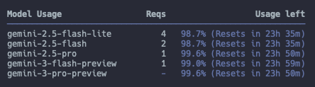

# 들어가며
오랜만에 Gemini CLI를 키니까 모델에 Gemini 2 밖에 없었다.
현존(2026.01.08.) 최강이라는 Gemini 3를 Gemini CLI에 적용하기 위한 방법을 알게 되어 이를 기록하려고 한다.  

그리고 Gemini CLI가 알아서 토큰 사용량을 최적화 하기 위해 자동으로 모델을 선택하는 내용과 토큰 사용량을 확인하는 방법을 알게 되어 이를 기록하려고 한다.

# 1. Gemini CLI에 Gemini 3 적용하기
일단 Gemini CLI를 가장 최신 버전으로 업데이트한다.  
나같은 경우 homebrew로 설치했기에 `brew upgrade`로 전체 패키지를 최신화했다.

> `brew upgrade`  
> Homebrew로 설치된 모든 패키지를 최신 버전으로 업데이트하는 명령어

그리고 CLI 상에서 `/settings` 를 입력하면 여러 설정을 수정할 수 있다.  
여기서 'Preview Features (e.g, models)' 를 true 로 설정한다.  
이후 ESC를 눌러 빠져나온다.  
그러면 콘솔창 최우측 하단에 모델이 변경된 것을 확인할 수 있다.

# 2. Gemini CLI의 토큰 사용량 최적화를 위해 모델 선택 정책
Gemini CLI를 사용할 때 모델 간 요청 라우팅 방식을 변경할 수 있다.  
기본적으로 _Auto routing_ 정책이고, 선택적으로 _Pro routing_ 을 선택할 수 있다.

## Auto routing
프롬프트의 복잡성을 판단해서 단순한 경우 자동으로 Gemini 2.5 Flash로 요청을 전달한다.  
만약 복잡하다면 경우, Gemini 3 Pro 가 활성화된 상태라면 Gemini 3 Pro에게, 그렇지 않다면 Gemini 2.5 Pro에게 요청을 전달한다.

## Pro routing
프롬프트를 가장 성능이 우수한 모델에게만 요청을 보내도록 하는 방식이다.  
`/model` 명령어를 통해 희망하는 모델을 선택하면 된다.

## Google이 권장하는 모델 선택의 Best practices

### Default to Auto
Model Selection을 Default 설정인 Auto로 유지하자.  
Google에서 알아서 프롬프트의 복잡도를 판단하여 토큰 사용량 최적화를 위해 모델을 선택해주는데, 이를 믿고 사용하는 것이 가장 효율적인 길이다.

### 원하는 결과를 얻지 못했다면 Pro 모델로 변경하라
사용하다가 대답이 살짝 아쉽다면, 그때 더 높은 성능의 모델을 선택하라고 한다.  
당연한 거 아닌가? ㅋㅋ

### 더 빠른 결과를 원한다면 Flash 또는 Flash-Lite로 전환하라
JSON 문자열을 yaml로 변환하는 작업 같이 간단한 응답의 경우 가벼운 모델을 선택하라고 한다.  
이것도 당연한 거 아닌가? ㅋㅋㅋ

# 3. Gemini CLI 토큰 사용량 확인 방법
Gemini CLI를 사용하다보면 사용량이 얼마나 남았는 지 확인하고 싶은 경우가 있다.  
그동안 알아볼 겨를 없이 그냥 다 소진할 때까지 썼는데, 이번 기회에 알게 됐다.

명령어는 `/stats` 인데, 아래 결과를 보면 Model 별로 사용량을 확인할 수 있다. Auto routing이 적용됐는 지 모델마다 사용량이 다른 것도 확인할 수 있다. 

좀 더 재밌는 명령어로 `/stats model`이 있다.  
  
_Model Stats For Nerds_ 라는 한 줄도 웃긴데, 각 모델 별 Input, Cache Reads, Thoughts, Output 별로 구체적인 수치도 확인할 수 있다.  
필요한 경우도 있을 것 같다. 

# 참고

- [Gemini CLI 공식문서](https://geminicli.com/docs/get-started/gemini-3/)
- [Homebrew FAQ](https://docs.brew.sh/FAQ)
