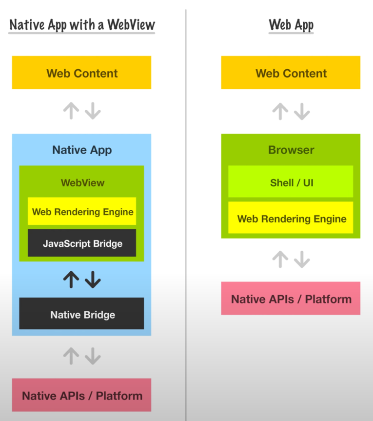

# WebView란 무엇일까?
WebView는 한 마디로 Native App에 내장된 웹 브라우저이다.  
HTML, CSS, JavaScript로 개발한 웹 페이지를 Native App의 **화면 일부** 또는 **전체**에서 렌더링할 수 있게 해준다.  
이를 통해, 사용자는 별도로 브라우저를 열지 않고 Web Contents를 볼 수 있는 것이다.

단순히 웹 브라우저의 역할 뿐 아니라, **Native App과 WebApp을 연결하는 다리 역할**도 수행한다.

인앱 브라우저 기능, 웹 기반 결제 시스템 연동, 동적 콘텐츠 표시, 웹 기반 설정 화면 등에서 널리 사용된다.

# WebView 사용의 장단점
## 장점
1. **개발 효율성과 코드 재사용**  
   웹 기술(React)로 한 번 개발하면 여러 플랫폼에서 사용할 수 있다.

2. **동적 콘텐츠 업데이트**  
   앱 스토어 승인 과정 없이도 WebApp을 업데이트할 수 있다.

3. **복잡한 웹 기술 활용**  
   Canvas를 이용한 그래픽 처리, WebGL을 통한 3D 렌더링, Web Audio API를 활용한 오디오 처리 등 웹 표준 기술을 모바일 앱에서도 그대로 활용할 수 있다.

## 단점
1. **성능 제약**  
   네이티브 코드 대비 실행 속도가 느릴 수 있습니다. 특히 복잡한 애니메이션, 대용량 데이터 처리, 빈번한 DOM 조작이 필요한 경우 성능 차이가 클 수 있다.  
   메모리 사용량도 일반적으로 더 높다.

2. **플랫폼별 차이점**
   Android와 iOS의 WebView 엔진이 다르기 때문에 같은 코드라도 렌더링 결과나 JavaScript 실행 결과가 달라질 수 있다.  
   CSS 지원 범위, JavaScript API 지원 여부 등에서 미묘한 차이가 발생한다.

3. **네이티브 기능 접근 제한**  
   네이티브 기능(카메라, GPS, 푸시 알림, 생체 인식 등)을 사용하려면 별도의 브릿지 구현이 필요하다.  
   모든 기능이 완벽하게 지원되는 것은 아니며, 플랫폼 업데이트에 따른 호환성 문제도 발생할 수 있다.

4. **디버깅의 복잡성**  
   웹 코드와 네이티브 코드가 혼재되어 있어 디버깅이 복잡할 수 있다.

## 결론
개발 리소스가 부족하며 네이티브 기능을 사용할 계획이 없다면 WebView를 통한 하이브리드 앱 개발이 더 효율적이다.  
하지만 성능이 크게 중요하거나 특정 플랫폼에서만 제공되지 않는 기능이 있는 한계가 발생한다면 네이티브 앱으로 개발하는 것이 좋겠다.

# Android와 iOS 별 WebView
두 플랫폼 별 WebView는 각기 다른 컴포넌트를 통해 구현된다.  
따라서 서로 제공하는 기능이 조금씩 다를 수 있다.

## Android
Android에서는 주로 Chromium을 기반으로 동작한다.  
`WebView` 클래스를 통해 구현되며, JavaScript 실행 허용 여부, 쿠키 처리, 파일 접근 권한 등을 세밀하게 제어할 수 있다.

## iOS
`WKWebView` 클래스를 통해 구현되며, Safari와 같은 엔진을 사용한다.  
JavaScript와 Native App 간의 메시지 전달을 지원한다.

# Flutter에서 WebView 사용하기
Flutter에서는 [webview_flutter](https://pub.dev/packages/webview_flutter) 라이브러리를 사용한다.
`flutter pub add webview_flutter` 명령어를 통해 의존성을 추가할 수 있다.

이 링크에서 이어서하기 -> https://claude.ai/chat/8daa0b2e-ddf2-4e76-8fe3-e325aa1d9cad
이 링크도 있음 -> https://codelabs.developers.google.com/codelabs/flutter-webview?hl=ko#2
https://pub.dev/packages/webview_flutter

# 보안 고려사항
## JavaScript 실행 제어
1. **선택적 JavaScript 허용**  
필요하지 않은 경우 JavaScript를 완전히 비활성화하고, 허용할 때도 신뢰할 수 있는 도메인에서만 실행되도록 제한해야 한다.  

Flutter의 경우 세 가지 JavaScript 모드를 제공한다.
- `JavaScriptMode.disabled`: JavaScript 완전 비활성화
- `JavaScriptMode.unrestricted`: 모든 사이트에서 JavaScript 허용 (위험)
- `JavaScriptMode.restrictedToSecureOrigins`: HTTPS에서만 JavaScript 허용 (권장)

2. **JavaScript 인터페이스 보안**  
Android의 addJavascriptInterface()를 사용할 때는 @JavascriptInterface 어노테이션을 명시적으로 붙인 메서드만 노출되도록 해야 합니다. 또한 민감한 정보나 시스템 레벨 기능에 접근할 수 있는 메서드는 노출하지 않아야 해요.

## 네트워크 보안
HTTPS 강제
모든 통신을 HTTPS로 제한하고, HTTP 연결은 차단해야 합니다. Android에서는 Network Security Config를 통해, iOS에서는 App Transport Security를 통해 설정할 수 있습니다.
도메인 화이트리스트
신뢰할 수 있는 도메인만 로드할 수 있도록 화이트리스트를 구성해야 합니다. shouldOverrideUrlLoading() 메서드나 decidePolicyFor navigationAction 델리게이트에서 URL을 검증합니다.
SSL 인증서 검증
SSL Pinning을 구현하여 특정 인증서나 공개키만 허용하도록 설정할 수 있습니다. 중간자 공격을 방지하는 효과적인 방법입니다.
파일 시스템 보안
파일 접근 제한
setAllowFileAccess(false)로 로컬 파일 시스템 접근을 차단하고, setAllowFileAccessFromFileURLs(false)로 file:// URL에서의 다른 파일 접근을 방지해야 합니다.
Universal Access 제한
setAllowUniversalAccessFromFileURLs(false)로 파일 URL에서 다른 도메인에 접근하는 것을 차단해야 합니다.
콘텐츠 보안
Content Security Policy (CSP)
웹 페이지에 CSP 헤더를 설정하여 XSS 공격을 방지하고, 허용되지 않은 스크립트 실행을 차단해야 합니다.
사용자 입력 검증
JavaScript에서 네이티브로 전달되는 모든 데이터는 서버 사이드에서와 마찬가지로 철저하게 검증하고 살균화해야 합니다.
권한 관리
최소 권한 원칙
WebView가 필요로 하는 최소한의 권한만 부여하고, 위치 정보, 카메라, 마이크 등의 민감한 권한은 사용자 동의 없이는 허용하지 않아야 합니다.
동적 권한 요청
런타임에 사용자의 명시적 승인을 받아 권한을 요청하고, 거부된 경우 적절한 대안을 제공해야 합니다.
이러한 보안 조치들을 종합적으로 적용하면 WebView의 장점을 활용하면서도 보안 위험을 최소화할 수 있습니다. 정기적인 보안 감사와 WebView 엔진 업데이트도 중요한 보안 관리 요소입니다.
# WebView Architecture

WebView 아키텍처는 아래와 같다.

# Flutter로 WebView를 띄우려면 어떻게 해야 할까?
