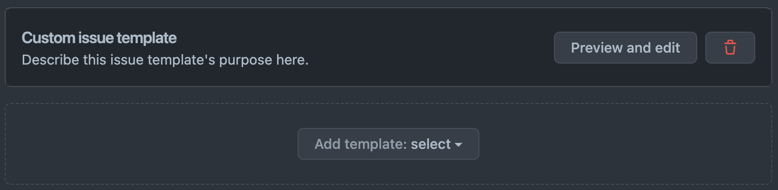
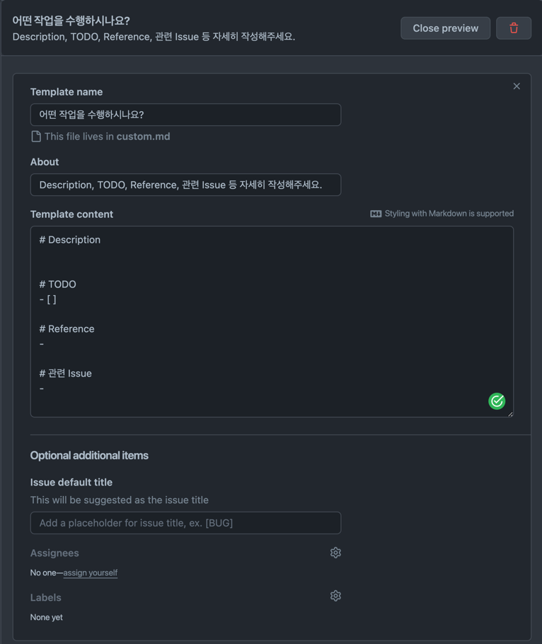

## 들어가며

Github Repository에 Issue Template과 PR Template을 적용하는 방법에 대해 작성한 글입니다.

## Issue Template

Issue Template의 경우 Github Repository에 있는 Settings를 통해 쉽게 생성할 수 있습니다.

위 버튼을 누르면 아래와 같은 페이지가 뜹니다.

가운데 버튼을 눌러 Bug Report, Feature에 대한 Template을 생성할 수 있습니다.

이번 글에서는 제 취향을 담아 `Custom template`을 선택하여 Bug와 Feature 구분없이 작성할 수 있는 **공통 Template**을 작성하겠습니다.

위 버튼을 누르면 아래처럼 새로운 Template이 생성됩니다.

`Preview and edit` 버튼을 눌러 상세 내용을 적습니다. 
저는 아래와 같이 적었습니다.

> 만약 Issue를 생성할 때 자동으로 제목에 PREFIX를 추가하고 싶다면 `Issue default title`에 값을 기입하면 됩니다.
> 
> Assignees도 Issue Template에 따라 자동으로 설정할 수 있습니다. 
> Lables 또한 마찬가지입니다.

입맛대로 작성이 완료됐다면 우측 상단에 `Propose changes` 버튼을 눌러 Commit 하면 아래와 같이 해당 브랜치에 `.github/ISSUE_TEMPLATE` 디렉터리가 생성되고 그 안에는 작성한 내용에 따라 생성된 md 파일이 존재합니다.

그리고 이제 Issue 탭에서 새로운 Issue를 생성할 때 만들어놓은 Template을 맘껏 활용하면 됩니다.

> 추후 수정이 필요하다면 md 파일 자체를 수정하거나 Settings를 통해 접근해서 수정할 수 있습니다.

## PR Template

PR Template은 Issue Template처럼 Github Repository의 Settings 탭에서 생성할 수 있는 기능은 없습니다.

따라서 직접 md 파일을 추가해야 합니다.

아래 사진처럼 Issue Template을 만들어서 생성된 `.github` 디렉터리로 이동합니다. 
그리고 우측 상단에 `Add file` - `Create new file` 버튼을 누릅니다.

그리고 아래와 같이 PR Template을 작성해줍니다.

파일 제목은 `pull_request_template.md`로 해주세요.

> 물론 Template 본문은 본인 취향에 맞게 작성해주세요. 🙏

그리고 우측 상단에 `Commit changes...`를 눌러 작업 내용을 Commit 합니다.

이제 PR을 생성할 때 자동으로 Template이 작성 되어있는 것을 확인할 수 있습니다.