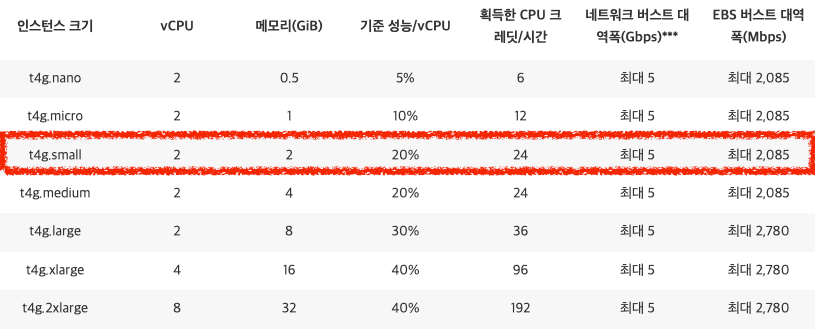

## 들어가며

[EC2에 스프링 배포하기](https://kdkdhoho.github.io/deploy-spring-boot-in-aws-ec2-manually/) 글을 작성하다가 EC2 인스턴스를 생성할 때 AMI를 설정하게 됩니다.

이때 선택할 수 있는 아키텍처는 아래와 같이 `x86`과 `Arm` 두 가지로 나뉩니다.

문득, 이 둘의 차이에 대해 궁금해져 학습하고 정리해봤습니다.

## Amazon Machine Image?

우선 Amazon Machine Image에 대해 알아보겠습니다.

[공식 문서](https://docs.aws.amazon.com/ko_kr/AWSEC2/latest/UserGuide/AMIs.html)에 따르면 다음과 같습니다. 
> 인스턴스를 시작하는 데 필요한 정보를 제공하는 AWS에서 지원하는 이미지다.

즉, 운영체제를 '도커의 이미지' 처럼 EC2 인스턴스에 설치하는 것으로 이해하면 되겠습니다.

## 아키텍처?

그럼 여기서의 아키텍처는 무엇을 의미하며 64비트(x86), 그리고 64비트(Arm)은 각각 무엇을 의미하는걸까요?

이것들은 모두 _CPU 아키텍처_ 를 의미하는 것입니다.

CPU 아키텍처란, 간단히 말해 CPU를 만드는 설계 방법입니다.

이 CPU를 만드는 회사는 다양하고 각 회사마다 CPU를 만드는 방법이 조금씩 다른데요.

가장 유명한 CPU 제조 회사인 [Intel](https://www.intel.com/content/www/us/en/homepage.html) 사가 만드는 CPU의 아키텍처는 `x86` 라고 부릅니다. 
그리고 타사인 [ARM](https://www.ARM.com/) 사가 만드는 CPU의 아키텍처가 바로 `Arm` 입니다.

이 두 CPU 아키텍처에는 큰 차이가 있습니다.

## x86 vs Arm

| 아키텍처 |     지원 OS     |      타겟      | 에너지 사용량 | 발열 | 비용 | 트랜지스터 수 |
|:----:|:-------------:|:------------:|:-------:|:--:|:--:|:-------:|
| x86  | 윈도우, 리눅스, 맥 등 |      PC      |   높음    | 높음 | 높음 |   많음    |
| Arm  |   리눅스 계열 등    | 스마트폰, 저전력 PC |   낮음    | 낮음 | 낮음 |   적음    |    

x86은 CPU 내에 상대적으로 더 많은 트랜지스터가 존재합니다. 
따라서 **처리 성능은 뛰어납니다.** 하지만 그만큼 **에너지 사용량이 높고 발열량이 높습니다.** 
그에 따라 **비용도 상대적으로 비쌉니다.**

Arm은 x86에 비해 **더 싸고 발열도 낮습니다.** 
본래 Arm의 설계 목적은 스마트폰 같이 소형 전자 장치에 들어갈 CPU를 목적으로 설계되었습니다. 
따라서 더 작고, 배터리 수명이 길고, **저비용**에 초점을 맞춰 설계합니다.

## 그럼 어떤 아키텍처를 선택하면 좋을까?

목적은 클라우딩 컴퓨터인 EC2에 들어갈 아키텍처를 선택하는 것입니다.

클라우딩 컴퓨터는 "저비용에 고효율"을 가지는 대표적인 기술입니다. 
또한 물리적 자원이 아니다보니 CPU 발열을 냉각시켜야 하는 제약이 존재하지 않습니다.

추가로 아래 사진을 보시겠습니다.

x86을 선택하면 기본적으로 _t2.micro_ 타입이 설정됩니다. 
반면, Arm을 선택하면 _t4g.micro_ 타입이 설정됩니다.

이 두 인스턴스 타입의 차이에 대해 알아보겠습니다.

두 타입 모두 프리티어이면서 동일한 AMI에서 설정되는 인스턴스 타입임에도 불구하고, CPU 아키텍처의 차이에 따라 성능과 비용의 차이가 있음을 확인할 수 있습니다.

결론적으로, 저비용 고효율을 위해서라면 `Arm 아키텍처`를 선택하는 것이 바람직해보입니다.

## 64비트는 무엇이지?

그런데 64비트는 무엇일까요?

여기서의 '비트'는 CPU가 가지는 *레지스터*의 크기를 의미합니다.

CPU가 프로그램 명령어를 처리하기 위해 자체적으로 저장소를 가집니다. 
이 저장소를 레지스터라고 합니다. 
레지스터는 용량은 매우 작은 대신 속도는 매우 빠른 특징을 가집니다.

따라서 저장소의 크기가 클수록 더 많은 데이터를 이용해 CPU가 명령어를 처리하는 능력이 향상됩니다.

참고로 32비트도 존재합니다만 64비트와의 차이는 다음과 같습니다. 
32비트는 2^32 = 4,294,967,296 bit ≒ **4GB** 
64비트는 2^64 = 18,446,744,073,709,551,616 bit ≒ **16EB** (= 4GB x 4GB)

현대의 많은 CPU는 대부분 64비트로 생산되고 있습니다.

## 마치며

지금까지 CPU 아키텍처를 선택하는 데에 있어 필요한 정보들을 알아보았습니다.

처음 접한 내용이다보니 틀리거나 빠진 내용이 있을 수 있습니다. 
만약 정보의 수정이 필요하다면 언제든 댓글 남겨주시길 바랍니다.

감사합니다.

### Reference

> - [AMR vs x86 - Red Hat 공식문서](https://www.redhat.com/en/topics/linux/Arm-vs-x86)
> - https://velog.io/@480/이제는-개발자도-CPU-아키텍처를-구분해야-합니다
> - [CPU 32비트와 64비트 차이, 모르고 사용하면 낭비다 - 이포커스](https://www.e-focus.co.kr/news/articleView.html?idxno=2638858)
> - https://dev.to/aws-builders/data-points-you-need-to-know-about-Arm-for-your-application-code-migration-5c0f
> - https://youtu.be/ndXKHgFIIL4
