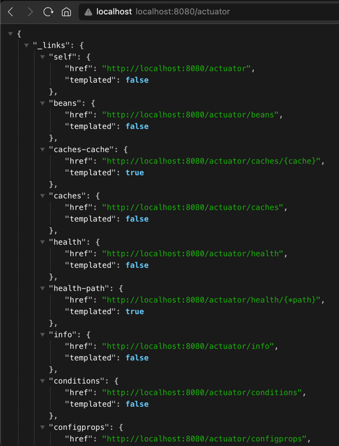
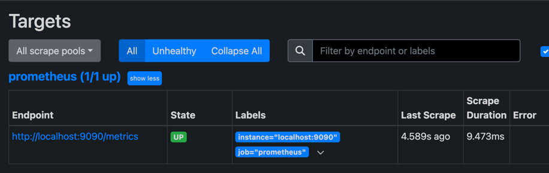
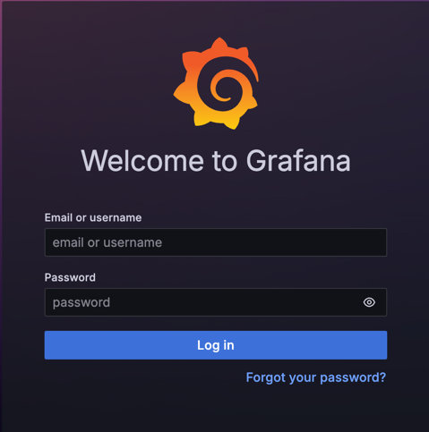
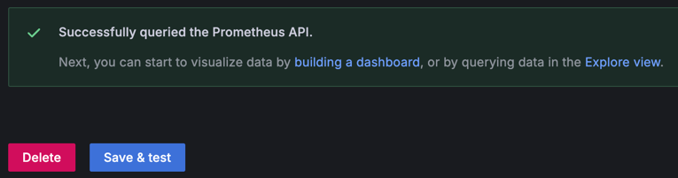
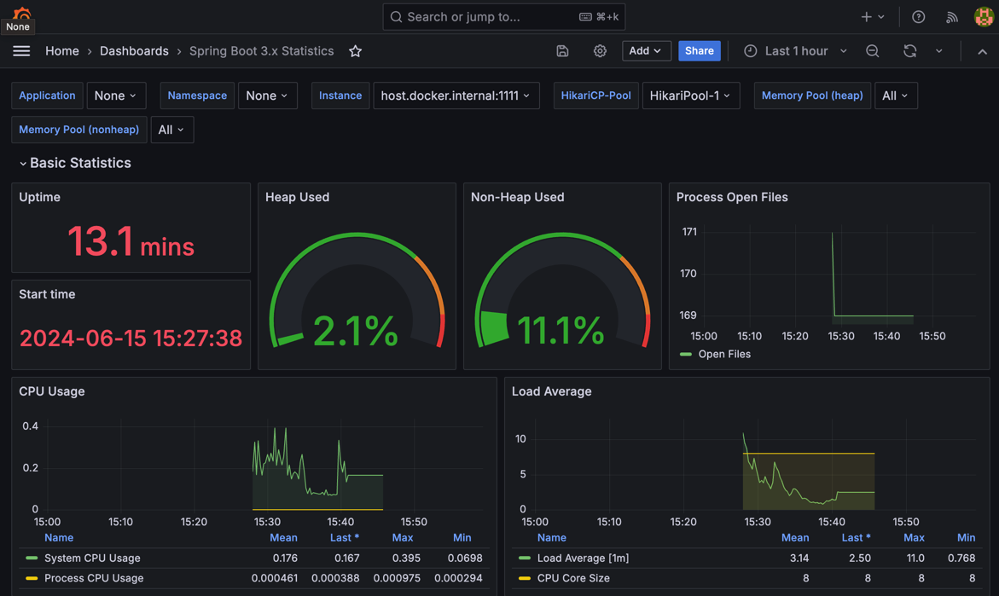

## 들어가며

서비스를 운영하면서 발생한 장애를 빠르게 대응하고 복구하는 것은 매우 중요하다.<br>
이를 위해선 **장애의 원인을 빠르게 파악**해야 한다.<br>

문제의 원인을 파악하는 방법에는 애플리케이션의 상태를 전반적으로 관찰 가능한 **모니터링 대시보드**, 사용자의 요청을 한 트랜잭션으로 묶어 파악하는 **APM**, 문제에 대한 상세한 설명이 적힌 **로깅** 등이 있다.

그 중에서도 **모니터링 대시보드를 Docker, Prometheus, Grafana를 이용해 구축하는 과정**에 대해 작성하겠다.

설정할 것이 상당히 많지만 단순히 설정하고 연결하고 확인하는 것이 끝이다.<br>
하나하나 차근차근 진행하면 할 수 있을 것이다.

개발 환경은 다음과 같다.
- MacOS 14.5 (23F79)
- Spring Boot 3
- Docker 26.1.3
- Nginx 1.18.0

## 모니터링 시스템 아키텍처

모든 구축이 완료되면 아래 그림과 같은 모니터링 시스템 아키텍처를 가지게 될 것이다.


- Spring Actuator를 이용해 Application의 메트릭을 웹에 노출한다.<br>
Prometheus는 일정 주기마다 Actuator가 노출한 Endpoint에서 메트릭을 수집 & 저장한다.<br>
Grafana를 통해 Prometheus가 수집 & 저장한 데이터를 한눈에 본다.

- Docker를 이용해 Spring, Prometheus, Grafana를 띄운다.<br>
  Prometheus, Grafana는 docker-compose를 이용해 두 컨테이너를 하나의 서비스처럼 동작할 수 있게 한다.

- 외부인이 Spring Actuator나 Prometheus에 접근하는 것을 막기 위해 Docker Network를 구축한다.<br>
  사용자는 8080 포트를 통해 서비스를 이용만 할 수 있게 된다.<br>
  Prometheus가 Spring Actuator의 메트릭을 수집하고 Grafana가 Prometheus를 Datasource로 등록하기 위한 통신은 IP 주소를 입력할 필요없이 컨테이너 이름으로만 접근 및 통신한다.<br>
  개발자는 Grafana에 특정 포트를 통해서만 접근이 가능하다. 물론 인바운드 규칙 등으로 외부인의 접근을 차단한다.

## 1. Spring Actuator

가장 먼저 [Spring Actuator](https://docs.spring.io/spring-boot/docs/3.0.5/reference/html/actuator.html)를 설정해서 애플리케이션의 메트릭을 볼 수 있게 해야 한다.<br>
메트릭은 **서버 상태와 관련된 데이터**라고 이해하면 된다.

build.gradle에 `spring-boot-starter-actuator` 의존성을 추가하면 Spring Actuator 기능을 사용할 수 있다.

```gradle
dependencies {
    implementation 'org.springframework.boot:spring-boot-starter-actuator'
}
```

의존성을 추가하고 `localhost:8080/actuator`로 접근하면 아래 그림처럼 Endpoint들이 노출된 것을 볼 수 있다.


> 💡 엔드포인트를 사용하려면 엔드포인트 활성화, 엔드포인트 노출 두 가지 작업을 모두 수행해야 한다.<br>
> 기본적으로 `shutdown`을 제외하고는 대부분의 엔드포인트는 활성화된 상태인데, 이렇게 활성화된 엔드포인트를 HTTP에 노출할 지 JMX에 노출할 지 결정 후 사용하는 것이다.<br>

이제 더 많은 Endpoint를 노출하기 위해 `application.yml`에 아래 코드를 추가한다.
```yaml
management:
  endpoints:
    web:
      exposure:
        include: "*" # web에 모든 Endpoint를 노출한다.
server:
  tomcat:
    mbeanregistry:
      enabled: true # tomcat과 관련된 Endpoint를 노출한다.
```

그리고 다시 확인해보면 훨씬 많은 Endpoint가 노출된 것을 확인할 수 있다.


하지만 큰 문제가 하나 있다.<br>
누구든지 뒤에 `/actuator` 만 붙여 접근하면 현재 서버의 메트릭을 볼 수 있다는 점이다.<br>
보안을 강화하기 위해 일부 엔드포인트만 열어둘 수 있지만, 그럼에도 아무나 볼 수 있는 것은 동일하다.<br>
보여져도 상관없는 메트릭일지라도 모두에게 오픈하고 싶지는 않다.

Spring Boot는 이러한 문제를 해결하기 위해 _port_와 _base-path_를 따로 설정할 수 있게 해준다.
```yaml
# application.yml
management:
  endpoints:
    web:
      exposure:
        include: "*"
  server:
    port: 1111 # port 설정
    base-path: new/path # base-path 설정
```
위처럼 설정을 추가하면 `localhost:8080`이 아닌 `localhost:1111/new/path/actuator`로 접근해야 볼 수 있다.


이렇게 설정한 port와 base-path는 내부망에서만 접근하도록 설정하면 된다.

## 2. Prometheus

다음으로 Prometheus를 Docker Container에 띄어 실행하고 Spring Actuator의 Endpoint에 접근해 메트릭을 수집해보자.
> 💡 Prometheus는 메트릭을 주기적으로 수집해 저장하는 오픈소스 소프트웨어이다.<br>

그 전에, 미리 수행해야 하는 작업이 있다.<br>
build.gradle에 `implementation 'io.micrometer:micrometer-registry-prometheus'` 을 추가하는 것이다.

추가하는 이유는 JDBC를 사용하는 것으로 이해하면 되는데, DB 종류마다 쿼리를 읽고 처리하는 방식이 약간씩 다르지만 JDBC가 DB 계층을 추상화하여 개발자는 DB 종류에 종속되지 않는 것과 같다고 이해하면 된다.

추상화 작업은 바로 [Micrometer](https://micrometer.io/)가 수행해주는데, Micrometer가 Spring Actuator의 메트릭을<br>
Prometheus가 읽을 수 있도록 변환해주는 것이다.

의존성 추가 후 애플리케이션을 재실행해보면 `~/actuator/prometheus` Endpoint가 노출된 것을 확인할 수 있다.


---
<br>

이제 진짜 Prometheus를 실행해보자.<br>
환경 구성의 편리함을 위해 *docker-compose*를 통해 구성한다.<br>
```yaml
# docker-compose.yml
name: monitoring
services:
  prometheus:
    image: prom/prometheus:latest
    container_name: prometheus
    ports:
      - "9090:9090"
```
이제 `docker compose up -d` 명령어를 통해 컨테이너를 실행하고 `localhost:9090` 으로 접속 후 확인해보자.


실행이 성공적으로 된다면, Status -> Targets로 들어가보자.<br>
현재 Prometheus 스스로의 메트릭을 정상적으로 수집하고 있음을 확인할 수 있다.


이제 이 수집 대상에 Spring Actuator를 추가하자.<br>
추가하기 위해 `prometheus.yml` 파일을 생성 후 도커 마운트를 이용할 것이다.

1. `prometheus.yml` 파일 작성
  ```yaml
  # prometheus.yml
  scrape_configs:
    - job_name: "spring application"
      metrics_path: "/new/path/actuator/prometheus"
      scrape_interval: 5s
      scrape_timeout: 5s
      static_configs:
        - targets: ["localhost:1111"]
  ```

2. `docker-compose.yml` 수정
  ```yaml
  # docker-compose.yml
  name: monitoring
  services:
    prometheus:
      image: prom/prometheus:latest
      container_name: prometheus
      ports:
        - "9090:9090"
      user: "65534:65534"
      volumes: # 추가
        - "./prometheus.yml:/etc/prometheus/prometheus.yml"
        - "./prometheus-data:/prometheus"
  ```

이후 `docker compose down` -> `docker compose up -d` 명령어로 컨테이너를 다시 띄운다.<br>
그리고 다시 Targets 화면으로 이동 후 연결 상태를 확인한다.<br>

만약 아래처럼 `connection refused` 에러가 발생했다면 통신에 실패한 것이다.<br>


보통 올바르지 않은 Host거나, Host를 찾지 못했거나, Host에서 통신을 차단한 경우에 발생한다.

필자는 Spring은 IDE를 이용해 호스트 자체에서 실행 중인데, Container로 실행 중인 Prometheus가 Spring에 HTTP GET 요청을 보내면서 통신에 실패한 것이다.<br>
Container에서 호스트로 요청하려면 `localhost` 대신 `host.docker.internal`로 접근해야 한다.<br>
([참고 - Docker 공식문서](https://docs.docker.com/desktop/networking/#i-want-to-connect-from-a-container-to-a-service-on-the-host))
> ⚠️ 만약 EC2 인스턴스 내에서 수행하고 있는데 연결이 안된다면, 인바운드 규칙을 열어두었는지 확인해보자.<br>

`prometheus.yml`을 올바르게 수정 후 다시 실행하면 아래 그림처럼 성공할 것이다.


## 3. Grafana

지금까지 Spring Actuator를 통해 메트릭 Endpoint를 노출했고 Prometheus를 통해 Endpoint에 접근해 메트릭을 수집하도록 설정했다.

이제는 Grafana를 이용해 Prometheus가 수집한 메트릭을 한눈에 그리고 이쁘게 볼 수 있도록 대시보드를 구축해보자.

Grafana도 Prometheus와 함께 *docker-compose*로 구성 및 실행한다.
```yaml
# docker-compose.yml
name: monitoring
services:
  prometheus:
    image: prom/prometheus:latest
    container_name: prometheus
    ports:
      - "9090:9090"
    user: "65534:65534"
    volumes:
      - "./prometheus.yml:/etc/prometheus/prometheus.yml"
      - "./data:/prometheus"
  grafana: # 추가
    image: grafana/grafana:latest
    container_name: grafana
    user: "$UID:$GID"
    ports:
      - "3000:3000"
    volumes:
      - "./grafana-data:/var/lib/grafana"
      - "./grafana-logs:/var/log/grafana"
    depends_on:
      - prometheus
```

이번에도 마찬가지로 `docker compose down` -> `docker compose up -d`로 재실행 후 `localhost:3000`으로 접속하면 아래와 같이 로그인 창이 뜰 것이다.


admin/admin을 입력하면 패스워드를 재설정하라고 뜨는데, 일단 skip 후 계속 진행하자.

로그인에 성공하면, 설정할 것이 두 가지가 있다.

첫 번째로, **Datasource 설정**이다.<br>
Datasource는 화면에 그려줄 데이터를 어디서 가져올 건지 설정하는 것이다.

설정을 위해 화면 좌측에 메뉴바에서 Connections - Data sources 탭에 들어가서 `Add data source` 버튼을 누른다.<br>
그리고 prometheus를 찾아 클릭하면 아래 그림처럼 설정 페이지가 뜰 것이다.


이제 빨간 경고창이 나타내는 곳에 Prometheus의 URL을 입력하면 된다.<br>
그리고 맨 아래에 `Save & test` 버튼을 눌러 연결을 확인하자.



만약 연결이 안된다면, URL을 입력할 때 _http 혹은 https 스키마를 추가했는지?_ 혹은 _host가 유효한지?_ 혹은 _host에 요청이 가능한지?_ 등을 확인해보자.

성공적으로 연결이 됐다면 Data sources 페이지에 아래처럼 뜰 것이다.


---
<br>

이제 두 번째로 설정할 것은, **대시보드 구축**이다.<br>
대시보드를 직접 하나하나 구축해도 되지만, 감사하게도 [Grafana Labs](https://grafana.com/grafana/dashboards/)에서 제공되는 대시보드 템플릿이 매우 다양하게 있다.<br>
우리는 여기서 제공되는 템플릿을 이용할 것이다.

왼쪽 메뉴에서 Dashboards 페이지로 이동 후 `Create Dashboard` 버튼 -> `Import dashboard` 버튼을 누르자.<br>
그리고 가운데 보이는 칸에 "19004"를 입력 후 `Load` 버튼을 누르면 페이지가 이동하는데<br>
이동한 페이지에서 Data source를 Prometheus로 설정 후 `Import` 버튼을 누르고 아래처럼 뜨면 성공이다!



추가적으로 JVM 관련 메트릭만을 따로 확인할 수 있는 대시보드를 만들어보자.<br>
과정은 위와 동일하지만 Import ID에 "4701" 를 입력하면 된다.

## 4. Docker Network 구성

지금까지 성공적으로 대시보드 모니터링을 구축했다.<br>
하지만 아직까지 `:111/new/path/actuator` 로 접속하면 메트릭을 볼 수 있을 뿐더러, `:9090`로 접속하면 Prometheus를 통해서도 확인할 수 있다.

이제 이 메트릭을 Docker Network를 이용해 내부망을 통해서만 확인할 수 있게 하고 Grafana만을 외부로 허용하자.

우선 `docker network ls` 명령어를 입력하면 *monitoring_default* 네트워크가 존재할 것이다.

*docker-compose*를 통해 컨테이너를 구축함과 동시에 네트워크가 생성된 것이다.<br>
우리는 이 네트워크에 Spring, Prometheus, Grafana 컨테이너를 포함할 것이다.
> 💡 참고로 이 네트워크는 docker-compose가 내려가면 사라진다.

`docker-compose.yml`을 수정하자. (Spring Container는 따로 추가해주자.)
```yaml
# docker-compose.yml
name: monitoring
services:
  prometheus:
    image: prom/prometheus:latest
    container_name: prometheus
    networks: # network 추가
      - "monitoring_default"
    #ports: 
    #  - "9090:9090" # Prometheus는 더이상 외부에서 접근하지 못한다. 
    user: "65534:65534"
    volumes:
      - "./prometheus.yml:/etc/prometheus/prometheus.yml"
      - "./data:/prometheus"
  grafana:
    image: grafana/grafana:latest
    container_name: grafana
    networks:  # network 추가
      - "monitoring_default"
    user: "$UID:$GID"
    ports:
      - "3000:3000"
    volumes:
      - "./grafana/data:/var/lib/grafana"
      - "./grafana/logs:/var/log/grafana"
    depends_on:
      - prometheus

# network 설정
networks:
  monitoring_default:
    external: true
```

*monitoring_default* 라는 Docker Network에 Prometheus와 Grafana가 추가되었다.<br>
이제 IP가 아닌 Container name으로 접근할 수 있게 되었다.<br>
Prometheus와 Grafana 설정도 바꿔주자.

1. `prometheus.yml`
  ```yaml
  # prometheus.yml
  scrape_configs:
    - job_name: "spring application"
      metrics_path: "/new/path/actuator/actuator"
      scrape_interval: 5s
      scrape_timeout: 5s
      static_configs:
        - targets: ["spring:1111"] # 변경
  ```

2. Grafana - Data sources


---
<br>

이제 `:9090` 으로 접속이 불가능하며 그라파나로만 접속이 가능하게 되었다.<br>
성공적으로 연결이 된 것도 그라파나를 통해 확인하자.

물론 그라파나로의 연결도 인바운드 규칙 등을 이용해 특정 IP에서만 접속할 수 있도록 설정하여 보안을 강화하자.

## 마치며

지금까지 Docker, Prometheus, Grafana를 이용해 Spring Application 모니터링 대시보드 구축에 대해 작성해보았다.

꽤 까다로운 작업이었지만 모니터링 대시보드를 통해 서비스 운영이 원활해질 것을 기대한다.
