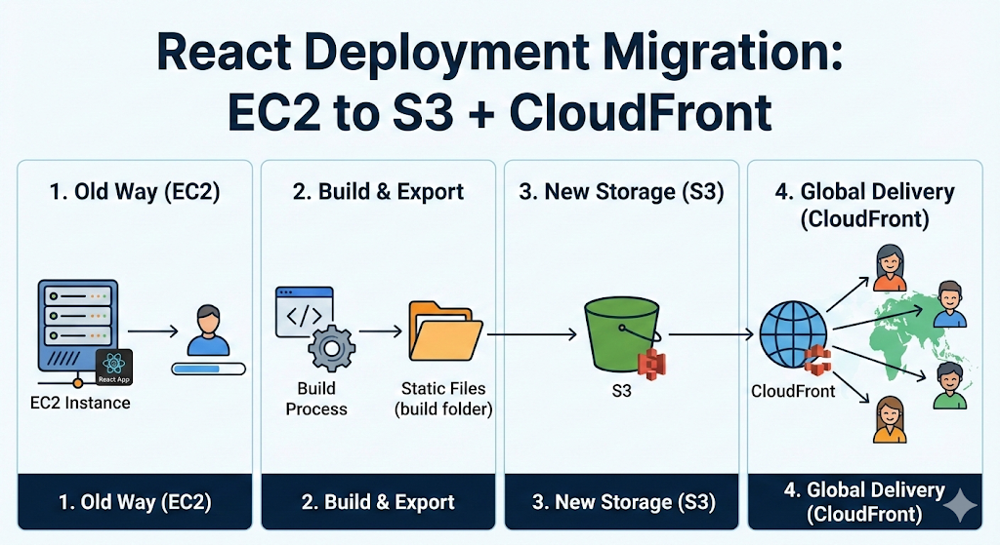

# 1. 들어가며
앱 서비스를 운영하던 스타트업에서 React로 쇼핑몰 사이트를 개발했습니다.  
당시 배포 작업은 동료가 맡고 있었고, 배포 방식은 EC2를 사용하는 방향으로 정해져 있었습니다.

저는 React 애플리케이션은 빌드 후 정적 파일만 안정적으로 서빙하면 된다고 보고 있었기 때문에, EC2보다 S3와 CloudFront를 활용하는 방식이 더 적절하다고 판단했습니다.

이번 글에서는 왜 배포 방식을 EC2에서 S3와 CloudFront로 변경했는지, 그리고 그 과정에서 무엇을 고려했는지 정리해보려 합니다.

# 2. 문제 상황

동료는 S3와 CloudFront를 이용한 배포 경험이 없었고, 새롭게 학습하며 적용할 시간도 충분하지 않았습니다.  
그래서 우선 익숙한 방식인 EC2 배포를 선택했습니다.

하지만 React는 서버에서 애플리케이션 로직을 실행해야 하는 구조가 아니라, 빌드된 정적 파일을 전달하면 되는 경우가 많습니다.  
그럼에도 EC2 인스턴스를 계속 켜두는 방식은 비용과 운영 효율 측면에서 비효율적이라고 판단했습니다.

# 3. 요구 사항 & 제약 조건
이번 배포 방식 변경에서 중요했던 조건은 다음과 같았습니다.

- React 빌드 결과물을 정적으로 안정적으로 서빙할 수 있어야 했습니다.
- 스타트업 환경상 비용을 최대한 아껴야 했습니다.
- 새로운 방식을 도입하더라도 운영 복잡도가 과도하게 높아지면 안 됐습니다.
- 당시 인프라가 AWS 기반이었기 때문에, AWS 서비스 안에서 해결하는 것이 자연스러웠습니다.

# 4. 해결 방안
React는 `npm run build`를 실행하면 브라우저가 바로 사용할 수 있는 정적 파일들을 생성합니다.  
결과물은 `build` 또는 `dist` 디렉터리에 쌓이고, 배포는 결국 이 파일들을 사용자에게 전달하는 과정입니다.

이 구조를 기준으로 보면 선택지는 크게 두 가지였습니다.

1. EC2에 빌드 파일을 올리고 직접 호스팅하는 방식
2. S3에 정적 파일을 저장하고 CloudFront로 전 세계에 캐싱하여 서빙하는 방식

비교 결과, 정적 파일 중심의 React 서비스에는 S3와 CloudFront 조합이 더 적합하다고 판단했습니다.  
EC2는 인스턴스를 계속 실행해야 비용이 발생하는 반면, S3와 CloudFront는 저장 용량과 트래픽 중심으로 과금되기 때문에 트래픽이 크지 않은 서비스에서는 훨씬 경제적이었습니다.

또한 GitHub Actions에서 빌드한 파일을 `aws s3 sync`로 업로드하면 배포 파이프라인도 단순하게 구성할 수 있었습니다.

# 5. 해결
결국 배포 방식을 EC2에서 S3와 CloudFront 기반으로 변경했습니다.  
빌드 결과물을 S3에 업로드하고, 사용자는 CloudFront를 통해 정적 파일을 전달받는 구조로 전환했습니다.

다만 전환 이후 새로운 빌드 결과물이 바로 반영되지 않는 캐시 이슈가 발생했습니다.  
CloudFront는 S3의 콘텐츠를 엣지 로케이션에 캐싱하기 때문에, TTL이 남아 있으면 S3에 새 파일이 올라가도 이전 파일을 계속 응답할 수 있습니다.  
특히 파일명이 고정된 `index.html`에서 이런 문제가 발생하기 쉬웠습니다.

당시에는 사용자 규모가 크지 않았고 더 시급한 업무가 많았기 때문에, 가장 빠르고 단순한 방법인 CloudFront 캐시 무효화(Invalidation)로 대응했습니다.  
장기적으로는 AWS가 권장하는 [Tiered TTLs](https://kdkdhoho.github.io/posts/post-20260124-07fabb/) 방식도 고려할 수 있는 상황이었습니다.

# 6. 결과
배포 방식을 바꾼 뒤 인프라 운영 효율은 분명히 좋아졌습니다.

당시 MAU는 약 6,400명 수준이었고 빌드 파일 크기도 100MB 미만이어서, S3와 CloudFront를 사용할 때 비용은 사실상 0에 가깝게 유지됐습니다.  
반면 EC2는 트래픽과 관계없이 인스턴스를 계속 켜두어야 하므로, 작은 규모의 정적 사이트를 운영하기에는 부담이 더 컸습니다.

배포 파이프라인 측면에서도 SSH 기반 전송보다 S3 업로드 방식이 단순하고 반영 과정도 명확했습니다.

# 7. 마치며
React 배포 방식을 EC2에서 S3와 CloudFront로 변경하며 인프라 효율을 높일 수 있었습니다.  
물론 SEO를 위한 SSR(Server Side Rendering)이 필요하거나 특수한 목적이 있다면 EC2를 사용할 수 있지만, 상황과 목적에 맞게 클라우드 제품을 선택하는 것이 중요합니다.

한 가지 아쉬운 점은 두 방식의 차이를 수치로 정밀하게 기록하지 못한 점입니다.  
배포 속도가 얼마나 단축되었는지, 비용이 정확히 얼마나 절감되었는지 지표로 남겼다면 더 설득력 있는 글이 되었을 것입니다.  
다음부터는 이러한 지표 측정을 의식적으로 챙겨야겠습니다.

# 참고
- [AWS 가이드 - Tiered TTLs](https://aws.amazon.com/blogs/networking-and-content-delivery/host-single-page-applications-spa-with-tiered-ttls-on-cloudfront-and-s3/) 
- [AWS 공식문서 - AWS CLI S3 Configuration](https://docs.aws.amazon.com/cli/latest/topic/s3-config.html)
