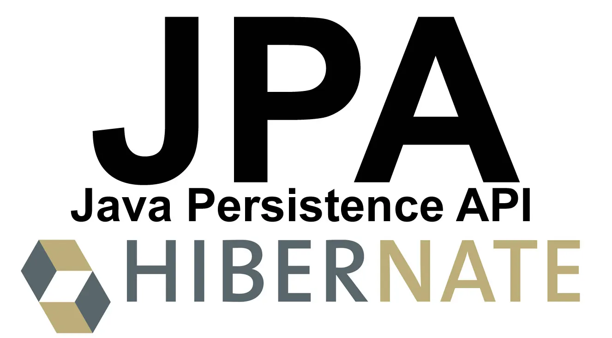

# 1. JPA 시작하기: 왜 객체 중심 개발인가?
## JPA를 써야 하는 이유
- **SQL 중심에서 객체 중심으로**: JPA 없이 JdbcTemplate만 사용하면 객체를 RDB에 저장하고 불러오는 반복적인 매핑 과정이 매우 번거롭습니다. JPA는 이 과정을 자동화합니다.
- **생산성 및 유지보수 향상**: 필드 하나가 추가될 때 수많은 SQL을 수정해야 하는 고통에서 해방됩니다.
- **성능 최적화**: 지연 로딩, 쓰기 지연 등 다양한 성능 최적화 기능을 제공합니다.

## JPA의 두 가지 핵심
1. **매핑(Mapping)**: 객체와 테이블을 어떻게 연결할 것인가?
2. **영속성 컨텍스트 동작 방식**: 영속성 컨텍스트가 내부적으로 어떻게 데이터를 관리하는가?

---

# 2. 내부 동작 방식(영속성 관리)
## EntityManagerFactory와 EntityManager
- EntityManagerFactory
  - EntityManager를 생성하는 Factory 객체입니다.
  - **생성 비용이 비싸서** 애플리케이션 전역에서 1개만 생성하고 재사용합니다.

- **EntityManager**
    - **영속성 컨텍스트를 관리하는 객체**입니다.
    - Client의 요청마다 EntityManager를 생성하고, 하나의 EntityManager는 하나의 Connection을 사용합니다.
    - **Entity의 상태 변경 시, 반드시 트랜잭션이 필요**합니다. 단순 조회에서는 필수는 아니지만 트랜잭션을 읽기 전용으로 설정하여 최적화 할 수 있습니다.
    - Bean으로 주입받으려면 `@PersistenceContext` 를 필드에 추가합니다. Spring Data JPA를 쓰면 `@Autowired` 로도 주입받을 수 있습니다.


## 영속성 컨텍스트
- JPA에서 가장 중요한 용어로, **논리적인 개념**입니다.
- EntityManager를 통해서 영속성 컨텍스트에 접근합니다.
    - EntityManager는 트랜잭션 단위로 생성됩니다. 즉, **트랜잭션이 끝나면 EntityManager도 종료되고, 영속성 컨텍스트도 종료**된다.

## 영속성 컨텍스트의 특징
### 1차 캐시
영속성 컨텍스트 내부에는 Key-Value 형태의 **1차 캐시**가 존재합니다.  
(**Key: `@Id` 어노테이션을 설정한 필드의 값**, Value: Entity의 인스턴스)

영속 상태의 Entity는 모두 1차 캐시에 저장됩니다.  
덕분에, DB에 조회할 때 우선 1차 캐시에서 데이터(인스턴스)를 조회합니다.  

존재하면 DB를 거치지 않고 바로 반환하기에 성능 상 이점이 있습니다.  
(사실상 한 트랜잭션 안에서만 사용되는 성능 상의 이점이기 떄문에, 극적인 효과를 누릴 순 없습니다. 이때 애플리케이션 전역에서 사용하기 위한 캐시로, _2차 캐시_ 가 존재하긴 합니다.)

### 동일성 보장
[1차 캐시](#1차-캐시) 덕분에, 똑같은 식별자로 조회한 두 Entity의 인스턴스 주소값이 동일함을 항상 보장합니다.  
이는 애플리케이션 레벨에서 트랜잭션 격리 수준 중, [Repeatable Reade](https://kdkdhoho.github.io/%EB%8D%B0%EC%9D%B4%ED%84%B0%EB%B2%A0%EC%9D%B4%EC%8A%A4/understanding-transaction-and-concurrency-problem/#3-3-repeatable-read)를 보장합니다.

### 쓰기 지연
영속성 컨텍스트 내부에는 1차 캐시 외에도 **쓰기 지연 SQL 저장소**가 있습니다.

이 곳에 `INSERT`, `UPDATE`, `DELETE` 쿼리를 저장해두다가 **트랜잭션이 커밋하는 순간에 DB로 전달**합니다. 이를 **Flush** 라고 합니다.
  
덕분에 DB와의 네트워크 통신 비용을 줄일 수 있습니다.

### Dirty Checking (변경 감지)
영속 상태의 Entity 필드값이 변경되면, 트랜잭션 커밋 시점에 별도의 `persist()` 호출 없이도 자동으로 UPDATE 쿼리가 실행되는 기능입니다.

동작 원리는 다음과 같습니다.

1. **스냅샷**: Entity를 영속성 컨텍스트에 처음 저장할 때의 상태를 복사해서 보관합니다.
2. **비교 및 생성**: `flush()` 호출 시, 1차 캐시의 현재 Entity 상태와 스냅샷을 비교합니다.
3. **SQL 저장**: 차이점이 발견되면 UPDATE 쿼리를 생성하여 쓰기 지연 SQL 저장소에 보관 후 DB에 전달합니다.

### Lazy Loading
연관된 객체를 즉시 조회하지 않고, **실제로 사용할 때(프록시 객체 초기화 시점) 조회하는 전략**입니다.

가급적 모든 연관관계에는 지연 로딩을 사용하는 것이 실무적인 권장 사항입니다.

## 플러시
영속성 컨텍스트의 변경 사항을 DB에 동기화하는 작업입니다.  
플러시는 영속성 컨텍스트를 비우는 것이 아닌 **단순히 쓰기 지연 SQL 저장소에 쌓인 SQL을 DB로 전달**할 뿐입니다.  
따라서 1차 캐시도 유지가 됩니다.

플러시가 발생하는 시점은 다음과 같습니다.

- `em.flush()` 직접 호출 
- 트랜잭션 커밋 전 자동 호출
- JPQL 쿼리 실행: SQL로 변환되어 DB에 직접 날아가기 전, 정합성을 위해 자동 호출합니다. 이유가 중요한데, **JPQL로 `SELECT` 문을 실행하면 영속성 컨텍스트를 거치지 않고 바로 DB를 조회**합니다. 이떄 영속성 컨텍스트에 저장된 Entity가 DB에 반영이 되어 있어야 정합성에 문제가 발생하지 않기 떄문입니다.

## Entity
데이터베이스 테이블과 매핑되는 **자바 객체**입니다.  
JPA가 Java의 Reflection 기능을 활용하기 때문에 **기본 생성자가 필수**입니다.

## Entity의 생명주기
- **비영속 상태**: 영속성 컨텍스트에 한번도 포함되지 않은 상태입니다.
- **영속 상태**: 영속성 컨텍스트에 포함되어 있는 상태입니다.
- **준영속**: 영속성 컨텍스트에 포함됐다가 분리된 상태입니다.
- **삭제**: 영속성 컨텍스트에 포함은 되지만 _REMOVED_ 로 기록된 상태입니다. 트랜잭션 커밋 시점에 DELETE 쿼리가 나갑니다.

# 3. Entity 매핑
## 기본 매핑 어노테이션
- `@Entity`
  - JPA가 관리할 클래스임을 지정합니다.
  - 기본 생성자가 필수입니다. 기본 생성자의 접근 제어자는 public이나 protected 수준이어야 합니다.
  - `final`, `enum`, `interface`, `inner` 클래스에는 사용이 불가합니다.
  - 속성
    - name: JPA에서 사용할 Entity의 이름
- `@Table`: 엔티티와 매핑할 테이블 명칭을 지정합니다.
  - Entity와 매핑할 테이블을 설정합니다.
  - 속성
      - name: 매핑할 테이블 이름
      - catalog: DB Catalog 매핑
      - schema: DB Schema 매핑
      - uniqueConstraints: DDL 생성 시, 유니크 제약 조건 생성
- `@Column`: 필드와 컬럼을 매핑합니다. 제약조건 설정이 가능합니다.
- `@Enumerated`: Enum 객체를 매핑합니다. 이떄 반드시 **STRING 타입을 사용**해야 합니다. _ORDINAL_ 은 Enum의 필드 순서 변경 시 치명적 오류가 발생합니다.

## DB Schema 자동 생성
- `ddl-auto` 옵션 ^4dcc88
    - create: 기존 테이블 삭제 후 다시 생성
    - create-drop: create 이후, 애플리케이션 종료 시점에 테이블 DROP
    - update: 변경된 부분만 `ALTER`. **삭제, 변경은 하지 않고 추가만 한다**. 운영 환경에서는 사용 X
    - validate: Entity와 테이블이 정상적으로 매핑됐는지만 확인
    - none: 사용하지 않음
- **운영 DB에서는 *validate*만 사용하고, [[Flyway]]로 스키마를 관리하는 것이 안전**하다.
  `ALTER` 쿼리를 잘못 날리면 DB가 중단될 수 있다.

## 필드와 칼럼 매핑
- `@Entity`를 붙인 클래스의 필드와 DB 테이블의 칼럼을 매핑한다.
- 필드에 `@Column`을 안붙여도 자동으로 매핑된다.
- `@Column`
    - 칼럼명을 다르게 하고 싶거나, null, unique, length 같은 제약조건을 명시하고 싶을 때, 혹은 별도 설정을 하고 싶을 때 사용한다.
    - 속성
        - unique
            - 유니크 제약 조건을 설정하는 옵션이다.
            - 다만, [[#^4dcc88|ddl-auto]] 옵션으로 자동 생성될 때 제약 조건이 이름이 이상하게 생성되고 복합 설정도 안된다.
              따라서 `@Table` 어노테이션의 `uniqueConstraints` 속성을 활용하는 것이 좋다.
        - columnDefinition
            - DB 칼럼 정보를 직접 설정한다.
        - table:
        - precision, scale
            - BigDecimal 타입일 때 사용한다. double, float 타입에는 적용되지 않는다.
            - precision: 소수점을 포함한 전체 자리수
              scale: 소수의 자리수
- `@Enumerated`
    - Java의 Enum 타입을 매핑한다.
    - **무조건 `EnumType.ORDINAL` 말고 `EnumType.STRING`을 사용한다.**
- `@Lob`
    - CLob, BLob 타입을 매핑한다.
- `@Transient`
    - 필드를 **칼럼에 매핑하고 싶지 않을 때** 사용한다.
    - 주로 메모리 상에서 임시로 값을 저장할 때 사용한다.

## 기본 키 매핑
- `@Id`
    - 단독으로 사용하면 애플리케이션에서 직접 할당한다.
- `@GeneratedValue`
    - ID 값을 **자동으로 할당**할 때 사용한다.
    - 속성
        - IDENTITY
            - 기본키 값 할당을 DB에 위임하는 전략이다. (AUTO_INCREMENT)
            - 전략 특성 상, **`em.persist()` 가 호출되는 시점에 즉시 DB로 `INSERT` 쿼리를 실행한다.**
              Entity를 영속성 컨텍스트에서 관리하기 위함인데, Entity가 영속성 컨텍스트에 관리되려면 반드시 기본키 값이 필요한다. 하지만 _IDENTITY_ 일 때는 기본키 필드에 `null`이 할당된다. 따라서 곧바로 `INSERT` 쿼리를 실행한다.
            - 영한님) 그렇다고 유의미한 성능 저하가 발생하진 않더라.
            - 예: MySQL, PostgreSQL, SQL Server
        - SEQUENCE
            - DB 시퀀스 오브젝트를 사용한다.
            - 시퀀스 오브젝트를 매핑하는 `@SequenceGenerator`가 필요하다.
                - 속성
                    - name: `@GeneratedValue`의 _generator_ 속성에 할당할 이름
                    - sequenceName: 매핑할 DB 시퀀스 오브젝트 이름
                    - initialValue
                        - DDL 생성 시에만 사용한다.
                        - 초기 값을 설정한다.
                    - **allocationSize**
                        - 시퀀스 한 번 호출에 증가하는 수.
                        - **기본값은 50이다.**
                        - 동시성 문제는 발생하지 않는다.
            - Entity 초기 저장 시, ID 값을 가져오기 위해 `call next value`를 DB에 실행해서 시퀀스 오브젝트를 호출한다.
                - Entity를 저장할 때마다 네트워크 통신이 이뤄진다는 점에서, 성능 최적화를 위해 `allocationSize` 를 이용한다.
            - 예: Oracle, H2
        - TABLE
            - 별도의 키 생성용 테이블을 사용한다.
            - 모든 DB에 적용이 가능하기에 범용성있게 활용할 수 있지만, 최적화가 안되어 있어 성능 문제가 발생할 수 있다.
            - `@TableGenerator`가 필요하다.
        - AUTO (default)
            - 방언에 따라 자동으로 지정된다.

# **연관관계 매핑**
## 단방향 연관관계
-  `@ManyToOne` ^f134d7
    - 단방향 연관관계를 맺는 데 사용되는 기본적인 어노테이션
    - Entity가 **참조 Entity와 다대일 관계**일 때 사용한다.
-  `@JoinColumn` ^b3adc0
    - **외래키 칼럼을 매핑**할 때 사용한다.
    - 속성
        - **`name`**
            - DB에 생성할 **외래키 칼럼명**을 설정한다.
            - 생략 시 기본값: `필드명_참조테이블의PK칼럼명` (예: `user_id`)
        - `nullable`, `insertable`, `updatable`
        - `unique`
            - 일대일 관계에서 주로 사용한다.
        - `columnDefinition`
            - DDL을 직접 정의한다.
        - **`foreginKey`**
            - **외래키 제약조건을 설정**한다.
            - DDL 자동생성 시에만 영향이 있다.

## 양방향 연관관계
- **연관관계의 주인**
    - **외래키를 관리(Create, Update, Delete)하는 쪽의 Entity**를 의미한다.
    - 연관관계의 주인만이 외래키를 관리하고, **주인이 아닌 쪽은 읽기만 가능**하다.

- `@OneToMany`
    - 속성
        - `mappedBy`
            - **연관관계의 주인**을 의미한다.
            - 참조하는 Entity의 `@ManyToOne`에 해당하는 필드명을 입력한다.
    - **컬렉션 초기화 시점은 필드에서 곧바로 초기화하는 것이 Hibernate의 권장 사항**이다. 또한, **할당된 인스턴스를 변경하지 않는다**.
      `null` 관련 문제를 방지할 수 있고, 무엇보다 JPA가 컬렉션을 영속성 컨텍스트에서 관리할 때 `PersistenceBag` 이라는 일종의 프록시 객체로 감싼다.
      이때, `PersistenceBag` 가 참조하는 컬렉션의 참조값을 변경하면 JPA 동작에 문제가 발생할 수 있기 때문이다.

### 양방향 매핑 시 신경써야 할 것: 연관관계 편의 메서드, 순환 참조 문제
- 연관관계의 주인에 해당하는 Entity가 아닌 `@OneToMany`에 해당하는 Entity에만 값을 쓰는 경우이다.
  이 경우, DB에 값이 의도한대로 저장되지 않는다.
  `@OneToMany`는 읽기 전용이기 때문이다.
  따라서 **반드시 연관관계 주인**에 해당하는 Entity에 값(객체)을 할당해야 한다.
- 그렇다고 `@ManyToOne` 쪽 Entity에만 값을 할당하는 것도 정답은 아니다.
  왜냐하면, 객체지향 관점에서 생각해봤을 때, `@ManyToOne` Entity에 `@OneToMany` Entity가 할당되었다면, `@OneToMany` Entity에서도 `@ManyToOne` Entity로도 할당이 되어야 말이 된다.
  따라서 **연관관계 편의 메서드**를 생성한다.
    - 메서드의 위치는 둘 중 하나에만 두면 되는데, 핵심 비즈니스에 가까운 도메인에 위치하는 것이 나은 선택이 된다.
      DDD의 Aggregate Root 개념을 사용한다면, Aggregate Root에 위치하는 게 좋은 선택일 확률이 높다.
      한 가지 조언으로는, 비즈니스 로직을 구현할 때 양쪽 엔티티에 구현해보면 편한 쪽이 보일 것이다.
      또한, 연관관계 편의 메서드의 위치는 개발 중간에 리팩터링 할 수 있으니 큰 부담을 안가지는 게 좋겠다.

      관련한 자세한 내용은 [인프런의 QnA 글](https://www.inflearn.com/community/questions/16308?focusComment=42558)을 참고하자.


	- 예제 코드
		```java
		public void changeUser(User user) {
		    if (this.user != null) {
		        this.user.getOrders().remove(this);
		    }
		    this.user = user;
		    if (user != null) {  // null 체크 필수
		        user.getOrders().add(this);
		    }
		}
		```
- 또한, 양방향 매핑 시 **순환 참조 문제**를 조심하자

### 단방향 연관관계와 양방향 연관관계 중 어느 것을 하나?
- **처음에는 단방향 매핑으로 객체 설계**를 끝낸다.
- 이후, `@OneToMany`에서 `@ManyToOne` 으로 참조가 필요하다면 그때 양방향 연관관계로 확장한다.

## 일대다 단방향 ^dcdba0
- `@OneToMany` 쪽이 연관관계의 주인이 되는 연관관계 매핑 방법이다.
  이때, `@JoinColumn(name = "${외래키 칼럼명}")` 을 꼭 붙여줘야 한다.
  그렇지 않으면 JPA가 중간 매핑 테이블을 생성한다.
- 외래키를 가지지 않는 Entity에서 외래키를 관리하게 된다.
- 객체 설계 관점에서 이런 구조가 높은 확률로 나타날 수 있지만, [[#^f134d7|다대일 단방향]]과 비교했을 때 추가적인 쿼리가 나가야 한다.
- 권장되지 않는 방법인데, 이유는 다음과 같다.
  애플리케이션 코드 상으로는 `@OneToMany` Entity만 수정했는데, 정작 외래키를 가지는 테이블에도 `UPDATE` 쿼리가 나가는 점이, 복잡성보다는 단순함이 지향되는 실무적인 관점에서는 복잡성을 키우기 때문이다.

  따라서 외래키를 가지는 Entity 쪽을 연관관계의 주인으로 설정하고, 필요시 양방향 연관관계를 매핑하는 것이 권장된다. 만약 외래키를 가지는 Entity에서 참조하는 Entity로 접근할 일이 없다 하더라도, 위에서 말한 복잡성을 낮추기 위해 객체 설계 관점에서 단순성을 희생하는 방식으로 채택하는 것이 권장된다.

## 일대다 양방향
- [[#^dcdba0|일대다 단방향]]처럼 `@OneToMany` 쪽이 연관관계의 주인인 구조에서, `@ManyToOne`은 읽기 전용으로 객체 참조를 추가하는 방식이다.
- `@ManyToOne`에 `@JoinColumn(name = "${외래키 칼럼명}", insertable = false, updatable = false)` 를 추가해야 한다.
    - `insertable`과 `updatable`을 끔으로서 읽기 전용으로 만드는 야매 방식이다.
- 일대다 양방향도 예측하기 힘든 특성이 유지되므로 다대일 양방향을 사용하자.

## 일대일 연관관계
### 단방향
- `@OneToOne`를 사용한다.
- 외래키를 가지는 쪽에 [[#^b3adc0||@JoinColumn]] 을 추가한다.
### 양방향
- 마찬가지로 `@OneToOne`을 사용한다.
- `mappedBy` 속성을 통해서 연관관계의 주인을 나타낸다.

### 대상 테이블에 연관관계 주인 설정
- 단방향은 아예 불가한 방법이다.
- 양방향은 사실상 연관관계의 주인을 반대 방향으로 설정하면 된다.

## 다대다 연관관계
- 실무에서 쓰면 안된다.
  왜냐하면 **다대다 연관관계에서 생성되는 중간 테이블은 확장 할 수 없다.**
- 그래서 두 Entity와 중간 테이블을, `@ManyToOne`(중간 테이블 -> Entity)과 `@OneToMany`(Entity -> 중간 테이블) 로 연결하고 중간 테이블을 Entity로 승격하는 방식이 권장된다.
- 이때 두 Entity의 ID를 복합키로 PK 제약조건을 걸 수 있는데, 이 구조는 유연성이 다소 떨어진다.
  따라서 PK 필드는 별도의 대체키로 두는 것이 권장된다.

## 상속관계 매핑
- 객체의 상속 관계를 RDB에서 풀기 위한 모델링 전략으로 세 가지 전략이 있다.
  JPA는 세 가지 전략에 대해서 모두 매핑이 가능하다.
- `@Inheritance(strategy = InheritanceType.XXX)` 어노테이션을 부모 클래스에 추가하여 상속관계를 매핑한다.
- `@DiscriminatorColumn(name = "${구분지을 칼럼명}")` 어노테이션을 부모 Entity에 작성하여 자식 Entity를 구분지을 칼럼명을 설정한다. 기본값은 `DTYPE` 이다.
  `@DiscriminatorValue("${DTYPE에 저장될 값}")` 어노테이션을 자식 Entity에 작성하여, 자식 Entity를 나타내는 값을 설정한다.
- 예제 코드
    - `@Inheritance`의 strategy 값만 바꾸면 매핑 방법을 변경할 수 있다.
```java
@Entity
@Inheritance(strategy = InheritanceType.JOINED)
public abstract class Item { 
	@Id @GeneratedValue 
	private Long id; 
	private String name; 
	private int price; 
} 

@Entity 
public class Album extends Item { 
	private String artist; 
} 

@Entity 
public class Movie extends Item { 
	private String director; 
	private String actor; 
} 

@Entity 
public class Book extends Item { 
	private String author; 
	private String isbn;
 }
```

### 조인 전략
- 가장 정석적인 방법이다.
- 부모 Entity에 PK를 두고, 공통 속성을 정의한다. 자식 Entity를 구분하는 칼럼(`DTYPE`)을 포함한다.
  자식 Entity에는 부모 Entity의 PK 값을 기본키로 설정한다.
- `InheritanceType.JOINED` 로 설정한다.
- 특징
    - [[데이터베이스 정규화]]가 지켜진다. -> 저장 공간 효율적
    - FK 제약조건을 활용할 수 있다.
    - 자식 테이블 조회 시 부모 테이블과 JOIN이 필요하다. -> 성능 고려
    - INSERT 쿼리가 2번 발생한다. -> 성능 고려
    - 단일 테이블 전략에 비해, 테이블 구조의 복잡성이 증가한다.

### 단일 테이블 전략
- 상속 구조에 존재하는 모든 속성(필드)을 하나의 테이블에 포함한다.
- JPA의 기본 전략이다.
- `InheritanceType.SINGLE_TABLE`로 설정한다.
  단일 테이블 전략의 경우에는 `@DiscriminatorColumn`를 생략할 수 있지만, JPA가 자동으로 추가해준다.
- 특징
    - [[데이터베이스 정규화||정규화]]가 이뤄지지 않는다.
    - 조회 시 JOIN이 불필요하다.
    - 여러 칼럼에 `null`이 할당된다.
    - 테이블이 매우 비대해질 수 있다. -> 상황에 따라 조회 성능이 느려질 수 있다. -> 성능이 느려지는 임계점이 있는데, 사실상 그 임계점도 잘 안넘는다.
    - `INSERT`와 `SELECT` 쿼리가 가장 단순하다.

### 구현 클래스마다 테이블 전략
- **잘 사용되지 않는 방법**이다.
- 부모 Entity의 필드를 자식 Entity에 모두 (중복되게끔) 저장한다.
- `InheritanceType.TABLE_PER_CLASS`를 할당한다.
- `@DiscriminatorColumn`이 무의미해서 추가해도 동작하지 않는다.
- 특징
    - **부모 타입으로 조회 시, `UNION ALL` 연산으로 모든 자식 테이블을 조회한다. -> 성능 문제 발생 가능**
    - 변경 관점에서 보면 매우 번거로운 작업이 된다.

### 전략 선택 기준
- 상속 구조가 단순하고 확장 가능성이 낮다고 판단될 경우 -> 싱글 테이블 전략
- 하지만, 비즈니스 적으로 중요한 가치를 지니고 복잡한 구조인 경우 -> 조인 전략

## `@MappedSuperclass`
- 하위 Entity에서 **공통으로 매핑할 필드가 있을 때 사용**한다. (예: _createdAt_, _lastUpdatedAt_)
- 부모 클래스를 상속받는 **자식 Entity에 매핑 정보만 제공**한다.
- `@Id` 필드는 하지 않는 것 같다.
  JPA 기본편에서도 ID 필드를 추가하지 않으시고, Q&A에서도 ID 필드의 경우 `member_id` 처럼 이름이 Entity마다 다르기에 따로 `@MappedSuperclass`에 두지 않는다고 하신다.

  추가로, [Stackoverflow](https://stackoverflow.com/questions/29943132/overriding-id-defined-in-a-mappedsuperclass-with-jpa)에서도 `@Id` 필드를 `BaseEntity`에 정의하면 하위 클래스에서 재정의할 수 없으므로 `@Id`는 각각의 구체 클래스에 두는 것이 좋다고 한다.
- 예시 코드
```java
@MappedSuperclass
public abstract class SoftDeleteEntity {
    private boolean deleted = false;
    private LocalDateTime deletedDate;
    
    public void softDelete() {
        this.deleted = true;
        this.deletedDate = LocalDateTime.now();
    }
}

@Entity
public class Member extends SoftDeleteEntity {
    @Id @GeneratedValue
    private Long id;
    private String username;
}

// 사용
member.softDelete();  // DB에서 실제로 삭제하지 않고 플래그만 변경
```

### 부모 클래스의 속성 재정의
- 부모 클래스(`BaseEntity`)의 속성을 재정의할 수 있다.
- 예제 코드
```java
@MappedSuperclass
public abstract class BaseEntity {
    private LocalDateTime createdDate;
	private String createdBy;
}

@Entity
@AttributeOverrides({
    @AttributeOverride(name = "createdDate", 
        column = @Column(name = "member_created_date")),
    @AttributeOverride(name = "createdBy", 
        column = @Column(name = "member_created_by"))
})
public class Member extends BaseEntity {
    // ...
}
```

# **프록시와 연관관계 관리**
## `em.find()`와 `em.getReference()`
JPA를 통해 Entity를 조회할 때, `em.find()` 와 `em.getReference()` 두 메서드가 있다.
`em.find()`는 실제 Entity 객체를 조회하고, `em.getReference()`는 프록시 객체로 조회한다.

## 지연 로딩
- 특정 Entity를 DB에서 조회할 때, 그 Entity가 참조하는 다른 Entity를 매번 함께 조회하는 것은 불필요한 오버헤드가 될 수 있다.
- JPA는 이러한 오버헤드를 줄여주기 위해 [[#프록시 객체]]를 이용한 [[#지연 로딩]]을 지원한다.
- 이후, 해당 Entity의 ID가 아닌 다른 필드에 접근하면 그때 프록시를 초기화한다.

## 프록시 객체
- Target 클래스를 **상속받아서 생성**된다.
  이 특징 때문에 **타입 체크 시** `==` 연산자 말고 `instanceOf` 를 사용해야 한다.
  `==` 연산자는 두 인스턴스가 동일한지 비교하고, `instanceOf`는 인스턴스가 특정 타입(클래스 or 인터페이스)인지 확인한다.
- 프록시 객체의 초기화
    1. 프록시 객체를 초기화하기 위해 **영속성 컨텍스트에 초기화 요청**을 한다.
       때문에, **Entity가 준영속 상태일 때 초기화하면 `LazyInitializatinException`이 발생**한다.
    2. 영속성 컨텍스트는 DB에 조회를 하고, 결과인 Entity를 `T target`에 할당한다.
- 영속성 컨텍스트에 이미 Target 인스턴스가 할당 된 상태라면 굳이 초기화하지 않는다.

### 관련 유틸성 메서드
`EntityManagerFactory`에서 `.getPersistenceUnitUitl()`을 호출해서 `PersistenceUnitUtil` 객체를 가져올 수 있다.

- `PersistenceUnitUtil.isLoaded(Object entity)`: 프록시 인스턴스 초기화 여부 확인
- `entity.getClass().getName()`: 프록시 클래스 확인
- `org.hibernate.Hibernate.initialize(entity)`: 프록시 강제 초기화

## 즉시 로딩
- Entity를 조회할 때, 참조하는 Entity도 `LEFT OUTER JOIN`을 통해 함께 조회한다.

## 실무에서 즉시 로딩? 지연 로딩?
- 실무에서는 **가급적 지연 로딩만 사용**한다.
- 이유
    1. 즉시 로딩으로 참조하는 Entity가 3개만 돼도 3중 JOIN 쿼리문이 나간다.
       실무에서는 객체 참조가 많을 확률이 높다.
    2. **JPQL에서 [[#N+1 문제]]가 발생**한다.
## N+1 문제
- 1개의 조회 쿼리가 수행되고, 그 결과의 개수가 N일 때, **N개의 쿼리**가 추가적으로 나가는 문제다.
- `@ManyToOne` Entity 이거나, `@OneToMany` Entity 상관없이, **조회한 Entity들의 컬렉션을 순회하면서, 각 Entity의 LAZY 로딩된 참조 Entity에 접근**하면서 생기는 문제다.
- 만약, `Order` 가 `@ManyToOne` 으로 `User` 엔티티를 참조하고, `@OneToOne`으로 `Address`를 참조한다고 했을 때,
  1번의 쿼리로 N개의 `Order` 엔티티가 조회되었을 때, `User` 엔티티를 조회하기 위해 N개의 쿼리와 `Address` 엔티티를 조회하기 위해 N개의 쿼리가 추가적으로 실행된다.
  결과적으로 **1 + 2N 개의 쿼리가 실행**된다.
- 예제 코드
```java
@Entity
public class Team {
    @Id @GeneratedValue
    private Long id;
    private String name;
    
    @OneToMany(mappedBy = "team")
    private List<Member> members = new ArrayList<>();
}

@Entity
public class Member {
    @Id @GeneratedValue
    private Long id;
    private String username;
    
	@JoinColumn(name = "team_id")
    @ManyToOne(fetch = FetchType.LAZY)
    private Team team;
}

public void case1() {
	// 전체 Member 조회 => 쿼리 1개
    List<Member> members = em
	    .createQuery("SELECT m FROM Member m", Member.class)
        .getResultList();

	// 각 Member의 Team에 접근 => 쿼리 N개
    for (Member member : members) {
        System.out.println(member.getTeam().getName()); // Team 프록시 초기화 시점에 쿼리 발생
    }
}

public void case2() {
	// 전체 Team 조회 => 쿼리 1개
	List<Team> teams = em
		.createQuery("SELECT t FROM Team t", Team.class)
	    .getResultList();

	// 각 Team의 Members에 접근 => 쿼리 N개
	for (Team team : teams) {
	    System.out.println(team.getMembers().size());
	}
}
```


## 영속성 전이: CASCADE
- 특정 Entity를 영속 상태로 만들 때, **참조하는 Entity도 함께 영속 상태로 만들고 싶을 때 사용**한다.
- `@OneToMany` Entity에서 `@ManyToOne` Entity를 참조할 때, Collection을 가진다.
  이 Collection에 참조하는 Entity를 저장하면, 해당 Entity를 `persist()`하지 않아도, 함께 영속성 컨텍스트에 저장된다.
- 보통 `ALL` 또는 `PERSIST` 만 사용한다.
- _CASCADE_ 를 적용하려는 Entity을 참조하는 Entity가 하나일 때 사용해도 된다. 만약 둘 이상이면 사용하면 안된다.
  Parent1 -> Child, Parent2 -> Child 라는 구조일 때, Parent1만 삭제해도 Child가 삭제되고, Parent2 관점에서는 의도하지 않은 삭제가 이뤄지기 때문이다.
  그리고 라이프사이클이 동일할 때 사용한다.

## 고아 객체
- 부모 Entity와 연관관계가 끊어진 자식 Entity를 자동으로 삭제하는 기능이다.
- `orphanRemoval=true` 로 설정한다.
- 예제 코드
```java
Parent parent = em.find(Parent.class, 1L);
parent.getChildren().remove(0); // 0번 째 인덱스의 자식 Entity 제거
// 'DELETE FROM child WHERE id=?' 쿼리 실행
```
- 영속성 전이와 마찬가지로 **참조하는 곳이 하나일 때 사용**해야 한다.
  == 특정 Entity가 개인 소유(소유자가 하나일 때) 사용해야 한다.

## 영속성 전이 + 고아 객체
- 두 옵션 모두 활성화하면, 부모 Entity를 통해서 자식의 생명 주기를 관리할 수 있게 된다.
- DDD의 Aggregate Root 개념을 구현할 때 유용하다.


# 값 타입

## 엔티티 타입
- `@Entity` 로 정의하는 객체
- 식별자(`@Id`)로 **추적가능**한 객체
## 값 타입
- `int`, `Integer`, `String`처럼 단순히 값으로 사용하는 자바 기본 타입 또는 객체
- 식별자가 없고 값만 있으므로 변경 시 **추적 불가**
- 값이 다르면 다른 객체다.
- 불변성을 가져야 한다. -> 값이 다르면 서로 다른 객체가 되어야 하기 때문

## 값 타입의 종류
### 기본값 타입
- 자바 기본 타입(`int`, `double`) 또는 래퍼 클래스(`Integer`, `Long`) 또는 `String`
### 임베디드 타입
- 2개 이상의 기본값 타입을 묶은 하나의 클래스를 의미한다. (예: Coordinate)
- **엔티티가 아니라 값 타입**이다.
- 값 타입 클래스에 `@Embeddable` 을, 값 타입 객체를 사용하는 곳에 `@Embedded` 를 추가한다.
    - `@Embeddable`: JPA에게 임베디드 타입임을 알린다.
    - `@Embedded`: JPA에게 임베디드 타입으로 사용함을 알린다.
    - 둘 중 하나 생략 가능하지만, 둘 다 추가하는 걸 권장한다.
- 하이버네이트 6.2 버전부터는 Record 클래스 사용 가능하다.
- 임베디드 타입 사용 전과 후에 매핑하는 테이블은 동일하다.
- 특징
    - 높은 응집도
    - 캡슐화
    - 재사용성
- 임베디드 타입이 엔티티 타입을 참조할 수 있다.
- 하나의 엔티티 안에서 동일한 타입의 임베디드 타입을 두 개 사용할 때는 `@AttributeOverrides`, `@AttributeOverride` 어노테이션을 활용해서 칼럼 명이 중복되는 문제를 해결해야 한다.
  예제 코드
  ```java
	public class Member {

		@Embedded
		@AttributeOverrides({
			@AttributeOverride(name = "city", column = @Column("work_city")),
			@AttributeOverride(name = "street", column = @Column("work_street")),
		})
		private Address workAddress;
		
		@Embedded
			@AttributeOverrides({
				@AttributeOverride(name = "city", column = @Column("home_city")),
				@AttributeOverride(name = "street", column = @Column("home_street")),
			})
			private Address homeAddress;
		}
	```
### 컬렉션 값 타입
- 값 타입(임베디드 타입)을 하나 이상 저장할 때 사용한다. 자바 컬렉션에 담아서 사용한다.
- 컬렉션을 저장하기 위해 **별도의 테이블이 필요**하다.
- `@ElementCollection` 어노테이션을 컬렉션에 추가하고, `@CollectionTable`을 사용한다.
- 값 타입 컬렉션도 **지연 로딩** 전략이 default로 적용된다.
- [[#영속성 전이 CASCADE|영속성 전이]]와 [[#고아 객체]] 제거 기능이 자동으로 적용된다.
- 예제 코드
  ```java
  @Entity
  public class Member {

      @Id @GeneratedValue
      private Long id;

      @ElementCollection
      @CollectionTable(
          name = "favorite_food",
          joinColumns = @JoinColumn(name = "member_id")
      )
      @Column(name = "food_name") // 'favorite_food' 테이블에 매핑될 칼럼영
      private Set<String> favoriteFoods = new HashSet<>();

      @ElementCollection
      @CollectionTable(
          name = "address",
          joinColumns = @JoinColumn(name = "member_id")
      )
      private List<Address> addressHistory = new ArrayList<>();
  }
  ```

### 컬렉션 값 타입의 제약사항
- 값 타입 컬렉션에 수정이 일어나면, 기존의 모든 데이터를 삭제하고, 최신 버전의 데이터를 모두 새로 저장한다.
  값 타입은 추적할 수 없기 때문이다.
- 또한, 값 타입 컬렉션을 매핑하는 테이블은 **모든 칼럼을 묶어서 기본키로 구성해야 한다.**
  이로 인해 null을 입력할 수 없으며 중복 값도 저장할 수 없다.
- 이러한 제약 사항들 때문에 **상황에 따라 값 타입 컬렉션 대신, 일대다 관계를 고려하는 것도 방법**이다.
  [[#일대다 단방향 dcdba0|일대다 단방향]]으로 매핑하거나, 양방향으로 매핑한다.
- 예시 코드
  ```java
  @Entity
  public class AddressEntity {

      @Id @GeneratedValue
      private Long id;

      @ManyToOne
      @JoinColumn(name = "member_id")
      private Member member;

      ...
  }

  
  ```

### 컬렉션 값 타입 사용 시점
- 컬렉션 크기가 작고 변경이 적을 때
- 비즈니스 규칙이 복잡할 때

# JPQL
- JPA가 지원하는 쿼리 방법 중 하나다.
- JPQL은 **엔티티 객체를 대상으로 쿼리**를 한다.
- 지원 키워드
  : `SELECT`, `DISTINCT`, `FROM`, `WHERE`, `GROUP BY`, `HAVING`, `ORDER BY`, `JOIN`, `COUNT`, `SUM`, `AVG`, `MAX`, `MIN`, `EXISTS`, `IN`, `AND`, `OR`, `NOT`, `=`, `>`, `>=`, `<`, `<=`, `<>`, `BETWEEN`, `LIKE`, `IS NULL`
  ## 문법
  - 엔티티와 속성은 대소문자를 구분한다.
  - JPQL 키워드는 대소문자를 구분하지 않는다.
  - 엔티티 이름을 사용한다. 테이블 이름이 아니다.
  - 별칭은 필수이다.
  ## 코드
  - `TypeQuery`: 반환 타입이 명확할 때 사용
  `Query`: 반환 타입이 명확하지 않을 때 사용
  - `query.getResultList()`: 반환 값이 N개일 때
  `query.getSingleResult()`: 반환 값이 **무조건** 1개일 때.
  (결과가 없으면 `NoResultException`이 발생, 결과가 2개 이상이면 `NonUniqueResultException` 발생)
  ## 파라미터 바인딩
  - JPQL에 `:{필드명}` 으로 적고, `.setParameter()` 으로 값을 할당한다.
  - 예제 코드
  ```java
  String jpql = "SELECT m FROM Member m WHERE m.name = :username"
  Member member = query.createQuery(jpql)
      .setParameter("username", "동호")
      .getSingleResult();
  ```

## 프로젝션
- **SELECT 절에 조회할 대상을 지정하는 것**이다.
- 아래 세 종류가 있다.

### 엔티티 프로젝션
- Entity를 조회하는 경우다. (예: `SELECT m FROM Member m`)
- 엔티티 프로젝션으로 조회한 엔티티는 영속성 컨텍스트에 영속된다.
- `SELECT m.team FROM Member m`처럼 특정 Entity의 참조 Entity도 조회할 수 있다.
    - 하지만, `SELECT t FROM Member m JOIN m.team t` 처럼 `JOIN`을 JPQL에 드러내는 것이 좋다.
      `SELECT m.team FROM Member m`을 실행하면 `JOIN` 쿼리가 나가는데, 이것이 숨겨지기 때문이다.

      `JOIN` 쿼리는 성능에 큰 영향을 줄 수 있으며, 쿼리 튜닝의 여지가 있기에 JPQL에 명시적으로 드러내는 것이 권장된다.

### 임베디드 타입 프로젝션
- Entity의 임베디드 타입을 조회하는 경우다. (예: `SELECT m.address FROM Member m`)

### 기본 데이터 타입 프로젝션
- 기본 데이터 타입을 조회하는 경우다. (예: `SELECT m.username, m.age FROM Member m`)
- 반환 타입을 세 가지 방법으로 설정할 수 있다.
    - `Query`
    - `Object[]`
    - DTO 객체
- 가장 권장되는 방식은 DTO 객체로 반환받는 것이다.
  예제 코드
  ```java
  List<MemberFindResponse> result = em.createQuery(
    "SELECT new com.example.MemberFindResponse(m.username, m.age) FROM Member m",
    MemberFindResponse.class
  )
  .getResultList();
  ```


## 페이징
- JPA는 페이징을 다음 두 메서드로 추상화한다.
    - `setFirstResult(int startPosition)`: 조회 시작 위치 (0부터 시작)
    - `setMaxResults(int maxResult)`: 조회할 데이터 수
- 예제 코드
```java
List<MemberFindResponse> result = em.createQuery(
		"SELECT m FROM Member m ORDER BY m.name DESC", 
		Member.class
)
.setFirstResult(10)
.setMaxResults(20)
.getResultList();
```

## 조인
- 내부 조인
    - `SELECT m FROM Member m [INNER] JOIN m.team t`
- 외부 조인
    - `SELECT m FROM Member m LEFT [OUTER] JOIN m.team t`
- 세타 조인
    - `SELECT COUNT(m) FROM Member m, Team t WHERE m.username = t.name`
- **ON 절을 이용한 JOIN**
    - 조인 대상 필터링이 가능해진다.
    - 연관관계가 없는 엔티티 대상으로 외부 조인이 가능해진다.
    - `SELECT m FROM Member m LEFT JOIN m.team t ON t.name = 'teamA'`

## 서브 쿼리
- SQL의 서브쿼리와 동일하다.
- 예제 코드
```java
// 나이가 평균보다 많은 회원
SELECT m FROM Member m
WHERE m.age > (SELECT AVG(m2.age) FROM Member m2)

// 한 건이라도 주문한 고객
SELECT m FROM Member m
WHERE (SELECT COUNT(o) FROM Order o WHERE m = o.member) > 0
```
### 서브쿼리 지원 함수
- `[NOT] EXISTS`
    - 서브쿼리에 결과가 하나라도 있으면 true
    - `WHERE EXISTS (SELECT 1 FROM Team t WHERE t.name = 'teamA')`: `t.name='teamA'`인 팀이 존재하면 true
- `ALL`
    - 모든 조건을 만족해야 true
    - `WHERE m.age > ALL (SELECT m2.age FROM Member m2)`: `m.age`가 전체 회원의 나이보다 커야 true
- `ANY`, `SOME`
    - 하나라도 조건을 만족해야 true
    - `WHERE m.age > ANY (SELECT m2.age FROM Member m2)`: `m.age`가 전체 회원 중, 한 명의 나이보다 많을 경우 true
- `IN`
    - 하나라도 같으면 true
    - `WHERE m.team IN (SELECT t FROM Team t WHERE t.name = 'teamA'`: teamA에 속한 회원을 필터링
- 제약사항
    - `WHERE`, `HAVING` 절에서만 사용 가능하다.
    - `SELECT`, `FROM` 절에서 사용 불가하다. (하이버네이트는 `SELECT` 절을 지원한다.)
    - `FROM` 절의 서브쿼리의 해결 방안은 다음과 같다.
        1. 서브쿼리를 Join으로 변경한다. (불가능한 상황이 있을 수 있다.)
        2. 애플리케이션에서 쿼리를 2번 분리해서 실행한다.
        3. nativeSQL을 사용한다.

## JPQL 타입 표현
- 문자: 'HELLO', 'She''s'
- 숫자: 10L(Long), 10D(Double), 10F(Float)
- Boolean: TRUE, FALSE (대소문자 구분 X)
- ENUM: com.example.MemberType.Admin (패키지명 포함)
- 엔티티 타입
    - 상속 관계 매핑에서 `DTYPE` 칼럼을 조회할 때 사용한다.
    - 예제 코드
  ```java
  em.createQuery("SELECT i FROM Item i WHERE TYPE(i) = Book", Item.class);
  ```

## 조건식 - CASE 식
### 기본 CASE 식
```java
SELECT
	CASE WHEN m.age <= 10 then '학생요금'
		 WHEN m.age >= 60 then '경로요금'
		 else '일반요금'
	END
FROM Member m
```

### 단순 CASE 식
```java
SELECT
	CASE t.name
		WHEN 'teamA' THEN '인센티브110%'
		WHEN 'teamB' THEN '인센티브120%'
	END
FROM Team t
```

### COALESCE
- 하나씩 조회해서 `null`이 아니면 반환한다.
- 예제 코드
```java
// m.username이 null이면 '이름 없는 회원'을 반환한다.
SELECT COALESCE(m.username, '이름 없는 회원') FROM Member m
```

### NULLIF
- 두 값이 같으면 `null`을 반환한다. 다르면 첫 번째 값을 반환한다.
- 예제 코드
```java
// m.username이 '관리자'이면 null을 반환하고, 나머지는 본인의 이름을 반환한다.
SELECT NULLIF(m.username, '관리자') FROM Member m
```

## JPQL 기본 함수
- CONCAT, SUBSTRING, TRIM, LOWER, UPPER, LENGTH, LOCATE
- ABS, SQRT, MOD
- SIZE: 컬렉션의 사이즈를 반환한다.
    - 예시 코드: `SIZE(t.members)`

### 사용자 정의 함수 호출
- 하이버네이트는 사용 전, 방언을 추가해야 한다.
- 사용하는 DB 방언을 상속받고, 사용자 정의 함수를 등록한다.
  또한, 애플리케이션 프로퍼티에도 사용자 정의 함수를 등록해야 한다.
- 예제 코드
```java
// 사용하는 DB 방언 상속받고, 사용자 정의 함수 등록
public class MyH2Dialect extends H2Dialect {
	public MyH2Dialect() {
		registerFunction("group_concat", new StandardSQLFunction("group_concat", StandardBasicTypes.String))
	}
}

// application.yml
spring:
	hibernate:
		dialect: MyH2Dialect

// 사용자 정의 함수 호출
SELECT FUNCTION('group_concat', m.username) FROM Member m

// Hibernate
SELECT group_concat(m.username) FROM Member m
```

## 경로 표현식
- `.` 으로 객체 그래프를 탐색하는 것이다.
- 경로 표현식에는 세 가지 방식이 있다.
  상태 필드, 단일 값 연관 필드, 컬렉션 값 연관 필드
  각 방식에 따라서 내부적으로 동작이 달라진다.
- 기본 형식 코드
```java
SELECT m.username // 상태 필드
FROM Member m
JOIN m.team t // 단일 값 연관 필드
JOIN m.orders o // 컬렉션 값 연관 필드
WHERE t.name = 'teamA'
```

### 상태 필드
- 단순히 값을 저장하기 위한 필드다.

### 단일 값 연관 필드
- 연관관계를 위한 필드이며, 대상이 엔티티인 경우다.
  (예: `m.team`)
- **묵시적 내부 조인(`INNER JOIN`) 발생**한다.
  => JOIN을 명시적으로 JPQL에 드러내야 한다.
- 추가적인 그래프 탐색이 가능하다.

### 컬렉션 값 연관 필드
- 연관관계를 위한 필드이며, 대상이 컬렉션인 경우다.
  (예: `m.orders`)
- **묵시적 내부 조인(`INNER JOIN`) 발생**
  `JOIN`은 성능에 큰 영향을 미치기 때문에, 숨기는 것보단 드러내는 것이 좋다.
  따라서, JPQL에 JOIN을 명시적으로 드러내는 것이 권장된다.
    - 명시적 `JOIN` 예시: `SELECT m FROM Team t JOIN t.members m`
- **추가적인 그래프 탐색이 불가**하다.
  컬렉션 중, 어떤 요소를 기준으로 탐색해야 하는 지 애매하기 때문이다.

## **Fetch Join**
- SQL JOIN 종류가 아니다.
- JPQL에서 성능 최적화를 위한 기능으로, 연관 엔티티나 컬렉션을 하나의 SQL에 함께 조회하는 기능이다.
- 일반 `JOIN`과 차이점은, `SELECT` 절에 가져오려는 엔티티를 함께 조회해온다.
- `join fetch` 키워드를 사용한다.
    - 문법: `[LEFT [OUTER] | INNER] JOIN FETCH`

### 컬렉션 Fetch Join
- 일대다 관계일 때, Fetch JOIN을 하는 경우다.
- **중복된 엔티티가 조회될 수 있다는 점**을 조심해야 한다.
  DB 관점에서 봤을 때 일대다 관계에서 `JOIN`을 하면, "다" 쪽의 테이블에서 외래키를 가지는 ROW의 개수(N)만큼 조회 ROW가 존재한다.
  이때, JPQL을 통해 "일" 쪽의 Entity를 조회하면 N개 만큼의 중복된 Entity가 조회된다.
  따라서, [[#DISTINCT]] 키워드로 중복을 제거해야 한다.

### DISTINCT
- JPA의 `DISTINCT`는 두 가지 기능을 제공한다.
    1. SQL에 `DISTINCT` 추가
    2. 영속성 컨텍스트에서 중복된 Entity 제거
- Entity 앞에 `DISTINCT` 키워드를 추가한다.

### Fetch Join의 한계
- **Fetch Join 대상 Entity에는 별칭을 줄 수 없다.**
  Hibernate에서는 가능하지만 가급적 사용하지 않는 것이 좋다.
  왜냐하면, 별칭을 추가하면 별칭을 이용해서 객체 그래프를 추가적으로 탐색할 수 있게 된다.
  하지만 JPA를 설계할 때부터 [[#컬렉션 값 연관 필드]]를 가져올 때 **전부 가져오는 것**으로 설계되어 있다.
  만약, 조건절을 걸어서 일부만 가져온다면 [[#컬렉션 값 연관 필드]]에는 [[#영속성 전이 CASCADE|영속성 전이]]나 [[#고아 객체]]를 설정하면 안된다.
  하지만 실무에서 이를 신경쓰면서 개발하기에는 너무 피로도가 크다.
  따라서, 추가하지 않는 것이 좋다.
  다만, 객체 그래프를 여러 Depth에 걸쳐서 Fetch Join을 할 때에만 사용할 수 있다.
- **둘 이상의 컬렉션은 Fetch Join 할 수 없다.**
  시도하면 `MultipleBagFetchException` 예외가 발생한다.
  사실 가능은 하지만 [[카테시안 곱]]이 발생해서 데이터 뷰가 급격히 증가하고, 어떤 Entity를 조회해야 하는 지 구분할 수가 없다.

  이를 해결하기 위해, 하나만 Fetch Join을 하고 나머지는 `@BatchSize`를 적용하는 방법이 있다.
  또는 애플리케이션 프로퍼티에 `hibernate.default_batch_fetch_size` 값을 보통 100~1000 사이 값으로 설정한다. 이럴 경우 두 컬렉션에 모두 `@BatchSize`를 적용한 것과 동일하게 동작한다.
  실무에서는 이 방법을 기본으로 깔고 한다고 한다.

  `@BatchSize`는 지연 로딩 시, N+1 문제를 해결하기 위해 엔티티 컬렉션을 한 번에 조회하는 기법이다.
  `@BatchSize`를 적용하면, 각 컬렉션을 조회할 때 `IN` 쿼리로 설정한 크기만큼 묶어서 조회해온다.
  Fetch Join과의 차이점으로는, Fetch Join은 `SELECT` 쿼리에 대상 엔티티 컬렉션을 **한꺼번에 모두 조회**한다는 점이고, `@BatchSize`는 대상 엔티티 컬렉션을 따로 `IN` 쿼리를 날려서 일정 크기만큼 조회해온다는 점이다.
  `@BatchSize`를 사용하면 페이징 API도 사용할 수 있다.
- **컬렉션을 Fetch Join 하면 페이징 API를 사용할 수 없다.**
  일대일, 다대일 같은 연관관계 매핑은 Fetch Join 해도 페이징이 가능하다.
  하지만, 일대다 연관관계 매핑은 DB 관점에서 `JOIN` 시에 데이터가 뻥튀기가 되고, 그 결과에 페이징을 하면 데이터 정합성이 맞지 않을 수 있다.


## 다형성 쿼리
- `TREAT`
    - Java의 다운 캐스팅과 유사하다.
    - 예제 코드
   ```java
   // JPQL
   SELECT i FROM Item i
   WHERE TREAT(i as Book).auther = 'kim'

   // SQL
   SELECT i.* FROM item i
   WHERE i.dtype='B' and i.author = 'kim'
    ```


## 엔티티 직접 사용
- **JPQL에서 엔티티를 직접 사용하면 SQL에서는 엔티티의 기본키 값을 사용**한다.
- 엔티티를 파라미터 바인딩으로 전달해도 똑같이 SQL에 기본키 값을 사용한다.
```java
// JPQL
SELECT COUNT(m) FROM Member m

// SQL
SELECT COUNT(m.id) as count FROM member m
```

## Named 쿼리
엔티티에 미리 JPQL을 작성해두고 이름을 부여한 다음, `em.createQuery()`에서 이름을 사용하는 방식이다.

정적 쿼리만 작성 가능하다는 특징이 있다.
덕분에, **애플리케이션 로딩 시점에 SQL을 초기화**할 수 있게 되고, 그 과정에서 **JPQL에 필드명이 다른 문제도 잡아낼 수 있다**.
또한, **SQL 초기화 후 캐싱해서 재사용**한다는 장점이 있다.

- 예제 코드
```java
// 엔티티
@Entity
@NamedQuery(
	name = "Member.findByUsername",
	query = "SELECT m FROM Member m WHERE m.username = :username"
)
public class Member {
	...
}

// Named 쿼리 사용
em.createNamedQuery("Member.findByUsername", Member.class)
	.setParameter("username", "회원1")
	.getResultList();
```

## 벌크 연산
- JPA의 [[#Dirty Checking]]을 이용해서 `UPDATE` 쿼리를 날리려면 각 ROW마다 쿼리가 하나씩 나간다.
- 이러한 성능 이슈를 최적화하기 위해 **하나의 쿼리로 여러 ROW를 `UPDATE` 또는 `DELETE`  해주는 기능**이다.
- `executeUpdate()`를 실행하면 된다.
```java
String jpql = """
	UPDATE Product p
	SET p.price = p.price * 1.1
	WHERE p.stockAmount < :stockAmount
"""

int resultCount = em.createQuery(jpql)
					.setParameter("stockAmount", 10)
					.executeUpdate(); // 벌크 연산 수행
```
- 하이버네이트의 경우에는 `INSERT INTO ... SELECT` 문도 지원한다.
    - `INSERT INTO ... SELECT`: 특정 테이블의 ROW 전부 또는 일부를 다른 테이블로 복사하는 데 사용하는 쿼리
- 주의해야 할 점
    - 벌크 연산은 **영속성 컨텍스트를 무시하고 DB에 직접 쿼리**한다.
      이를 해결하기 위해 벌크 연산을 먼저 수행하거나, **벌크 연산을 수행한 뒤 영속성 컨텍스트를 초기화**하는 방법으로 정합성 문제를 해결할 수 있다.

# References
- [Hibernate](https://hibernate.org/)
- [인프런, 자바 ORM 표준 JPA 프로그래밍 - 기본편](https://inf.run/SmpwH)
