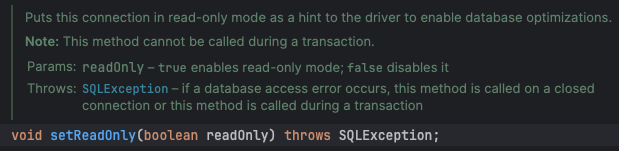
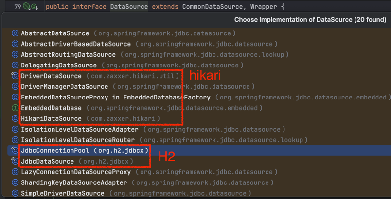
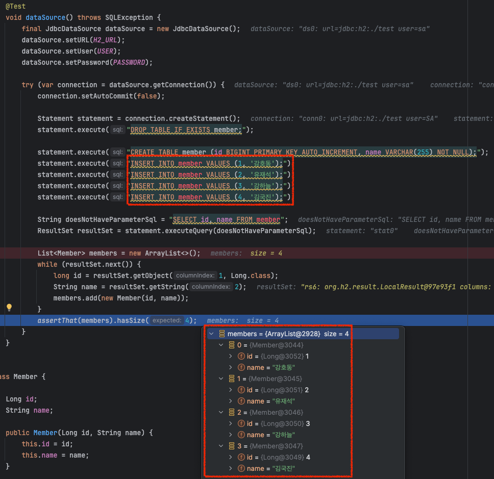

JPA, JDBCTemplate 등 자바 프로그램에서 DB에 연결하기 위해선 **JDBC**를 반드시 사용하게 된다.<br>
아무리 JPA 같은 기술이 추상화를 잘해주어 편리하게 사용한다해도 기반이 되는 기술을 알아야 더 나은 코드와 프로그램을 만들 수 있다.<br>

이번에는 **자바의 데이터베이스 연결을 책임지는 JDBC(Java DataBase Connectivity)**에 대해 알아보겠다.

## 1. JDBC란?

JDBC는 자바 애플리케이션과 DB를 연결하고 통신할 수 있도록 제공하는 API이다.<br>
JDBC 덕분에 우리는 어떠한 DB Driver를 사용하더라도 JDBC만 사용해 DB와 통신할 수 있다.<br>
일종의 애플리케이션과 DB 사이에서 연결을 추상화한 계층인 것이다.


JDBC는 Connection, `Statement`, `ResultSet`으로 구성되어 있다.

## 2. Connection

[Oracle 공식문서](https://docs.oracle.com/javase/8/docs/api/java/sql/Connection.html)에서는 Connection 객체를 다음과 같이 설명하고 있다.<br>
> "_A connection (session) with a specific database. SQL statements are executed and results are returned within the context of a connection._"<br>
> "특정 DB와의 연결(세션)이다. 연결 컨텍스트 내에서 SQL 문이 실행되고 결과가 반환된다."

결국, DB에 쿼리를 날리고 결과를 반환받기 위해선 이 Connection 객체가 최우선적으로 생성되어야 한다.

Connection이 제공하는 기능은 다음과 같다.

- `setAutoCommit(boolean)`: Auto Commit 모드 제어
- `setTransactionIsolation(int)`: 트랜잭션 격리 레벨 설정
- `setReadOnly(boolean)`: ReadOnly 설정
  > ReadOnly를 true로 설정하면 **Connection을 읽기 전용 모드**로 설정하며 `Driver`에게 쿼리 힌트로 제공하게 되어 쿼리 실행을 최적화할 수 있다. [^1]
    <br>

<br>

그렇다면 Connection 객체는 어떻게 생성할까?<br>
생성하는 데에는 총 2가지 방법이 존재한다.
 
### 2-1. DriverManager

Legacy한 방법으로, `DriverManager` 객체를 사용하는 방법이 있다.<br>
아래는 DriverManager를 이용해 Connection 객체를 생성하는 예시이다.

```java
public Connection getConnection(String url, String username, String password) {
    return DriverManager.getConnection(url, username, password);
}
```

참고로 JDBC 4.0 이전에는 `Class.forName` 메서드를 통해 JDBC 드라이버를 직접 등록해줘야 했다.<br>
하지만 이후부터 `DriverManager`가 주어진 url 값을 이용해 라이브러리에 등록된 Driver와 비교해 적절한 JDBC Driver를 찾아 제공한다.

하지만 DataSource의 등장으로 잘 사용되지 않는 방법이 되었다.

### 2-2. DataSource

DataSource는 `DriverManager`를 발전한 모델이다.<br>
DB 연결 정보를 **코드가 아닌 properties로 값을 주입할 수 있으며**<br>
**[Connection Pool](https://kdkdhoho.github.io/dbcp/), 분산 트랜잭션 기능**을 지원한다.

```java
public Connection getConnection(String url, String username, String password) {
    return DataSourceBuilder.create()
                .url(url)
                .username(username)
                .password(password)
                .build();
```

DataSource 구현체는 각 벤더가 제공하고 있다.


### Connection Pool

DataSource의 장점 중 하나인, _Connection Pool_ 에 대해 알아보고 내부 코드를 살펴보겠다.<br>
(이 부분은 JDBC를 이해하는 데 반드시 필요한 부분은 아니다. 개인적인 지적 호기심으로 코드를 뜯어본 것이니 관심없으면 안봐도 좋다.)

Connection Pool은, 지정된 개수만큼 미리 Connection 객체들을 만들어놓고 해당 객체를 재사용하기 위해 만들어놓은 저장 공간을 의미한다.<br>
Connection 객체를 재사용하는 이유는 **Connection 객체를 생성하고 삭제하는 비용이 비싸기 때문**이다.<br>
기본적으로 DB와 TCP/IP를 통한 네트워크 통신이 이루어져야 하며, 쿼리가 모두 처리되면 해당 Connection 객체는 필요없어지기에 GC에 의해 처리되는데 이때도 GC 비용도 생각해야 한다.<br>
때문에 이 값비싼 Connection 객체를 재사용하면 성능상 많은 이점을 얻을 수 있다.

H2에서 제공하는 JdbcConnectionPool을 직접 살펴보며 조금 더 이해해보겠습니다.

```java
@Test
void testJdbcConnectionPool() throws SQLException {
    JdbcConnectionPool jdbcConnectionPool = JdbcConnectionPool.create(H2_URL, USER, PASSWORD);

    assertThat(jdbcConnectionPool.getActiveConnections()).isZero();

    try (var connection = jdbcConnectionPool.getConnection()) {
        assertThat(connection.isValid(1)).isTrue();
        assertThat(jdbcConnectionPool.getActiveConnections()).isEqualTo(1);
    }
    assertThat(jdbcConnectionPool.getActiveConnections()).isZero();

    jdbcConnectionPool.dispose();
}
```

1. `JdbcConnectionPool#create(String, String, String)`
    : 주어진 DB 연결 정보를 통해 DataSource 객체를 만들고 JdbcConnectionPool 객체를 초기화한다.
    

2. `assertThat(jdbcConnectionPool.getActiveConnections()).isZero();`
    : 초기 생성된 ConnectionPool은 Active 상태인 Connection이 0개다.

3. `jdbcConnectionPool.getConnection()`
    : `JdbcConnectionPool` 객체 내부에 인스턴스 변수로 `AtomicInteger activeConnections`를 가진다.<br>
    이 변수의 값을 1 증가하고, `volatile int maxConnections` 값과 비교해 이하인 경우에 Connection 객체를 반환한다.<br>
    JDBCConnectionPool가 가지는 `maxConnections`의 default 값은 10 이다.<br>
    Connection 객체를 반환할 때는 우선적으로 `Queue<PooledConnection> recycledConnections = new ConcurrentLinkedQueue()` `recycledConnections.poll()` 하고,<br>
    아무 값이 존재하지 않을 경우엔 DataSource에서 PooledConnection 객체를 만들어 반환한다.<br>
    해당 Connection이 close 되면 `recycledConnections`에 Connection 객체를 `add()` 한다.<br>
    만약 `recycledConnections`에 재사용할 Connection이 존재한다면 Connection을 재사용하다.
    
    

아래 사진을 통해 `Queue<PooledConnection> recycledConnections`에 Connection 객체가 존재하는 모습을 확인할 수 있다.


### HikariCP

Spring Boot 2.0 부터 DataSource와 그에 상응하는 `Connection Pool`을 기본적으로 `HikariCP` 구현체를 사용한다.<br>
[HikariCP](https://github.com/brettwooldridge/HikariCP)는 다른 DataSource 구현체들에 비해 매우 빠른 속도와 성능을 가지는 Connection Pool 구현체 중 하나다.

위 코드 상으로는 `ConnectionPool`을 직접 만들고, 그 안에서 DataSource 객체를 만들고, Connection 객체를 만들어 반환해주었습니다.<br>
하지만 기본적으로 DB 연결 정보만 제공해서 DataSource 객체만 만들면 아래와 같이 `HikariDataSource` 객체가 만들어진다.


위 사진을 잘 보면, Connection Pool이 null로 초기화되어 있는데 이 객체가 바로 커넥션 풀 객체이다.<br>
그리고 처음 `getConnection()`을 호출하면 아래 메서드를 통해 `pool` 이 초기화되고 해당 `HikariPool` 객체에서 `getConnection()` 메서드가 호출되어 최종적으로 Connection 객체가 반환되는 것이다.


실제로 디버깅을 통해 HikariPool 내에 존재하는 Pool에 등록된 Connection 객체와 반환된 Connection 객체가 동일한 객체임을 확인할 수 있다.


그런데 신기한 사실을 발견할 수 있었다. 테스트 메서드가 끝나기 전에, Connection 객체가 총 10개가 만들어지는 것을 확인할 수 있었다.


이를 이해하기 위해 조금 더 깊이 파보았지만 `DataSourceConfig` 객체에 선언된 `maxPoolSize`가 10으로 설정되어 있다는 정보 말고는 `maxPoolSize` 수 만큼 Connection 객체를 만들어 저장하는 부분을 찾지 못했다..<br>
(이 부분 어디서 확인할 수 있는지 아시는 분은 댓글 남겨주시면 감사하겠습니다 😭)

결과적으로 Spring Boot를 사용해서 properties에 DB 연결 정보를 입력하면 `HikariDataSource` 구현체가 사용되고, 그에 따라 _maxPoolSize_ 로 설정된 사이즈만큼 Connection Pool에 Connection 객체를 미리 만들어 놓은 다음 Connection 객체를 재사용하는 것까지 확인할 수 있었다.

### 2-4. 분산 트랜잭션

Connection Pool 처럼 DataSource 객체로 만들어진 Connection 객체는 분산 트랜잭션에 참여할 수 있다.

분산 트랜잭션은 MSA에서 사용되는 개념이므로 여기선 패스하겠다..!

## 3. Statements

Connection 객체를 통해 DB와 세션을 맺었으면, 이제 쿼리를 날릴 차례다<br>
JDBC는 각 DB 종류에 상관없이 SQL 문을 작성할 수 있도록 `Statement` 인터페이스를 제공한다.<br>

`Statement`에는 세 종류가 존재한다.<br>

- `Statement`: 순수 문자열로 이루어진 SQL 문이다. 파라미터가 존재하지 않는다.
- `PreparedStatement`: SQL 문에 파라미터가 존재할 때 사용한다. `Statement` 객체를 상속한다.
- `CallableStatement`: 입력과 출력에 파라미터를 포함할 수 있는 스토어드 프로시저를 실행할 때 사용된다. `PreparedStatement`를 상속한다.

아래 사진은 `Statement`와 `PreparedStatement`를 사용하는 예시 코드이다.<br>
(`CallableStatment`는 사용해본 적이 없고 잘 사용하지 않는 것 같아 제외했다.)


`Statement` 인터페이스에는 쿼리를 실행하는 메서드들이 아래와 같이 존재한다.

- `execute`: 쿼리를 수행하고 그 결과가 `ResultSet`이면 true를, 그렇지 않고 결과값이 없거나 update count 인 경우 false를 반환한다.
- `executeQuery`: 쿼리를 수행하고 `ResultSet` 객체를 반환한다.
- `executeUpdate`: 쿼리를 수행되고 쿼리가 적용된 Row 수를 반환한다.

## 4. ResultSet

지금까지 DB와 Connection을 맺고, 쿼리를 수행했으면, 쿼리의 결과를 가져올 차례다.<br>
`ResultSet`는 DB에서 조회해온 결과(데이터)에 접근할 수 있도록 하는 객체이다.<br>

`ResultSet`에는 **커서 개념**이 적용된다.<br>
쿼리 결과를 조회해오면 처음 커서의 위치는 -1이다. 그리고 `ResultSet#next()` 메서드를 통해 다음 행에 접근할 수 있다.<br>
접근할 행이 존재한다면 `ResultSet#get???()` 메서드를 통해 값을 가져올 수 있다.<br>

만약 id 칼럼의 데이터를 가져오려면 `resultSet.getLong(1);`을 호출하거나 `resultSet.getObject(1, Long.class);`를 호출하면 됩니다.<br>
이때 **첫 번째 파라미터로 `columnIndex` 값이 들어가게 되는데 이 값은 `SELECT` 절에 있는 칼럼 순서**를 나타낸다. 이때 주의할 점은 첫 번째 값이 0으로 시작하는 일반적인 index와 다르게 1부터 시작한다는 점이다.

직접 코드로 이해해보자.

## 5. Connection 부터 ResultSet 까지 직접 코드로 확인해보기

`id`, `name` 칼럼을 가지는 `Member` 테이블을 만들자.<br>
그리고 `Statement`를 이용해 데이터를 조회하는 코드와 `PreparedStatement`를 통해 쿼리에 파라미터를 삽입하여 조회하는 상황을 코드로 작성하고 테스트로 검증해보겠다.

### 5-1. `Statement`를 이용해 결과 조회 



값이 잘 들어가있는 것을 확인할 수 있다.

### 5-2. `PreparedStatement`를 이용해 결과 조회

이번엔 성이 '강' 씨인 member를 조회하는 코드를 작성해보겠습니다.


## 마치며

지금까지 JDBC를 이해하기 위해 `Connection`, `DriverManager`, `DataSource`, `ConnectionPool`, `Statement`, `ResultSet`에 대해 알아보다.

항상 JPA, Spring Data JPA를 사용하다가 JDBC를 직접 사용해보니, 쿼리를 실행하고 결과를 받아오기까지 많은 리소스가 들어가지만 DB 연결부터 쿼리 작성, 결과를 추출하기까지 직접 해보니 JPA가 데이터를 어떻게 가져올 지 그림이 그려지는 것 같다.<br>
JDBC는 데이터 접근 기술의 가장 근본이며 기본이므로 헷갈릴 때마다 다시 보며 공부해야다.

### References  
> - https://www.geeksforgeeks.org/introduction-to-jdbc/
> - https://docs.oracle.com/javase/tutorial/jdbc/basics/processingsqlstatements.html
> - https://docs.oracle.com/en/java/javase/11/docs/api/java.sql/javax/sql/package-summary.html
 
---

[^1]: [Optimizing InnoDB Read-Only Transactions - MySQL](https://dev.mysql.com/doc/refman/8.0/en/innodb-performance-ro-txn.html)
