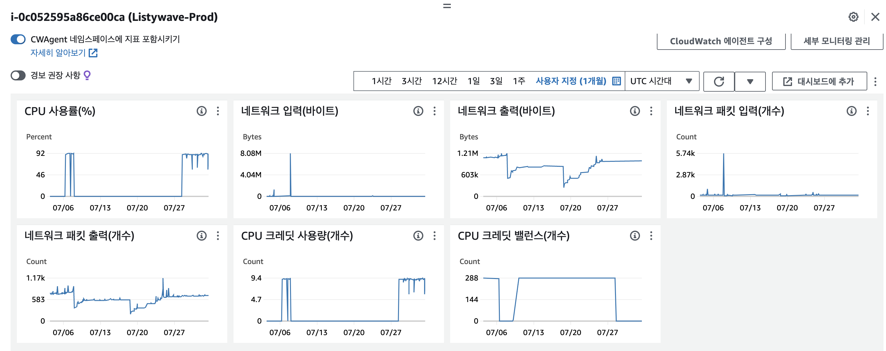
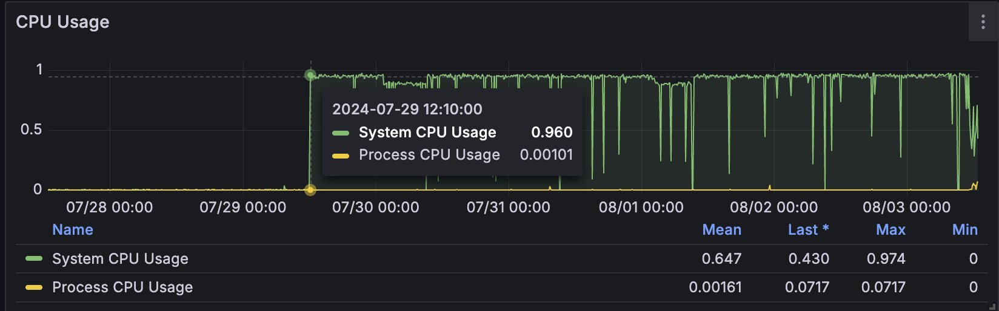

# 1. 들어가며
ListyWave 프로젝트를 진행하는 도중이었습니다. 평소 인프라 비용이 약 25$가 부과되고 있었는데요. 갑자기 33$가 부과된 적이 있습니다. 

비용 청구서를 자세히 살펴보니 "Amazon Elastic Compute Cloud T4GCPUCredits" 라는 항목으로 금액이 추가된 것이었는데요. 이 항목은 EC2의 성능 버스트 가능 인스턴스의 추가 버스트 CPU 사용량에 대해 부과된 것이었습니다. [^1]

> 버스트 CPU (Burst CPU)란?[^2]  
> 대부분의 인스턴스 자원의 CPU 사용량은 평균적으로 낮습니다. 하루 중에 일부 시간대만 잠깐 CPU 사용량이 급격히 치솟는 패턴을 보이죠. 따라서 높은 효율의 CPU 자원을 유지하는 것은 비효율적일겁니다.  
> 이에따라 AWS는 EC2 인스턴스의 T 시리즈를 제공하는데요. T 시리즈는 기준 성능(baseline)과 CPU 크레딧을 기반으로 동작하며, 필요 시 일시적으로 기준 성능을 초과해 버스트할 수 있습니다.
>
> 그런데 이 T 시리즈는 _Burstable Instance Types_ 라고도 부를 수 있는데요. Burstable, 그러니까 버스트 가능하다는 뜻은, 위에서 말한 고정된 CPU 성능 이상의 CPU 성능을 내도록 한다는 뜻입니다.  
> 이를 **버스트 CPU** 라고 부르는데, 버스트 CPU는 추가 과금이 발생할 수 있습니다.  
> 다만 추가 과금은 모든 버스트 사용에 즉시 붙는 것이 아니라, Unlimited 모드에서 누적 사용량이 기준선을 지속적으로 초과할 때 여분 크레딧 형태로 발생합니다.
> 

즉, 기본 CPU 사용량을 넘어선 버스트 CPU가 사용됐다는 의미로 해석됩니다.

이에 다양한 지표로 원인을 분석해보니 **디스크 용량 부족과 동시에 CPU 사용률이 90% 이상 유지되는 이상 현상을 포착**했습니다.

이번 글에서는 해당 문제를 파악하기까지의 과정과 이를 해결하는 과정에 대해 기록하려고 합니다. 

---

# 2. 원인 분석

## 2.1. AWS 모니터링 지표 파악
가장 먼저 AWS에서 제공하는 모니터링 대시보드로 CPU 사용량을 파악해봤습니다.  
아래 사진은 당시 대시보드입니다.



네트워크 입력이 7/8 쯤 한번 피크를 찍는 순간이 있습니다. 그래도 절대값으로 보면 8.08M 밖에 되지 않습니다.

이제 CPU 사용률을 봤을 때 7/8 쯤 92%를 찍는 순간이 존재합니다. 그리고 **7/27 이후로 92%가 유지**되는 것을 확인할 수 있습니다.

이렇게 봤을 때 과도한 트래픽으로 인한 버스트 CPU는 아닌 것으로 파악할 수 있습니다.

> CPU 사용률 그래프와 CPU 크레딧 사용량 그래프가 100% 일치하는 것도 재밌는 지표입니다.

## 2.2. 그라파나 모니터링 지표 파악
다음으로는 그라파나로 구축한 모니터링 대시보드를 확인해봤습니다.  
아래 사진은 당시의 CPU 사용량에 대한 지표입니다.



주목할 부분은 Process CPU Usage 최대 0.00717, **System CPU Usage 최대 0.974**로 시스템 영역 부하가 훨씬 크다는 점입니다.

이를 통해 애플리케이션 프로세스의 원인일 가능성은 낮고, 커널, 로깅 데몬, 기타 시스템 영역의 부하를 의심해볼 수 있습니다.

## 2.3. syslog 확인 
다음으로는 _syslog_ 를 확인해봤습니다.

> _syslog_ 란?  [^3]  
> Linux, macOS 등 유닉스 계열 시스템과 네트워크 장비에서 발생하는 다양한 경우의 로그 메시지를 표준화된 방법으로 생성, 전달, 수집하기 위한 프로토콜입니다.  
> 시스템에서 발생하는 다양한 로그를 기록해주는 기능이라고 생각하시면 됩니다.

아래는 당시에 버스트 CPU가 발생했던 기간의 로그 일부입니다. 너무 길어서 일부는 자르고 핵심적인 로그만 남겨두었습니다.    
핵심만 말씀드리면 **rsyslogd/journald의 "No space left on device" 오류와 dockerd의 동일 오류가 매우 짧은 간격으로 반복**됐다는 점입니다.

> journald는 systemd의 로그 수집/저장 컴포넌트이고, rsyslogd는 전통 syslog 생태계의 로깅 데몬입니다.

```text
2024-07-31T00:07:08.262339+00:00 ip-172-31-38-137 rsyslogd[165030]: rsyslogd: file '/var/log/syslog'[8] write error - see https://www.rsyslog.com/solving-rsyslog-write-errors/ for help OS error: No space left on device [v8.2312.0 try https://www.rsyslog.com/e/2027 ]
2024-07-31T00:07:08.262418+00:00 ip-172-31-38-137 rsyslogd[165030]: rsyslogd: action 'action-3-builtin:omfile' (module 'builtin:omfile') message lost, could not be processed. Check for additional error messages before this one. [v8.2312.0 try https://www.rsyslog.com/e/2027 ]
2024-07-31T00:07:08.262512+00:00 ip-172-31-38-137 rsyslogd[165030]: rsyslogd: file '/var/log/syslog'[8] write error - see https://www.rsyslog.com/solving-rsyslog-write-errors/ for help OS error: No space left on device [v8.2312.0 try https://www.rsyslog.com/e/2027 ]
2024-07-31T00:07:08.262581+00:00 ip-172-31-38-137 rsyslogd[165030]: rsyslogd: action 'action-3-builtin:omfile' (module 'builtin:omfile') message lost, could not be processed. Check for additional error messages before this one. [v8.2312.0 try https://www.rsyslog.com/e/2027 ]
2024-07-31T00:07:08.262689+00:00 ip-172-31-38-137 rsyslogd[165030]: rsyslogd: file '/var/log/syslog'[8] write error - see https://www.rsyslog.com/solving-rsyslog-write-errors/ for help OS error: No space left on device [v8.2312.0 try https://www.rsyslog.com/e/2027 ]
2024-07-31T00:07:08.262758+00:00 ip-172-31-38-137 rsyslogd[165030]: rsyslogd: action 'action-3-builtin:omfile' (module 'builtin:omfile') message lost, could not be processed. Check for additional error messages before this one. [v8.2312.0 try https://www.rsyslog.com/e/2027 ]
2024-07-31T00:07:08.268322+00:00 ip-172-31-38-137 systemd[1]: sysstat-summary.service: Deactivated successfully.
2024-07-31T00:07:08.275229+00:00 ip-172-31-38-137 systemd[1]: Finished sysstat-summary.service - Generate a daily summary of process accounting.
2024-07-31T00:07:03.053696+00:00 ip-172-31-38-137 kernel: systemd-journald[164997]: Failed to open system journal: No space left on device
2024-07-31T00:10:08.240256+00:00 ip-172-31-38-137 systemd[1]: Starting sysstat-collect.service - system activity accounting tool...
2024-07-31T00:10:08.245703+00:00 ip-172-31-38-137 kernel: systemd-journald[164997]: Failed to open system journal: No space left on device (Dropped 20546 similar message(s))
2024-07-31T00:10:08.249710+00:00 ip-172-31-38-137 kernel: systemd-journald[164997]: Failed to open system journal: No space left on device
2024-07-31T00:10:08.260427+00:00 ip-172-31-38-137 systemd[1]: sysstat-collect.service: Deactivated successfully.
2024-07-31T00:10:08.271450+00:00 ip-172-31-38-137 systemd[1]: Finished sysstat-collect.service - system activity accounting tool.
2024-07-31T00:10:08.263698+00:00 ip-172-31-38-137 kernel: systemd-journald[164997]: Failed to open system journal: No space left on device
2024-07-31T00:15:01.933716+00:00 ip-172-31-38-137 kernel: systemd-journald[164997]: Failed to open system journal: No space left on device (Dropped 3 similar message(s))
2024-07-31T00:15:01.936707+00:00 ip-172-31-38-137 kernel: systemd-journald[164997]: Failed to open system journal: No space left on device
2024-07-31T00:15:01.949349+00:00 ip-172-31-38-137 CRON[415611]: (root) CMD (command -v debian-sa1 > /dev/null && debian-sa1 1 1)
2024-07-31T00:15:01.952692+00:00 ip-172-31-38-137 kernel: systemd-journald[164997]: Failed to open system journal: No space left on device
2024-07-31T00:17:01.939703+00:00 ip-172-31-38-137 kernel: systemd-journald[164997]: Failed to open system journal: No space left on device (Dropped 3 similar message(s))
2024-07-31T00:17:01.943731+00:00 ip-172-31-38-137 kernel: systemd-journald[164997]: Failed to open system journal: No space left on device
2024-07-31T00:17:01.957020+00:00 ip-172-31-38-137 CRON[415616]: (root) CMD (cd / && run-parts --report /etc/cron.hourly)
2024-07-31T00:17:01.960755+00:00 ip-172-31-38-137 kernel: systemd-journald[164997]: Failed to open system journal: No space left on device
2024-07-31T00:20:08.239392+00:00 ip-172-31-38-137 systemd[1]: Starting sysstat-collect.service - system activity accounting tool...
2024-07-31T00:20:08.242699+00:00 ip-172-31-38-137 kernel: systemd-journald[164997]: Failed to open system journal: No space left on device (Dropped 3 similar message(s))
2024-07-31T00:20:08.247700+00:00 ip-172-31-38-137 kernel: systemd-journald[164997]: Failed to open system journal: No space left on device
2024-07-31T00:20:08.260189+00:00 ip-172-31-38-137 systemd[1]: sysstat-collect.service: Deactivated successfully.
2024-07-31T00:20:08.271838+00:00 ip-172-31-38-137 systemd[1]: Finished sysstat-collect.service - system activity accounting tool.
2024-07-31T00:20:08.263697+00:00 ip-172-31-38-137 kernel: systemd-journald[164997]: Failed to open system journal: No space left on device
2024-07-31T01:24:12.302176+00:00 ip-172-31-38-137 rsyslogd[165030]: rsyslogd: file '/var/log/syslog'[8] write error - see https://www.rsyslog.com/solving-rsyslog-write-errors/ for help OS error: No space left on device [v8.2312.0 try https://www.rsyslog.com/e/2027 ]
2024-07-31T01:24:12.302207+00:00 ip-172-31-38-137 rsyslogd[165030]: rsyslogd: action 'action-3-builtin:omfile' (module 'builtin:omfile') message lost, could not be processed. Check for additional error messages before this one. [v8.2312.0 try https://www.rsyslog.com/e/2027 ]
2024-07-31T00:25:01.949718+00:00 ip-172-31-38-137 kernel: systemd-journald[164997]: Failed to open system journal: No space left on device (Dropped 3 similar message(s))
2024-07-31T00:25:01.953694+00:00 ip-172-31-38-137 kernel: systemd-journald[164997]: Failed to open system journal: No space left on device
2024-07-31T00:25:01.966387+00:00 ip-172-31-38-137 CRON[415631]: (root) CMD (command -v debian-sa1 > /dev/null && debian-sa1 1 1)
2024-07-31T00:29:12.947214+00:00 ip-172-31-38-137 dockerd[72833]: time="2024-07-31T00:29:12.946688543Z" level=error msg="Error writing log message" driver=json-file error="error writing log entry: write /var/lib/docker/containers/2dfe8bd85c1922553dbcc6ab2e11ccc79a1c457eef02f1b93f790e1ff0045057/2dfe8bd85c1922553dbcc6ab2e11ccc79a1c457eef02f1b93f790e1ff0045057-json.log: no space left on device" message=
2024-07-31T00:25:01.969689+00:00 ip-172-31-38-137 kernel: systemd-journald[164997]: Failed to open system journal: No space left on device
2024-07-31T00:29:12.947685+00:00 ip-172-31-38-137 kernel: systemd-journald[164997]: Failed to open system journal: No space left on device (Dropped 3 similar message(s))
2024-07-31T00:29:12.947692+00:00 ip-172-31-38-137 kernel: systemd-journald[164997]: Failed to open system journal: No space left on device
2024-07-31T00:29:17.942629+00:00 ip-172-31-38-137 dockerd[72833]: time="2024-07-31T00:29:17.941983283Z" level=error msg="Error writing log message" driver=json-file error="error writing log entry: write /var/lib/docker/containers/2dfe8bd85c1922553dbcc6ab2e11ccc79a1c457eef02f1b93f790e1ff0045057/2dfe8bd85c1922553dbcc6ab2e11ccc79a1c457eef02f1b93f790e1ff0045057-json.log: no space left on device" message=
2024-07-31T00:29:17.942934+00:00 ip-172-31-38-137 dockerd[72833]: time="2024-07-31T00:29:17.942062224Z" level=error msg="Error writin2024-07-31T01:24:12.302137+00:00 ip-172-31-38-137 rsyslogd[165030]: rsyslogd: action 'action-3-builtin:omfile' (module 'builtin:omfile') message lost, could not be processed. Check for additional error messages before this one. [v8.2312.0 try https://www.rsyslog.com/e/2027 ]
```

그리고 `df -h` 명령어로 디스크 공간을 확인해보니 다음과 같았습니다.


결국 **디스크 용량이 부족해 로그를 기록하지 못해서 생긴 문제**로 좁혀집니다. 

# 3. 디스크 용량 부족과 CPU 사용률의 상관관계
그런데 여기서 한 가지 의문이 들었습니다.  
디스크 용량이 부족해서 로그를 쓰지 못하는 것과 CPU 사용량은 무슨 상관이 있을까요?

이를 이해하려면 먼저 _systemd-journal_ 과 _rsyslog_ 의 관계를 이해해야 합니다.

## 3.1. systemd-journal과 rsyslog
- [systemd-journal](https://ubuntu.com/server/docs/reference/glossary/#term-journald)
  - systemd 서비스, 커널 메시지, 시스템 로그, 애플리케이션 로그 같이 다양한 종류의 로그 메시지를 바이너리 형태로 수집하고 저장하는 서비스입니다.  
- [rsyslog](https://www.rsyslog.com/doc/)
  - 기존 syslog에서 발전된 로깅 프레임워크입니다.
  - Linux 시스템에서 로깅 데몬으로 널리 사용되고 있습니다.

## 3.2. 두 시스템의 상호 관계
systemd-journal 공식 문서[^4] 중에는 다음과 같은 설명이 있습니다.

"_journal 데몬이 수신한 로그 메시지를 syslog 데몬, 커널 로그 버퍼, 시스템 콘솔, 로그인한 모든 사용자에게 wall 메시지로 전송하거나 소켓을 통해 전송할지 여부를 제어할 수 있습니다._"

그리고 Ask Ubuntu에 'Relationship of rsyslog and journald on Ubuntu 16.04' 라는 제목의 글[^5]에서 좀 더 명확한 힌트를 얻을 수 있었는데요.

"_Ubuntu 16.04의 기본 설정에서 journald는 로그를 수집하는 역할을 하며, rsyslog는 기존의 텍스트 기반의 로그 관리 체계를 유지하고 복잡한 로그 처리를 지원하기 위해 공존하는데요. 로그가 두 곳 모두에 남는 이유는 rsyslog가 imuxsock 모듈을 사용하여 로컬 소켓을 통해 journald의 로그 메시지를 직접 수신하기 때문입니다. 즉, journald와 rsyslog가 동일한 로그 소스를 각자의 방식으로 동시에 수집하고 있기 때문에 데이터가 중복되어 기록되는 현상이 발생한다. _"

정리를 해보자면, "**journald는 로그 수집 시스템이고 rsyslog는 로그 파일을 관리할 수 있도록 하는 시스템이며, Ubuntu 시스템에서 두 시스템이 함께 사용된다. 이때 journald가 다양한 형태의 로그를 수집하고, rsyslog는 journald가 전달한 로그 메시지를 소켓으로 받아 텍스트 로그 파일로 기록한다.**" 가 되겠네요.

## 3.3. CPU 사용률과의 상관관계에 대해
자, 그럼 다시 돌아와서 CPU 사용률과의 상관관계는 어떻게 될까요?

위에서 로그가 기록되는 과정을 천천히 살펴보면 다음과 같습니다.

1. journald에서 로그를 수집하고, 이를 기록한다.
2. rsyslog는 journald에서 수집된 로그를 수신하여 텍스트 파일로 저장한다.
3. 이때 디스크 부족으로 쓰기 실패 오류가 발생한다.
4. 이렇게 발생한 에러를 journald가 다시 수집한다.
5. 위 과정이 무한 루프에 빠진다..!

이제야 감이 오는 것 같습니다.  
**디스크 부족으로 로그 쓰기가 반복 실패했고, 이 실패 로그가 다시 수집·기록되면서 로깅 경로에 부하가 누적돼 CPU 사용률이 92%까지 상승했던 것**입니다.

---

# 4. 해결
그러면 이 문제를 어떻게 해결할 수 있을까요?

## 4.1. 표면적인 방법
일단 당장 추가 과금이 발생하지 않도록 가장 직관적인 방법을 사용했는데요.

### 4.1.1. 디스크에 여유 공간 확보하기
가장 먼저 불필요한 파일, 특히 로그 파일을 대거 삭제하여 디스크에 여유 공간을 확보했습니다.

하지만 이는 시간이 지남에 따라 재발할 것입니다. 좀 더 근원적인 해결 방안이 필요합니다.

### 4.1.2. EC2 인스턴스의 크레딧 사양 변경
T4g 기준으로 크레딧 사양의 기본값은 unlimited 입니다. 이는 잉여 크레딧을 소비하여 기준치 이상으로 버스트할 수 있는 설정입니다.  
해당 설정을 꺼주었습니다.


## 4.2. 근본적인 방법
이제 로그가 과도하게 쌓이지 않도록 설정하여 재발하지 않도록 설정해야 합니다.

### 4.2.1. 시스템 로그 정책 강화
첫 번째로 [logrotate](https://github.com/logrotate/logrotate) 유틸리티를 사용하여 시스템 로그가 과도하게 쌓이지 않도록 정책을 설정했습니다.

> logrotate란?  
> logrotate는 시스템의 로그 파일을 간단하게 관리할 수 있도록 도와주는 툴입니다.  
> 사용자가 정한 주기(시간, 일, 주, 월) 마다 쌓인 로그를 아카이브하고, 아카이브된 파일의 갯수가 사용자가 정한 최대 갯수보다 많아지면, 가장 오래된 순서로 아카이브된 로그 파일을 삭제해주는 기능을 제공합니다.  

오픈 인프라 엔지니어 그룹의 'logrotate를 활용하여 로그 관리하기' 라는 제목의 글[^6]을 통해 구체적인 사용법을 확인할 수 있었고, AI의 도움을 받아 아래와 같이 설정했습니다.

```conf
/var/log/syslog
/var/log/auth.log
{
    daily
    rotate 14
    compress
    delaycompress
    missingok
    notifempty
    create 0640 syslog adm
    postrotate
      systemctl kill -s HUP rsyslog.service >/dev/null 2>&1 || true
    endscript
}
```

- 파일 경로: `/etc/logrotate.d/rsyslog`
- `daily`: 매일 로그 회전
- `rotate 14`: 최대 14개의 아카이브 유지(약 2주)
- `compress`: 회전된 로그 압축
- `delaycompress`: 직전 회전본은 다음 회전 때 압축
- `missingok`: 대상 로그가 없어도 오류 없이 진행
- `notifempty`: 빈 로그 파일은 회전하지 않음
- `create 0640 syslog adm`: 새 로그 파일 권한/소유자 지정
- `postrotate ... HUP rsyslog`: 회전 후 rsyslog가 새 파일을 다시 열도록 신호 전송

```conf
[Journal]
SystemMaxUse=500M
SystemKeepFree=1G
RuntimeMaxUse=200M
MaxRetentionSec=14day
```

- 파일 경로: `/etc/systemd/journald.conf`
- `SystemMaxUse=500M`: `/var/log/journal` 총 사용량 상한
- `SystemKeepFree=1G`: 디스크 여유 공간 최소 1GB 확보
- `RuntimeMaxUse=200M`: `/run/log/journal` 사용량 상한
- `MaxRetentionSec=14day`: 로그 보관 기간 상한

### 4.2.2. Docker 컨테이너 로그 제한 설정
다음으로는 Docker 컨테이너 로그는 _json-file_ 에 용량과 개수 상한을 부여했습니다. [^7]  
각 로그 파일의 크기 상한은 10MB, 개수는 5개로 설정했습니다.

```json
{
    "log-driver": "json-file",
    "log-opts": {
        "max-size": "10m",
        "max-file": "5",
        "compress": "true"
    }
}
```

- 파일 경로: `/etc/docker/daemon.json`
- `max-size=10m`: 로그 파일 1개 최대 10MB
- `max-file=5`: 최대 5개 파일 보관
- `compress=true`: 회전 로그 압축
- 총 보관 상한(압축 전 기준): 컨테이너당 약 50MB

---

# 5. 결과
그 결과 아래 사진에서 볼 수 있듯이 CPU 사용률은 다시 정상화가 되었습니다.


그리고 디스크 용량이 가득차는 문제가 다시는 발생하지 않았습니다. 

---

# 6. 마치며
지금까지 Ubuntu 시스템에서 디스크 용량이 부족하여 CPU 사용량이 급격히 치솟았던 문제를 분석하고 이를 해결하는 과정에 대해 기록해봤습니다.

Ubuntu의 Logging과 관련된 공식 문서를 찾기 어려웠지만, 이 문제를 해결하면서 Ubuntu 시스템의 기본 로깅 설정과 관련된 툴에 대해 이해할 수 있었던 시간이었습니다.

모니터링 대시보드를 구축했지만 임계치를 설정하고 알람 설정을 했으면 더 적은 비용을 치뤘을텐데 하는 아쉬움이 있습니다.

[^1]: https://docs.aws.amazon.com/ko_kr/AWSEC2/latest/UserGuide/burstable-credits-baseline-concepts.html#key-concepts
[^2]: https://docs.aws.amazon.com/AWSEC2/latest/UserGuide/burstable-performance-instances.html
[^3]: https://askubuntu.com/questions/234038/what-is-syslog-and-how-can-i-tackle-problems-by-using-it?st_source=ai_mode
[^4]: https://www.freedesktop.org/software/systemd/man/latest/journald.conf.html#ForwardToSyslog=
[^5]: https://askubuntu.com/questions/925440/relationship-of-rsyslog-and-journald-on-ubuntu-16-04
[^6]: https://blog.o3g.org/server/logrotate%EB%A5%BC-%ED%99%9C%EC%9A%A9%ED%95%98%EC%97%AC-%EB%A1%9C%EA%B7%B8-%EA%B4%80%EB%A6%AC%ED%95%98%EA%B8%B0/
[^7]: https://docs.docker.com/engine/logging/configure/
