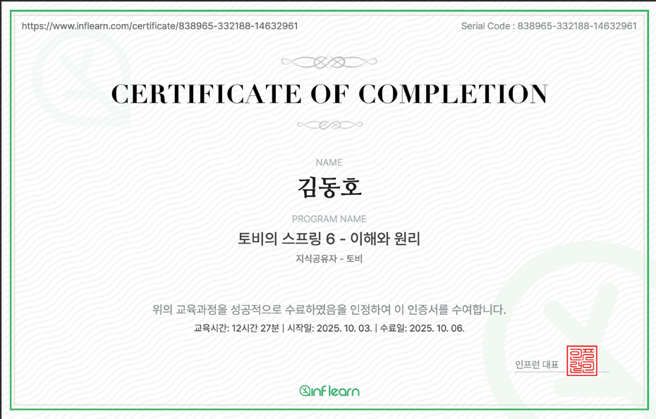

# 들어가며

긴 추석 연휴동안 별 다른 계획이 없던 나는, 인프런에서 진행하는 [향로와 함께하는 추석 완강 챌린지](https://inf.run/zWxzt)를 보자마자 홀린듯이 신청했다.
40% 할인 쿠폰도 줘서 듣고 싶었던 강의를 모두 결제했고, 그 중에 하나가 [토비의 스프링 6 - 이해와 원리](https://inf.run/EoaJe)다.

이 강의로 챌린지에 참여해야겠다고 생각을 했다.
이유는, 한동안 스프링 기술에 대해 학습을 하지 않았고 무지성으로 개발했으며 러닝타임이 길었기 때문이다.

본 강의는 제목 그대로 **스프링 프레임워크 버전 6에 대해 이해하고, 그 속에 있는 원리를 주로 전달**하는 강의다.
진행 방식은 실제로 동작하는 코드를 만들어보고 그 속에 존재하는 문제점들을 파악한 다음, 그 문제를 스프링 프레임워크를 이용하여 어떻게 해결할 수 있을지 설명해주시고 실제로 해결하는 과정을 밟는다.

중간중간 토비님의 개발 팁이나 견고하고 유지보수하기 쉬운 프로그래밍 방법을 전달해주시기도 한다.

긴 시간동안 학습을 진행하고 배운 것이 너무 많지만, 나름대로 학습한 내용을 정리하고 기록하려고 한다.

# 배운 것들

강의를 통해 내가 배운 것은 다음과 같다.

1. 스프링의 핵심 기술 3가지
    - SOLID 원칙이 디자인 패턴의 근본이라는 것
    - 비즈니스와 관련된 로직과 기술과 관련된 로직을 분리해서 바라보는 시각
2. 예외를 이상적으로 다루는 방법
3. 작은 스텝으로 나누어 개발을 진행하는 방식

## 1. 스프링의 핵심 기술 3가지

우선 한 마디로 스프링 프레임워크에 대해 정의를 해보면, **확장성이 뛰어나고 유지보수성이 좋은 객체지향 프로그래밍 개발을 편하게 만들어주기 위한 프레임워크**라고 생각된다.
스프링은 이를 위해서 **IoC/DI 컨테이너**, **서비스 추상화**, **AOP** 라는 개념을 핵심적으로 제공한다.

확장성이 뛰어나고 유지보수성이 좋은 객체지향 프로그래밍을 설계하고 개발하려면 SOLID 원칙이 기본이 된다.
그 중에서 DIP와 OCP 원칙이 핵심이다.

DIP와 OCP 원칙을 잘 준수할 수 있게끔 도와주는 개념으로 **IoC/DI 컨테이너** 가 핵심이라고 생각된다.
IoC/DI 컨테이어는 다음과 같은 개발자가 순수 자바 클래스를 작성하고 메타 데이터 정보(`@Configuration`, `@Bean`, `@ComponentScan`, `@Component`) 통해 **구성 정보**를 추가한다. 그러면 **스프링은 구성 정보를 토대로 IoC/DI 컨테이너에 해당 오브젝트를 스프링 빈으로 등록**한다.
이때 별도 설정을 하지 않으면 해당 빈은 **싱글톤 빈으로 생성**하게 되는데, 보통 스프링을 이용해 서버 애플리케이션을 개발하고 서버 애플리케이션에서는 **수많은 클라이언트의 요청이 올 때마다 매번 새로운 객체를 생성하는 것이 비효율적**이기 때문에 싱글톤 빈으로 생성해두고, IoC/DI 컨테이너에서 해당 오브젝트가 필요로 하는 곳에 사용하는 것이다.

강의가 진행되면서 주어진 비즈니스 요구사항을 충족하기 위해 기능을 구현하는데, 이때 확장성과 유지보수성이 안좋은 코드로 시작한다. 그 이유는 **비즈니스 로직에 외부 기술(환율 정보 조회, 데이터 접근 기술 등)이 포함되기 때문**이다.
외부 기술은 언제든지 변경될 수 있다. 그럴 때마다 비즈니스 로직이 수정되는 것은 확장성과 유지보수성이 좋지 않은 설계다.
그래서 **애플리케이션 서비스와 외부 기술 관련 코드를 느슨한 결합**이 되도록 만든다.
이때 `Interface`를 활용하여 **애플리케이션 서비스가 추상화된 것(`Interface`)에 의존**하도록 만드는 것이다.
이렇게 되면 OCP, DIP 원칙이 매우 잘 지켜지게 된다.
추가로 **테스트하기 용이한 코드가 되는 것은 덤**이다.

이러한 과정을 통해, **디자인 패턴의 근본은 SOLID 원칙이라는 것**과 **비즈니스 관련된 로직과 기술 관련된 로직을 분리해서 바라보는 시각**을 배우게 되었다.

**예외 추상화**와 **서비스 추상화**도 위에서 설명한 것과 거의 같은 개념이 적용되었다고 본다.
강의에서는 다양한 데이터 접근 기술(JPA, JDBC)을 통해 두 개념을 설명했는데, **결국 외부 기술을 사용하면서 발생한 공통적인 부분을 추상화**하여, **애플리케이션에서 추상화에 의존하여 처리하도록 하는 것이 핵심**이라고 생각된다.

추가로 스프링이 제공하는 여러 기술 중에서 많이 사용되는 디자인 패턴에 대해서도 알게 되었다.
예로는 템플릿-콜백 패턴, 데코레이터 패턴, 프록시 패턴이 있는데, 결국 이 모든 디자인 패턴들도 목적은 **확장하기 쉽고 유지보수성이 좋은 설계를 위한 것**이라고 생각이 든다.

## 2. 예외를 이상적으로 다루는 방법

지금까지 예외를 어떻게 다뤄야 한다는 것에 대해 제대로 들어본 적이 없는 것 같다.
그런데 이번 강의를 통해 토비님이 예외를 어떻게 생각하는 지에 대해 알 수 있었고, 예외는 어떻게 처리해야 하는지에 대해 조금은 알게 된 것 같다.

예외의 종류에 따라 다루는 방법이 다르다.

1. 인프라 서비스를 사용하면서 발생한 예외인 경우
   이때는 **복구해서 정상적인 흐름으로 전환할 수 있는가**에 대해 생각해봐야한다.
   복구를 위해 고민해볼 방법은 2가지가 있다.

    1. 재시도한다.
    2. 다른 대안을 마련한다.

2.  버그가 발생한 경우
    이 경우는 2가지로 나뉠 수 있다.

    1. 우리가 만든 코드 상의 버그인가?
       `NPE`같은 예외가 발생한 경우에는 버그를 찾아 해결해야 한다.
    2. 클라이언트의 버그인가?
       잘못된 파라미터를 전달하거나 잘못된 요청을 한 경우이다.
       이때는 **예외 메시지를 친절히 작성해서 밖으로 던지면** 충분하다.

3.  제어할 수 없는 경우
    DB에 장애가 났거나, 국가적 재난 상황으로 서비스를 이용할 수 없는 경우이다.
    이때는 사용자에게 "시스템에 문제가 생겼으니 잠시 후 재시도를 하거나, 고객문의를 주세요." 같은 안내를 하고 빠르게 문제를 대응해야 되겠다.

그리고 스프링에게 배우는 예외처리 중 하나로, **구체 클래스 또는 기술 자체가 다르더라도, 같은 이유에서 발생한 경우의 예외라면 동일한 종류의 추상화된 예외로 번역이 되어서 전달 될 필요가 있다**는 것이다.
이를 통해 **기술에 종속적이지 않은 시스템을 개발**할 수 있는 것이다.

## 3. 작은 스텝으로 나누어 개발을 진행하는 방식

기술적인 내용은 아니지만 토비님께서 개발할 때 자신만의 방법을 공유해주셨다.
바로 작은 스텝으로 나누어 개발을 진행하고, 진행한 것을 확인하고, 이어서 다음 스텝을 진행하는 방식이다.

최근 나의 개발 방식을 생각해보면 위 방식과 꽤나 거리가 있다.
아무래도 시간이 너무 촉박한 상황 + 테스트 코드가 없는 상황이다 보니 나름 최선의 선택을 했다고 생각을 한다.

하지만 최근에 진행해온 방식에는 분명히 한계점들이 있다고 생각되고, 안정적인 프로그램 개발을 위해서라면 토비님의 방식을 따라야겠다고 생각이 든다.

이를 위해서 필요한 것은 **테스트 코드**라고 생각이 든다.
일정이 쫓겨 살고 있지만.. 반드시 테스트 코드를 팀에 도입해야겠다.

## 그 외 배운 것들

위에서 정리한 내용 말고도 배운 것들이 참 많다.
JDBC Client, 데코레이터 패턴, 프록시 패턴, HTTP Client, XML로 JPA Entity를 정의하기 등..
강의를 진행하면서 배운 디자인 패턴들에 대해서는 꼭 다시 한번 정리를 하고 넘어가야겠다.

# 마치며

지금까지 강의를 보고 스프링 프레임워크를 이해하고 그 속에 담긴 핵심 원리에 대해서 정리를 해보았다.
단순히 기술적인 내용 뿐 아니라 스프링을 사용하며 어떻게 개발할 것인가? 에 대한 내용을 배울 수 있어서 너무너무 뜻깊었다.
이번 강의에서 배운 내용들을 앞으로 실무에 적용해보고 싶다.

그리고 인프런과 향로님께 감사하다. 원래 추석 연휴동안 공부할 계획이긴 했지만 챌린지 덕분에 지치지 않고 꾸준히 학습을 할 수 있었다.
그리고 한푼도 아깝지 않은 명강의를 제공해주신 토비님께도 감사하다.
그리고 추석 연휴에도 열심히 학습해서 정리까지 마친 나에게도 감사하다!

# References
- [토비의 스프링 6 - 이해와 원리](https://inf.run/EoaJe)
- [실습 Repository](https://github.com/kdkdhoho/tobispring6)
