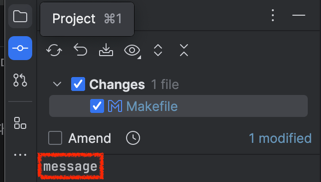
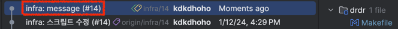
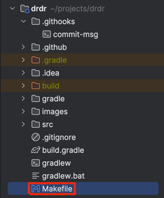
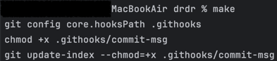

## 들어가며

이번 글에서는 브랜치 네이밍을 이용해 자동으로 커밋 타입과 이슈 번호를 추가하는 방법에 작성하겠습니다.

글의 대상은 다음과 같습니다.

- 브랜치 네이밍 컨벤션과 커밋 메시지 컨벤션을 정하려는 팀
- 커밋 메시지 컨벤션에 따라 매번 커밋 메시지를 작성하는 게 귀찮거나 자주 까먹는 사람

### 이 글을 읽고 나면

커밋 메시지를 `message`라고만 했을 경우, 저장된 커밋 메시지의 결과는 `feat: message (#1)`과 같이 작성될 것입니다.





### 참고

시작하기 앞서 `커밋 타입`은 `feat`, `refactor`, `chore`와 같은 [Conventional Commits](https://www.conventionalcommits.org/en/v1.0.0/)의 `type`을 의미합니다.

개발 환경은 다음과 같습니다.

- MacOS 14.2.1(23C71)
- IntelliJ 2023.2.5 (Ultimate Edition)

## 1. 컨벤션 정하기

해당 작업을 수행하기 전 _브랜치 네이밍 컨벤션_ 과 _커밋 메시지 컨벤션_ 을 먼저 정해야 합니다.

이번 글에선 브랜치 네이밍 컨벤션을 `type/issue_number` 와 같은 형식으로, 커밋 메시지 컨벤션을 `type: message (#1)`와 같이 설정하겠습니다.<br>
> 예) 브랜치 네이밍 컨벤션 : `feat/1`<br>
> 커밋 메시지 컨벤션 : `feat: 기능 구현 (#1)`

## 2. 스크립트 작성

프로젝트의 루트 위치 아래에 `.githooks` 디렉터리를 만들고 그 안에 `commit-msg`를 만들어주세요.<br>
`commit-msg`는 단순히 file 형태로 만들면 됩니다.


---

그 다음 스크립트 코드를 작성하겠습니다.<br>
코드에 대한 설명은 주석을 참고해주세요.

```shell
#!/bin/sh

# 본 스크립트는 브랜치 명을 토대로 개발자가 작성한 커밋 메시지에 자동으로 PREFIX와 POSTFIX 문자열을 추가하는 스크립트입니다.
# 브랜치 명은 "feat/14" 와 같이 "{type}/{issue_number}" 의 형식입니다.

COMMIT_MESSAGE_FILE_PATH=$1 # 작성한 커밋 메시지가 저장된 File의 경로 추출
MESSAGE=$(cat "$COMMIT_MESSAGE_FILE_PATH") # 작성한 커밋 메시지 추출

# 커밋 메시지가 존재하지 않은 경우, 스크립트 종료
if [[ $(head -1 "$COMMIT_MESSAGE_FILE_PATH") == '' ]]; then
  exit 0
fi

# 브랜치 이름에서 '/' 이전의 문자열만 남긴다. 만약 명시적으로 type을 작성한 경우 작성하지 않는다.
if [[ $MESSAGE != *:* ]]; then
  PREFIX="$(git branch | grep '\*' | sed 's/\* //' | sed 's/\([^/]*\).*/\1/'):"
fi

# 브랜치 이름에서 '/' 이후의 문자열만 남긴다. '/'가 없다면 브랜치 전체 이름이 POSTFIX가 된다.
# POSTFIX의 첫 번째 '-' 앞 뒤의 문자열만 포함한다. '-'가 없다면 변경은 없다.
# 명시적으로 이슈 번호를 작성한 경우 작성하지 않는다.
if [[ $MESSAGE != *#* ]]; then
  POSTFIX="(#$(git branch | grep '\*' | sed 's/* //' | sed 's/^.*\///' | sed 's/^\([^-]*-[^-]*\).*/\1/'))"
fi

printf "%s %s %s" "$PREFIX" "$MESSAGE" "$POSTFIX" > "$COMMIT_MESSAGE_FILE_PATH"
```

## 3. git hooks 설정 (Makefile 이용)

git hooks를 설정해야 작성한 스크립트를 **적용**할 수 있습니다.

설정하기 위한 명령어는 `git config core.hooksPath .githooks` 입니다.

하지만 git hooks 설정 외에도 권한 관련 설정을 한번에 편하게 하기 위해 Mac(or Linux) OS에 기본적으로 제공되는 [Makefile](https://www.gnu.org/software/make/)를 이용하겠습니다.

---

프로젝트 루트 경로에 `Makefile`을 만들어줍니다.



Makefile에 아래의 코드를 작성합니다.

```shell
init:
	git config core.hooksPath .githooks
	chmod +x .githooks/commit-msg
	git update-index --add --chmod=+x .githooks/commit-msg
```

> - Makefile 문법 상, 띄어쓰기가 아닌 Tab을 입력해야 합니다.<br>
> <br>
> 코드 설명
> - `git config core.hooksPath .githooks`: git hooks의 위치를 .githooks로 변경합니다.<br>
> - `chmod +x .githooks/commit-msg`: ./githooks/commit-msg 파일을 실행할 권한을 부여합니다.<br>
> - `git update-index --add --chmod=+x .githooks/commit-msg`: git이 .githooks/commit-msg 파일을 실행할 권한을 부여합니다.
> 

그 다음 터미널에서 `make` 명령어를 입력해 위 파일을 실행시켜줍니다.



## 4. 확인하기

이제 끝났습니다.

직접 커밋을 남겨보고 그 결과를 확인해보면 Prefix와 Postfix가 추가된 상태로 커밋되는 것을 확인할 수 있습니다!

## 주의사항 및 적용 해제하기

### 주의 사항

만약 프로젝트를 레포지토리에서 새로 clone 한 경우 터미널에 `make`를 입력해야 스크립트가 적용됩니다.

### 적용 해제하기

적용을 해제하려면 터미널에 `git config core.hooksPath .git/hooks`를 입력해서 원래 설정으로 돌려놓으면 됩니다.

## 마치며

해당 글에서는 적용 방법에 대한 내용만 작성했습니다.

만약 각 과정의 이유에 대해 알아보고 싶은 분들은 [해당 포스팅](https://blog.deercorp.com/commit-convention/)을 참고해주세요.

### Reference
> - https://blog.deercorp.com/commit-convention/
> - https://feb-dain.tistory.com/7