## TL;DR
- 7월 AWS 비용이 지난 달보다 7$가 추가되었다.
- 원인은 서버 CPU 사용량의 급격하게 증가함에 따라 추가 비용이 발생했던 것이다.
- 따라서 CPU 사용량이 급격히 추가 비용이 발생하지 않도록 설정을 바꿔줬다. 
- CPU 사용량이 급격히 늘어난 이유는 로그와 디스크 용량 때문이었다.
- 디스크 용량을 줄이니 귀신같이 해결되었다.
- 재발 방지를 위해 로그 정책을 설정해주었다.

## 1. 문제 상황

### 지난 달에 비해 7$ 증가
**7월 AWS 비용이 갑자기 지난 달에 비해 7$가 추가**됐다.<br>
청구서를 자세히 살펴보니 아래 사진처럼 "**Amazon Elastic Compute Cloud T4GCPUCredits**" 이라는 항목으로 6\$가 추가됐다.<br>
나머지 1$는 6월에 비해 하루가 더 많아서 발생한 것으로 판단한다.<br>
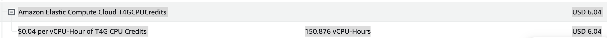
(참고로 150시간은 약 6일이다.)

### Amazon Elastic Compute Cloud T4GCPUCredits란?
GPT에 물어보니 아래와 같이 설명한다.
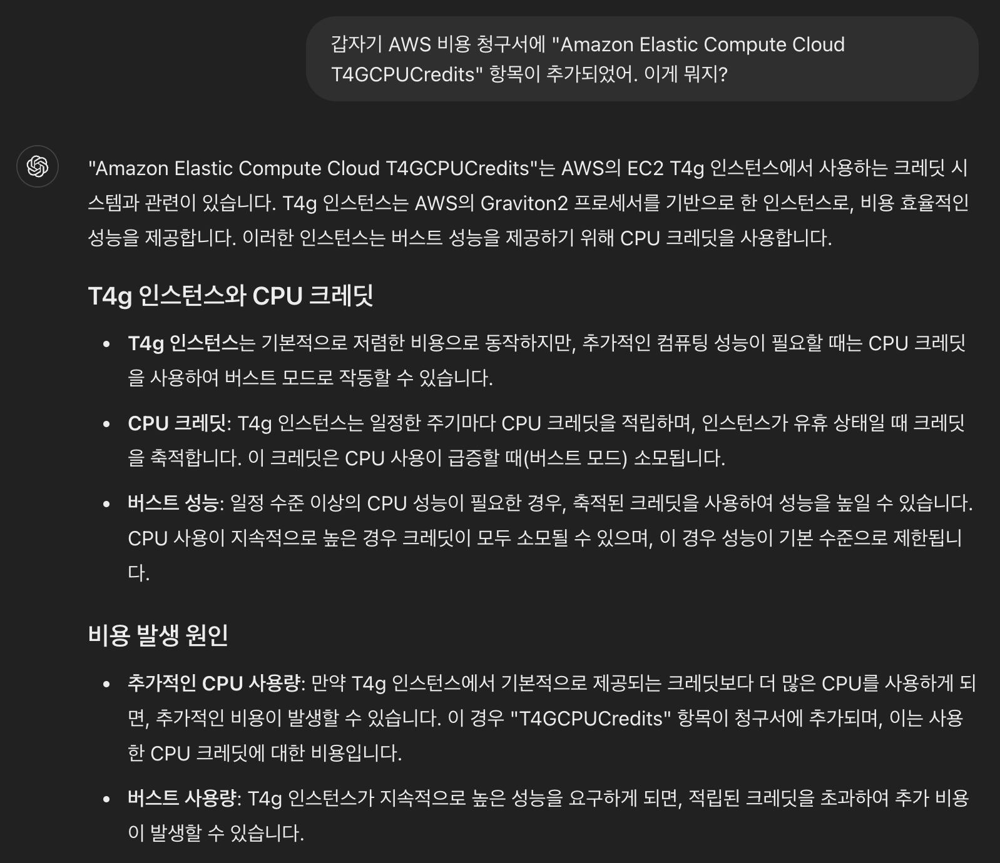

해당 정보를 바탕으로 관련 공식 문서 발견했다. ([문서1](https://docs.aws.amazon.com/AWSEC2/latest/UserGuide/burstable-performance-instances-unlimited-mode.html?icmpid=docs_ec2_console), [문서2](https://aws.amazon.com/ko/ec2/pricing/on-demand/#T2.2FT3.2FT4g_Unlimited_Mode_Pricing))<br>
문서에서 아래와 같이 설명한다.<br>
> T4g, T3a and T3 instances launch as unlimited by default (unless you [change the default](https://docs.aws.amazon.com/AWSEC2/latest/UserGuide/burstable-performance-instances-how-to.html#burstable-performance-instance-set-default-credit-specification-for-account)). If the average CPU usage over a 24-hour period exceeds the baseline, you incur charges for surplus credits. If you launch Spot Instances as unlimited and plan to use them immediately and for a short duration, with no idle time for accruing CPU credits, you incur charges for surplus credits. We recommend that you launch your Spot Instances in [standard](https://docs.aws.amazon.com/AWSEC2/latest/UserGuide/burstable-performance-instances-standard-mode.html) mode to avoid paying higher costs.
> <br>
> <br>
> T4g, T3a 및 T3 인스턴스는 기본적으로 무제한으로 시작됩니다(기본값을 변경하지 않는 한). 24시간 동안의 평균 CPU 사용량이 기준선을 초과하면 초과 크레딧에 대한 요금이 부과됩니다. 스팟 인스턴스를 무제한으로 시작하고 CPU 크레딧이 적립되는 유휴 시간 없이 단기간 동안 즉시 사용할 계획인 경우 잉여 크레딧에 대한 요금이 부과됩니다. 더 높은 비용을 지불하지 않으려면 스팟 인스턴스를 표준 모드로 시작하는 것이 좋습니다.

> T4g 인스턴스를 무제한 모드로 사용할 경우 CPU 크레딧은 Linux, RHEL 및 SLES에 대해 **vCPU-시간당 0.04 USD가 부과**됩니다.

**현재 사용 중인 인스턴스는 t4g.micro** 로서, 위 내용에 해당한다.<br> 
청구서에서도 '0.04$ per vCPU Hours' 라고 했으니 정확하다.<br>
찾아보니 **실제로 크레딧 사양이 unlimited**였고 **무제한 모드 설정을 끌 수 있는 것으로 파악**했다.<br>

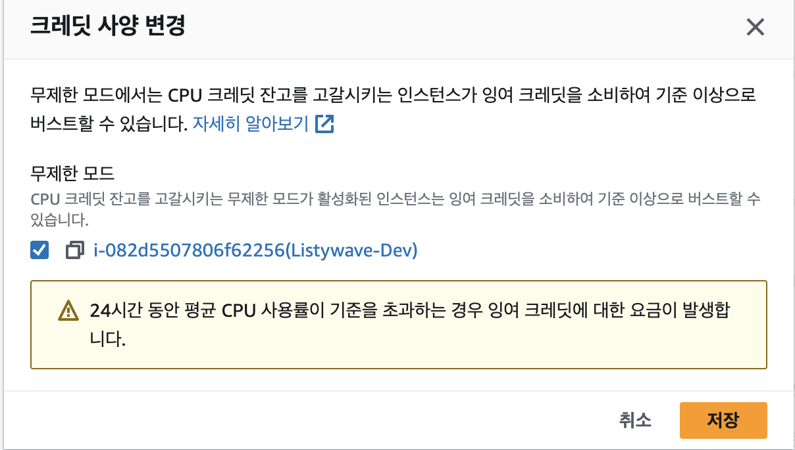

일단 세 인스턴스 모두 꺼놓았다.

## 2. 원인 파악

이제 CPU 사용량이 급격히 치솟은 이유를 파악해보자.

### AWS 모니터링으로 CPU 사용량 파악

위에서부터 AWS가 제공하는 Prod, Dev, DB 인스턴스의 모니터링 결과이다.<br>
모두 한 달 간의 결과를 보았다.<br>
눈여겨 볼 점은 **CPU 사용률**이다.

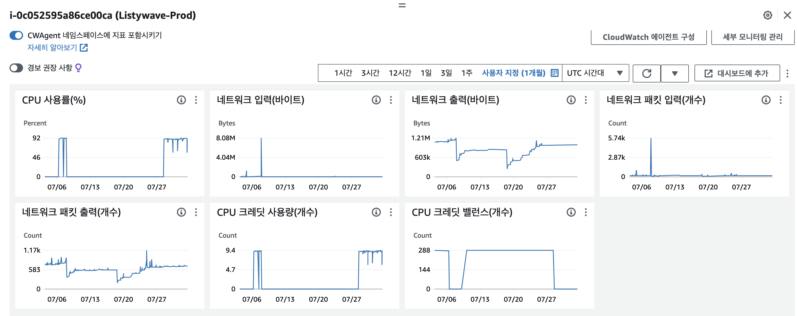
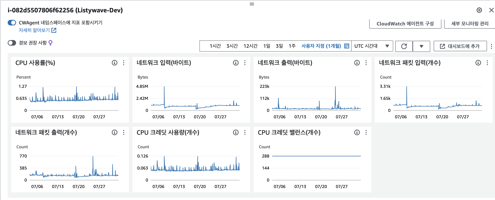
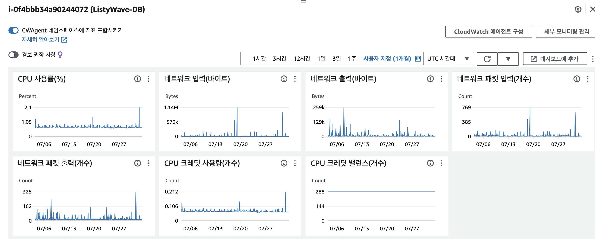

Dev, DB 인스턴스는 CPU 사용량이 최대 2.1%이다.<br>
반면 **Prod는 92%** 가 찍힌다. 심지어 7/27 부터 지금까지 지속되다시피 한다.<br>
실제로 **CPU 사용률과 CPU 크레딧 사용량 모니터링 결과가 거의 일치**한다.

CPU 사용률이 올라감에 따라 CPU 크레딧 사용량이 증가해서 추가 비용이 증가한 것이 틀림없어 보인다.

## 24/08/03 11:22 기준 Prod 인스턴스 상태

일단 Prod 인스턴스에 접속해서 현재 상태를 파악해보자.

CPU는 6.56% 사용중이다.
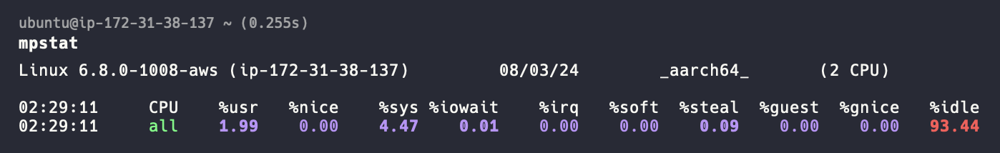

메모리는 전체 3GB 중, 약 8MB 정도 사용 중이다.
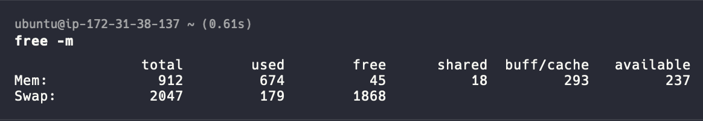

뭔가 이상해서 다시 AWS 모니터링해봤더니 실시간으로 내려가는 중이다 ..?
11:10 기점으로 내려가기 시작했다.
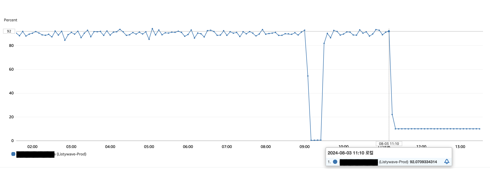

내려가니 다행인데 CPU 사용률이 급격하게 올라가는 이유는 무엇일까..?

.<br>
.<br>
.


아무튼 중요한 건 CPU 사용률이 급격하게 증가한 이유다.<br>
다시 CPU 사용률을 자세히 보면, '7/7\~7/9' 사이와 '7/29\~8/3' 사이에 사용률이 튄다.
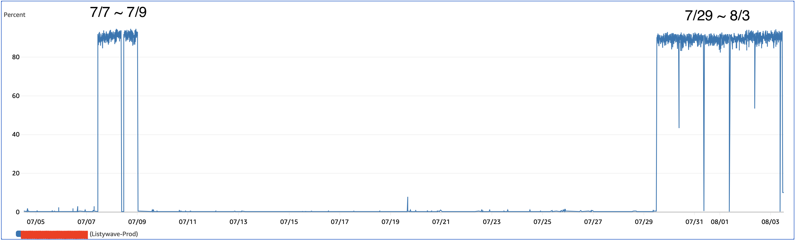

참고로 아까 150 시간이 부과되었고 150시간은 약 6일이라고 했다.<br>
7월 7,8,9,29,30,31 -> 6일로 맞아 떨어진다..!

7월 8일, 7월 29일은 정기 회의가 진행된 날이다.<br>
회의 때마다 서버에 트래픽이 몰리는 경우가 있다.<br>
그렇다면 서버에 과도한 요청에 따라 발생하거나 어디선가 병목현상이 발생해서 CPU 사용률이 올라가는 것일까?

아래는 7월 29일이 포함되는 이번 한 주(7/27\~8/3)의 네트워크 I/O 비율이다.
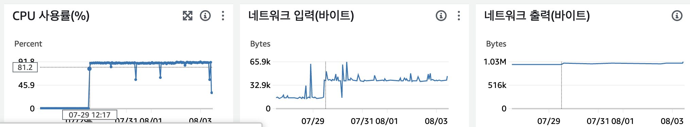

7월 29일 기준으로 CPU 사용률은 90% 이상을 유지하지만 네트워크 I/O 비율은 큰 변동이 없다.<br>
네트워크 입력이 중간중간 수치가 올라가지만, 결과에 영향을 주는 것 같지는 않다.

스프링의 문제인가 싶어서 그라파나를 살펴봤다.<br>
그런데 정작 Process CPU Usage는 Max 값이 0.0717 이었다.<br>
System CPU Usage는 AWS의 모니터링 결과와 일치했다.<br>
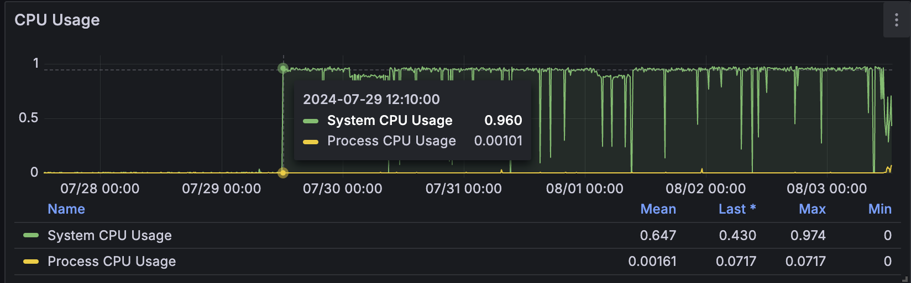

결국 **인스턴스 자체의 문제**인 것으로 좁힐 수 있다.<br>
곧바로 AWS에서 제공하는 시스템 로그를 파악해봤지만 일자도 없고 무슨 소린지 잘 모르겠다 🤷‍♂️<br>
그래서 인스턴스 내에 `/var/log/syslog`를 읽어보니 아래와 같았다.

```text
2024-07-31T00:07:08.262339+00:00 ip-172-31-38-137 rsyslogd[165030]: rsyslogd: file '/var/log/syslog'[8] write error - see https://www.rsyslog.com/solving-rsyslog-write-errors/ for help OS error: No space left on device [v8.2312.0 try https://www.rsyslog.com/e/2027 ]
2024-07-31T00:07:08.262418+00:00 ip-172-31-38-137 rsyslogd[165030]: rsyslogd: action 'action-3-builtin:omfile' (module 'builtin:omfile') message lost, could not be processed. Check for additional error messages before this one. [v8.2312.0 try https://www.rsyslog.com/e/2027 ]
2024-07-31T00:07:08.262512+00:00 ip-172-31-38-137 rsyslogd[165030]: rsyslogd: file '/var/log/syslog'[8] write error - see https://www.rsyslog.com/solving-rsyslog-write-errors/ for help OS error: No space left on device [v8.2312.0 try https://www.rsyslog.com/e/2027 ]
2024-07-31T00:07:08.262581+00:00 ip-172-31-38-137 rsyslogd[165030]: rsyslogd: action 'action-3-builtin:omfile' (module 'builtin:omfile') message lost, could not be processed. Check for additional error messages before this one. [v8.2312.0 try https://www.rsyslog.com/e/2027 ]
2024-07-31T00:07:08.262689+00:00 ip-172-31-38-137 rsyslogd[165030]: rsyslogd: file '/var/log/syslog'[8] write error - see https://www.rsyslog.com/solving-rsyslog-write-errors/ for help OS error: No space left on device [v8.2312.0 try https://www.rsyslog.com/e/2027 ]
2024-07-31T00:07:08.262758+00:00 ip-172-31-38-137 rsyslogd[165030]: rsyslogd: action 'action-3-builtin:omfile' (module 'builtin:omfile') message lost, could not be processed. Check for additional error messages before this one. [v8.2312.0 try https://www.rsyslog.com/e/2027 ]
2024-07-31T00:07:08.268322+00:00 ip-172-31-38-137 systemd[1]: sysstat-summary.service: Deactivated successfully.
2024-07-31T00:07:08.275229+00:00 ip-172-31-38-137 systemd[1]: Finished sysstat-summary.service - Generate a daily summary of process accounting.
2024-07-31T00:10:08.240256+00:00 ip-172-31-38-137 systemd[1]: Starting sysstat-collect.service - system activity accounting tool...
2024-07-31T00:07:03.053696+00:00 ip-172-31-38-137 kernel: systemd-journald[164997]: Failed to open system journal: No space left on device
2024-07-31T00:10:08.245703+00:00 ip-172-31-38-137 kernel: systemd-journald[164997]: Failed to open system journal: No space left on device (Dropped 20546 similar message(s))
2024-07-31T00:10:08.249710+00:00 ip-172-31-38-137 kernel: systemd-journald[164997]: Failed to open system journal: No space left on device
2024-07-31T00:10:08.260427+00:00 ip-172-31-38-137 systemd[1]: sysstat-collect.service: Deactivated successfully.
2024-07-31T00:10:08.271450+00:00 ip-172-31-38-137 systemd[1]: Finished sysstat-collect.service - system activity accounting tool.
2024-07-31T00:10:08.263698+00:00 ip-172-31-38-137 kernel: systemd-journald[164997]: Failed to open system journal: No space left on device
2024-07-31T00:15:01.933716+00:00 ip-172-31-38-137 kernel: systemd-journald[164997]: Failed to open system journal: No space left on device (Dropped 3 similar message(s))
2024-07-31T00:15:01.936707+00:00 ip-172-31-38-137 kernel: systemd-journald[164997]: Failed to open system journal: No space left on device
2024-07-31T00:15:01.949349+00:00 ip-172-31-38-137 CRON[415611]: (root) CMD (command -v debian-sa1 > /dev/null && debian-sa1 1 1)
2024-07-31T00:15:01.952692+00:00 ip-172-31-38-137 kernel: systemd-journald[164997]: Failed to open system journal: No space left on device
2024-07-31T00:17:01.939703+00:00 ip-172-31-38-137 kernel: systemd-journald[164997]: Failed to open system journal: No space left on device (Dropped 3 similar message(s))
2024-07-31T00:17:01.943731+00:00 ip-172-31-38-137 kernel: systemd-journald[164997]: Failed to open system journal: No space left on device
2024-07-31T00:17:01.957020+00:00 ip-172-31-38-137 CRON[415616]: (root) CMD (cd / && run-parts --report /etc/cron.hourly)
2024-07-31T00:20:08.239392+00:00 ip-172-31-38-137 systemd[1]: Starting sysstat-collect.service - system activity accounting tool...
2024-07-31T00:17:01.960755+00:00 ip-172-31-38-137 kernel: systemd-journald[164997]: Failed to open system journal: No space left on device
2024-07-31T00:20:08.242699+00:00 ip-172-31-38-137 kernel: systemd-journald[164997]: Failed to open system journal: No space left on device (Dropped 3 similar message(s))
2024-07-31T00:20:08.247700+00:00 ip-172-31-38-137 kernel: systemd-journald[164997]: Failed to open system journal: No space left on device
2024-07-31T00:20:08.260189+00:00 ip-172-31-38-137 systemd[1]: sysstat-collect.service: Deactivated successfully.
2024-07-31T00:20:08.271838+00:00 ip-172-31-38-137 systemd[1]: Finished sysstat-collect.service - system activity accounting tool.
2024-07-31T00:20:08.263697+00:00 ip-172-31-38-137 kernel: systemd-journald[164997]: Failed to open system journal: No space left on device
2024-07-31T00:25:01.949718+00:00 ip-172-31-38-137 kernel: systemd-journald[164997]: Failed to open system journal: No space left on device (Dropped 3 similar message(s))
2024-07-31T00:25:01.953694+00:00 ip-172-31-38-137 kernel: systemd-journald[164997]: Failed to open system journal: No space left on device
2024-07-31T00:25:01.966387+00:00 ip-172-31-38-137 CRON[415631]: (root) CMD (command -v debian-sa1 > /dev/null && debian-sa1 1 1)
2024-07-31T00:29:12.947214+00:00 ip-172-31-38-137 dockerd[72833]: time="2024-07-31T00:29:12.946688543Z" level=error msg="Error writing log message" driver=json-file error="error writing log entry: write /var/lib/docker/containers/2dfe8bd85c1922553dbcc6ab2e11ccc79a1c457eef02f1b93f790e1ff0045057/2dfe8bd85c1922553dbcc6ab2e11ccc79a1c457eef02f1b93f790e1ff0045057-json.log: no space left on device" message=
2024-07-31T00:25:01.969689+00:00 ip-172-31-38-137 kernel: systemd-journald[164997]: Failed to open system journal: No space left on device
2024-07-31T00:29:12.947685+00:00 ip-172-31-38-137 kernel: systemd-journald[164997]: Failed to open system journal: No space left on device (Dropped 3 similar message(s))
2024-07-31T00:29:12.947692+00:00 ip-172-31-38-137 kernel: systemd-journald[164997]: Failed to open system journal: No space left on device
2024-07-31T00:29:17.942629+00:00 ip-172-31-38-137 dockerd[72833]: time="2024-07-31T00:29:17.941983283Z" level=error msg="Error writing log message" driver=json-file error="error writing log entry: write /var/lib/docker/containers/2dfe8bd85c1922553dbcc6ab2e11ccc79a1c457eef02f1b93f790e1ff0045057/2dfe8bd85c1922553dbcc6ab2e11ccc79a1c457eef02f1b93f790e1ff0045057-json.log: no space left on device" message=
2024-07-31T00:29:17.942934+00:00 ip-172-31-38-137 dockerd[72833]: time="2024-07-31T00:29:17.942062224Z" level=error msg="Error writin2024-07-31T01:24:12.302137+00:00 ip-172-31-38-137 rsyslogd[165030]: rsyslogd: action 'action-3-builtin:omfile' (module 'builtin:omfile') message lost, could not be processed. Check for additional error messages before this one. [v8.2312.0 try https://www.rsyslog.com/e/2027 ]
2024-07-31T01:24:12.302176+00:00 ip-172-31-38-137 rsyslogd[165030]: rsyslogd: file '/var/log/syslog'[8] write error - see https://www.rsyslog.com/solving-rsyslog-write-errors/ for help OS error: No space left on device [v8.2312.0 try https://www.rsyslog.com/e/2027 ]
2024-07-31T01:24:12.302207+00:00 ip-172-31-38-137 rsyslogd[165030]: rsyslogd: action 'action-3-builtin:omfile' (module 'builtin:omfile') message lost, could not be processed. Check for additional error messages before this one. [v8.2312.0 try https://www.rsyslog.com/e/2027 ]
```

위 로그를 분해해보면 다음과 같다.<br>
**7/31일 00:07+00:00부터 00:29+00:00 까지** 아래 로그가 기록된다.
```text
2024-07-31T00:07:08.268322+00:00 ip-172-31-38-137 systemd[1]: sysstat-summary.service: Deactivated successfully.
2024-07-31T00:07:08.275229+00:00 ip-172-31-38-137 systemd[1]: Finished sysstat-summary.service - Generate a daily summary of process accounting.
2024-07-31T00:10:08.240256+00:00 ip-172-31-38-137 systemd[1]: Starting sysstat-collect.service - system activity accounting tool...
2024-07-31T00:07:03.053696+00:00 ip-172-31-38-137 kernel: systemd-journald[164997]: Failed to open system journal: No space left on device
2024-07-31T00:10:08.245703+00:00 ip-172-31-38-137 kernel: systemd-journald[164997]: Failed to open system journal: No space left on device (Dropped 20546 similar message(s))
2024-07-31T00:10:08.249710+00:00 ip-172-31-38-137 kernel: systemd-journald[164997]: Failed to open system journal: No space left on device
2024-07-31T00:10:08.260427+00:00 ip-172-31-38-137 systemd[1]: sysstat-collect.service: Deactivated successfully.
2024-07-31T00:10:08.271450+00:00 ip-172-31-38-137 systemd[1]: Finished sysstat-collect.service - system activity accounting tool.
2024-07-31T00:10:08.263698+00:00 ip-172-31-38-137 kernel: systemd-journald[164997]: Failed to open system journal: No space left on device
2024-07-31T00:15:01.933716+00:00 ip-172-31-38-137 kernel: systemd-journald[164997]: Failed to open system journal: No space left on device (Dropped 3 similar message(s))
2024-07-31T00:15:01.936707+00:00 ip-172-31-38-137 kernel: systemd-journald[164997]: Failed to open system journal: No space left on device
2024-07-31T00:15:01.949349+00:00 ip-172-31-38-137 CRON[415611]: (root) CMD (command -v debian-sa1 > /dev/null && debian-sa1 1 1)
2024-07-31T00:15:01.952692+00:00 ip-172-31-38-137 kernel: systemd-journald[164997]: Failed to open system journal: No space left on device
2024-07-31T00:17:01.939703+00:00 ip-172-31-38-137 kernel: systemd-journald[164997]: Failed to open system journal: No space left on device (Dropped 3 similar message(s))
2024-07-31T00:17:01.943731+00:00 ip-172-31-38-137 kernel: systemd-journald[164997]: Failed to open system journal: No space left on device
2024-07-31T00:17:01.957020+00:00 ip-172-31-38-137 CRON[415616]: (root) CMD (cd / && run-parts --report /etc/cron.hourly)
2024-07-31T00:20:08.239392+00:00 ip-172-31-38-137 systemd[1]: Starting sysstat-collect.service - system activity accounting tool...
2024-07-31T00:17:01.960755+00:00 ip-172-31-38-137 kernel: systemd-journald[164997]: Failed to open system journal: No space left on device
2024-07-31T00:20:08.242699+00:00 ip-172-31-38-137 kernel: systemd-journald[164997]: Failed to open system journal: No space left on device (Dropped 3 similar message(s))
2024-07-31T00:20:08.247700+00:00 ip-172-31-38-137 kernel: systemd-journald[164997]: Failed to open system journal: No space left on device
2024-07-31T00:20:08.260189+00:00 ip-172-31-38-137 systemd[1]: sysstat-collect.service: Deactivated successfully.
2024-07-31T00:20:08.271838+00:00 ip-172-31-38-137 systemd[1]: Finished sysstat-collect.service - system activity accounting tool.
2024-07-31T00:20:08.263697+00:00 ip-172-31-38-137 kernel: systemd-journald[164997]: Failed to open system journal: No space left on device
2024-07-31T00:25:01.949718+00:00 ip-172-31-38-137 kernel: systemd-journald[164997]: Failed to open system journal: No space left on device (Dropped 3 similar message(s))
2024-07-31T00:25:01.953694+00:00 ip-172-31-38-137 kernel: systemd-journald[164997]: Failed to open system journal: No space left on device
2024-07-31T00:25:01.966387+00:00 ip-172-31-38-137 CRON[415631]: (root) CMD (command -v debian-sa1 > /dev/null && debian-sa1 1 1)
2024-07-31T00:29:12.947214+00:00 ip-172-31-38-137 dockerd[72833]: time="2024-07-31T00:29:12.946688543Z" level=error msg="Error writing log message" driver=json-file error="error writing log entry: write /var/lib/docker/containers/2dfe8bd85c1922553dbcc6ab2e11ccc79a1c457eef02f1b93f790e1ff0045057/2dfe8bd85c1922553dbcc6ab2e11ccc79a1c457eef02f1b93f790e1ff0045057-json.log: no space left on device" message=
2024-07-31T00:25:01.969689+00:00 ip-172-31-38-137 kernel: systemd-journald[164997]: Failed to open system journal: No space left on device
2024-07-31T00:29:12.947685+00:00 ip-172-31-38-137 kernel: systemd-journald[164997]: Failed to open system journal: No space left on device (Dropped 3 similar message(s))
2024-07-31T00:29:12.947692+00:00 ip-172-31-38-137 kernel: systemd-journald[164997]: Failed to open system journal: No space left on device
2024-07-31T00:29:17.942629+00:00 ip-172-31-38-137 dockerd[72833]: time="2024-07-31T00:29:17.941983283Z" level=error msg="Error writing log message" driver=json-file error="error writing log entry: write /var/lib/docker/containers/2dfe8bd85c1922553dbcc6ab2e11ccc79a1c457eef02f1b93f790e1ff0045057/2dfe8bd85c1922553dbcc6ab2e11ccc79a1c457eef02f1b93f790e1ff0045057-json.log: no space left on device" message=
2024-07-31T00:29:17.942934+00:00 ip-172-31-38-137 dockerd[72833]: time="2024-07-31T00:29:17.942062224Z" level=error msg="Error writin2024-07-31T01:24:12.302137+00:00 ip-172-31-38-137 rsyslogd[165030]: rsyslogd: action 'action-3-builtin:omfile' (module 'builtin:omfile') message lost, could not be processed. Check for additional error messages before this one. [v8.2312.0 try https://www.rsyslog.com/e/2027 ]
```

그리고 위 로그의 전후로 아래 로그가 상당히 많이 기록되어있다.

```text
2024-07-31T00:07:08.262339+00:00 ip-172-31-38-137 rsyslogd[165030]: rsyslogd: file '/var/log/syslog'[8] write error - see https://www.rsyslog.com/solving-rsyslog-write-errors/ for help OS error: No space left on device [v8.2312.0 try https://www.rsyslog.com/e/2027 ]
2024-07-31T00:07:08.262418+00:00 ip-172-31-38-137 rsyslogd[165030]: rsyslogd: action 'action-3-builtin:omfile' (module 'builtin:omfile') message lost, could not be processed. Check for additional error messages before this one. [v8.2312.0 try https://www.rsyslog.com/e/2027 ]
```

아니 이게 웬걸? **실제 모니터링 결과에서도 7/31 00:00\~00:30 까지 CPU 사용량이 급격히 줄어든다**.<br>
그리고 **그 전후로 CPU 사용량이 90% 이상을 꾸준히 기록**된다.<br>
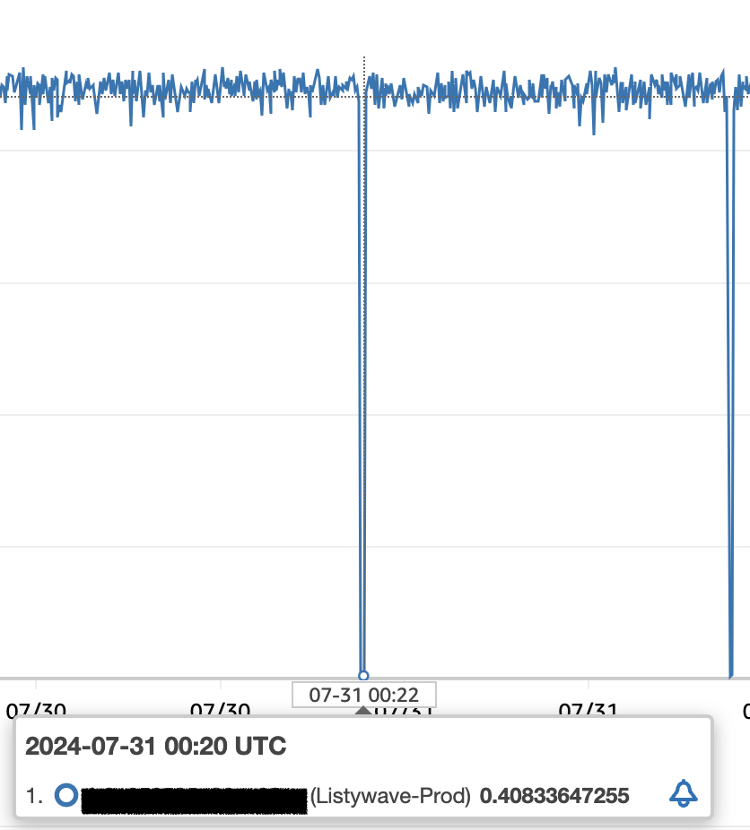

위 로그가 정답이 될 것 같다 ❗️<br>
로그를 잘 읽어보니 **로그를 기록하는 데 필요한 디스크 용량이 부족**하다고 한다.

`df -h`로 확인해보니 실제로 가득차있다. 😱😱
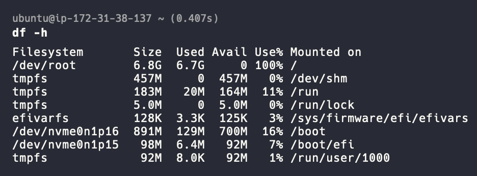

도커의 로그도 관련되어 있어 보이니 Docker Container의 용량도 확인해보자.
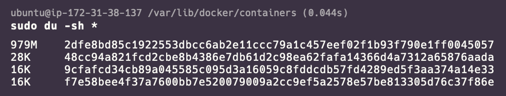
'2dfe~~' 는 스프링 애플리케이션을 실행 중인 컨테이너이다.<br>
여기서 1GB 가까이 차지하고 있었다!<br>

컨테이너 내부에 로그 파일은 _{ContainerId}-json.log_ 와 같은 이름으로 되어 있다.<br>
따라서 `sudo truncate -s 0 2dfe8bd85c1922553dbcc6ab2e11ccc79a1c457eef02f1b93f790e1ff0045057-json.log` 명령어로 로그의 내용을 모두 지워주고 디스크를 확인해보니 확연히 줄었다!<br>
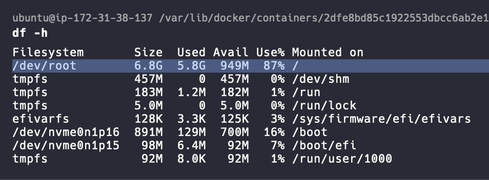

디스크를 어느정도 정리하고 보니 10%를 유지하던 CPU 사용량도 줄었다!<br>
사진을 잘못찍어 잘 안보이겠지만 2.58% 까지 줄어듦을 확인할 수 있다.
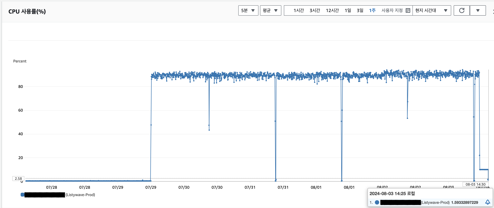

**결국 로그로 인해 디스크 용량 부족으로 발생한 문제임이 확실해졌다.**

하지만 삭제했다고 끝이 아니다.<br>
앞으로도 로그는 계속해서 남을 것이다.

도커의 로그 드라이버를 설정해주어 최대 용량을 제한해두자.<br>
`sudo vi /etc/docker/daemon.json`을 입력해서 Docker 로깅 드라이버 설정을 아래와 같이 해주었다.<br>
최대 용량은 500MB, 최대 파일 사이즈는 5로 설정해두었다.
```json
{
  "log-driver": "json-file",
  "log-opts": {
    "max-size": "500m",
    "max-file": "5"
  }
}
```

이번엔 서버 시스템의 로그 설정을 해주자.[^1]
Linux에는 주기적으로 로그를 삭제 및 정리하는 기능의 Logrotate 기능이 있다.<br>
해당 기능을 설정해주자.

`sudo vim /etc/logrotate.conf` 명령어를 입력하고 아래 값을 입력 & 저장해주자.

```text
# see "man logrotate" for details

# global options do not affect preceding include directives

# rotate log files weekly
# 주마다 로그 파일을 교체한다
weekly

# use the adm group by default, since this is the owning group
# of /var/log/.
su root adm

# keep 4 weeks worth of backlogs
# 로그 파일의 개수가 4개 이상이면 가장 오래된 로그 파일을 삭제한다.
rotate 4

# create new (empty) log files after rotating old ones
# 오래된 로그를 정리하고 새로운 로그 파일을 만들지 여부
create

# use date as a suffix of the rotated file
# 로그 파일 정리 후 로그 파일 뒤에 날짜를 추가한다.
dateext

# uncomment this if you want your log files compressed
# 로그 파일을 로테이트 후 압축 파일로 생성한다.
compress

# packages drop log rotation information into this directory
include /etc/logrotate.d

# system-specific logs may also be configured here.
size 500M # 로그 파일 사이즈가 500M가 넘으면 로테이트를 실행한다.
```

## 마무리

정리하는 김에 다른 불필요한 파일이나 폴더를 삭제해주었다.<br>
CPU 사용량도 더 줄어듦을 볼 수 있다.

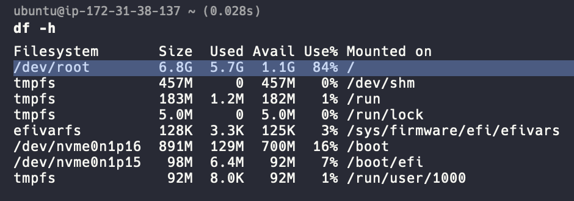
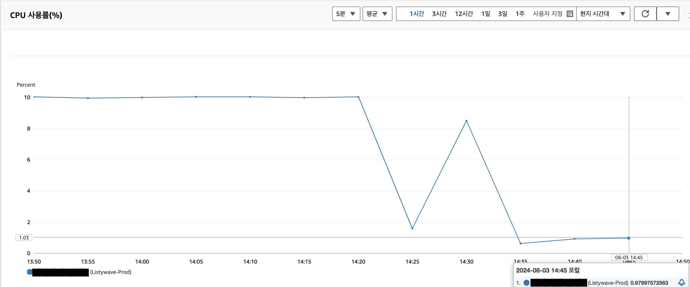

원치 않은 추가 비용이 발생함에 따라 크레딧 사양을 unlimited에서 standard로 수정했다.<br>
이에 따라 CPU 사용량이 급격히 늘어남에 따라 추가 비용이 발생하지는 않을 것으로 보인다.<br>

돈을 조금 더 썼지만 소중한 경험을 할 수 있었다.<br>
**시스템을 운영할 때 로그를 잘 남기는 것이 매우 중요**하다는 것과 **로그를 잘 저장하는 것이 중요**하다는 것이다.<br>
또한 모니터링 대시보드를 붙였음에도 잘 사용하고 있지 못하는 것 같다.<br>
**특정 메트릭에 임계치를 설정해놓고 값을 초과하면 알람을 발생하도록** 해봐야겠다.

---

[^****1]: [[Linux] Logrotate 설명 및 설정 방법](http://www.chlux.co.kr/bbs/board.php?bo_table=board02&wr_id=91&sca=OS&page=6)