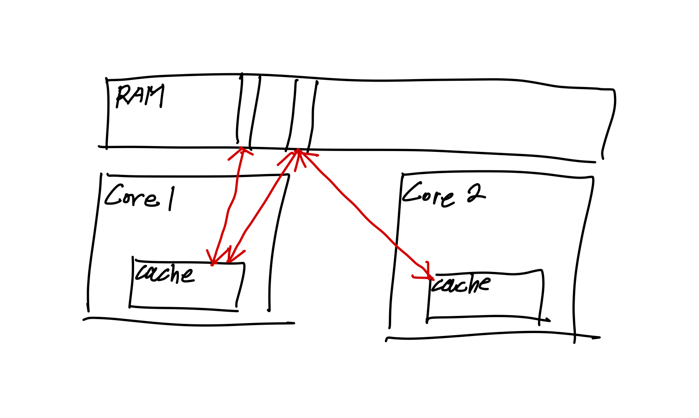

## 들어가며

[지난 글](https://kdkdhoho.github.io/status-and-control-thread-in-java)에는 쓰레드를 다루기 위해 **쓰레드의 상태**와 **쓰레드의 행동을 제어하는 메서드**들에 대해 알아보았다.

이번에는 쓰레드의 핵심. 쓰레드의 꽃이라고 생각하는 **쓰레드 동기화**에 대해 알아보자.

Java에서 쓰레드를 동기화하는 방법에는 3가지가 있다.

## 임계영역과 락, 그리고 모니터

쓰레드의 동기화를 알아보기 전에, **임계 영역(Critical Section)**과 **락(Lock)**, 그리고 **모니터(Monitor) 방식**에 대해 간단히 알아보자.

### 임계 영역 (Critical Section)

**임계 영역**은 **둘 이상의 쓰레드가 동시에 접근해서 안되는 공유 자원에 접근하는 구간 또는 영역**이다.

아래 코드를 예시로 했을 때, `Main.increment()`가 임계 영역이 된다.<br>

```java
class MyThread extends Thread {
    
    @Override
    public void run() {
        for (int i = 0; i < 1000; i++) {
            Main.increment(); // 임계 영역
        }
    }
}

public class Main {

    private static int count = 0;

    public static void increment() {
        count++;
    }

    public static void main(String[] args) throws InterruptedException {
        MyThread thread1 = new MyThread();
        MyThread thread2 = new MyThread();
        thread1.start();
        thread2.start();
        thread1.join();
        thread2.join();
        System.out.println("Final count: " + count);
    }
}

== Console ==
Final count: 3995
```

### 락 (Lock)

락은, **임계 영역에 들어가기 위해 획득해야 하는 것**이다.<br>
락을 획득한 쓰레드만이 임계 영역에 들어갈 수 있다. 따라서 임계 영역에서 작업이 모두 끝나면 반드시 락을 반환해야 한다.<br>
그렇지 않으면 다른 쓰레드는 임계 영역에 절대 들어갈 수 없다.

만약 다른 쓰레드가 이미 먼저 락을 선점했다면, 해당 쓰레드가 락을 반환할 때까지 자신은 무한정 대기해야 한다.

<br>

---

<br>
<br>

이제 본격적으로 동기화하는 방법에 대해 알아보자.

### 모니터(Monitor)

모니터는 스레드 간의 동기화하는 기법 중 하나다.<br>
모니터는 상호 배제(Mutual Exclusion)을 지원하고 조건에 따라 스레드를 WAITING 상태로 전환한다.<br>
모니터의 구성 요소로는 Mutex Lock과 Condition Variable(s)가 있다.<br>
Mutex Lock은 말 그대로 여러 스레드가 임계 영역에 접근하기 위해 획득을 시도하는 Lock이고 Condition Variable은 WAITING 상태로 전환된 스레드가 대기하는 공간이다. 구현에 따라 Queue나 Pool의 개념으로 구현할 수 있다.

모니터에 대해 알아본 이유는, JVM이 모든 객체에 대해 모니터 기법으로 동기화 하기 때문이다.<br>
자바에서 모든 객체는 Lock을 하나씩 가지고 있고 (Mutex Lock), Lock을 획득하기 위해 대기하는 공간인 Waiting Pool (Condition Variable)이 하나씩 존재한다.

## 1. synchronized를 이용한 동기화

제일 먼저 가장 쉽고 단순한 방법인 `synchronized` 키워드를 이용한 동기화에 대해 알아보자.

`synchronized` 키워드를 선언하면 JVM이 해당 자원(객체)에 대해 모니터 방식으로 동기화를 제어한다.

`synchronized`를 사용하는 방식으로는 두 가지가 있다.

### 1-1. 메서드 전체를 임계 영역으로 설정

아래 코드처럼 메서드 자체에 `synchronized` 키워드를 추가함으로써 **메서드 전체를 임계 영역으로 설정**할 수 있다.<br>

```java
// 메서드 전체를 임계 영역으로 지정
public static synchronized void increment() {
    count++;
}
```

모든 쓰레드는 해당 메서드를 호출한 시점부터 자동으로 Lock을 얻어 작업을 수행하다가 메서드가 종료되면 Lock을 반환한다.

> 참고)<br>
> Java에서 모든 객체는 고유한 Lock을 하나씩 가진다.<br>
> Lock은 JVM이 소유하고 관리한다.

### 1-2. 특정 영역을 임계 영역으로 설정

두 번째로, 코드 일부 영역을 블럭 `{}` 으로 감싸고, 블럭 앞에 `synchronized(참조변수)` 키워드를 추가하는 방식이다.

```java
@Override
public void run() {
    for (int i = 0; i < 1000; i++) {
        // 특정 영역을 임계 영역으로 지정
        // ⬇️ synchronized 블럭 ⬇️
        synchronized (Main.class) {
            Main.increment();
        }
    }
}
```

이때, **참조변수는 Lock을 걸고자하는 객체를 참조**해야 한다.<br>
이 블럭을 _synchronized 블럭_ 이라고 부르며, 이 블럭의 영역 안으로 들어가면서 쓰레드는 지정된 객체의 Lock을 획득하고, 블럭의 영역을 벗어나면 Lock을 반납한다.

### synchronized 사용 시 주의점

임계 영역의 설정은 멀티쓰레드 프로그램의 성능을 결정한다.<br>

`synchronized` 키워드는 동기화를 적용하기 매우 쉬운 방법이지만, Lock을 획득하기 위해 무한정 대기해야 하는 쓰레드들이 무수히 많아지면 프로그램 성능의 악영향을 끼칠 수 있다.
또한, 임계 영역을 메서드 전체보다는 필요한 영역으로만 최소화하는 것이 프로그램 성능에 영향을 끼친다.<br>
따라서 synchronized 블럭으로 임계 영역을 최소화할 수 있다면, 메서드 전체에 `synchronized`를 설정하는 것보단 더 나은 선택일 수 있다.<br>
물론 메서드 전체가 임계 영역이어야 한다면, 그땐 `synchronized` 메서드를 선언하는 것이 나을 수 있다.

추가로 맨 위에 있는 예시 코드에서 `int count` 변수가 현재는 `private` 으로 설정되어 있지만, `public`으로 열리는 순간 `count` 변수에 직접 접근할 수 있다.<br>
이때는 **변수 자체에 동기화를 설정**하는 것이 중요하다.<br>
즉, `Main.increment()` 메서드에만 `synchronized`로 동기화하는 실수를 범해서는 안된다는 의미다.<br>

## 2. wait()과 notify()

`synchronized`를 이용해서 동기화하게 되면, Lock을 얻기 위해 무한정 대기해야하는 상황이 발생할 수 있다.<br>
이런 상황을 개선하기 위해 고안된 것이 `wait()`과 `notify()` 메서드이다.

동기화된 임계영역의 코드를 수행하다가, **작업을 더 이상 진행할 상황이 아니면 `wait()` 메서드를 호출해서 획득한 Lock을 반납하고 대기열(Waiting Pool)에서 대기**한다.<br>
(참고로 이때 쓰레드는 WAITING 상태가 된다.)<br>
그러면 Lock을 얻기 위해 대기하던 쓰레드 중 하나가 Lock을 획득하여 작업을 수행할 수 있게 된다.<br>
**나중에 작업을 진행할 수 있는 상황이 오면 `notify()` 메서드를 호출해서 대기열에서 대기 중인 쓰레드가 다시 RUNNABLE 상태로 바뀌게 되고, 마침내 Lock을 얻어 작업을 진행**할 수 있게 된다.

> `wait()`에 의해 Lock을 반환했다가, 다시 Lock을 얻어서 임계 영역에 진입하는 것을 _재진입(reentrance)_ 이라고 한다.

하지만 대기열에서 대기 중인 쓰레드가 둘 이상인 경우, **`notify()` 메서드를 호출하게 되면 단 하나의 쓰레드만이 무작위로 선택되어 RUNNABLE 상태**가 된다.<br>
**대기열에 있는 모든 쓰레드를 RUNNABLE 상태로 만드는 `notifyAll()`** 이라는 메서드도 있지만, **대기열에 있는 모든 쓰레드를 깨울 뿐, 결국 Lock은 단 하나의 쓰레드만이 획득하여 Lock을 획득하지 못한 나머지 쓰레드는 다시 Lock을 얻기 위해 대기해야 한다.**

`wait()`과 `notify()`는 특정 객체에 대한 행동이므로 `Object` 클래스에 정의되어있다.

`wait()`은 `notify()`가 호출될 때까지 기다린다.<br>
`wait(long timeout)`, `wait(long timeout, int nanos)`는 지정된 시간동안만 기다린다.<br>
즉, 지정 시간이 지난 후 자동으로 `notify()`를 호출하는 것과 동일하다.

**Waiting Pool은 객체마다 존재**한다.<br>
따라서 `notifyAll()`이 호출된다고 해서 모든 객체의 쓰레드, 그 중에서 Waiting Pool에 있는 쓰레드가 깨워지는 것은 아니라는 점을 기억하자.

**`wait()`과 `notify()`는 _synchronized 블록_ 내에서만 사용**할 수 있다.

### 예시 코드 - Producer, Consumer 문제

아래 코드는 식당에서 음식(Dish)을 만들어 테이블(Table)에 추가(add)하는 요리사(Cook)와 테이블의 음식을 소비(remove)하는 손님(Customer)을 쓰레드로 구현한 코드이다.

```java
import java.util.ArrayList;
import java.util.List;

// 테이블 쓰레드
class Table {

    public static final String[] dishNames = {"donut", "donut", "burger"}; // donut이 더 자주 나온다.
    private static final int MAX_FOOD = 6; // 테이블에 놓을 수 있는 최대 음식 수

    private final List<String> dishes = new ArrayList<>();

    // 테이블에 음식이 가득찼으면, 테이블에 음식을 추가하지 않는다.
    public void add(String dish) {
        if (dishes.size() >= MAX_FOOD) {
            return;
        }
        dishes.add(dish);
        System.out.println("Dishes: " + dishes);
    }

    // 지정된 요리와 일치하는 요리를 테이블에서 제거한다.
    public boolean remove(String dishName) {
        for (int i = 0; i < dishes.size(); i++) {
            if (dishName.equals(dishes.get(i))) {
                dishes.remove(i);
                return true;
            }
        }
        return false;
    }

    public int dishNum() {
        return dishNames.length;
    }
}

// 요리사 쓰레드
class Cook implements Runnable {

    private final Table table;

    public Cook(Table table) {
        this.table = table;
    }

    // 임의의 요리를 하나 선택해서 table에 추가하고 0.001초 대기하는 작업을 무한정 수행한다.
    @Override
    public void run() {
        while (true) {
            int index = (int) (Math.random() * table.dishNum());
            table.add(Table.dishNames[index]);

            try {
                Thread.sleep(1);
            } catch (InterruptedException e) {
            }
        }
    }
}

// 손님 쓰레드
class Customer implements Runnable {

    private final Table table;
    private final String food;

    public Customer(Table table, String food) {
        this.table = table;
        this.food = food;
    }

    @Override
    public void run() {
        // 0.01초 대기 후, table에서 food를 소비한다.
        // 소비 결과에 따라 다른 내용을 출력한다.
        while (true) {
            try {
                Thread.sleep(10);
            } catch (InterruptedException e) {
            }

            String name = Thread.currentThread().getName();
            boolean removed = table.remove(food);

            if (removed) {
                System.out.println(name + " ate a " + food);
            } else {
                System.out.println(name + " failed to eat.");
            }
        }
    }
}

public class Main {
    public static void main(String[] args) throws InterruptedException {
        Table table = new Table(); // 여러 객체가 공유하는 객체

        new Thread(new Cook(table), "COOK1").start();
        new Thread(new Customer(table, "donut"), "CUSTOMER1").start();
        new Thread(new Customer(table, "burger"), "CUSTOMER2").start();

        Thread.sleep(100); // 0.1초 대기했다가
        System.exit(0); // 프로그램을 강제 종료한다.
    }
}

```

이 코드를 실행할 때마다 결과는 다르다. 예외가 발생할 수도, 발생하지 않을 수도 있다.<br>
최악의 경우엔 **2가지 종류의 예외가 발생**하는데, 하나는 Cook 쓰레드가 Table에 음식을 추가하는 도중에, Customer 쓰레드가 음식을 가져가려 했기 때문에 `ConcurrentModificationException`이고,<br>
또 하나는, Customer 쓰레드가 Table의 마지막 남은 음식을 가져가는 도중에 다른 Customer 쓰레드가 먼저 음식을 가져가서, 존재하지 않는 음식을 Table에서 remove() 하려고 했기 때문에 발생하는 `IndexOutOfBoundsException`이다.

이런 예외들이 발생하는 이유는 여러 쓰레드(Cook, Customer)가 공유자원(Table)을 사용하는데도 동기화하지 않았기 때문이다.
이제 이 코드에 동기화를 추가해보자.<br>
복잡할 거 없다. `Table` 클래스만 잘 살펴보자.

```java
import java.util.ArrayList;
import java.util.List;

// 테이블 쓰레드
class Table {

    String[] dishNames = {"donut", "donut", "burger"}; // donut이 더 자주 나온다.
    final int MAX_FOOD = 6; // 테이블에 놓을 수 있는 최대 음식 수

    private List<String> dishes = new ArrayList<>();

    // 테이블에 음식이 가득찼으면, 테이블에 음식을 추가하지 않는다.
    public synchronized void add(String dish) { // synchronized 추가
        if (dishes.size() >= MAX_FOOD) {
            return;
        }
        dishes.add(dish);
        System.out.println("Dishes: " + dishes);
    }

    // 지정된 요리와 일치하는 요리를 테이블에서 제거한다.
    public boolean remove(String dishName) {
        synchronized (this) { // synchronized 블럭 추가
            while (dishes.isEmpty()) { // 요리가 없으면 생길 때까지 0.5초 대기하는 것을 반복한다.
                String name = Thread.currentThread().getName();
                System.out.println(name + " is waiting.");
                try {
                    Thread.sleep(500);
                } catch (InterruptedException e) {
                }
            }

            for (int i = 0; i < dishes.size(); i++) {
                if (dishName.equals(dishes.get(i))) {
                    dishes.remove(i);
                    return true;
                }
            }
        }
        return false;
    }

    public int dishNum() {
        return dishNames.length;
    }
}

// 요리사 쓰레드
class Cook implements Runnable {

    private final Table table;

    public Cook(Table table) {
        this.table = table;
    }

    // 임의의 요리를 하나 선택해서 table에 추가하고 0.01초 대기하는 작업을 무한정 수행한다.
    @Override
    public void run() {
        while (true) {
            int index = (int) (Math.random() * table.dishNum());
            table.add(table.dishNames[index]);

            try {
                Thread.sleep(100);
            } catch (InterruptedException e) {
            }
        }
    }
}

// 손님 쓰레드
class Customer implements Runnable {

    private final Table table;
    private final String food;

    public Customer(Table table, String food) {
        this.table = table;
        this.food = food;
    }

    @Override
    public void run() {
        // 0.01초 대기 후, table에서 food를 소비한다.
        // 소비 결과에 따라 다른 내용을 출력한다.
        while (true) {
            try {
                Thread.sleep(10);
            } catch (InterruptedException e) {
            }

            String name = Thread.currentThread().getName();
            boolean removed = table.remove(food);

            if (removed) {
                System.out.println(name + " ate a " + food);
            } else {
                System.out.println(name + " failed to eat.");
            }
        }
    }
}

public class Main {
    public static void main(String[] args) throws InterruptedException {
        Table table = new Table(); // 여러 객체가 공유하는 객체

        new Thread(new Cook(table), "COOK1").start();
        new Thread(new Customer(table, "donut"), "CUSTOMER1").start();
        new Thread(new Customer(table, "burger"), "CUSTOMER2").start();

        Thread.sleep(5000); // 5초 후 대기했다가
        System.exit(0); // 프로그램을 강제 종료한다.
    }
}

== Console ==
Dishes: [donut]
CUSTOMER2 is waiting.
CUSTOMER1 ate a donut
CUSTOMER2 is waiting.
CUSTOMER2 is waiting.
CUSTOMER2 is waiting.
... (생략)
```

Table 쓰레드의 **`add()` 메서드에 synchronized 키워드를 추가**했고, **`remove()` 메서드 내부에 synchronized 블럭을 추가**했다.<br>
모두, 공유 자원인 `List<String> dishes`에 접근하는 임계 영역을 `synchronize`를 이용해서 동기화 한 것이다.<br>
추가로 프로그램 실행 시간을 5초로 늘렸으며, Cook 쓰레드가 음식을 추가하는 주기를 0.001초에서 0.1초로 늘렸다.

더이상 예외는 발생하지 않는다.<br>
하지만, "Customer2 is waiting." 이 한번 출력되면 프로그램이 종료될 때까지 무한정 출력된다.<br>
이유는 바로, `remove()` 메서드에 있다.

Customer2가 `remove()`을 호출했을 때 synchronized 블럭에 진입했다고 가정하고 실행 흐름을 잘 따라가보자.<br>
만약 이때 `dishes.isEmpty()`의 결과로 `true`가 반환되었다면, while 문을 반복할 것이다.<br>
하지만 현재 공유 자원인 Table에 대한 Lock을 가진 채로 무한히 while 문을 돌게 된다.<br>
때문에 Cook 쓰레드와 Customer1 쓰레드는 LOCK을 획득하기 위해 무한정 대기하고 있는 것이고,<br>Lock을 점유한 Customer2는 무한정 대기하고 있는 것이다.

이제 `wait()`와 `notify()`를 이용하여 이를 개선해보자.

```java
import java.util.ArrayList;
import java.util.List;

// 테이블 쓰레드
class Table {

    String[] dishNames = {"donut", "donut", "burger"}; // donut이 더 자주 나온다.
    final int MAX_FOOD = 6; // 테이블에 놓을 수 있는 최대 음식 수

    private List<String> dishes = new ArrayList<>();

    // 테이블에 음식이 가득찼으면, 테이블에 음식을 추가하지 않는다.
    public synchronized void add(String dish) {
        if (dishes.size() >= MAX_FOOD) {
            System.out.println(Thread.currentThread().getName() + " is waiting.");

            try {
                wait(); // 쓰레드 자신(Cook)을 대기시킨다.
                Thread.sleep(500);
            } catch (InterruptedException e) {
            }
        }

        // 성공적으로 음식을 추가한다
        dishes.add(dish);
        System.out.println(Thread.currentThread().getName() + " add " + dish);
        notify(); // 쓰레드를 깨운다. Customer 쓰레드를 깨우기 위함이다.
        System.out.println("Dishes: " + dishes);
    }

    // 지정된 요리와 일치하는 요리를 테이블에서 제거한다.
    public void remove(String dishName) {
        synchronized (this) {
            // 음식이 아무것도 없으면
            while (dishes.isEmpty()) {
                System.out.println(Thread.currentThread().getName() + " is waiting.");

                try {
                    wait(); // 쓰레드 자신(Customer)을 대기시킨다.
                    Thread.sleep(500);
                } catch (InterruptedException e) {
                }
            }

            while (true) {
                for (int i = 0; i < dishes.size(); i++) {
                    if (dishName.equals(dishes.get(i))) {
                        dishes.remove(i); // 성공적으로 제거하고
                        notify(); // 쓰레드를 깨운다. Cook 쓰레드를 깨우기 위함이다.
                        return;
                    }
                }

                try {
                    System.out.println(Thread.currentThread().getName() + " is waiting.");
                    wait(); // 원하는 음식이 없기에, 쓰레드 자신(Customer)을 대기시킨다.
                    Thread.sleep(500); // 0.5초 딜레이
                } catch (InterruptedException e) {
                }
            }
        }
    }

    public int dishNum() {
        return dishNames.length;
    }
}

// 요리사 쓰레드
class Cook implements Runnable {

    private final Table table;

    public Cook(Table table) {
        this.table = table;
    }

    // 임의의 요리를 하나 선택해서 table에 추가하고 0.01초 대기하는 작업을 무한정 수행한다.
    @Override
    public void run() {
        while (true) {
            int index = (int) (Math.random() * table.dishNum());
            table.add(table.dishNames[index]);

            try {
                Thread.sleep(10);
            } catch (InterruptedException e) {
            }
        }
    }
}

// 손님 쓰레드
class Customer implements Runnable {

    private final Table table;
    private final String food;

    public Customer(Table table, String food) {
        this.table = table;
        this.food = food;
    }

    @Override
    public void run() {
        while (true) {
            try {
                Thread.sleep(100);
                table.remove(food);
                System.out.println(Thread.currentThread().getName() + " ate a " + food);
            } catch (InterruptedException e) {
            }
        }
    }
}

public class Main {
    public static void main(String[] args) throws InterruptedException {
        Table table = new Table(); // 공유 자원

        new Thread(new Cook(table), "COOK").start();
        new Thread(new Customer(table, "donut"), "CUSTOMER1").start();
        new Thread(new Customer(table, "burger"), "CUSTOMER2").start();

        Thread.sleep(2000); // 2초 대기했다가
        System.exit(0); // 프로그램을 강제 종료한다.
    }
}
```

`wait()`와 `notify()`를 적절히 배치하여, 예외가 발생하지 않는다.<br>
또, 하나의 쓰레드가 Lock을 지속적으로 점유하는 문제도 발생하지 않는다.

하지만 여전히 문제는 존재한다. 바로, **기아 상태**가 발생할 수 있다.

### 기아 상태

기아 상태란, **자원을 획득하기 위해 대기하는 쓰레드가 매번 선택받지 못해 영영 대기하게 되는 상태**를 의미한다.

위 코드에서 Customer 쓰레드가 음식을 성공적으로 먹은 후, 음식을 채워달라고 하기 위해 `notify()` 메서드를 호출하여 대기 중인 Cook 쓰레드를 깨우길 시도한다.
하지만 `notify()`는 Waiting Pool에 존재하는 쓰레드 중 무작위의 단 하나에게만 신호를 준다고 했다.
따라서 Customer 쓰레드끼리 서로 깨우고 대기하고를 반복할 수 있다는 것이다.<br>
최악의 경우 Cook 쓰레드는 영영 대기하게 될 것이고, 이를 기아 상태에 빠졌다고 할 수 있다.

**기아 상태를 해결하기 위해선 `notifyAll()`을 호출**해야 한다.<br>
만약 `notifyAll()`을 호출했을 때, 바로 다음 차례에 또 다시 Customer 쓰레드가 Lock을 획득했다 하더라도, 해당 Customer 쓰레드는 마찬가지로 먹을 게 없어 다시 Waiting Pool로 돌아갈 것이고<br>
Cook 쓰레드는 Lock을 얻기 위해 대기하고 있다가 차례가 오면 마침내 Lock을 획득할 수 있게 되어 음식을 추가할 수 있게 될 것이다.

### 참고

참고로 위의 테이블, 요리사, 손님 예시는 [생산자-소비자 문제](https://ko.wikipedia.org/wiki/%EC%83%9D%EC%82%B0%EC%9E%90-%EC%86%8C%EB%B9%84%EC%9E%90_%EB%AC%B8%EC%A0%9C)와 같다.

그리고 스레드 동기화 기법 중, [모니터](https://ko.wikipedia.org/wiki/%EB%AA%A8%EB%8B%88%ED%84%B0_(%EB%8F%99%EA%B8%B0%ED%99%94))를 `wait()`, `notify()`, `notifyAll()`로 구현할 수 있다.

## 3. Lock과 Condition을 이용한 동기화

`wait()`과 `notify()`를 이용해서 Lock을 효율적으로 관리할 수 있었다.
하지만 `notify()` 특성상, 특정 쓰레드를 찝어서 RUNNABLE 상태로 바꾸기는 불가능했다.
만약 특정 쓰레드를 꺠울 수 있다면 훨씬 효율적인 멀티쓰레딩 작업이 수행될 것이다.

앞으로 살펴볼 Lock과 Condition 인터페이스가 이를 가능케 한다.

Lock 인터페이스에는 다음과 같이 3가지의 종류가 있다.

- `ReentrantLock`: 재진입이 가능한 Lock으로, 가장 일반적인 배타 Lock.
- `ReentrantReadWriteLock`: 읽기에는 공유적이고, 쓰기에는 배타적인 Lock.
- `StampedLock`: ReentrantReadWriteLock에 낙관적 Lock 기능을 추가
  > StapmedLock은 Lock 인터페이스를 구현하지 않는다.

<br>

세 가지 종류의 Lock 모두, 사용법이 비슷하다.
따라서 가장 기본적인 ReentrantLock의 사용법에 대해서만 알아보겠다.

### ReentrantLock

우선, ReentrantLock은 아래 있는 두 개의 생성자를 가진다.

```java
public ReentrantLock();
public ReentrantLock(boolean fair);
```

`fair` 값에 `ture`를 인자로 주면, Lock이 풀렸을 때 가장 오래 기다린 쓰레드가 Lock을 획득할 수 있도록 처리한다.<br>
하지만 공정하게 처리하기 위해선 이를 연산하는 과정이 필요하기 때문에 오버헤드가 발생한다.<br>
대부분의 경우엔 굳이 공정하게 처리하지 않아도 문제가 되지 않으므로 공정함보단 성능을 택한다.

다음으론 ReentrantLock의 `lock()` 메서드에 대해 알아보자.

Lock을 자동으로 획득&반환하는 `synchronized`와 달리 **Lock 클래스들은 모두 수동으로 Lock을 관리**해야 한다.<br> 
그래도, Lock을 걸고 푸는 것은 간단하다.<br>
`void lock()`, `void unlock()`, `boolean isLocked()` 메서드를 호출하기만 하면 된다.<br>
하지만, **반드시 `lock()`을 걸고 해제해줘야 한다**는 것은 잊지 말자.

```java
synchronized (lock) {
    // 임계 영역
}

⬇️ ⬇️ ⬇️ 

lock.lock();
// 임계 영역
lock.unlock();
```

만약, 임계 영역 내에서 예외가 발생하거나 `return`문으로 빠져나오게 되면 Lock이 풀리지 않을 수 있다.<br>
때문에 `unlock()`은 아래 코드처럼 try-finally 문으로 감싸는 것이 일반적이다.

```java
Lock lock = new ReentrantLock();
lock.lock();
try {
    // 임계 영역
} finally {
    lock.unlock();
}
```

이 외에도 `tryLock()`이라는 메서드가 있다.<br>
`lock()` 메서드를 호출하게 되면 Lock을 획득할 때까지 대기 상태에 빠진다.<br>
하지만 `boolean tryLock()` 메서드의 경우, Lock 획득을 시도했다가 실패하면 대기하지 않고 바로 false를 반환한다. 반면 획득했을 경우엔 true를 반환한다.

아니면 `boolean tryLock(long timeout, TimeUnit unit) throws InterruptedException` 메서드를 호출해서 지정된 시간동안만 Lock을 획득하기 위해 대기하도록 할 수 있다.<br>
이를 이용해 지정된 시간동안 Lock을 얻지 못하면 다시 작업을 시도할 것인지 포기할 것인지를 사용자가 결정할 수 있게 하는 것도 좋은 방법이 될 수 있다.<br>
그리고 이 메서드는 `InterruptedException`을 발생할 수 있는데, 이는 지정된 시간동안 기다리는 도중에 `interrupt()`에 의해 대기를 취소할 수 있다는 뜻이다.

### ReentrantLock과 Condition

앞서 `wait()`와 `notify()`는 쓰레드 종류 상관없이 Waiting Pool에서 대기하고 그 중에서 하나를 무작위로 깨운다고 했다.<br>
그럼 만약, Waiting Pool을 쓰레드 타입에 따라 나누어 기다리도록 한다면 이 문제를 간단하게 해결할 수 있지 않을까?<br>
이를 `Condition` 인터페이스가 지원한다.

`Condition`을 어떻게 사용하는지 코드로 살펴보자.<br>
아래 코드는 `wait()`와 `notify()`를 학습할 때 사용한 코드에 일부를 추가한 것이다.<br>
추가한 것으로는, `ReentrantLock`와 Cook 쓰레드를 위한 Condition인 `conditionforCook`, Customer 쓰레드를 위한 Condition인 `conditionForCustomers`를 생성했고  
`wait()`는 `condition.await()`로, `notify()`는 `condition.signal()`로 수정한 게 전부다.

```java
import java.util.ArrayList;
import java.util.List;
import java.util.concurrent.locks.Condition;
import java.util.concurrent.locks.Lock;
import java.util.concurrent.locks.ReentrantLock;

// 테이블 쓰레드
class Table {

    private Lock lock = new ReentrantLock(); // ReentrantLock 객체 생성
    private Condition conditionForCook = lock.newCondition(); // lock으로부터 Cook 쓰레드를 위한 Condition 생성
    private Condition conditionForCustomers = lock.newCondition(); // Customer 쓰레드를 위한 Condition 생성

    String[] dishNames = {"donut", "donut", "burger"}; // donut이 더 자주 나온다.
    final int MAX_FOOD = 6; // 테이블에 놓을 수 있는 최대 음식 수

    private List<String> dishes = new ArrayList<>();

    // 테이블에 음식이 가득찼으면, 테이블에 음식을 추가하지 않는다.
    public void add(String dish) { // synchronized 제거
        lock.lock(); // Lock 획득 시도

        try {
            if (dishes.size() >= MAX_FOOD) {
                System.out.println(Thread.currentThread().getName() + " is waiting.");

                try {
                    conditionForCook.await(); // Cook 쓰레드를 Cook Condition에 대기시킨다.
                    Thread.sleep(500);
                } catch (InterruptedException e) {
                }
            }

            // 성공적으로 음식을 추가한다
            dishes.add(dish);
            System.out.println(Thread.currentThread().getName() + " add " + dish);
            conditionForCustomers.signal(); // Customer 쓰레드를 꺠운다.
            System.out.println("Dishes: " + dishes);
        } finally { // finally문을 이용해 항상 unlock()을 호출
            lock.unlock();
        }
    }

    // 지정된 요리와 일치하는 요리를 테이블에서 제거한다.
    public void remove(String dishName) {
        lock.lock(); // 락 획득 시도

        try {
            // 음식이 아무것도 없으면
            while (dishes.isEmpty()) {
                System.out.println(Thread.currentThread().getName() + " is waiting.");

                try {
                    // lock.unlock(); // 대기시키기 전에 획득한 Lock을 반환해야 하는게 아닌가? 의문이 들 수 있다. 결론은, 반환하지 않아도 된다. JVM이 알아서 Lock을 반환해준다. 자세한 내용은 https://stackoverflow.com/questions/11308768/condition-should-unlock-before-await 를 참고하자.
                    conditionForCustomers.await(); // Customer 쓰레드를 Customer Condition에 대기시킨다.
                    Thread.sleep(500);
                } catch (InterruptedException e) {
                }
            }

            while (true) {
                for (int i = 0; i < dishes.size(); i++) {
                    if (dishName.equals(dishes.get(i))) {
                        dishes.remove(i); // 성공적으로 제거하고
                        conditionForCook.signal(); // Cook Condition에 대기 중인 쓰레드를 깨운다.
                        return;
                    }
                }

                try {
                    System.out.println(Thread.currentThread().getName() + " is waiting.");
                    conditionForCustomers.await(); // 원하는 음식이 없으므로 Customer Condition에 본인을 대기시킨다.
                    Thread.sleep(500); // 0.5초 딜레이
                } catch (InterruptedException e) {
                }
            }
        } finally { // finally문을 이용해 항상 unlock()을 호출
            lock.unlock();
        }
    }

    public int dishNum() {
        return dishNames.length;
    }
}

// 요리사 쓰레드
class Cook implements Runnable {

    private final Table table;

    public Cook(Table table) {
        this.table = table;
    }

    // 임의의 요리를 하나 선택해서 table에 추가하고 0.01초 대기하는 작업을 무한정 수행한다.
    @Override
    public void run() {
        while (true) {
            int index = (int) (Math.random() * table.dishNum());
            table.add(table.dishNames[index]);

            try {
                Thread.sleep(10);
            } catch (InterruptedException e) {
            }
        }
    }
}

// 손님 쓰레드
class Customer implements Runnable {

    private final Table table;
    private final String food;

    public Customer(Table table, String food) {
        this.table = table;
        this.food = food;
    }

    @Override
    public void run() {
        while (true) {
            try {
                Thread.sleep(100);
                table.remove(food);
                System.out.println(Thread.currentThread().getName() + " ate a " + food);
            } catch (InterruptedException e) {
            }
        }
    }
}

public class Main {
    public static void main(String[] args) throws InterruptedException {
        Table table = new Table(); // 공유 자원

        new Thread(new Cook(table), "COOK").start();
        new Thread(new Customer(table, "donut"), "CUSTOMER1").start();
        new Thread(new Customer(table, "burger"), "CUSTOMER2").start();

        Thread.sleep(2000); // 2초 후 대기했다가
        System.exit(0); // 프로그램을 강제 종료한다.
    }
}
```

그 결과, Cook 쓰레드가 깨어나야 할 상황에 Customer 쓰레드가 깨어날 일이 없다.<br>
자연스레 기아 현상이 해결되었다.

## 4. volatile

요즘은 대부분 기본적으로 멀티 코어 프로세서를 사용한다.
즉, 2개 이상의 코어가 작업을 병렬로 처리한다는 의미다.

이 코어에는 각각의 캐시가 존재한다.


코어는 메모리에서 읽어온 값을 캐시에 저장하고 저장한 값을 읽어서 작업한다.<br>
똑같은 값을 다시 읽을 때에는, 캐시에 값이 있는지 체크하고 없을 때만 메모리에서 읽어온다.<br>
그러다보니 메모리에는 값이 바뀌었는데도 캐시에 저장된 값이 갱신되지 않아서 메모리에 저장된 값이 다른 경우가 발생한다.

이러한 문제를 해결하기 위해서는 **`volatile` 키워드**를 변수에 추가하면 된다.<br>
`volatile` 키워드는 **코어가 변수의 값을 읽을 때, 캐시가 아닌 메모리에서 읽도록 강제**한다.

변수에 `volatile` 키워드 말고 `synchronized` 키워드를 붙여도 같은 효과를 얻을 수 있다.<br>
**쓰레드가 synchronized 블럭으로 들어갈 때와 나올 때, 캐시와 메모리간의 동기화**가 이루어지기 때문이다.

추가로 `volatile`은 변수의 읽기와 쓰기를 원자화한다.

**JVM은 데이터를 4byte 단위로 처리**한다.<br>
따라서 `int`나 이보다 작은 데이터 타입은 하나의 명령으로 읽기나 쓰기가 가능하다.<br>
참고로 **하나의 명령이란 CPU 레벨에서 더 이상 나눌 수 없는 최소한의 작업 단위**를 의미한다.<br>
다시 말해, 작업 중간에 다른 쓰레드가 끼어 들 수가 없다는 의미다.<br>
그런데 **`long`이나 `double`은 8byte**이다.<br>
**두 번의 연산이 수행**되어야하고, 이는 곧 **중간에 다른 쓰레드에 의해 방해받을 여지가 있다**는 말이다.<br>
이를 방지하기 위해 변수에 접근하는 모든 곳에 `synchronized` 키워드를 추가해도 되지만, **간단하게 변수에 `volatile` 키워드를 추가함으로써 해당 변수에 대한 읽기나 쓰기가 원자화할 수 있다.**

마지막으로 `volatile`에 대해 중요한 점은, `volatile`로 여러 쓰레드들의 작업을 동기화하는 건 아니라는 것이다.<br>
`volatile` 키워드를 추가했으니 더이상 동기화를 신경쓰지 않아도 된다고 생각할 수 있다.<br>
하지만 **`volatile`은 코어가 변수에 접근할 때 항상 메모리에 있는 값을 읽도록 강제하는 것과 해당 변수를 읽기나 쓰기가 원자화 되는 것일 뿐, 여러 쓰레드들이 수행하는 작업에 대한 동기화는 수행되지 않는다.**

## 마치며

지금까지 Java에서 쓰레드를 생성하고 실행시키고, 멀티쓰레드 프로그램을 작성하기 위해 필요한 쓰레드의 상태, 행동을 제어하는 메서드와 동기화를 제어하는 방법에 대해 알아보았다.

사실 굉장히 추상적이고 여러 쓰레드간의 흐름을 머리 속으로 그리는 것은 쉽지 않은 일이다.
그래서 다음엔 지금까지 배운 쓰레드 관련 지식들을 토대로, 여러가지 문제 상황을 만들고 이를 해결해보려고 한다.