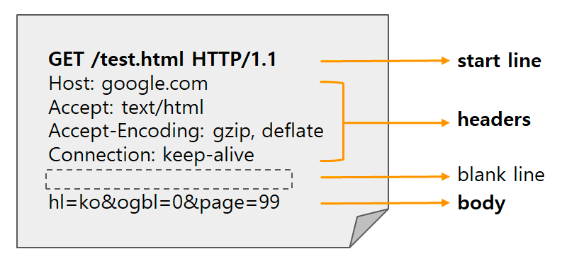
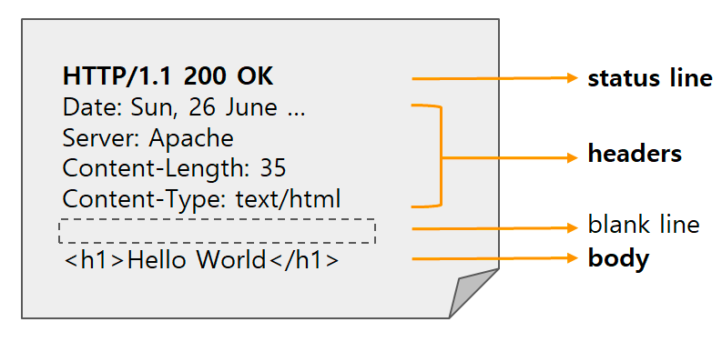

## 들어가며 

이 글은 [그림으로 배우는 Http & Network Basic](https://m.yes24.com/Goods/Detail/15894097)을 읽고 학습한 내용을 정리한 글입니다.

이번 글에서는 HTTP 프로토콜에 대해 작성하겠습니다.

## HTTP 프로토콜

HyperText Transfer Protocol, HTTP 프로토콜은 **HTML 문서와 같은 리소스를 가져올 수 있도록 하는 프로토콜**입니다.

기본적으로 리소스를 요청하는 **클라이언트**와 리소스를 응답하는 **서버**가 존재합니다.

클라이언트가 보내는 _Http Request_와 서버가 응답하는 _Http Response_ 를 통해 요청과 응답이 이루어집니다.

이 Http Request와 Http Response는 _Http 메시지_ 라고 합니다. 
HTTP 메시지는 ASCII로 인코딩된 동일한 구조의 텍스트입니다.

HTTP 메시지를 정해진 구조 내에서 자유롭게 확장할 수도 있습니다. 
(ex. 커스텀 헤더 추가)

### Http Request의 구조

Http Request는 아래와 같은 구조로 되어있습니다.

- Start Line
  - Method: [HTTP 메서드](https://developer.mozilla.org/ko/docs/Web/HTTP/Methods)가 작성됩니다. (GET, POST, PUT, DELETE 등)
  - Path: 리소스의 Path가 작성됩니다.
  - Version: 사용한 Http Protocol의 버전이 작성됩니다.

- [Headers](https://developer.mozilla.org/ko/docs/Web/HTTP/Headers)
  - 부가적인 정보를 포함합니다.
  - `:`를 구분자로 하여 헤더의 이름과 값이 작성됩니다.
    - `:` 뒤에 공백은 무시됩니다.

- Blank Line
  - `Headers`와 `Body`를 구분짓기 위한 한 줄의 공백입니다.

- Body
  - 리소스를 등록(`POST`)하거나 업데이트(`PUT`, `PATCH`)할 때 필요한 정보를 담는 공간입니다. (반드시 Body에만 담아야하는 것은 아닙니다.)
  - 경우에 따라 내용이 포함되지 않을 수 있습니다.

### Http Response의 구조

Http Response의 구조는 다음과 같습니다.

- Status Line
  - Version: 사용한 Http Protocol의 버전이 작성됩니다.
  - [Status Code](https://developer.mozilla.org/ko/docs/Web/HTTP/Status): 응답 결과를 숫자와 텍스트로 나타냅니다. 

- Headers
  - Http Request의 Headers와 동일합니다.

- Blank Line
  - Http Request의 Blank Line과 동일합니다.

- Body
  - 리소스에 대한 정보를 Body에 담아 응답한다.

## HTTP 프로토콜은 Stateless 하다

HTTP 프로토콜은 기본적으로 Http Request와 Http Response를 저장하지 않습니다. 
따라서 새로운 Http Reqeust가 보내질 때마다 이에 응하는 Http Response가 응답됩니다. 
같은 요청을 수만 번 보내면 응답이 수만번 온다는 의미입니다!

이러한 특징을 우리는 Stateless 하다고 부릅니다.

하지만 유저의 로그인 상태를 유지해야하는 요구 사항이 생겼고, 이에 따라 *Cookie* 를 이용해 해결합니다.

클라이언트가 로그인에 성공하면, 서버는 `Set-Cookie` 헤더에 로그인 상태를 유지할 수 있는 정보를 담아 응답합니다. 
응답을 받은 클라이언트는 정보를 가지고 있다가 다시 서버로 요청을 보낼 때 `Cookie` 헤더에 정보를 담아 요청합니다. 
요청을 받은 서버는 `Cookie` 헤더에 담긴 정보를 통해 어떤 사용자인지 확인하는 방식으로 진행됩니다.

## 지속 연결, 파이프라인

과거 HTTP/1.0 시절에는 요청과 응답 각각에 TCP 연결(3 way handshake)이 필요했습니다. 
이는 요청의 수가 많아질수록 오버헤드가 많이 발생한다는 문제점이 존재합니다.

이를 해결하기 위해 HTTP/1.1부터는 *지속 연결* 과 *파이프라인* 개념을 도입하여 더욱 효율적으로 통신을 할 수 있도록 합니다.

[`Connection` 헤더](https://developer.mozilla.org/ko/docs/Web/HTTP/Headers/Connection)를 통해 위 기술을 적용합니다.

### 지속 연결

지속 연결은 **어느 한 쪽이 명시적으로 연결을 종료하지 않는 이상, TCP 연결을 계속 유지**하는 개념입니다.

이를 통해 **한 번의 TCP Connection을 통해 많은 요청과 응답이 존재**할 수 있게 됩니다.

### 파이프라인

파이프라인은 Request를 보낸 후에 Response를 받기 전까지 기다린 뒤에야 다른 Request를 보내던 것을, Response를 기다리지 않고 바로 Request를 보낼 수 있도록 하는 개념입니다.  

이는 하나의 html 페이지에 이미지 파일이 10개가 있다고 가정했을 때, 얼마나 효율적인 방식으로 통신하는지 이해할 수 있습니다.

### Reference
> - [그림으로 배우는 Http & Network Basic](https://m.yes24.com/Goods/Detail/15894097)
> - [HTTP 개요 - MDN](https://developer.mozilla.org/ko/docs/Web/HTTP/Overview)