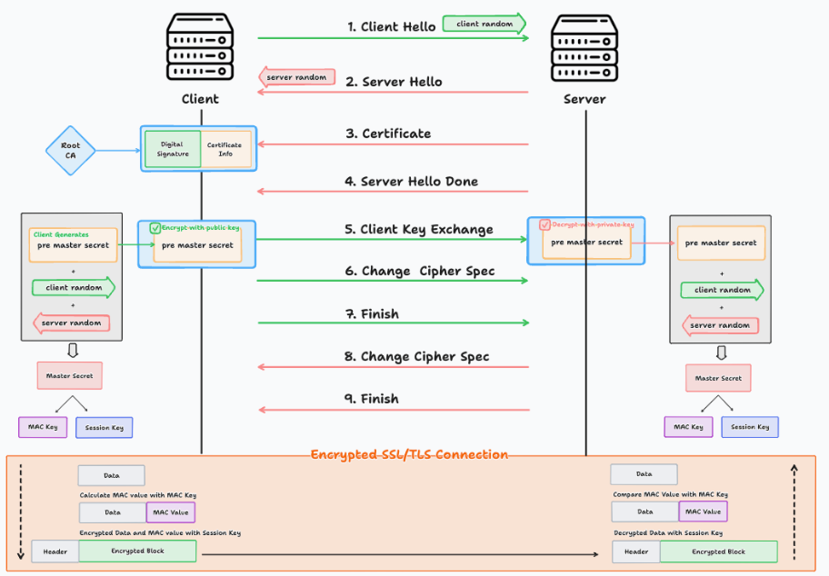

## 들어가며 

이 글은 [그림으로 배우는 Http & Network Basic](https://m.yes24.com/Goods/Detail/15894097)을 읽고 학습한 내용을 정리한 글입니다.

이번 장에서는 HTTPS에 대해 알아보겠습니다.

## HTTPS 등장 배경

지금까지 살펴본 HTTP 프로토콜은 클라이언트 혹은 서버가 단순히 문자열 데이터를 통해 요청하고 응답하는 구조였습니다.

하지만 클라이언트와 서버가 통신을 할 때 중간에 많은 호스트를 거치게 되는데, 이때 전송되는 패킷들을 수집하여 HTTP 메시지를 도청할 수 있게 됩니다. 
송신한 HTTP 메시지가 내가 원하는 호스트에게 잘 갔는지? 혹은 수신한 HTTP 메시지가 중간에 조작됐는지는 서버나 클라이언트 측에선 알 방법이 전혀 없습니다. 

따라서 이러한 문제를 해결하기 위해 HTTPS가 탄생하게 됐습니다.

## HTTPS

HTTPS는 HTTP 프로토콜에 SSL/TLS 프로토콜을 적용한 프로토콜입니다. 
단순 HTTP 프로토콜은 HTTP -> TCP -> IP 프로토콜 계층 순서로 통신하는 반면 
HTTPS 프로토콜은 HTTP -> SSL/TLS -> TCP -> IP 순서로 통신하는 구조입니다.

HTTPS 프로토콜을 통해 통신을 하면, <u>통신을 암호화하고</u> <u>통신 상대를 신뢰할 수 있게 되고</u> <u>HTTP 메시지가 중간에 조작되지 않음을 보장</u>할 수 있습니다.

## SSL/TLS

그렇다면 SSL/TLS는 무엇일까요?

> SSL은 구버전 TLS는 신버전입니다. 
> 하지만 일반적으로 SSL이라고 지칭합니다. 

SSL/TLS는 데이터를 암호화하는 통신 프로토콜입니다. 

통신을 암호화할 때는 <u>대칭키 방식 암호화</u>와 <u>비대칭키 방식 암호화</u>를 모두 적용합니다.

### 대칭키 방식 암호화

평문(PlainText)을 암호화 혹은 복호화할 때 <u>공통되는 키 하나로만 수행</u>하는 방식의 암호화입니다. 
이 공통되는 키를 *대칭키* 라고 부릅니다. 
서버나 클라이언트에서 암호화할 때 대칭키를 통해 암호화하고 암호화한 데이터와 대칭키를 함께 상대에게 전송하고, 수신한 대칭키를 이용해 복호화하는 과정을 수행하게 됩니다.

하지만 중간에 공통키가 유출되면 제 3자도 복호화할 수 있게 되는 문제가 있습니다.

### 비대칭키 방식 암호화

비대칭키 방식 암호화는 공개키와 개인키를 통해 수행됩니다.

대칭키 방식 암호화처럼 암호화할 땐 공개키로 수행을 합니다. 하지만 <u>복호화는 개인키로만 가능</u>한 구조입니다. 
공개키가 아무리 유출되더라도 개인키만 유출되지 않으면 암호화한 데이터를 지킬 수 있습니다. 
따라서 대칭키 방식 암호화의 문제를 해결할 수 있습니다.

## SSL/TLS 통신 과정

위 사진은 SSL 핸드셰이크 과정입니다.

아까 위에서 SSL 프로토콜을 이용하면 통신을 암호화할 수 있고, 상대를 신뢰할 수 있고, 메시지가 중간에 조작되지 않았음을 보장할 수 있다고 했습니다. 
또, <u>대칭키 방식과 비대칭키 방식을 모두 사용</u>한다고 했습니다.

이를 좀 더 자세히 알아보겠습니다.

### 통신 암호화

SSL 프로토콜은 어떤 방식으로 대칭키 방식과 비대칭키 방식을 모두 사용하고 있을까요? 
동작 순서는 다음과 같습니다.

1. 클라이언트가 서버로 통신 요청을 보냅니다.
2. 서버는 클라이언트에게 공개키를 전달합니다.
3. 클라이언트는 자신의 대칭키를 공개키를 통해 암호화하여 서버로 전송합니다.
4. 수신한 데이터를 서버가 가지는 개인키를 통해 복호화하여 대칭키를 획득합니다.
5. 이후로는 대칭키를 통해 암호화하여 전송함으로써 빠른 통신을 수행합니다.

두 방식을 함께 적용하는 이유는, 매번 안전한 비대칭키 방식 암호화를 사용하면 될 것 같지만 사실 대칭키 방식보다 속도가 느리기 때문에 각각의 장점만을 살리는 방식을 채택했기 때문입니다.

### 상대를 신뢰하는 방법

만약 위 1번 과정에서 클라이언트가 보낸 통신 요청이 공격자에 의해 조작되어 신뢰할 수 없는 사이트의 공캐기가 오게 되는 경우는 어떻게 막을 수 있을까요? 
바로 <u>인증 기관</u>과 그 기관이 발행하는 <u>공개키 인증서</u>를 통해 확인할 수 있습니다. 
바로 이 공개키 인증서를 통해 클라이언트가 수신한 공개키가 어떤 사이트로부터 받은 공개키인지 식별할 수 있게 되는 것입니다.

공개키 증명서는 다음과 같은 순서로 발급하게 됩니다. 

1. 발급받으려는 서버는 인증 기관에게 서버 정보와 서버 공개키를 전송합니다.
2. 인증 기관은 받은 데이터를 먼저 검증을 한 뒤, 검증에 성공하면 인증 기관의 개인키로 서명합니다.
3. 그 결과 만들어진 공개키 인증서는 서버로 전송됩니다.

그리고 이 공개키 인증서를 받은 클라이언트는 미리 브라우저에 내장해놓은 인증 기관의 공개키를 통해 인증서가 정말 인증 기관이 인증한 것인지 식별할 수 있게 됩니다.

### 조작이 되지 않았음을 보장하는 법

클라이언트는 암호화에 사용할 대칭키인 _Pre Master Secret_ 을 만듭니다. 
여기에 _MAC Key_ 와 _Session Key_ 가 포함됩니다.

클라이언트가 서버의 공개키를 통해 Pre Master Secret을 암호화하여 서버로 전송하면 서버는 비밀키를 통해 Pre Master Secret을 획득하게 됩니다. 
그리고 이전에 주고 받았던 random 값을 통해 _Master Secret_을 생성하게 되고, 이를 통해 Session 키와 MAC 키를 생성합니다. 
이제부터는 이 대칭키를 사용하자고 상호 간의 확인을 합니다.

이후 클라이언트는 패킷을 보낼 떄 MAC Key와 Session Key를 통해 암호화를 하고, 데이터를 수신한 서버는 우선 대칭키로 복호화를 한다. 
그 결과로 만들어진 Mac Key와 Session Key를 이전에 서버에 저장해놓은 MAC Key와 Session Key를 비교하여 데이터가 중간에 조작되진 않았는지 검증하는 구조이다.

### Reference
> - [그림으로 배우는 Http & Network Basic](https://m.yes24.com/Goods/Detail/15894097)
> - [테코톡 - 다니의 HTTPS](https://youtu.be/wPdH7lJ8jf0?feature=shared)
> - [테코톡 - 헤나의 HTTPS](https://youtu.be/KpyzbEFYE_E?feature=shared)
> - [HTTPS 원리 이해하기](https://brunch.co.kr/@growthminder/79)