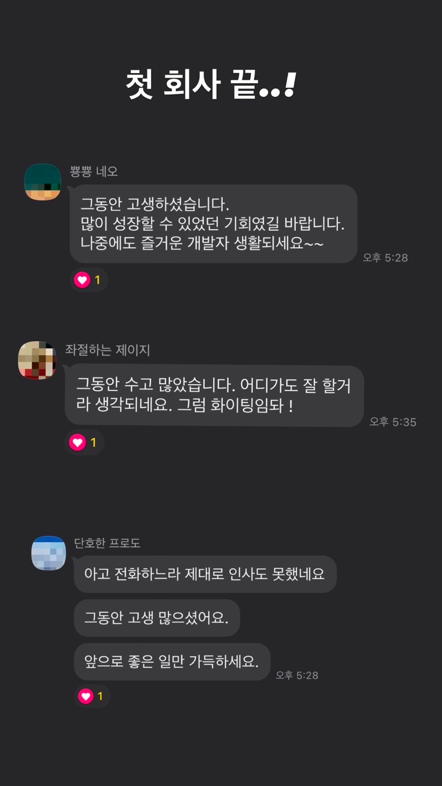

드디어 2학기 현장실습이 끝이 났다.
2022년 08월 29일부터 12월 15일까지, 총 75일 간의 내 첫 사회 생활이 끝이 났다.

끝이 난 지 일주일이 지났지만 이제서야 작성하는 이유는, 그동안 SSAFY  면접과 우아한테크코스 프리코스 최종 코딩테스트를 마무리하고 쉬기 바빠 이제서야 작성한다. 😅

약 3-4개월 간의 치열했던 현장 실습을 회고해보자.

## 웹이 아닌 앱 부서 배치

내 첫 부서는 다름아닌 **앱 개발 부서**였다. 
이전 포스팅에서도 작성했지만, 전혀 예상치도 못한 부서로 배치가 되었다. 
게다가 java를 이용해서 안드로이드 개발하는 것이면 그래도 괜찮은데, 웬 iOS 개발을 한다고 했다.

덕분에 난생 처음으로 맥을 만져보았지만, 설레는 꿈과 희망으로 첫 출근한 내 기대가 산산히 부셔지는 순간이었다. 
때문에 한 달동안 swift를 공부했다. java처럼 블로그들에 정보들이 많이 활성화되지 않아서, 공식 홈페이지를 항상 모니터 한 켠에 켜놓고, 정말 많은 검색을 통해 꾸역꾸역 공부했다.

실제로 공식 홈페이지를 통해 swift의 기본을 가벼운 마음으로 이틀간 공부했고, 그 다음부터는 바로 프로젝트를 진행했다. ([내 프로젝트 Repository](https://github.com/kdkdhoho/Swift)) 

사흘 째 되는 날, "이게 맞나?", "이거 하려고 정말 많은 고민과 스트레스를 받으며 서울까지 왔나?" 싶었다. 회의감도 들었다. 그래서 현장 실습을 포기하려고 했다. 포기로 인해 학교 휴학이나 자퇴를 해야 한다면 할 각오도 있었다. 그 정도로 싫었다. 
이 때문에 퇴근 후 집에 와 밥을 먹을 때까지 멍을 때리며 정말 많은 고민과 생각을 했다. 
그런데 막상 밥먹으면서 혼잣말로 생각을 정리하고 나니, 왠지 모를 독기와 끈기가 생겼다.

돈보다 **경험**을 하기 위해 힘든 결정을 했고, 그 경험이 내가 원하는 것이 아니더라도 앞으로 있을 개발자 인생에서 피가 되고 살이 될 것이다고 판단했다. 그래서 이 악물고 해보려고 했다.

그렇게 큰 고비를 넘기고, 연구소 사람들과 가까워졌다. swift도 할만해졌다. 
이때만해도 정말 많은 것을 배웠다. 특히, 팀장님 덕분에 정말 많은 것을 느끼고 배울 수 있었다.

특히 **요구사항에 대한 정확한 이해와 정확한 커뮤니케이션**을 몸소 겪었다. 
한 번은 팀장님이 요구하신 사항을 다르게 이해하여 괜히 더 힘든 방향으로 구현을 했다. 이때 팀장님이, 구현하기 전에 정확한 요구사항 파악이 개발자에게 있어서 중요한 역량이라고 말씀해주셨다. 또한 자신이 이해한 것에 확신이 서지 않다면 되물어볼 수 있는 용기와 커뮤니케이션 능력 또한 중요하다고 말씀해주셨다.

사실 다양한 매체를 통해 위 내용들이 중요하다고는 알고 있었다. 하지만 직접 몸소 겪어보니, 개발자는 개발을 잘하는 것은 기본 역량이며 다른 사람과 함께 일을 하는 능력 또한 중요한 요소라고 깨달았다.

또 **동기와 비동기의 중요성**을 느꼈다. 
여태까지 공부하고 프로젝트 한 것들은 동기, 비동기를 신경쓰며 개발하지 않았다. 하지만 앱 개발을 하려다보니, 동기 비동기가 정말 까다롭고 신경을 많이 써야하는 것이라고 느꼈다. 
내 인사이트가 확장된 순간이었다.

## 마침내 웹으로

어느때와 마찬가지로 점심을 먹고 연구소 분들과 카페를 가는 길에, 소장님께서 "아직도 웹 하고 싶냐?"는 질문을 받았다. 솔직하게 그렇다고 말했다. 실제로 앱보다 웹이 내 적성에 맞고 더 재밌다.

그런데 뭔가 느낌이 쎄했다. 갑자기 이런 걸 물어보실 분이 아닌데, 나한테 물어보신다는건 웹으로 갈 기회가 생겼다는 말처럼 들렸다. 
아니나 다를까, 실제로 웹에 TO가 생겼고 내가 가고 싶다면 부서 이동도 가능하다고 하셨다. 
한 달간 가까워진 연구소 분들을 두고 본사로 가야한다는 생각이 조금 아쉬웠지만, 웹이 하고 싶다고 했다.

그렇게 약 이주 간의 시간이 흐르고 웹 부서로 자리를 이동했다.

그곳에서는 회사가 운영하는 서비스의 기능을 파악하고, 레거시 코드를 파악 및 분석하고, 마침내 몇 가지 기능을 직접 추가하는 업무가 주어졌다.

마침내 내가 정말 하고 싶었던 분야를 하게 되었기에, 정말 괜히 신이 나고 의지가 더 생겼다. 
그래서 남은 기간, 정말 열심히 했다고 자부할 수 있다.

그곳에서는 느낀 것들이 더더욱 많다.

1. 보안에 대한 중요성
2. DB 서버의 다중화 및 DB 크기의 놀라움
3. 약어를 굉장히 많이 사용한다
4. 개발자가 무엇을 하는 사람인가?
5. 타인의 코드를 보고 분석하는 경험
6. 기본이 정말 중요하다
7. 클린 코드의 중요성
8. 기존 프로젝트를 분석하여, 흐름을 코드 상으로도 파악하고, 기존에 있는 프로그램을 해치지 않으며 새로운 기능을 추가하는 경험을 해본 것

모두 이야기하고 싶지만, 6, 7, 8번을 이야기 하고자 한다. 
이번에 실무에서 프로젝트를 진행하면서, 기본이 정말 중요하다고 느꼈다. 
실제 웹 부서 팀장님이 기본을 항상 중요시하며 유행을 쫓지말고 기본을 탄탄히 하라고 말씀해주셨다. 
그래서 바로 자바의 정석 책을 구매하여, 퇴근 후 자바의 정석을 짬짬히 공부하였다.

실제로 타인의 코드를 보면서 해당 코드를 해치지 않고 새로운 기능만을 추가하는 작업은 이번이 처음이다. 
게다가 팀장님이 굉장히 쉽지 않은 작업이라고 해주셨다. 하지만 난 이번에 그것을 경험하면서 한 단계 성장한 기분이 들었다. 
그런데, 회사의 코드는 옛날 스타일대로 작성되어 있었다. 또한 메서드 하나에 라인이 50줄이 되는 메서드도 있었고, Repository에서 비즈니스 로직을 처리하는 부분도 있었다. 그리고 변수명과 함수명이 약어로 정말 많이 되어 있어서 코드를 처음에 이해하는 것도 너무 힘들었고, 술술 읽히지도 않았다. 
지금 생각하면 꽤나 단순한 기능들에도 불구하고 전체 코드를 이해하는 데에 일주일이 넘게 걸렸다.

이때 느꼈다. 클린 코드와 클린 아키텍쳐가 이래서 정말 중요하구나.

개발은 혼자서 절대 이루어질 수 없다. 내가 짠 코드를 타인이 읽어야 하고, 타인이 짠 코드를 내가 읽어야 한다. 
이때 코드가 지저분하다면 개발이 정말 힘들 것이다. 
또 서비스와 코드는 항상 발전한다. 새로운 기능이 추가되며, 새로운 구조가 적용될 수 있다. 
이때, 아키텍쳐가 정교하고 깔끔하다면, 다른 사람이 봤을 때 꽤나 쉽게 기능을 구현할 수 있을 것이다.

사실, 현장실습을 진행하면서 우테코 프리코스도 병행했다. 
우테코에서도 위 내용들의 중요성을 간접적으로 그리고 단순하게 알려주려는 노력이 보였다.

프리코스와 위 경험들을 동시에 경험하다보니, 클린 코드와 클린 아키텍쳐의 중요성과 필요성을 정말 잘 이해할 수 있는 소중한 시간이었다고 생각한다.

## 마무리하며

그동안 정말 많은 것을 얻을 수 있는 시간이었다.
학교에 남아 수업을 들으며 공부를 했다면 결코 얻을 수 없던 것들이었다.

이번 현장실습을 통해 앞으로 내 개발자 커리어에 대한 로드맵을 그리게 될 수 있을 것 같고, 개발 공부의 방향성을 일깨울 수 있었다.

소중한 경험을 할 수 있게 해주신 대표님과 이사님들께 감사하다는 말씀을 드리며, 마무리한다.

## 각 부서에서 배운 것들

### iOS

- **요구사항에 대한 정확한 이해와 정확한 커뮤니케이션**
  > 한 번은 viewAccssoryView에 버튼 달아서 버튼 누르면 키패드 내려가도록 요구
  > 하지만 난 텍스트필드와 버튼이 같이 올라가도록 구현. 당시 내가 원하는 방법을 아무리 찾아도 나오지 않아 정말 힘들었던 경험이 있음. 그날 사수분이 피드백 해주시며 개발자는 커뮤니케이션이 중요하다. 요구사항이 있으면 그에 따른 정확한 니즈 파악이 중요하다. 기껏 만들어 줬더니 맘에 안들면 모두 폐기해야 한다. 따라서 요청이 들어올 때 개발자만 알고 있는 개발 관련 지식을 바탕으로 요청자와 많은 대화를 통해 상호간에 좀 더 합리적이고 이상적인 방향이 되도록 많은 의사소통이 중요하다고, 그래서 그 후로 의사소통의 중요성을 몸소 느끼고, 많이 하려고 노력했다. 실제로 그 다음 날 사수가 코로나에 걸렸는데 전에 지시하셨던 업무를 어떤 식으로 진행해야 할 지 확신이 서지 않았고 전 날 해주신 말씀이 바로 생각나서 바로 전화로 물어보며 진행 방향을 새롭게 조율했다.

- 언어를 몰라도 구글링으로 원하는 기능을 개발은 할 수 있다. 하지만 개발하는 속도나 요구사항이 변경되었을 때 수정하는 능력은 떨어진다. 그래서 기본이 되어 있으면 개발 속도, 유지보수 속도가 매우 빨라짐
- 공식문서의 중요성
- 한 분야만 안다고 진짜 고수가 아니다
- **동기 / 비동기의 중요성 → 서버 단에서는 크게 못느끼는데 클라이언트 단에서 통신하고 화면에 결과를 뿌려줄 때에는 동기 비동기의 중요성이 대두된다.**
- 인턴 or 신입한테는 잘할 것이라고 기대안한다. 맡긴 일을 정확하게만 하자.
- 기능은 구현하는 것은 쉽다. 하지만 개발하는 것은 어렵다. → 구현하고자는 기술에 대한 기본적인 원리, 이치 등을 정확하게 이해하고 있어야 트래픽이 거대해져도 큰 문제없이, 문제가 있더라도 쉽게 문제를 해결 할 힘이 생긴다.

### WEB

- 보안을 매우 중요하게 생각한다. (ex. DB url, 사용자 phone 번호 암호화)
- DB 서버도 한 대가 아니고, 테이블도 무지하게 많고, 데이터도 어마어마하게 많다.
- 약어를 굉장히 많이 흔하게 사용. 근데 별로 안좋은듯하다.
- 개발자가 무엇을 하는 사람인지 깨달음 → 단순히 Spring 기술을 잘 사용하는 것에 그치는 것이 아닌, java, mysql, CS, OS 등 **기본 지식**들을 바탕으로 **문제를 해결하는 사람** → 단순히 새로운 기능을 구현하고 코드를 짜는 것만이 개발자가 아니라, 주어진 문제를 어떻게 좀 더 최적의 비용으로 해결할 수 있을지에 대한 고민을 하는 사람
- 타인이 짠 소스코드를 보는 연습을 많이 했다
    - 내가 소스코드를 짠 사람이라 생각하고 이해
    - 코드를 그대로 작성하며 위에서부터 한 줄 한 줄 이해
    - 길이가 짧다면 손코딩
    - 결국, **반복**해서 읽다보면 코드의 패턴이 눈에 들어옴
    - Entity → DB → Repo → Service → Controller 순으로 보는 것이 도움이 되었음
- 기본이 중요하다. Java나 DB, Spring, JPA 같은. 하지만 아직 많이 부족하다.
- **기존 프로젝트를 분석하여, 흐름을 코드 상으로도 파악하고, 기존에 있는 프로그램을 해치지 않으며 새로운 기능을 추가하는 경험을 해본 것이 가장 큰 경험이지 않을까 싶다.**