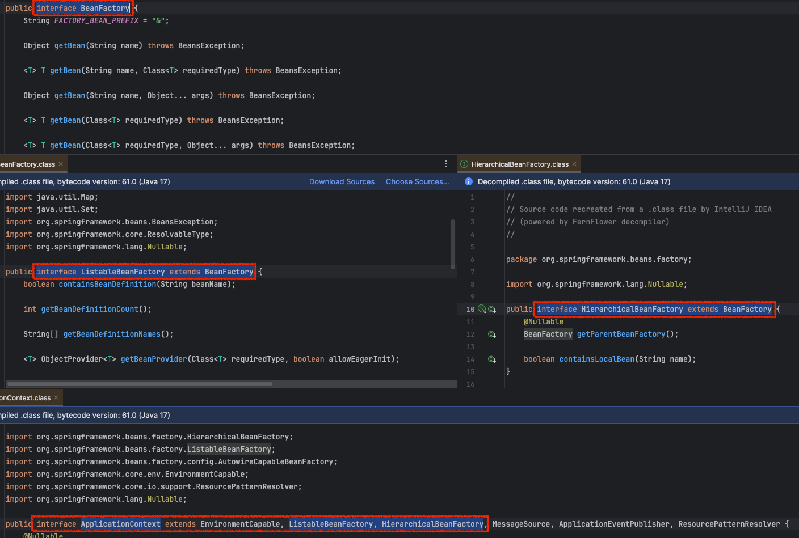
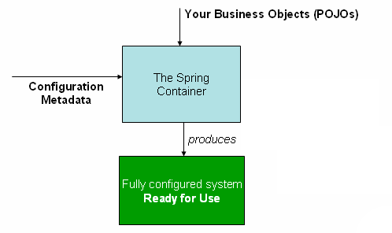
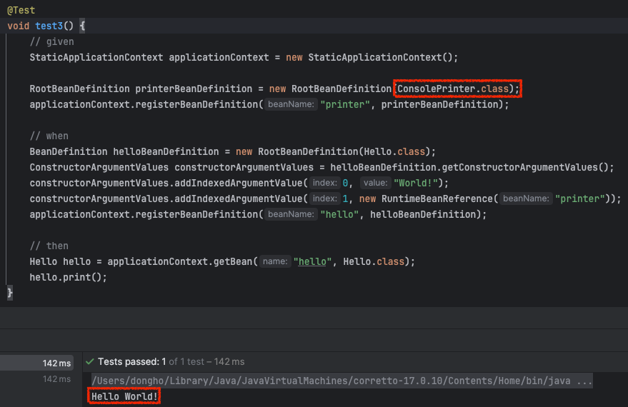

## 들어가며

이번에는 스프링 애플리케이션의 핵심인 <u>스프링 컨테이너</u>와 스프링의 핵심 프로그래밍 모델 중 하나인 <u>IoC/DI</u>에 대해 학습한 내용을 정리해보겠습니다.

참고로 [토비의 스프링 3.1](https://m.yes24.com/Goods/Detail/75738556)을 통해 학습을 진행했습니다.

## 1. IoC 컨테이너: Bean Factory와 Application Context

스프링 애플리케이션에는 스프링 컨테이너가 존재합니다.<br>
스프링 컨테이너는 객체 생성, 의존성 주입(DI), 객체 소멸을 개발자 대신 수행합니다.<br>
이 때문에 제어의 역전, Inversion of Control. 즉, **스프링 컨테이너를 IoC 컨테이너라고도 부릅니다.**<br>
또는 경우에 따라 **Bean Factory**나 **Application Context** 라고 부르기도 합니다.

하지만 Bean Factory와 Application Context는 느낌이 약간 다릅니다.<br>
객체의 생성과 소멸, DI를 수행하는 관점에서는 Bean Factory 라고 할 수 있지만, 사실 스프링 컨테이너는 더 많은 작업을 수행하기 때문입니다.<br>
이러한 작업들을 모두 포함해서 스프링 컨테이너를 봤을 땐 Application Context 라고 부르는 것이 합당할 수 있겠습니다.<br>
따라서 일반적으로 스프링 컨테이너를 **Application Context**라고 부릅니다.

실제로 아래 사진을 보시면 `ApplicationContext`가 `BeanFactory`를 상속받아 기능을 확장하고 있는 것을 확인할 수 있습니다.<br>
(클릭하면 크게 볼 수 있습니다!) 



> #### 요약<br>
> 1. 스프링 애플리케이션에는 스프링 컨테이너가 존재한다.<br>
> 2. 스프링 컨테이너는 객체의 생명주기와 의존성 주입을 수행한다.<br>
> 3. 경우에 따라 스프링 컨테이너는 IoC 컨테이너, Bean Factory, Application Context 라고 불린다.<br>
> 4. 하지만 BeanFactory와 ApplicationContext의 역할을 따졌을 때, 일반적으로 Application Context 로 불린다.

## 2. IoC 컨테이너의 동작원리

그럼 IoC 컨테이너는 어떻게 객체를 생성하고 소멸하며, 필요한 의존성을 주입하게 되는 것일까요?<br>
바로 <u>POJO 클래스와 설정 메타정보를 이용하기 때문입니다.</u><br>

### POJO 클래스

POJO(Plain Old Java Object)는 <u>Java로만 만들어진 순수 클래스 파일입니다.</u><br>
바로 이 POJO 클래스가 개발자가 작성한 코드가 되는 것이죠.<br>
Repository 객체가 될 수 있고, Service 객체가 될 수 있으며, 순수한 Domain 객체가 될 수 있습니다.

#### 설정 메타정보

설정 메타정보는 <u>스프링 애플리케이션에게 런타임에 사용할 POJO 객체임을 선언하고, 이로 인해 IoC 컨테이너가 제어할 수 있도록 알려주는 메타정보입니다.</u><br>
즉, 스프링에게 Bean으로 등록할 객체를 알리는 방법입니다.<br>
(여기서 Bean이란, 스프링 컨테이너에 생성되어 관리되는 객체를 일컫는 용어입니다.)

결국 <u>스프링 컨테이너는 POJO와 설정 메타정보를 가지고 IoC/DI 작업을 수행하는 것입니다.</u>



설정 메타정보는 `BeanDefinition` 으로 만들어진 순수한 추상 정보이고, 스프링 컨테이너는 바로 이 `BeanDefinition`으로 만들어진 객체를 사용해 IoC/DI 작업을 수행하게 되는 것입니다.<br>
따라서 제공하려는 메타정보를 읽어서 `BeanDefinition` 객체로 만들어 등록하는 `BeanDefinitionReader`만 있다면 어떤 방법으로든 모두 가능합니다.<br>
주로 XML, 어노테이션 등과 같은 방식으로 메타정보를 나타냅니다.<br>

<u>결과적으로 스프링 컨테이너는 각 객체에 대한 정보를 담은 설정 메타정보를 읽고, 이를 활용해 IoC/DI 작업을 수행하게 됩니다.</u><br>
<u>이 작업들을 통해 만들어진 객체들이 모여 하나의 애플리케이션을 구성하고 동작하게 되는 것입니다.</u>

> #### 요약<br>
> 1. IoC 컨테이너는 POJO 클래스와 설정 메타정보를 이용해 IoC/DI 작업을 수행한다.<br>
> 2. POJO 클래스는 개발자가 작성한 순수 Java 코드이다.<br>
> 3. 설정 메타정보는 Bean으로 등록할 객체임을 스프링에게 알리는 방법이다.<br>
> 4. IoC 컨테이너는 메타정보를 통해 객체들을 생성하며 DI 작업을 수행하고 마침내 스프링 애플리케이션이 동작하게 된다.<br>

### 직접 IoC 컨테이너 만들어보기

이제는 직접 코드를 통해 IoC 컨테이너를 만들어보고 눈으로 확인해보겠습니다.<br>
다시 한번 상기시키자면 IoC 컨테이너는 **POJO**와 **설정 메타정보**가 필요합니다.

우선 POJO 만으로 IoC 컨테이너에 Bean으로 등록해보겠습니다.

```java
class Hello {

    private String name;
    private Printer printer;

    public String sayHello() {
        return "Hello " + name;
    }

    public void print() {
        printer.print(sayHello());
    }

    public void setName(String name) {
        this.name = name;
    }

    public void setPrinter(Printer printer) {
        this.printer = printer;
    }
}

interface Printer {
    
    void print(String message);
}

class StringPrinter implements Printer {

    private final StringBuffer buffer = new StringBuffer();

    @Override
    public void print(String message) {
        buffer.append(message);
    }

    public String toString() {
        return buffer.toString();
    }
}

class ConsolePrinter implements Printer {

    @Override
    public void print(String message) {
        System.out.println(message);
    }
}
```


테스트 수행 결과, 개발자가 따로 `Hello` 객체를 만들어주지 않아도 IoC 컨테이너에 객체로 만들어져있는 것을 확인할 수 있습니다.<br>
이제는 직접 `BeanDefinition`을 활용해 설정 메타정보를 만들고 `Printer`에 대한 의존성 주입까지 해보겠습니다.<br>
> 의존성 주입을 받는 방법으로는 setter 주입, 필드 주입, 생성자 주입이 있습니다.<br>
> 본 글에서는 편의를 위해 setter 주입을 사용합니다.

```java
@Test
void test2() {
    // given
    StaticApplicationContext applicationContext = new StaticApplicationContext();

    RootBeanDefinition printerBeanDefinition = new RootBeanDefinition(StringPrinter.class);
    applicationContext.registerBeanDefinition("printer", stringPrinterBeanDefinition);

    // when
    BeanDefinition helloBeanDefinition = new RootBeanDefinition(Hello.class);
    MutablePropertyValues propertyValues = helloBeanDefinition.getPropertyValues();
    propertyValues.addPropertyValue("name", "World!");
    propertyValues.addPropertyValue("printer", new RuntimeBeanReference("printer"));
    applicationContext.registerBeanDefinition("hello", helloBeanDefinition);

    // then
    Hello hello = applicationContext.getBean("hello", Hello.class);
    hello.print();

    assertThat(applicationContext.getBean("printer").toString()).isEqualTo("Hello World!");
}
```

위 테스트 코드에서는 `StringPrinter`를 IoC 컨테이너에 Bean으로 등록하고 `Hello` 객체에 `addPropertyValue` 메서드를 통해 주입해주었습니다.<br>
만약 생성자 주입이라면 아래와 같이 코드를 작성하면 됩니다.

```java
BeanDefinition helloBeanDefinition = new RootBeanDefinition(Hello.class);
ConstructorArgumentValues constructorArgumentValues = helloBeanDefinition.getConstructorArgumentValues();
constructorArgumentValues.addIndexedArgumentValue(0, "World!");
constructorArgumentValues.addIndexedArgumentValue(1, new RuntimeBeanReference("printer"));
```

이번에는 코드 한 줄만 바꿔 `ConsolePrinter`가 주입되도록 수정해보겠습니다.



테스트를 돌려보면 실제로 `Hello World!` 가 콘솔창에 출력되는 것을 확인할 수 있습니다.

마지막으로 IoC 컨테이너에서 Bean을 삭제하는 것도 테스트해보겠습니다.

```java
@Test
void test4() {
    // given
    StaticApplicationContext applicationContext = new StaticApplicationContext();

    RootBeanDefinition printerBeanDefinition = new RootBeanDefinition(ConsolePrinter.class);
    applicationContext.registerBeanDefinition("printer", printerBeanDefinition);

    // when
    applicationContext.removeBeanDefinition("printer");

    // then
    assertThatThrownBy(() -> applicationContext.getBean("printer"))
            .isInstanceOf(NoSuchBeanDefinitionException.class);
}
```


Bean 삭제 또한 가능한 것을 확인할 수 있습니다.

지금까지 POJO와 `BeanDefinition`을 이용한 설정 메타정보를 통해 IoC 컨테이너를 만들어보았습니다.<br>
코드로 직접 테스트해보니 객체 생성, 의존성 주입, 객체 삭제까지 객체의 모든 생명 주기를 관리하는 것을 확인할 수 있었다.

## 마치며

스프링 컨테이너와 IoC/DI에 대해 어느정도 알고 있다고 생각했지만 막상 다시 공부해보니 새로운 느낌이었습니다.<br>
게다가 테스트 코드를 통해 직접 눈으로 확인해보니 조금 더 잘 와닿는 것 같습니다.

다음으로는 IoC 컨테이너의 종류 중 하나인 `WebApplicationContext`에 대해 알아보겠습니다.