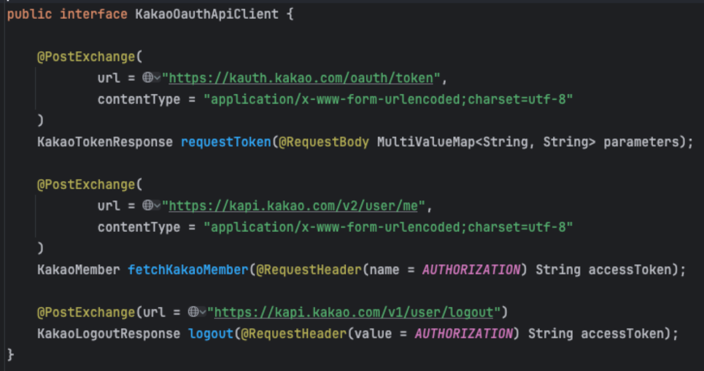
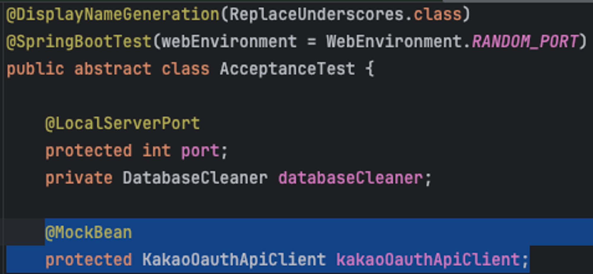
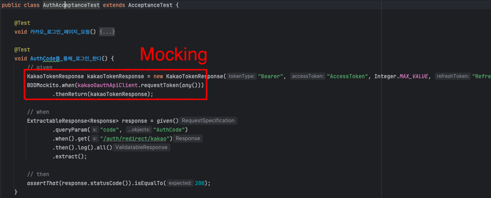
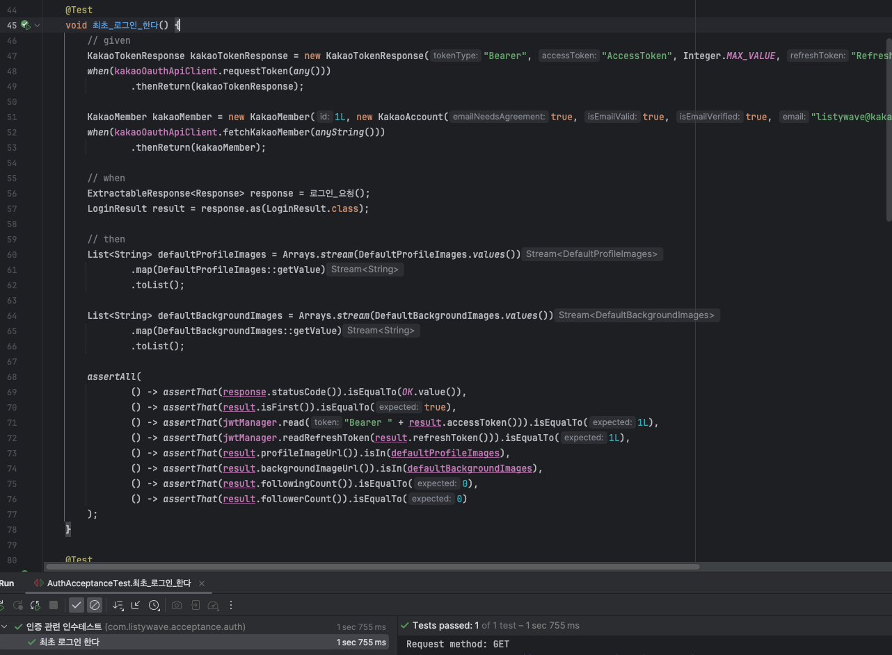
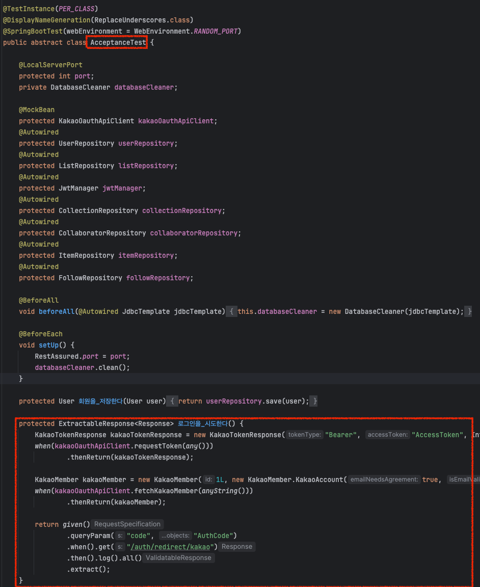

이번 글에서는 Spring Boot에서 Rest Assured를 이용해 인수 테스트를 하는 과정에서 OAuth를 처리하는 방법을 고민한 흔적과 해결 방법을 기록하려고 합니다.

비단 OAuth 뿐만 아니라 다른 외부 REST API를 호출하는 부분을 해결하는 데에도 도움이 될 것으로 기대합니다.

> 개발 환경은 Spring Boot 3.2.2, Rest Assured 5.3.2를 사용합니다.

## 개요

현재 ListyWave가 제공하는 모든 기능들에 인수 테스트를 작성하려고 합니다.

하지만 서비스는 자체적인 로그인 기능을 제공하지 않고 <u>사용자 경험 개선</u>과 <u>서비스 신뢰도 향상</u>을 위해 카카오 OAuth를 채택하여 사용 중입니다.

이는 다른 의미로, 회원과 관련된 기능들을 인수 테스트하기 위해서는 카카오 OAuth 로그인이 선행되어야 한다는 뜻입니다. 하지만 Rest Assured 만으로는 카카오 로그인을 수행하지 못합니다.

## 문제 파악하기

왜 수행하지 못할까요?

현재 ListyWave에서 수행 중인 로그인 요청부터 처리까지의 Flow는 대략 다음과 같습니다.

1. 사용자가 카카오로 로그인하기 버튼 클릭 -> 프론트엔드 서버에서 백엔드 서버로 로그인 URL 요청 -> 사용자는 카카오 로그인 페이지에서 로그인
2. 카카오 로그인에 성공하면 Redirect URI(프론트엔드 서버)로 AuthCode 전송 -> 프론트엔드는 AuthCode를 백엔드로 전송 -> AuthCode로 Kakao Authorization Server에 액세스 토큰 발급 요청 -> 발급받은 액세스 토큰으로 Kakao Resources Server에 회원 정보 요청 -> 받은 회원 정보로 로그인 비즈니스 로직 처리

위 flow는 이해가 잘 가지 않을 수 있기에 핵심만 말씀드리면 <u>로그인이 선행되려면 AuthCode가 필요하고</u> 
<u>AuthCode는 카카오 로그인 페이지에서 로그인 해야 하기 때문입니다!</u>

추가로, 만~약에 RestAssured 만으로도 카카오 로그인에 성공해서 AuthCode를 받아왔다고 해도 OAuth는 결국 <u>외부 API를 호출하는 것과 같습니다.</u> 
이는 다시 말해, 테스트 코드로 인해 사이드 이펙트가 발생할 가능성이 있다는 의미와 같습니다. 

따라서 <u>테스트 코드는 AuthCode로부터 자유로워야 하고, 실제 REST API를 호출하지 않아야 합니다.</u>

## 문제 해결하기

우선 OAuth 로그인에 사용되는 객체들을 천천히 살펴보았습니다.

- 요청과 응답을 처리하는 AuthController
- 로그인 비즈니스 로직을 처리하는 AuthService
- Kakao Authorization Server와 Resources Server에 REST API 요청을 보내기 위해 필요한 파라미터 값을 조립하는 KakaoOauthClient
- 실제 REST API를 호출하는 KakaoOauthApiClient

일단 <u>문제 해결의 핵심은 실제 REST API를 호출하는 `KakaoOauthApiClient`</u>가 될 것으로 생각됩니다.

AuthCode를 파라미터로 받아 Kakao Authorization Server에 액세스 토큰 발급 요청을 보내며, 
발급받은 액세스 토큰을 통해 Kakao Resource Server에 회원 정보를 요청하기 때문입니다.

어쩌면 이 녀석만 해결하면 모든 문제가 술술 풀릴 것 같은 생각이 듭니다.

따라서 저는 Mocking을 통해 해당 객체를 [테스트 더블](https://tecoble.techcourse.co.kr/post/2020-09-19-what-is-test-double/)을 시도해보았습니다. 
Stubing으로도 해결할 수 있겠지만 Mocking이 더 유연하고 간편하다고 판단했기 때문입니다. 
또한 인수 테스트 특성 상, Test Context에 모든 Bean을 Load하기에 `@MockBean`을 통해 쉽게 Mocking 할 수 있다고 판단했기 때문입니다.

## 해결 과정

우선 모든 인수 테스트가 상속받는 `AcceptanceTest`에 `KakaoOauthApiClient` 객체를 `@MockBean`으로 선언하여 등록합니다.

그리고 테스트 코드에서 Mocking을 해줍니다.

디버깅 모드로 하나씩 따라가보면 아래 사진처럼 만든 값들이 그대로 나오는 것을 확인할 수 있습니다.

## 결과

테스트가 통과하는 것을 확인할 수 있습니다.

이제 이를 `AcceptanceTest` 객체에 메서드로 만들어 다른 도메인에서 재사용할 수도 있습니다.

또한, 요구사항 중에 최초로 로그인 한 회원의 여부를 `LoginResult#isFirst` 필드에 boolean 타입으로 담아 반환하고 있는데요. 
해당 로직을 테스트해도 제대로 응답하고 있음을 확인할 수 있습니다.

## 마치며

이렇게 Spring Boot에서 Rest Assured로 인수 테스트하는 과정에서 OAuth와 같이 REST API를 호출하는 로직을 처리하는 방법에 대해 알아보았습니다.

피드백 및 더 좋은 방법 제시는 언제든지 환영입니다. 
긴 글 읽어주셔서 감사합니다.