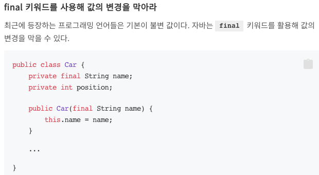
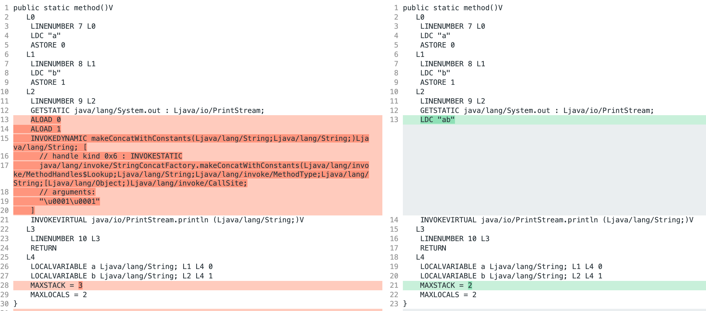
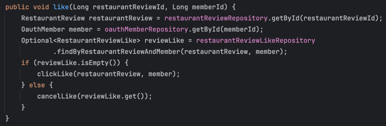
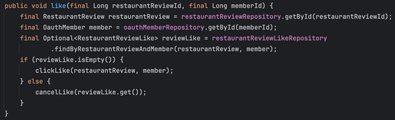

## 왜 값의 변경을 막아야 할까?



자동차 경주 피드백 중 하나이다.

왜 이런 피드백이 있는지 알아보자

## final 키워드를 붙이면 좋은 점

### 1. 변경 가능성을 최소화한다.

즉, 코드의 **예측이 쉬워진다**.

사실 알잘딱깔센으로 객체나 값의 변경은 정말 필요한 곳에서 필요한 만큼 수행해야 한다.

하지만 final 키워드를 붙이지 않으면 분명한 것은 변경 가능성이 존재하는 것이고, 모종의 이유로 사이드 이펙트 발생으로 버그를 낳을 수 있다.

그럼 퇴근이 늦어질 것이다.

### 2. Thread-Safe한 값이 된다.

동시성 이슈이 발생하는 과정에는 반드시 값이 **변경**하는 과정이 존재한다.

그런데 애초에 값을 변경하지 못하게 한다면 동시성 이슈는 일어날 일이 없다.

그럼 퇴근이 빨라질 것이다.

> **유의해야 할 점** ❗️ <br>
> `StringBuilder`나 `List`, `Map`, `Set` 과 같은 컬렉션들은 값이 **변경**한다.
> ```java
>>public String foo() {
>    final StringBuilder sb = new StringBuilder();
>    
>    sb.append("a");
>    sb.append("b");
>    
>    return sb.toString();
> }
> ```
> 
> 위 객체들은 내부적으로 쓰기 작업을 모두 허용한다.<br>
> **final 키워드는 사실 메모리 Level에서 값의 재할당을 불가능하게 막아줄 뿐이다.**

### 3. 성능의 사소한 이점

이건 우테코에서 배운건데 신기해서 공유한다.

아래 두 코드는 바이트 코드 레벨에서 차이가 존재한다.

```java
public void example1() {
    String a = "a";
    String b = "b";
    System.out.println(a + b);
}

public void example2() {
    final String a = "a";
    final String b = "b";
    System.out.println(a + b);
}
```



왼쪽 빨간 영역은 `example1()`의 결과, 오른쪽은 `example2()`의 결과이다.

프로그래밍 언어 관점에서는 아무 것도 아닌 것처럼 보이지만, 컴퓨터 관점에서 실행하는 코드의 양은 꽤 차이가 난다.

### 4. GC 성능을 높일 수 있다.

GC 성능을 높일 수 있다고 하는데, 이는 GC에 대해 알아보고 작성하자.

## final 키워드를 붙이면 안좋은 점

### 1. 값을 변경하려면 새로운 객체를 생성해야 한다.

이는 메모리를 추가적으로 사용하게 된다.

근데 사실 GC가 있으니 크게 문제되어 보이지 않는다.

GC를 믿어보자.

### 2. 코드가 다소 지저분해진다.

final 키워드를 통해 불변을 지키려면 가급적 불변을 지켜야하는 곳에는 모두 붙여줘야 할 것이다.

어디는 해주고 어디는 안해주면 그게 더 혼란스러울테니까.

그러면 인스턴스 변수 뿐만 아니라, 메서드 파라미터나 메서드 내의 지역변수에도 붙여줘야 할 것이다.

하지만 이는 코드를 작성하는 과정에서도 그렇고 읽는 데에도 은근 거슬린다.

아래는 진행했던 프로젝트의 메서드 중 하나이다.





은근 차이가 있어보인다.

> 사실 셀럽잇 프로젝트할 때 이거 때문에 안붙였는데 불변을 지키지 않아 생기는 문제는 없었다. 😶

## 결론

프로그래밍에서 불변을 진리처럼 여기는 것 같다.

하지만 늘 그랫듯 개발에는 **정답**은 없다.

final 키워드를 통한 불변식을 지키는 것도 마찬가지이다.
 
조금 더 넓은 범위에서 이해해보면, 사실 프로그래밍 언어가 제공하는 기능을 통해 프로그램의 안정성을 도모하는 것이다.

프로그램이 안정적이면 개발자는 조금 더 퇴근을 빨리하거나 꿀잠을 잘 수 있다.

하지만 개발하는 과정에서 final 키워드로 인해 눈이 조금이라도 피곤하고 머리가 아프다면 붙이지 않는 것이다.

근데 나라면 더 빠른 퇴근과 편안한 잠을 위해 final 키워드를 붙이는 데에 손을 들고 싶다.
