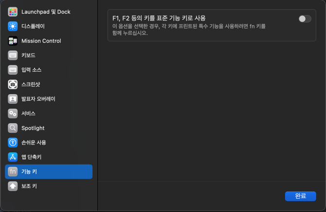

# 들어가며
아니 디스크 용량 줄이다가 뭐가 엉켰는지 갑자기 키보드가 제대로 동작하지 않는다;;  
이랬던 적이 처음이 아니라서 다음에 또 똑같은 일이 생겼을 때 빠르게 복구하기 위해 세팅하는 걸 기록해두려고 한다.

# 하드웨어
- 키크론 K8 MAX
- MacBook Air M1

# 소프트웨어 설정
## 시스템 설정 > 키보드
우선 맥 시스템 설정에서 키보드 설정은 아래 무조건 고정!


## 키크론 키맵
키크론 키맵 Json 파일은 아래와 같다.
```json
{"id":875825792,"keymap":[[{"col":0,"row":0,"val":41},{"col":1,"row":0,"val":0},{"col":2,"row":0,"val":58},{"col":3,"row":0,"val":59},{"col":4,"row":0,"val":60},{"col":5,"row":0,"val":61},{"col":6,"row":0,"val":62},{"col":7,"row":0,"val":63},{"col":8,"row":0,"val":64},{"col":9,"row":0,"val":65},{"col":10,"row":0,"val":66},{"col":11,"row":0,"val":67},{"col":12,"row":0,"val":68},{"col":13,"row":0,"val":69},{"col":14,"row":0,"val":32264},{"col":15,"row":0,"val":32266},{"col":16,"row":0,"val":30753},{"col":0,"row":1,"val":53},{"col":1,"row":1,"val":30},{"col":2,"row":1,"val":31},{"col":3,"row":1,"val":32},{"col":4,"row":1,"val":33},{"col":5,"row":1,"val":34},{"col":6,"row":1,"val":35},{"col":7,"row":1,"val":36},{"col":8,"row":1,"val":37},{"col":9,"row":1,"val":38},{"col":10,"row":1,"val":39},{"col":11,"row":1,"val":45},{"col":12,"row":1,"val":46},{"col":13,"row":1,"val":42},{"col":14,"row":1,"val":73},{"col":15,"row":1,"val":74},{"col":16,"row":1,"val":75},{"col":0,"row":2,"val":43},{"col":1,"row":2,"val":20},{"col":2,"row":2,"val":26},{"col":3,"row":2,"val":8},{"col":4,"row":2,"val":21},{"col":5,"row":2,"val":23},{"col":6,"row":2,"val":28},{"col":7,"row":2,"val":24},{"col":8,"row":2,"val":12},{"col":9,"row":2,"val":18},{"col":10,"row":2,"val":19},{"col":11,"row":2,"val":47},{"col":12,"row":2,"val":48},{"col":13,"row":2,"val":49},{"col":14,"row":2,"val":76},{"col":15,"row":2,"val":77},{"col":16,"row":2,"val":78},{"col":0,"row":3,"val":57},{"col":1,"row":3,"val":4},{"col":2,"row":3,"val":22},{"col":3,"row":3,"val":7},{"col":4,"row":3,"val":9},{"col":5,"row":3,"val":10},{"col":6,"row":3,"val":11},{"col":7,"row":3,"val":13},{"col":8,"row":3,"val":14},{"col":9,"row":3,"val":15},{"col":10,"row":3,"val":51},{"col":11,"row":3,"val":52},{"col":12,"row":3,"val":0},{"col":13,"row":3,"val":40},{"col":14,"row":3,"val":0},{"col":15,"row":3,"val":0},{"col":16,"row":3,"val":0},{"col":0,"row":4,"val":225},{"col":1,"row":4,"val":0},{"col":2,"row":4,"val":29},{"col":3,"row":4,"val":27},{"col":4,"row":4,"val":6},{"col":5,"row":4,"val":25},{"col":6,"row":4,"val":5},{"col":7,"row":4,"val":17},{"col":8,"row":4,"val":16},{"col":9,"row":4,"val":54},{"col":10,"row":4,"val":55},{"col":11,"row":4,"val":56},{"col":12,"row":4,"val":0},{"col":13,"row":4,"val":229},{"col":14,"row":4,"val":0},{"col":15,"row":4,"val":82},{"col":16,"row":4,"val":0},{"col":0,"row":5,"val":224},{"col":1,"row":5,"val":32256},{"col":2,"row":5,"val":32258},{"col":3,"row":5,"val":0},{"col":4,"row":5,"val":0},{"col":5,"row":5,"val":0},{"col":6,"row":5,"val":44},{"col":7,"row":5,"val":0},{"col":8,"row":5,"val":0},{"col":9,"row":5,"val":0},{"col":10,"row":5,"val":32259},{"col":11,"row":5,"val":228},{"col":12,"row":5,"val":21027},{"col":13,"row":5,"val":230},{"col":14,"row":5,"val":80},{"col":15,"row":5,"val":81},{"col":16,"row":5,"val":79},{"col":0,"row":6,"val":0},{"col":1,"row":6,"val":0},{"col":2,"row":6,"val":0},{"col":3,"row":6,"val":0},{"col":4,"row":6,"val":0},{"col":5,"row":6,"val":0},{"col":6,"row":6,"val":0},{"col":7,"row":6,"val":0},{"col":8,"row":6,"val":0},{"col":9,"row":6,"val":0}],[{"col":0,"row":0,"val":1},{"col":1,"row":0,"val":0},{"col":2,"row":0,"val":58},{"col":3,"row":0,"val":59},{"col":4,"row":0,"val":60},{"col":5,"row":0,"val":61},{"col":6,"row":0,"val":62},{"col":7,"row":0,"val":63},{"col":8,"row":0,"val":64},{"col":9,"row":0,"val":65},{"col":10,"row":0,"val":66},{"col":11,"row":0,"val":67},{"col":12,"row":0,"val":68},{"col":13,"row":0,"val":69},{"col":14,"row":0,"val":1},{"col":15,"row":0,"val":1},{"col":16,"row":0,"val":30752},{"col":0,"row":1,"val":1},{"col":1,"row":1,"val":32267},{"col":2,"row":1,"val":32268},{"col":3,"row":1,"val":32269},{"col":4,"row":1,"val":32270},{"col":5,"row":1,"val":1},{"col":6,"row":1,"val":1},{"col":7,"row":1,"val":1},{"col":8,"row":1,"val":1},{"col":9,"row":1,"val":1},{"col":10,"row":1,"val":1},{"col":11,"row":1,"val":1},{"col":12,"row":1,"val":1},{"col":13,"row":1,"val":1},{"col":14,"row":1,"val":1},{"col":15,"row":1,"val":1},{"col":16,"row":1,"val":1},{"col":0,"row":2,"val":30752},{"col":1,"row":2,"val":30753},{"col":2,"row":2,"val":30759},{"col":3,"row":2,"val":30755},{"col":4,"row":2,"val":30757},{"col":5,"row":2,"val":30761},{"col":6,"row":2,"val":1},{"col":7,"row":2,"val":1},{"col":8,"row":2,"val":1},{"col":9,"row":2,"val":1},{"col":10,"row":2,"val":1},{"col":11,"row":2,"val":1},{"col":12,"row":2,"val":1},{"col":13,"row":2,"val":1},{"col":14,"row":2,"val":1},{"col":15,"row":2,"val":1},{"col":16,"row":2,"val":1},{"col":0,"row":3,"val":1},{"col":1,"row":3,"val":30754},{"col":2,"row":3,"val":30760},{"col":3,"row":3,"val":30756},{"col":4,"row":3,"val":30758},{"col":5,"row":3,"val":30762},{"col":6,"row":3,"val":1},{"col":7,"row":3,"val":1},{"col":8,"row":3,"val":1},{"col":9,"row":3,"val":1},{"col":10,"row":3,"val":1},{"col":11,"row":3,"val":1},{"col":12,"row":3,"val":0},{"col":13,"row":3,"val":1},{"col":14,"row":3,"val":0},{"col":15,"row":3,"val":0},{"col":16,"row":3,"val":0},{"col":0,"row":4,"val":1},{"col":1,"row":4,"val":0},{"col":2,"row":4,"val":1},{"col":3,"row":4,"val":1},{"col":4,"row":4,"val":1},{"col":5,"row":4,"val":1},{"col":6,"row":4,"val":32271},{"col":7,"row":4,"val":28691},{"col":8,"row":4,"val":1},{"col":9,"row":4,"val":1},{"col":10,"row":4,"val":1},{"col":11,"row":4,"val":1},{"col":12,"row":4,"val":0},{"col":13,"row":4,"val":1},{"col":14,"row":4,"val":0},{"col":15,"row":4,"val":1},{"col":16,"row":4,"val":0},{"col":0,"row":5,"val":1},{"col":1,"row":5,"val":1},{"col":2,"row":5,"val":1},{"col":3,"row":5,"val":0},{"col":4,"row":5,"val":0},{"col":5,"row":5,"val":0},{"col":6,"row":5,"val":1},{"col":7,"row":5,"val":0},{"col":8,"row":5,"val":0},{"col":9,"row":5,"val":0},{"col":10,"row":5,"val":1},{"col":11,"row":5,"val":1},{"col":12,"row":5,"val":1},{"col":13,"row":5,"val":1},{"col":14,"row":5,"val":1},{"col":15,"row":5,"val":1},{"col":16,"row":5,"val":1},{"col":0,"row":6,"val":0},{"col":1,"row":6,"val":0},{"col":2,"row":6,"val":0},{"col":3,"row":6,"val":0},{"col":4,"row":6,"val":0},{"col":5,"row":6,"val":0},{"col":6,"row":6,"val":0},{"col":7,"row":6,"val":0},{"col":8,"row":6,"val":0},{"col":9,"row":6,"val":0}],[{"col":0,"row":0,"val":41},{"col":1,"row":0,"val":0},{"col":2,"row":0,"val":58},{"col":3,"row":0,"val":59},{"col":4,"row":0,"val":60},{"col":5,"row":0,"val":61},{"col":6,"row":0,"val":62},{"col":7,"row":0,"val":63},{"col":8,"row":0,"val":64},{"col":9,"row":0,"val":65},{"col":10,"row":0,"val":66},{"col":11,"row":0,"val":67},{"col":12,"row":0,"val":68},{"col":13,"row":0,"val":69},{"col":14,"row":0,"val":70},{"col":15,"row":0,"val":32265},{"col":16,"row":0,"val":30753},{"col":0,"row":1,"val":53},{"col":1,"row":1,"val":30},{"col":2,"row":1,"val":31},{"col":3,"row":1,"val":32},{"col":4,"row":1,"val":33},{"col":5,"row":1,"val":34},{"col":6,"row":1,"val":35},{"col":7,"row":1,"val":36},{"col":8,"row":1,"val":37},{"col":9,"row":1,"val":38},{"col":10,"row":1,"val":39},{"col":11,"row":1,"val":45},{"col":12,"row":1,"val":46},{"col":13,"row":1,"val":42},{"col":14,"row":1,"val":73},{"col":15,"row":1,"val":74},{"col":16,"row":1,"val":75},{"col":0,"row":2,"val":43},{"col":1,"row":2,"val":20},{"col":2,"row":2,"val":26},{"col":3,"row":2,"val":8},{"col":4,"row":2,"val":21},{"col":5,"row":2,"val":23},{"col":6,"row":2,"val":28},{"col":7,"row":2,"val":24},{"col":8,"row":2,"val":12},{"col":9,"row":2,"val":18},{"col":10,"row":2,"val":19},{"col":11,"row":2,"val":47},{"col":12,"row":2,"val":48},{"col":13,"row":2,"val":49},{"col":14,"row":2,"val":76},{"col":15,"row":2,"val":77},{"col":16,"row":2,"val":78},{"col":0,"row":3,"val":57},{"col":1,"row":3,"val":4},{"col":2,"row":3,"val":22},{"col":3,"row":3,"val":7},{"col":4,"row":3,"val":9},{"col":5,"row":3,"val":10},{"col":6,"row":3,"val":11},{"col":7,"row":3,"val":13},{"col":8,"row":3,"val":14},{"col":9,"row":3,"val":15},{"col":10,"row":3,"val":51},{"col":11,"row":3,"val":52},{"col":12,"row":3,"val":0},{"col":13,"row":3,"val":40},{"col":14,"row":3,"val":0},{"col":15,"row":3,"val":0},{"col":16,"row":3,"val":0},{"col":0,"row":4,"val":225},{"col":1,"row":4,"val":0},{"col":2,"row":4,"val":29},{"col":3,"row":4,"val":27},{"col":4,"row":4,"val":6},{"col":5,"row":4,"val":25},{"col":6,"row":4,"val":5},{"col":7,"row":4,"val":17},{"col":8,"row":4,"val":16},{"col":9,"row":4,"val":54},{"col":10,"row":4,"val":55},{"col":11,"row":4,"val":56},{"col":12,"row":4,"val":0},{"col":13,"row":4,"val":229},{"col":14,"row":4,"val":0},{"col":15,"row":4,"val":82},{"col":16,"row":4,"val":0},{"col":0,"row":5,"val":224},{"col":1,"row":5,"val":227},{"col":2,"row":5,"val":226},{"col":3,"row":5,"val":0},{"col":4,"row":5,"val":0},{"col":5,"row":5,"val":0},{"col":6,"row":5,"val":44},{"col":7,"row":5,"val":0},{"col":8,"row":5,"val":0},{"col":9,"row":5,"val":0},{"col":10,"row":5,"val":230},{"col":11,"row":5,"val":231},{"col":12,"row":5,"val":21027},{"col":13,"row":5,"val":228},{"col":14,"row":5,"val":80},{"col":15,"row":5,"val":81},{"col":16,"row":5,"val":79},{"col":0,"row":6,"val":0},{"col":1,"row":6,"val":0},{"col":2,"row":6,"val":0},{"col":3,"row":6,"val":0},{"col":4,"row":6,"val":0},{"col":5,"row":6,"val":0},{"col":6,"row":6,"val":0},{"col":7,"row":6,"val":0},{"col":8,"row":6,"val":0},{"col":9,"row":6,"val":0}],[{"col":0,"row":0,"val":1},{"col":1,"row":0,"val":0},{"col":2,"row":0,"val":190},{"col":3,"row":0,"val":189},{"col":4,"row":0,"val":32262},{"col":5,"row":0,"val":32263},{"col":6,"row":0,"val":30760},{"col":7,"row":0,"val":30759},{"col":8,"row":0,"val":172},{"col":9,"row":0,"val":174},{"col":10,"row":0,"val":171},{"col":11,"row":0,"val":168},{"col":12,"row":0,"val":170},{"col":13,"row":0,"val":169},{"col":14,"row":0,"val":1},{"col":15,"row":0,"val":1},{"col":16,"row":0,"val":30752},{"col":0,"row":1,"val":1},{"col":1,"row":1,"val":32267},{"col":2,"row":1,"val":32268},{"col":3,"row":1,"val":32269},{"col":4,"row":1,"val":32270},{"col":5,"row":1,"val":1},{"col":6,"row":1,"val":1},{"col":7,"row":1,"val":1},{"col":8,"row":1,"val":1},{"col":9,"row":1,"val":1},{"col":10,"row":1,"val":1},{"col":11,"row":1,"val":1},{"col":12,"row":1,"val":1},{"col":13,"row":1,"val":1},{"col":14,"row":1,"val":1},{"col":15,"row":1,"val":1},{"col":16,"row":1,"val":1},{"col":0,"row":2,"val":30752},{"col":1,"row":2,"val":30753},{"col":2,"row":2,"val":30759},{"col":3,"row":2,"val":30755},{"col":4,"row":2,"val":30757},{"col":5,"row":2,"val":30761},{"col":6,"row":2,"val":1},{"col":7,"row":2,"val":1},{"col":8,"row":2,"val":1},{"col":9,"row":2,"val":1},{"col":10,"row":2,"val":1},{"col":11,"row":2,"val":1},{"col":12,"row":2,"val":1},{"col":13,"row":2,"val":1},{"col":14,"row":2,"val":1},{"col":15,"row":2,"val":1},{"col":16,"row":2,"val":1},{"col":0,"row":3,"val":1},{"col":1,"row":3,"val":30754},{"col":2,"row":3,"val":30760},{"col":3,"row":3,"val":30756},{"col":4,"row":3,"val":30758},{"col":5,"row":3,"val":30762},{"col":6,"row":3,"val":1},{"col":7,"row":3,"val":1},{"col":8,"row":3,"val":1},{"col":9,"row":3,"val":1},{"col":10,"row":3,"val":1},{"col":11,"row":3,"val":1},{"col":12,"row":3,"val":0},{"col":13,"row":3,"val":1},{"col":14,"row":3,"val":0},{"col":15,"row":3,"val":0},{"col":16,"row":3,"val":0},{"col":0,"row":4,"val":1},{"col":1,"row":4,"val":0},{"col":2,"row":4,"val":1},{"col":3,"row":4,"val":1},{"col":4,"row":4,"val":1},{"col":5,"row":4,"val":1},{"col":6,"row":4,"val":32271},{"col":7,"row":4,"val":28691},{"col":8,"row":4,"val":1},{"col":9,"row":4,"val":1},{"col":10,"row":4,"val":1},{"col":11,"row":4,"val":1},{"col":12,"row":4,"val":0},{"col":13,"row":4,"val":1},{"col":14,"row":4,"val":0},{"col":15,"row":4,"val":1},{"col":16,"row":4,"val":0},{"col":0,"row":5,"val":1},{"col":1,"row":5,"val":1},{"col":2,"row":5,"val":1},{"col":3,"row":5,"val":0},{"col":4,"row":5,"val":0},{"col":5,"row":5,"val":0},{"col":6,"row":5,"val":1},{"col":7,"row":5,"val":0},{"col":8,"row":5,"val":0},{"col":9,"row":5,"val":0},{"col":10,"row":5,"val":1},{"col":11,"row":5,"val":1},{"col":12,"row":5,"val":1},{"col":13,"row":5,"val":1},{"col":14,"row":5,"val":1},{"col":15,"row":5,"val":1},{"col":16,"row":5,"val":1},{"col":0,"row":6,"val":0},{"col":1,"row":6,"val":0},{"col":2,"row":6,"val":0},{"col":3,"row":6,"val":0},{"col":4,"row":6,"val":0},{"col":5,"row":6,"val":0},{"col":6,"row":6,"val":0},{"col":7,"row":6,"val":0},{"col":8,"row":6,"val":0},{"col":9,"row":6,"val":0}]],"version":"1.0.0","MD5":"c420a95db3526f9599b0d077126c4694"}
```

## Karabiner-Element
Karabiner-Element로 한/영 씹힘 문제 해결한다.


Complex Modifications 설정은 아래 2개!

```json
{
    "description": "Map Option+F12 to Fn+Option+F12",
    "manipulators": [
        {
            "from": {
                "key_code": "f12",
                "modifiers": {
                    "mandatory": ["option"],
                    "optional": ["any"]
                }
            },
            "to": [
                {
                    "key_code": "f12",
                    "modifiers": ["fn", "option"]
                }
            ],
            "type": "basic"
        }
    ]
}
```

```json
{
    "description": "Control as Fn for Backspace",
    "manipulators": [
        {
            "from": {
                "key_code": "delete_or_backspace",
                "modifiers": { "mandatory": ["control"] }
            },
            "to": [
                {
                    "key_code": "delete_or_backspace",
                    "modifiers": ["fn"]
                }
            ],
            "type": "basic"
        }
    ]
}
```

# fn키 안먹을 때 확인하면 좋은 것

1. Karabiner-Elements 설정이 잘 되어 있는 지 확인
2. 키크론 초기화 (fn + J + Z 4초)
