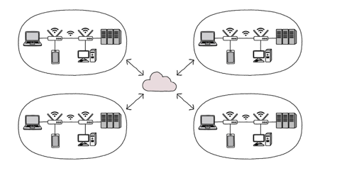
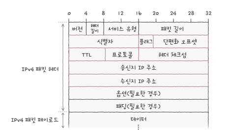
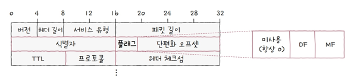
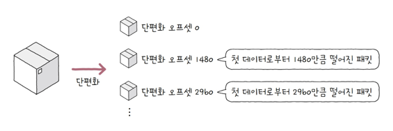
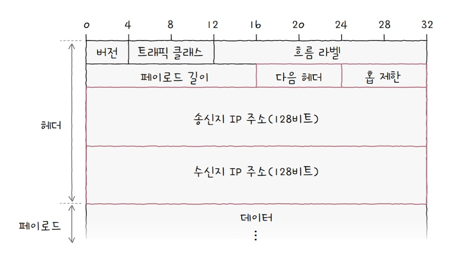
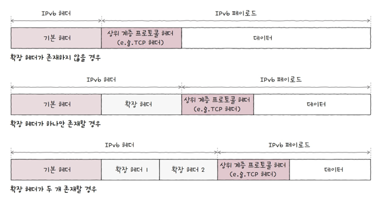
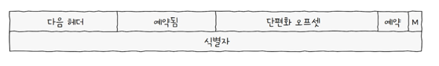
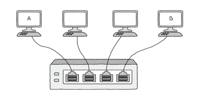
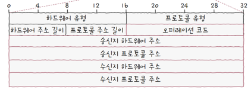
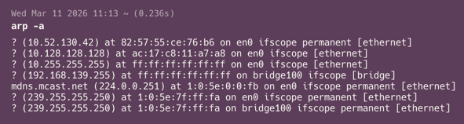

# 1. 들어가며
지난 번엔 [물리 계층과 데이터 링크 계층](https://kdkdhoho.github.io/posts/physics-layer-and-data-link-layer/)에 대해 정리해봤습니다.  
앞선 두 계층을 대표하는 네트워크 기술인 **이더넷**에 대해 알아보고, 케이블과 같은 통신 매체와 스위치 같은 물리적인 네트워크 장비에 대해 알아보고 동일한 LAN 안에서 MAC 주소를 가지고 이더넷 프레임이 어떻게 전달되는지에 대해 알아보았습니다.

앞선 두 계층은 주로 물리적인 영역이었다면 이번에 알아볼 **네트워크 계층**은 논리적인 개념으로, IP 주소와 ARP 프로토콜에 대한 내용이 설명됩니다.

---

# 2. 네트워크 계층
네트워크 계층은 OSI 7계층에서 3계층에 해당하는 계층입니다.  
1, 2계층인 물리 계층과 데이터 링크 계층은 근거리 통신 영역인 LAN을 구축하는데 필요한 계층이었다면, **네트워크 계층은 LAN과 LAN 간의 통신을 위한 계층**입니다.  

네트워크 계층은 **IP 주소를 이용해서 송수신지를 지정**하고, 다른 네트워크에 이르는 경로를 결정하는 **라우팅을 통해 다른 네트워크와 통신**하는 역할을 수행합니다.

## 2.1. 물리 계층과 데이터 링크 계층으로는 네트워크 간의 통신을 구축할 수는 없을까요?
편지를 주고받는 것으로 예를 들어보겠습니다.

네트워크 간의 통신을 한다는 의미는 서울에서 부산, 혹은 서울에서 샌프란시스코에 사는 사람과 편지를 주고받는 것과 같습니다.  
만약 받는 사람의 주소 없이, 이름만을 가지고 편지를 보내야 한다면 어떻게 할 수 있을까요?  
비현실적이긴하지만 수소문을 통해 그 사람을 아는 사람을 거쳐, 결국 그 사람이 있는 곳을 알아내야 합니다.  
그리고 알아냈다면 다시는 같은 고생을 하지 않기 위해서는 그 사람이 사는 곳을 기록해둬야겠죠.  
그런데 이 편지를 주고받는 것을 전 세계 사람들과 해야 한다면, 그 사람이 있는 곳을 찾는 것도 너무 힘들고 그 많은 사람들의 위치를 기록하는 것도 한계가 있습니다.

이 과정은 네트워크 계층 없이, 물리 계층과 데이터 링크 계층으로만 네트워크 간의 통신을 하는 것과 유사합니다.

우리는 이 과정을 효율적으로 하기 위해 시, 군, 구 같은 주소 체계를 이용합니다.  
특정 인물의 주소를 알고 있다면 그 주소를 이용해서 대상의 정확한 위치를 외울 필요 없이 주소만 외워서, 쉽고 효율적으로 찾아갈 수 있습니다.  
이 주소 체계를 구축하고, 찾아가는 과정을 네트워크 계층이 수행한다고 이해할 수 있습니다.

다른 예시를 들어보면, 특정 대학교가 IP 주소를 192.186.1.0/24 부터 192.186.255.0/24 까지의 주소 대역을 가진다면, 해당 대학교로 연결되는 다른 모든 라우터는 192.186.0.0/16 이라는 하나의 IP 주소만 라우터에 저장하면 됩니다. (이를 CIDR 이라고 합니다.)  
다시 말해 MAC 주소랑 L2 스위치의 동작으로 이를 구현하려면 대학교에 속한 모든 호스트의 MAC 주소를 L2 스위치에 저장해야 합니다.

결국, 더 광범위하고 효율적인 통신을 하기 위해 네트워크 계층(IP 주소 체계, ARP, 라우팅)이 탄생한 것입니다. 

# 3. 인터넷 프로토콜 (Internet Protocol, IP)
네트워크 계층의 가장 핵심적인 개념입니다.

MAC 주소가 물리적인 주소였다면, **IP는 논리적인 주소**입니다. (시, 군, 구 같은 개념입니다. 행정에 따라 얼마든지 변경될 수 있는 주소입니다.)  
_DHCP_ (Dynamic Host Configuration Protocol) 이라는 프로토콜을 통해 자동으로 할당받거나, 사용자가 직접 할당할 수도 있고, 한 대의 호스트에 여러 IP 주소를 부여할 수도 있습니다.  

현재 IP는 IPv4, IPv6의 두 가지 버전이 있습니다.  
> 기존에는 IPv4를 사용하고 있었는데, IPv4가 부여 가능한 범위(2^32)보다 호스트 개수가 더 많아짐에 따라 새로운 주소 체계인 IPv6가 탄생했습니다.

## 3.1. IPv4, IPv6 주소 형태
### 3.1.1. IPv4
- IP 주소는 **32bit** 형태로 주소를 표현합니다.
- `192.168.1.1` 과 같은 형태입니다.
- 각 자리마다 8bit로 표현되기에 0부터 255까지의 십진수가 옵니다.
- `.` 으로 구분된 8비트를 **옥텟**이라고 합니다.

### 3.2.2. IPv6
- IPv6는 IPv4의 주소 고갈 문제를 해결하기 위해 탄생한 주소 체계입니다.  
- IPv4는 32bit였다면, IPv6는 이보다 4배 더 긴 **128bit** 입니다.
- 128bit를 16bit씩 8개 그룹으로 나눈 형태입니다. 각 그룹은 4자리 16진수로 표현하며, 그룹 사이에는 콜론(`:`)으로 구분합니다.
- `2001:0db8:85a3:08d3:1319:8a2e:0370:7334` 같은 형태입니다.
- 128비트 주소를 모두 기입하는 것은 번거롭기 때문에, RFC 4291에서는 다음과 같은 축약 규칙을 정의하고 있습니다.
  - 각 그룹의 앞에 오는 0(Leading Zeros)은 생략할 수 있습니다.
    - 예: 0db8 -> db8, 0001 -> 1
  - 0으로만 구성된 그룹이 연속해서 나타날 경우, 이들을 이중 콜론(::) 하나로 대체할 수 있습니다.  
    단, 이중 콜론은 주소 내에서 단 한 번만 사용할 수 있습니다.
    - 예: 2001:0db8:0000:0000:0000:0000:1234:5678 -> 2001:db8::1234:5678

## 3.2. IP의 기능
IP는 두 가지 기능이 있습니다.

1. IP 주소 지정: IP 주소를 바탕으로 송수신 대상을 지정하는 것을 의미합니다.
2. IP 단편화: 전송하려는 패킷의 크기가 MTU 라는 최대 전송 단위보다 클 경우, 이를 MTU 크기 이하인 N개의 패킷으로 나누는 것을 의미합니다.

### 3.2.1. MTU (Maximum Transmission Unit)
MTU란 **한 번에 전송 가능한 IP 패킷의 최대 크기**를 의미합니다.  
IP 패킷의 헤더도 크기에 포함이 되며, 일반적인 MTU 크기는 1,500바이트입니다. (물론 1,500바이트보다 더 클 수 있습니다.)  
MTU 크기 이하로 나누어진 IP 패킷은 수신지에서 재조합됩니다.

## 3.2. 패킷 헤더 구조
### 3.2.1. IPv4

IPv4의 패킷 헤더 구조는 위 그림과 같습니다.  
이 중에서 식별자, 플래그, 단편화 오프셋 필드는 IP 단편화 기능에 관여하고 송신지 IP 주소, 수신지 IP 주소는 IP 주소 지정 기능에 관여합니다.  

#### 3.2.1.1. 식별자 (Identifier)
- **패킷에 할당된 번호**입니다.
- 메시지 전송 과정에서 IPv4 패킷이 여러 조각으로 나뉘어 전송됐다면, 수신지에서는 이들을 재조합해야 합니다.  
  이때 여러 개의 IPv4 패킷들이 **어떤 메시지로부터 나뉘어졌는지를 인식하기 위해 식별자를 사용**합니다.

#### 3.2.1.2. 플래그
- 총 3개의 bit로 구성된 필드입니다.
- 첫 번째 bit는 항상 0으로 예약된 비트로, 현재 사용되지 않습니다.
- 나머지 두 bit 중 하나는 **DF** (Don't Fragment) 라는 이름이 붙은 bit로, IP 단편화를 수행하지 말라는 표시입니다.  
  만약 DF 비트가 1이라면, IP 단편화를 수행하지 않고, 0이라면 IP 단편화를 수행할 수 있습니다.
- 나머지 한 bit는 **MF** (More Fragment) 라는 이름의 비트로, 단편화된 패킷이 더 있다는 의미입니다.  
  0이라면 이 패킷이 마지막 패킷임을 의미하고, 1이면 쪼개진 패킷이 더 있다는 걸 의미합니다.
  

#### 3.2.1.3. 단편화 오프셋
- 단편화된 IP 패킷들은 순서대로 도착하지 않을 수 있습니다.  
  따라서 무작위 순서대로 도착하는 IP 패킷들을 다시 순서대로 재조합하기 위해서는, 단편화된 패킷이 원본 데이터에서 몇 번째 데이터에 해당하는 패킷인지 알아야 합니다.  
- 이를 위해 활용하는 필드가 단편화 오프셋입니다.

#### 3.2.1.4. TTL (Time To Live)
- **패킷의 수명**을 의미합니다.
- 멀리 떨어진 호스트끼리 통신할 때 IP 패킷은 여러 개의 라우터를 거쳐갑니다.  
  이때 패킷이 호스트나 라우터에 한 번 전달되는 것을 **홉** 이라고 하는데, TTL의 값은 홉마다 1씩 감소합니다.  
- TTL이 0인 IP 패킷은 그 즉시 폐기하며, 송신자에게 시간 초과(Time Exceeded) 메시지를 전송합니다.
- 네트워크 상에 무의미한 패킷이 남지 않도록 방지하는 목적을 가집니다.

#### 3.2.1.5. 프로토콜
- 상위 계층의 프로토콜에 대한 정보가 기록됩니다.
- 예를 들어 TCP는 6번, UDP는 17번으로 기록됩니다.

#### 3.2.1.6. 송신지 IP 주소, 수신지 IP 주소
- 이름 그대로 송신지의 IP 주소와 수신지의 IP 주소가 기록됩니다.

### 3.2.2. IPv6
IPv6 패킷의 기본 헤더는 아래 그림과 같습니다.  

IPv4와 비교했을 때 상당히 간소화되어 있습니다. 그리고 IPv4에는 옵션이나 패딩 필드 때문에 길이가 가변적인데 IPv6는 40바이트로 길이가 고정되어있습니다.

#### 3.2.2.1. 다음 헤더 (Next Header)
- 상위 계층의 프로토콜을 가리키거나 확장 헤더를 가리킵니다.
  - 확장 헤더란, 기본 IPv6 헤더에 필요한 추가적인 헤더 정보가 필요한 경우 **확장 헤더**라는 추가 헤더를 의미합니다.
  - 확장 헤더는 아래 그림처럼 기본 헤더와 페이로드 데이터 사이에 위치합니다.  
    
  - 많이 쓰이는 확장 헤더의 종류로는 다음과 같습니다.
    - 홉 간 옵션(Hop-by-Hop Options): 송신지에서 수신지에 이르는 모든 경로의 네트워크 장비가 패킷을 검사하도록 합니다.
    - 수신지 옵션(Destination Options): 수신지에서만 패킷을 검사하도록 합니다.
    - 라우팅(Routing): 라우팅 관련 정보를 담습니다.
    - 단편화(Fragment): 단편화 정보를 담습니다.
      - 단편화 확장 헤더의 구조는 아래 그림과 같습니다.  
        
      - 예약됨과 예약 필드는 0으로 설정되어 사용되지 않습니다.
      - 단편화 오프셋은 IPv4의 단편화 오프셋, M은 IPv4의 MF 플래그, 식별자는 IPv4의 식별자 필드와 동일한 역할을 수행합니다.
    - ESP(Encapsulating Security Payload), AH(Authentication Header): 암호화와 인증을 위한 정보를 담는다.

#### 3.2.2.2. 홉 제한
- IPv4의 TTL과 비슷하게 **패킷의 수명**을 나타내는 필드입니다.

#### 3.2.2.3. 송신지 IP 주소, 수신지 IP 주소
- 송신지 IP 주소와 수신지 IP 주소 필드를 통해 IPv6 주소를 지정합니다.

---

# 4. ARP
**ARP(Address Resolution Protocol)**은 **IP 주소를 통해 MAC 주소를 알아내는 프로토콜**입니다.

우리가 IP 주소를 이용해서 통신을 하더라도 결국엔 데이터 링크 계층을 거쳐야 합니다.  
데이터 링크 계층에서는 MAC 주소를 활용하기 때문에, IP 주소로 MAC 주소를 구해서 하위 계층에 전달해야 하기 때문입니다.

## 4.1. 동작 방식
ARP의 동작 방식은 **ARP 요청 -> ARP 응답 -> APR 테이블 갱신** 으로 동작합니다.

아래 그림과 같이 LAN이 구성되어 있다고 가정해보겠습니다.

이때 호스트 A가 호스트 B의 IP 주소를 가지고 통신하려고 하는 상황입니다.

### 4.1.1. ARP 요청
가장 먼저 **ARP 요청**을 합니다.

브로드캐스트 방식으로 동일 네트워크에 속한 다른 모든 호스트에게 **ARP 요청 패킷**을 전달합니다.  

이 패킷에는 수신지 프로토콜 주소가 있는데요. 이 필드에 수신자의 IP 주소를 입력합니다.  
(수신지 하드웨어 주소는 MAC 주소를 입력하는 필드인데, 이 곳에는 '00:00:00:00:00:00' 이 입력됩니다.)

이 패킷을 받은 호스트 중, 본인의 IP 주소와 일치하지 않은 호스트는 해당 패킷을 폐기합니다.  
일치한다면 ARP 응답을 수행합니다.

### 4.1.2. ARP 응답
ARP 요청 패킷을 전달받은 호스트 B는, **ARP 응답 패킷**을 호스트 A에게 전달합니다. (유니캐스트)  
이때 패킷에 자신의 MAC 주소를 담습니다.

### 4.1.3. ARP 테이블 갱신
ARP 응답 패킷을 전달받은 호스트 A는, **ARP 테이블**에다가 호스트 B의 IP 주소와 MAC 주소를 저장합니다.  
이렇게 테이블에 저장한 결과는 일정 시간이 지나면 삭제되고, 임의로 삭제할 수도 있습니다.  
이후로 호스트 B와 통신할 때는 ARP 요청을 하지 않고, MAC 주소를 바로 담아서 통신하게 됩니다.  
마치 캐싱과 동일합니다.

ARP 테이블은 ARP를 활용할 수 있는 모든 호스트에서 관리합니다.  
그래서 각자 컴퓨터에서 확인이 가능한데요.  
Mac OS 기준으로는 터미널에서 `arp -a` 라고 입력하면 ARP 테이블을 확인할 수 있습니다.

# 5. IP 단편화를 피하는 방법
IP 단편화는 가급적 피하는 것이 좋습니다.  
한번 통신할 때 전송해야 하는 IP 패킷의 수가 많아질수록, 담아야 할 패킷 헤더의 정보도 많아지고, 대역폭에 더 많은 부하를 낳습니다.  
쪼개진 IP 패킷을 합치는 과정에서도 오버헤드가 발생합니다.

패킷 단편화를 피하려면 패킷의 사이즈를 줄이면 됩니다.  
그런데 어느 정도까지 줄여야 할까요?

**IP 패킷이 전달되는 모든 호스트 중, 최대 MTU 값**만큼 줄이면 됩니다.  
이를 **경로 MTU (Path MTU)** 라고 합니다.  
통신을 주고 받는 양쪽 PC에서는 MTU 값이 아무리 커도, 중간 호스트(라우터 등)에서 MTU 값이 1,500 바이트이면 결국 패킷 단편화가 일어나기 때문입니다.

이 경로 MTU를 구하는 기술을 **경로 MTU 발견 (Path MTU discovery)** 라고 하는데요.  
오늘날 네트워크에서는 대부분 이를 지원하고, 처리 가능한 MTU 크기도 대부분 균일하기에 IP 단편화는 자주 수행되지 않습니다.

실제로 와이어샤크 프로그램을 통해 패킷을 조회해보면, 대부분 IP 패킷에 [DF 플래그](#3212-플래그) 가 0으로 표시되어 있습니다.  
이는, IP 단편화를 수행하지 말라는 의미이며, 오늘날 네트워크에서는 대부분 경로 MTU 발견을 지원한다는 것을 의미합니다.  
경로 MTU 발견은 기본적으로 DF 플래그 값을 0으로 설정한 채 동작하기 때문입니다.

# 6. IP 주소
이번에는 IP 주소에 대해서 좀 더 자세히 알아보겠습니다.

## 6.1. 네트워크 주소와 호스트 주소
IP주소는 크게 **네트워크 주소**와 **호스트 주소**로 이루어집니다.

네트워크 주소는 호스트가 속한 특정 네트워크를 식별하는 역할을 하며, 호스트 주소는 네트워크 내에서 특정 호스트를 식별하는 역할을 합니다.

8비트가 총 네 개로 나뉜 IP 주소(v4 기준)의 각 8비트를 _옥텟_ 이라고 한다고 했는데요.  
네트워크 주소는 1옥텟에서 3옥텟까지 할당될 수 있습니다.

네트워크 주소를 구분하는 방법에는 **클래스풀 주소 체계**와 **클래스리스 주소 체계**가 존재합니다.

### 6.1.1. 클래스풀 주소 체계
클래스풀 주소 체계는 **클래스**로 네트워크 주소 크기를 구분합니다.

클래스는 A, B, C, D, E로 나뉩니다.

- A 클래스
  - 기본적으로 `**0**xxxxxx.xxxxxxxx.xxxxxxxx.xxxxxxxx` 형태입니다.
  - 맨 앞에 비트 `0` 이 무조건 오며, 1옥텟만이 네트워크 주소로 사용됩니다.
  - 따라서 이론상으로는 네트워크 주소는 2^7개의 주소가 사용될 수 있고, 호스트 주소는 2^24개의 주소가 사용될 수 있습니다.
- B 클래스
  - 기본적으로 `**10**xxxxxx.xxxxxxxx.xxxxxxxx.xxxxxxxx` 형태입니다.
  - 맨 앞에 비트 `10`이 무조건 오며, 2옥텟을 네트워크 주소로 사용합니다.
  - 이론상으로 네트워크 주소는 2^14개의 주소가 사용될 수 있고, 호스트 주소는 2^16개의 주소가 사용될 수 있습니다.
- C 클래스
  - 기본적으로 `**110**xxxxx.xxxxxxxx.xxxxxxxx.xxxxxxxx` 형태입니다.
  - 맨 앞에 비트 `110`이 무조건 오며, 3옥텟을 네트워크 주소로 사용합니다.
  - 이론상, 네트워크 주소는 2^21개의 주소가 사용될 수 있고, 호스트 주소는 2^8개의 주소가 사용될 수 있습니다.
- D 클래스
  - 멀티캐스트를 위해 예약된 클래스입니다.
- E 클래스
  - 특수한 목적을 위해 예약된 클래스입니다.

다만, 실제로 호스트 주소를 부여할 때, 비트가 모두 0인 IP 주소와 1인 IP 주소는 사용할 수 없습니다.

비트가 모두 0인 경우 **해당 네트워크 자체를 의미**하는 것이고, 비트가 모두 1일 땐 브로드캐스트를 위한 주소로 사용되기 때문입니다.

따라서 이론상 호스트 주소로 사용가능한 값에서 2를 빼주어야 실제로 사용 가능한 호스트 주소의 개수가 산출됩니다.

### 6.2.1. 클래스리스 주소 체계
클래스풀 주소 체계는 명확합니다.  
하지만 만약, 300개의 호스트 주소가 필요한 경우 불가피하게 B 클래스를 이용해야만 합니다.  
C 클래스는 최대 254개의 호스트 주소가 사용할 수 있기 때문입니다.  
하지만 B 클래스는 65,534개의 호스트 주소가 사용될 수 있습니다.  
따라서 **다수의 IP 주소가 낭비**되고 있습니다.

이러한 문제를 개선하기 위해 **클래스리스 주소 체계**가 탄생했습니다.

클래스리스 주소 체계는 **서브넷 마스크**를 이용해서 네트워크 주소 범위를 더 유동적이고 정교하게 네트워크를 구획할 수 있는 방법입니다.

#### 서브넷 마스크
서브넷 마스크는 IP 주소상에서 네트워크 주소는 `1`, 호스트 주소는 `0`으로 표기한 비트열입니다.  
네트워크 내의 부분 네트워크(Subnet)를 구분 짓기 위한 비트 마스크인 셈이죠.  
이 서브넷 마스크를 활용해 네트워크 주소를 원하는만큼 잘게 나눌 수 있는 것입니다.

#### 서브넷 마스크 표기법
서브넷 마스크를 표기하는 방법에는 두 가지가 있습니다.  

1. `255.255.255.0`처럼 10진수로 직접 표기하는 방법
2. **IP 주소/서브넷 마스크 상의 1의 개수** 형식으로 표기하는 방법

이 중에서 두 번째 방법을 **CIDR(Classless Inter-Domain Routing Notation) 표기법**이라고 부르며, 오늘날 흔히 사용됩니다.

예를 들어 C 클래스의 기본 서브넷 마스크는 `255.255.255.0` 입니다.  
이를 이진수로 표기하면 `11111111.11111111.11111111.00000000` 입니다.  
1이 총 24개이므로 CIDR 표기법에 따르면 `/24` 로 표기할 수 있습니다.

#### 서브넷팅
이 서브넷 마스크를 이용해서 네트워크 주소를 구하는 방법은 IP 주소에 서브넷 마스크를 비트 AND 연산을 수행하는 것입니다.

만약 `192.168.0.2/25` 라는 IP 주소가 있을 때, 네트워크 주소는 다음과 같이 구합니다.

서브넷 마스크는 `11111111.11111111.11111111.10000000` 이므로, `192.168.0.2`와 비트 AND 연산을 수행합니다.  
그 결과는 `192.168.0.0` 입니다.

네트워크 주소는 `192.168.0.0`이 되고, 이 네트워크 안에서 할당 가능한 호스트 IP 주소의 범위는 네트워크 주소 `192.168.0.0`과 브로드캐스트 주소 `192.168.0.127`을 제외한, `192.168.0.1` ~ `192.168.0.126`이 됩니다.

즉, `192.168.0.2/25`는 총 126개의 호스트를 할당할 수 있는 `192.168.0.0`이라는 네트워크에 속한 `2`라는 호스트를 의미합니다.

## 6.2. 공인 IP 주소와 사설 IP 주소
IP 주소는 **공인 IP 주소**와 **사설 IP 주소**로 나눌 수 있습니다.

### 6.2.1. 공인 IP 주소
**공인 IP 주소는 전 세계에서 고유한 IP 주소**입니다.  
인터넷에서 라우팅되는 네트워크 간 통신에서 사용하는 IP 주소가 바로 공인 IP 주소입니다.

공인 IP 주소는 ISP나 공인 IP 주소 할당 기관을 통해 할당받을 수 있습니다.

### 6.2.2. 사설 IP 주소
- 사설 IP 주소는 사설 네트워크에서 사용하기 위한 IP 주소입니다.
- 사설 네트워크란 인터넷, 외부 네트워크에 공개되지 않은 네트워크를 의미합니다.
- IP 주소 공간 중에서는 사설 IP 주소를 위해 예약된 IP 주소 공간이 있습니다.  
  - `10.0.0.0.8` (`10.0.0.0` ~ `10.255.255.255`)
  - `172.16.0.0/12` (`172.16.0.0` ~ `172.31.255.255`)
  - `192.168.0.0/16` (`192.168.0.0` ~ `192.168.255.255`)
- 사설 IP 주소의 할당 주체는 보통 라우터입니다.
- 사설 IP 주소는 해당 호스트가 속한 사설 네트워크 상에서만 유효하기 때문에, 다른 네트워크의 사설 IP 주소와 중복될 수 있다.  
  때문에 사설 IP 주소만으로는 인터넷 통신을 할 수 없다.  
  이를 해결하기 위해 **NAT(Network Address Translation)** 라는 기술이 존재합니다.
  - 
    NAT는 보통 라우터나 공유기에 내장되어 있습니다.
    따라서 사설 네트워크에서 만들어진 사설 IP 주소를 라우터/공유기가 공인 IP 주소로 변환되어 외부 네트워크로 전송됩니다.
    반대로 외부 네트워크로부터 받은 공인 IP 주소를 라우터/공유기가 사설 IP 주소로 변경해서 사설 네트워크 속 호스트에 전달합니다.

## 6.3. 정적 IP 주소와 동적 IP 주소
### 6.3.1. 정적 할당
- 호스트에 직접 IP 주소를 부여하는 방식입니다.
- 이렇게 할당된 IP 주소를 **정적 IP 주소(Static IP Address)** 라고 부릅니다.
- IP 주소를 직접 할당하다보면 호스트 수가 많아짐에 따라 관리가 어려워집니다.

### 6.3.2. 동적 할당과 DHCP
- 호스트에 IP 주소를 동적으로 할당하는 방식입니다.
- 이렇게 할당된 IP 주소를 **동적 IP 주소(Dynamic IP Address)** 라고 부릅니다.
- IP 동적 할당에 사용되는 대표적인 프로토콜이 **DHCP (Dynamic Host Configuration Protocol)** 입니다.
  - DHCP는 응용 계층(7계층)에 속합니다.
  - DHCP를 통한 동적 IP 주소 할당은 IP 주소를 할당받고자 하는 호스트(클라이언트)와 해당 호스트에게 IP 주소를 부여하는 DHCP 서버 간 통신을 통해 이루어집니다.
  - DHCP 서버의 역할은 보통 라우터(공유기)가 수행하지만, 특정 호스트에 DHCP 서버 기능을 추가할 수도 있습니다.
  - DHCP 서버는 할당 가능한 IP 주소 목록을 관리하다가, 클라이언트가 요청할 때 IP 주소를 할당합니다.
  - 이때, 동적 IP 주소는 **임대 기간이 정해져 있습니다**. (보통 수 시간 ~ 수 일 정도로 설정합니다.)
  - 임대 기간이 끝난 IP 주소는 다시 DHCP 서버로 반납됩니다.
  - 클라이언트와 DHCP 서버가 통신하는 과정은 네 가지로 나눕니다.
    1. DHCP Discover
       - 클라이언트가 DHCP 서버에 _DHCP Discover_ 패킷을 전달합니다.
       - 브로드캐스트로 전송하며, 송신지 IP 주소는 아직 할당받지 못했으므로 `0.0.0.0`으로 설정됩니다.
    2. DHCP Offer
       - DHCP 서버가 클라이언트에게 할당해 줄 IP 주소, 서브넷 마스크, 임대 기간 등의 정보를 담아 "제안"합니다.
    3. DHCP Request
       - DHCP Offer 패킷을 받은 클라이언트는, 제안받은 IP 주소를 사용하겠다는 요청을 보냅니다.
       - 이 또한 브로드캐스트로 전송됩니다.
    4. DHCP Acknowledgment (DHCP ACK)
       - DHCP Request 패킷을 전달받은 서버는 최종 승인을 내리기 위해 DHCP ACK 패킷을 응답합니다.
       - DHCP ACK 패킷을 전달받은 클라이언트는 할당받은 IP 주소를 자신의 IP 주소로 설정한 뒤, 임대 기간동안 IP 주소를 사용합니다.
  - 임대 기간이 모두 끝나면 원칙적으로는 부여받은 동적 IP 주소를 DHCP 서버에 반납해야합니다.
    하지만, 임대 기간이 끝나기 전에 연장할 수도 있는데요.  
    이를 **임대 갱신**이라고 합니다.  
    임대 갱신은 임대 기간이 끝나기 전에 기본적으로 두 차례 자동으로 수행됩니다.  
    두 차례의 갱신 시도 모두 실패하면, 동적 IP 주소는 DHCP 서버로 반납됩니다.

## 6.4. 네트워크 주소와 호스트 주소를 나누는 이유
그런데 네트워크 주소와 호스트 주소를 왜 나누는걸까요?

IP 주소는 단순히 장치 하나를 식별하는 값이 아니라, **라우팅을 위한 계층적 주소**입니다.

만약, `192.168.1.23` 이라는 IP 주소가 있을 때, 이를 '[네트워크 부분] + [호스트 부분]' 으로 나눕니다.  
(예: `192.168.1` + `23`)

이렇게 나누었을 때, 다음과 같은 이점이 있습니다.

- 같은 네트워크 내부 통신인지 판단이 쉽습니다.
  - 목적지 IP를 확인하고, 자신의 Subnet Mask를 적용합니다. 이때의 네트워크 주소를 비교합니다.
  - 네트워크 주소가 같다면 [ARP](#4-arp)를 통해 목적지의 MAC 주소를 찾습니다.
  - 다르면 다른 네트워크이므로, 다음 라우터로 전송합니다.
- 라우터의 라우팅 테이블 효율화
- 인터넷 규모 확장 가능
  - ISP가 `203.0.113.0/24` 를 할당했다고 가정했을 때, 조직 내부에서 `203.0.113.0/25` 와 `203.0.113.128/25` 같이 더 쪼개서 사용할 수도 있습니다.
  - 즉, 공인 IP 블록은 ISP가 할당하고, 네트워크 분할은 조직 내에서 네트워크 확장을 위해 필요에 따라 이루어집니다.

## 6.5. 예약 주소
IP 주소에는 예약된 IP 주소가 있습니다.

### 6.5.1. 0.0.0.0/8
`0.0.0.0/8`은 RFC 6890에 따르면, **이 네트워크의 이 호스트를 지칭**하도록 예약되어있다고 명시되어 있습니다.

이를 사용하는 대표적인 예시로는 [DHCP](#632-동적-할당과-dhcp) 과정 중, 첫 번째인 DHCP Discover 과정에서 송신지 IP 주소를 `0.0.0.0`으로 설정하는 것입니다.

### 6.5.2. 0.0.0.0/0
`0.0.0.0/8`과 유사하지만, `0.0.0.0/0`은 **모든 임의의 IP 주소**를 의미하고 **디폴트 라우트**를 나타내기 위해 사용됩니다.  
디폴트 라우트란, 패킷을 어떤 IP 주소로 전달해야할지 결정하기 어려울 때 기본적으로 패킷을 전달할 경로를 의미합니다.

AWS EC2에서 API 서버의 인바운드 설정할 때, 다른 모든 호스트로부터 요청을 받도록 하기 위해 `0.0.0.0/0`을 설정해야 하는 것이 대표적인 예시입니다.

### 6.5.2. 127.0.0.1/8
**루프백 주소**인 `127.0.0.1/8`은 개발하면서 많이 사용되는 IP 주소입니다.

자기 자신을 가리키는 주소이고, **로컬 호스트**라고도 부릅니다.

루프백 주소로 전송된 패킷은 자기 자신에게 되돌아오기 때문에, 자기 자신을 다른 호스트인 것처럼 통신을 시도할 수 있습니다.

---

# 5. 라우팅

# 참고 자료
- [강민철 저, 혼자 공부하는 네트워크](https://product.kyobobook.co.kr/detail/S000212911507)
- [티스토리, APR 쉽게 이해하기](https://aws-hyoh.tistory.com/70)
