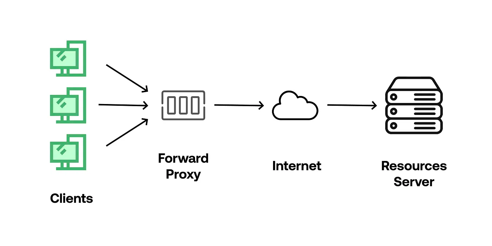
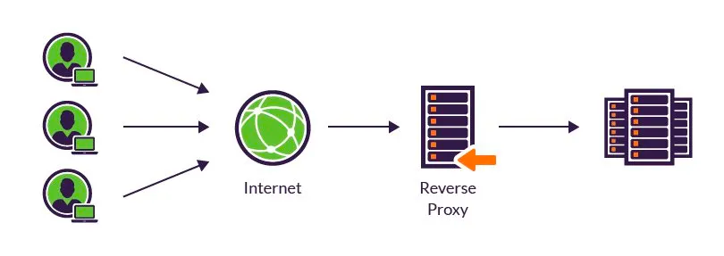

## 들어가며 

이 글은 [그림으로 배우는 Http & Network Basic](https://m.yes24.com/Goods/Detail/15894097)을 읽고 학습한 내용을 정리한 글입니다.

이번 장은 WAS 대신 다양한 기능을 대신 수행해주는 **웹 서버**와 **캐싱**에 대해 알아보겠습니다.

## 1. 멀티 도메인을 가능하게 하는 가상 호스트

우선 멀티 도메인이란, WAS는 1대이지만 이를 가리키는 호스트(도메인)는 2개 이상인 상태를 의미한다. 
웹 서버는 이 멀티 도메인을 수행할 수 있도록 **가상 호스트** 기능을 제공한다.

Nginx에서도 `Server Block`으로 가상 호스트를 설정할 수 있다. 
방법은 [이 블로그](https://www.sabujak.org/2023/10/02/nginx-virtual-host%EA%B0%80%EC%83%81%ED%98%B8%EC%8A%A4%ED%8A%B8%EB%A1%9C-%EC%82%AC%EC%9D%B4%ED%8A%B8-%EB%91%90-%EA%B0%9C-%EC%9A%B4%EC%98%81%ED%95%98%EA%B8%B0/)에서 확인할 수 있다.

가상 호스트를 통해 한 대의 WAS로 2개 이상의 사이트의 트래픽을 처리할 수 있을 것이다. 
이를 통해 효율적인 운영이 가능해진다고 생각한다.

## 2. 프록시, 게이트웨이, 터널

HTTP는 클라이언트와 서버 외에 **프록시, 게이트웨이, 터널과 같은 통신을 중계하는 프로그램**과 서버를 연계하는 것도 가능하다.

### 2-1. 프록시

프록시 서버는 Forward Proxy, Reverse Proxy로 나눌 수 있다. 
이 둘의 차이는 프록시 서버의 위치이며, 위치에 따라 얻을 수 있는 장점이 다를 수 있다.

#### 2-1-1. Forward Proxy

클라이언트(브라우저)의 요청이 서버로 도착하기 위해 네트워크를 타기 전, 프록시 서버가 요청을 받아서 중계 및 전달하는 역할을 수행한다. 
즉, 클라이언트 바로 뒤에 위치한다.

이를 통해 미리 설정해놓은 **특정 사이트 접근을 차단**할 수 있으며 Proxy Server에 **서버로부터 받은 응답을 캐싱**한다면 더 빠른 응답을 내려줄 수 있다. 또한 클라이언트의 정보를 암호화하여 서버로 보낼 수 있다.

> 단순히 'Proxy (Server)'라고 말한다면 바로 이 'Forward Proxy'를 의미한다. 
> 실제로 면접에서 "프록시와 리버스 프록시"의 차이에 대해 설명해달라는 요청이 있었다.

#### 2-1-2. Reverser Proxy

Forward Proxy와 반대로 클라이언트의 요청이 네트워크를 타고 와서 서버로 도달하기 전, Proxy Server가 해당 요청을 받아 중계 및 전달하는 구조를 가진다. 
즉, WAS 바로 앞에 위치한다.

서버의 정보를 숨길 수 있으며 포트 포워딩, 로드 밸런싱 등의 역할도 수행할 수 있다. 
흔히 사용하는 Nginx와 Apache Http Server가 Reverse Proxy로 수행될 수 있다.

### 2-2. 게이트웨이

다른 서버를 중계하는 역할을 수행한다. 프록시와 매우 유사한 역할이다. 
하지만 게이트웨이는 그 다음에 있는 서버(Origin Server)가 HTTP 서버 이외의 서비스를 제공하는 서버가 된다. 
클라이언트의 요청을 SSL과 같은 암호화하는 등으로 통신의 안정성을 높이는 역할을 수행한다.

예를 들어 DBMS에 접속하기 전이나 쇼핑 사이트에서 결제 시스템 등과 연계해서 사용할 수 있다.

### 2-3. 터널

서로 떨어진 두 대의 클라이언트와 서버 사이를 중계하며 접속들 주선한다.

클라이언트와 서버가 SSL 같은 암호화 통신을 통해 안전하게 통신을 하기 위해 중간에 터널을 통해 통신 경로를 구축한다. 
터널은 HTTP Request를 해석하려고 하지 않고 그대로 서버에 요청을 전달한다. 
그리고 통신하고 있는 양단의 호스트의 접속이 끊어질 때 종료된다.

## 3. 캐싱

캐싱은 응답의 결과(리소스)를 중간 어딘가에 사본으로 저장해놓고, 동일한 요청이 있을 때 중간에 저장해놓은 사본을 응답하는 기능이다. 
이를 통해 효율적인 통신이 수행될 수 있다.

### 3-1. 캐싱의 특징

네트워크에서 캐싱은 브라우저, CDN, Proxy Server 등과 같이 여러 곳에서 수행될 수 있다. 
브라우저에 저장되는 캐시를 `Private Cache`, Proxy나 CDN과 같은 곳에 저장되는 캐시를 `Shared Cache`로 불린다. 

### 3-2. 캐싱 정책

캐싱 데이터는 **사본**이기 때문에 Origin Server의 리소스가 변경되면 해당 캐싱 데이터는 더이상 사용되면 안되기 때문에 이를 위한 정책을 세우는 것이 중요하다.
정책을 설정하는데 고려할 요소는 **캐싱 데이터의 리소스 타입**, **캐싱 유효시간**, **버스팅 정책**이 있다.

#### 3-2-1. 정적 리소스 캐싱 정책 사례

예를 들어, JS, CSS 같은 정적 리소스 파일은 캐싱을 적용하기 좋다. 
하지만 이 둘은 개발이 진행됨에 따라 자주 변경되고, JS와 CSS 버전이 동기화되지 않으면 화면이 깨진다. 
캐싱는 **URL을 기반으로 리소스를 구분하므로 리소스가 업데이트될 때 URL을 변경하면 손쉽게 JS, CSS 파일의 캐싱 데이터를 제거할 수 있다.**

따라서 다음과 같이 캐싱 정책을 세울 수 있다. 
캐시의 Max-Age를 최대치(1년)로 설정하고, [E-Tag](https://developer.mozilla.org/ko/docs/Web/HTTP/Headers/ETag)도 적용하며, JS, CSS 리소스에 변경사항이 생기면 캐시 데이터가 무효화되도록 URL에 버전을 적용한다.
> `E-Tag`는 Http Response Header에 리소스의 특정 버전을 식별하는 식별자의 역할을 한다. 클라이언트는 [`If-None-Match`](https://developer.mozilla.org/ko/docs/Web/HTTP/Headers/ETag#%EB%B3%80%EA%B2%BD%EB%90%98%EC%A7%80_%EC%95%8A%EC%9D%80_%EB%A6%AC%EC%86%8C%EC%8A%A4%EC%9D%98_%EC%BA%90%EC%8B%B1) 헤더를 통해 해당 식별자 값을 전달하여 현재 캐싱하고 있는 데이터의 버전을 전달하고, 서버는 해당 값을 통해 리소스의 버전을 비교할 수 있다.

#### 3-2-2. WAS 캐싱 정책 사례

WAS의 경우 응답을 캐싱하지 않기를 원할 수 있다. 
이때는 Http Response Header에 `Cache-Control: no-cache, private`을 추가하여 [휴리스틱 캐싱](https://lalalilala.tistory.com/m/9)을 방지할 수 있다. 
> 휴리스틱 캐싱은 브라우저가 임의로 Http Response를 캐싱하는 것을 의미한다.

### Reference
> - [그림으로 배우는 Http & Network Basic](https://m.yes24.com/Goods/Detail/15894097)