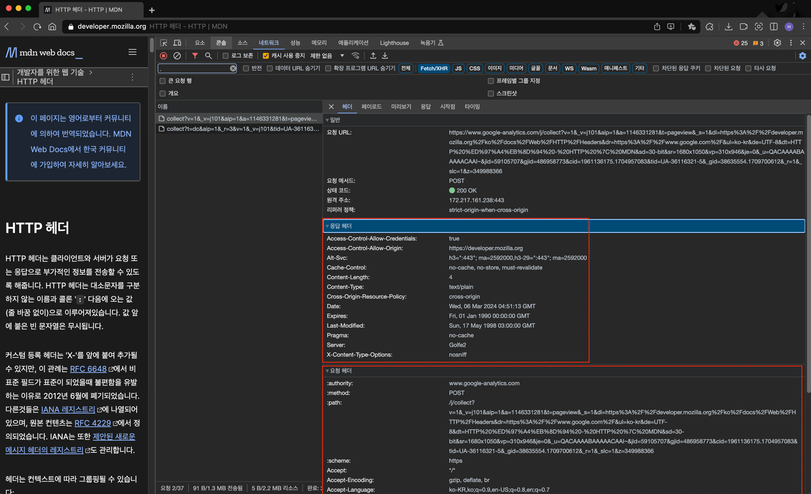
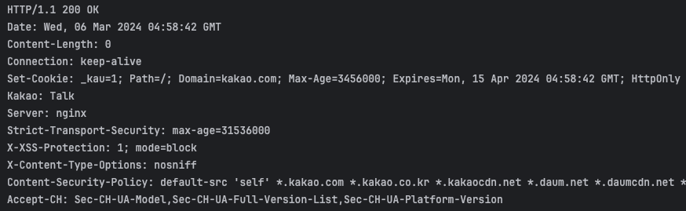
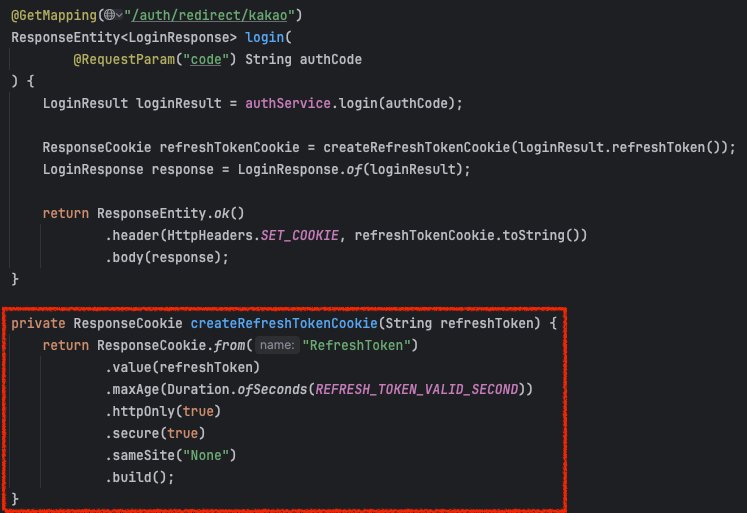

## 들어가며

이 글은 [그림으로 배우는 Http & Network Basic](https://m.yes24.com/Goods/Detail/15894097)을 읽고 학습한 내용을 정리한 글입니다.

이번 장에서는 HTTP 헤더에 대해 학습한 내용을 정리해보겠습니다. 추가로 HTTP Entity에 대해서도 학습한 내용을 정리해보겠습니다.

## HTTP 헤더란

HTTP 헤더는 HTTP 요청과 응답에 모두 포함되는 개념입니다. 

위 사진에서 보시다싶이 각각의 헤더는 `{Header Name}: {Header Value}` 로 이루어져 있습니다.

`:` 전후로 공백이 Optional하게 포함될 수 있습니다.

바로 이 헤더를 통해 요청과 응답에 필요한 정보들을 담아 전달하게 되는 것입니다.

또 중요한 점은 하나의 헤더가 2개 이상의 값이 포함될 수 있다는 점인데요. `Set-Cookie` 처럼 `;`를 구분자로 할 수도 있고 혹은 `Accept-CH`처럼 `,`를 구분자로 할 수 있다는 점입니다.

추가로 헤더의 Name은 대소문자를 구분하지 않습니다.

## HTTP 헤더의 종류

HTTP 헤더는 사용되는 용도에 따라 4가지로 분류될 수 있습니다.

### 일반적인 헤더 필드 (General Header Fields)

요청과 응답 모두 사용되는 헤더가 여기에 속합니다.

`Cache-Control`, `Connection`, `Date`, `Pragma`, `Transfer-Encoding`, `Via` 등이 속합니다.

> Via: 프록시 서버에 관한 정보

### 요청 헤더 필드 (Request Header Fields)

요청과 관련된 정보를 포함하는 헤더가 여기에 속합니다.

`Accept`, `Accept-Charset`, `Accept-Encoding`, `Accept-Language`, `Host`, `If-Match`, `If-Modified-Since`, `Proxy-Authorization`, `Referer`, `TE`, `User-Agent` 등이 속합니다.

> `Accept`: 클라이언트가 처리 가능한 미디어 타입 
> `If-Match`: 엔티티 태그의 비교 
> `If-Modifed-Since`: 리소스의 갱신 시간 비교 
> `User-Agent`: HTTP 클라이언트의 정보

### 응답 헤더 필드 (Response Header Fields)

응답과 관련된 정보를 포함하는 헤더가 여기에 속합니다.

`Accept-Ranges`, `Age`, `Etag`, `Location`, `Server`, `Vary` 등이 속합니다.

> `Accept-Ranges`: 바이트 단위의 요구를 수신할 수 있는지 없는지 여부 
> `Age`: 리소스의 지정 경과 시간 
> `Etag`: 리소스를 특정하기 위한 정보 
> `Location`: 클라이언트를 특정 URI에 리다이렉트 시키기 위한 주소 
> `Server`: 서버 정보 
> `Vary`: 프록시 서버에 대한 캐시 관리 정보

### 엔티티 헤더 필드 (Entity Header Fields)

HTTP Request에 포함된 Entity와 관련된 헤더가 여기에 속합니다.

`Allow`, `Content-Encoding`, `Content-Language`, `Content-Length`, `Content-Location`, `Content-Type`, `Expries`, `Last-Modifed` 등이 속합니다.

> `Allow`: 리소스가 제공하는 HTTP Method 
> `Expires`: 메시지 바디의 유효기한 날짜 
> `Last-Modified`: 리소스의 최종 갱신 날짜

### 헤더 필드의 순서

일반적으로 _General - Request or Response - Entity_ 순으로 Header를 보내는 것이 좋은 관행이라고 합니다.

### HTTP Entity? Entity Header? Entity Body? Message Body?

여기서 잠깐, HTTP 명세와 관련된 문서를 읽다보면 HTTP Entity, Entity Header, Entity Body, Message Body에 대한 내용이 종종 나타납니다.

HTTP Entity는 Status Line을 제외한 모든 Line을 의미하는 것으로 이해했으며 
Entity Header는 HTTP Header Fields, Entity Body는 Message Body를 의미하는 것 같습니다.

[스택 오버플로우](https://stackoverflow.com/questions/9197745/what-exactly-is-an-http-entity)에 따르면 옛날 문서에는 Entity라는 개념이 포함되었지만 현재는 `Header Fields`, `Message Body` 만으로 표현한다고 합니다. 
실제로 1999년에 나온 [RFC 2616](https://datatracker.ietf.org/doc/html/rfc2616)에서는 Entity와 관련된 정보들이 많이 포함되어 있지만 2024년에 나온 [RFC 9112](https://datatracker.ietf.org/doc/rfc9112/)에서는 Entity와 관련된 내용은 찾아볼 수 없습니다.

## Cookie 헤더에 대해 알아보자

다른 많은 헤더들에 대해서도 알아보면 좋겠지만, 아무래도 가장 많이 사용되지만 생각보다 사용하기 까다로운 헤더인 Cookie에 대해서 알아보겠습니다.

### 쿠키?

비상태성 프로토콜인 HTTP에서 클라이언트의 상태를 저장하기 위해 쿠키가 도입되었습니다. 
주로 세션이나 토큰과 같은 인증 정보를 담는 것으로 사용됩니다. 

하지만 이 쿠키는 여러 가지 속성들이 있고 보안을 위한 여러 제약 사항들이 있습니다. 
이로 인해 로그인 기능을 구현할 때, `Set-Cookie`에는 잘 담기지만 요청을 보낼 때 `Cookie`가 안담겨져 가는 문제들이 많이 발생할 수 있습니다.

### Set-Cookie 만들기

쿠키를 활용하려면 가장 먼저 서버가 `Set-Cookie` 헤더가 값을 담아서 응답해야 합니다.

Spring Boot 3을 기준으로 아래와 같이 Cookie 객체를 만들고 `ResponseEntity#header()`에 값을 넣어 `Set-Cookie` 헤더를 만들 수 있습니다.

### Cookie

`Set-Cookie`를 수신한 클라이언트는 브라우저에 쿠키 정보를 보관하고 있다가, `Cookie`를 만들어준 서버로 요청을 보낼 때 `Cookie` 헤더에 보관해뒀던 쿠키 정보를 포함하여 전송합니다.

하지만 Expires(or Max-Age), Domain, Path, HttpOnly, SameSite 와 같은 속성들 때문에 요청에 쿠키가 담겨지지 않을 수 있습니다.

지금부턴 이 속성들에 대해 자세히 알아보겠습니다.

### Secure, HttpOnly

Secure 속성은 HTTPS 프로토콜로 전송되는 요청일 때만 전송됩니다.

HttpOnly 속성은 XSS 공격을 방지하기 위해 JavaScript의 `Document.cookie`로 Cookie에 접근할 수 없도록 막습니다.

이 두 속성이 담기면 `Set-Cookie: JSESSIONID=abcde; Secure; HttpOnly` 와 같이 쿠키 값에 포함됩니다.

### Domain, Path

Domain 속성은 쿠키가 전송될 호스트를 명시합니다. 만약 명시되지 않는다면, 쿠키를 생성한 서버의 호스트가 자동으로 할당됩니다. 
그렇다고 원하는 호스트를 모두 설정할 수 없습니다. 설정할 수 있는 값으로는 현재 서버의 도메인 혹은 서브 도메인만 가능합니다. 
(예를 들어 listywave.com 에서 쿠키를 만들었다면, listywave.com 혹은 www.listywave.com으로만 설정 가능합니다.) 
만약 다른 도메인으로 설정했다면 무시됩니다.

Path 속성은 쿠키를 전송하기 위해 URL 내에 반드시 존재해야 하는 URL 경로입니다. 
만약 `Path=/docs` 로 설정되었다면 `/docs` 로 시작하는 URL Path에만 쿠키가 전송됩니다. 

### SameSite

쿠키가 [CSRF](https://nordvpn.com/ko/blog/csrf/)를 방어하기 위한 속성입니다.

SameSite 속성을 더욱 이해하려면 *서드 파티 쿠키*와 *퍼스트 파티 쿠키*를 이해해야 합니다.

#### 서드 파티 쿠키

브라우저가 접속한 사이트와 다른 사이트로 전송하는 쿠키를 *서드 파티 쿠키*라고 합니다. 
예를 들어 나는 현재 naver.com 에 접속해 있는데, 한 이미지가 `musinsa.com/pants.jpg` 를 사용하고 있다고 가정했을 때 
브라우저에 `musinsa.com` 에서 발행한 쿠키를 가지고 있다면 해당 이미지를 가져오기 위해 요청을 보낼 때 쿠키가 담겨질 것입니다. 이 쿠키를 서드 파티 쿠키라고 합니다.

#### 퍼스트 파티 쿠키

서드 파티 쿠키와 반대로 생각하시면 됩니다. 
퍼스트 파티 쿠키는 브라우저가 접속한 페이지와 같은 도메인으로 전송되는 쿠키를 의미합니다. 
현재 naver.com에 접속해있는데, naver.com으로 쿠키가 전송된다면 퍼스트 파티 쿠키가 되는 것입니다.

그렇다면 왜 서드 파티 쿠키와 퍼스트 파티 쿠키를 알아봤을까요?

쿠키에 별도로 설정을 하지 않는다면 <u>크롬을 제외한 브라우저는 모든 HTTP 요청에 쿠키를 담아 전송하기 때문</u>입니다. 
CSRF는 이를 노린 공격이고 이를 악용하여 공격자는 쿠키로 사용자 인증을 수행할 수 있게 되는 것입니다. 
<u>이를 막기 위해 탄생한 속성이 바로 `SameSite`</u>이기 때문입니다.

`SameSite` 옵션을 통해 Cross-Site로 전송하는 요청에 쿠키, 즉 서드 파티 쿠키를 담을 것인지 선택할 수 있습니다.

- `None`: 퍼스트 파티 쿠키, 서드 파티 쿠키를 모두 허용합니다.
- `Strict`: 퍼스트 파티 쿠키만 허용합니다.
- `Lax`: a 태그를 통한 이동이나, `window.location`과 같은 직접 이동에서만 서드 파티 쿠키가 전달 가능합니다.

## 번외: 동일한 헤더 Name을 가진 HTTP 헤더가 있다면?

만약 `Set-Cookie` 라는 헤더가 HTTP 응답에 2개가 담긴다면 응답을 수신하는 수신자는 어떻게 처리를 할까요?

바로, 수신자가 헤더를 읽는 정책에 따라 달라집니다.

가장 먼저 읽은 `Set-Cookie` 헤더의 Value를 사용한다면 상위에 위치하는 헤더를 읽을 것이고 
마지막으로 읽은 `Set-Cookie` 헤더의 Value를 사용한다면 하위에 위치하는 헤더를 읽을 것입니다. 
혹은 둘 다 읽긴 하지만, 마지막으로 읽은 값을 덮어 씌운다거나 값을 append 하는 방식으로 사용할 수도 있겠습니다.

따라서 클라이언트와 서버 사이에 있는 프록시 같은 중계자들은 Http Header의 위치를 바꾸면 안되는 이유가 되겠습니다.

## 번외: "X-" 접두사는 무엇일까?

표준으로 등록된 헤더가 아닌 경우 "X-"를 붙여 이를 구분짓는 용도로 활용했습니다. 
하지만 이 방법은 장점은 없고 단점만 많아서 RFC 6648 부터 이 방법을 폐지하는 것이 제안되었습니다. 
하지만 하위 호완성 떄문에 아직 많이 사용되고 있다고 합니다.

### Reference

> - [그림으로 배우는 Http & Network Basic](https://m.yes24.com/Goods/Detail/15894097)
> - [MDN](https://developer.mozilla.org/ko/)
> - [W3C](https://www.w3.org/)