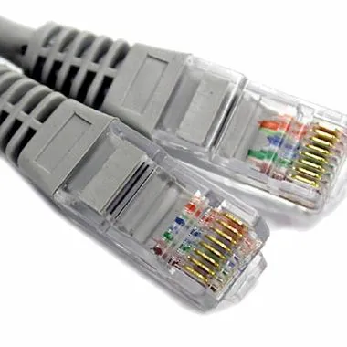
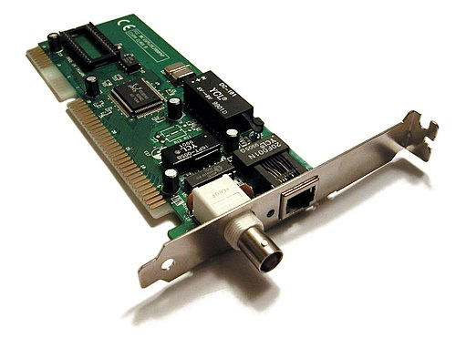

# 1. 들어가며
물리 계층과 데이터 링크 계층은 OSI 7 계층에 존재하는 계층입니.  
TCP/IP 스택 4계층에서는 네트워크 액세스 계층을 하나로 보거나, 네트워크 액세스 계층을 데이터 링크 계층으로 보고 물리 계층을 따로 볼 수도 있습다.

이번 글에서는 네트워크 참조 모델의 가장 하단인 물리 계층과 데이터 링크 계층에 대해 이해해보고자 합니다.

# 2. 이더넷
오늘날 물리 계층과 데이터 링크 계층에서 **이더넷**이라는 네트워크 기술을 공통으로 사용합니다.  
이더넷은 전기전자공학자협회, IEEE에서 표준화한 네트워크 기술로서, 일종의 프로토콜이라고 이해할 수 있습니다.

이더넷 기술의 주된 목표는 **통신 매체(케이블 등)를 통해 정보를 송수신 하는 방법을 정의**하는 것입니다.  
구체적으로는 다양한 통신 매체의 규격, 송수신되는 프레임의 형태, 프레임을 주고 받는 방법 등이 정의되어 있습니다.

실제로 정의되어 있는 문서를 보려면 https://www.ieee802.org/3/ 로 접속하면 볼 수 있습니다.  
표준은 지속적으로 발전하고 있으며 현재도 새로운 표준이 개발되고 있습니다.  
이더넷 표준에 따라 지원되는 네트워크 장비, 통신 매체의 종류, 전송 속도 등이 달라질 수 있습니다.

> 우리가 흔히 말하고 볼 수 있는 "랜선"이 이더넷 케이블입니다.  
> 

허브, 스위치, 케이블 등 물리 계층과 데이터 링크 계층에는 다양한 네트워크 장비들이 있는데, 이 모든 장비들은 이더넷 표준을 따르고 있다고 볼 수 있습니다.

## 2.1. 통신 매체 표기 형태
위에서 이더넷 표준은 지원하는 통신 매체의 종류와 전송 속도 등이 달라질 수 있다고 했습니다.  
이렇게 표준마다 다른 통신 매체를 지칭할 때, "[전송 속도][Base]-[추가 특성]" 과 같은 형태로 지칭합니다.

// TODO: 이어서

---

# 3. 통신 매체 표기 형태
이더넷 표준에 따라 통신 매체의 종류와 전송 속도가 달라질 수 있다면 특정 이더넷 표준 규격에 따라
구현된 통신 매체를 지칭할 때 ‘IEEE 802.3i 케이블’, ‘IEEE 802.3u 케이블’처럼 표기할까요?
그런 경우도 있지만, 일반적으로 그렇지는 않습니다. 보통 이더넷 표준 규격에 따라 구현된 통신 매
체를 지칭할 때는 통신 매체의 속도와 특성을 한눈에 파악하기 쉽도록 다음과 같은 형태로 표기합니
다. 하나씩 살펴보겠습니다.

## 네트워크 인터페이스란? 
네트워크 인터페이스란? [^위키백과 - 네트워크 인터페이스 컨트롤러]  
  
컴퓨터를 컴퓨터 망에 연결하는 컴퓨터 하드웨어 부품이다.  
초기 네트워크 인터페이스 컨트롤러는 일반적으로 위 사진같은 시스템 버스에 꽂는 확장 카드 형태로 구현되었다. 이더넷 표준의 저렴한 비용과 보편성 덕분에, 비록 별도의 네트워크 카드가 여전히 판매되고는 있지만, 대부분의 최신 컴퓨터는 **메인보드에 네트워크 인터페이스 컨트롤러가 내장**되어 있거나 **USB로 연결된 동글에 포함**되어 있다.
네트워크 컨트롤러는 이더넷이나 와이파이와 같은 특정 물리 계층 및 데이터 링크 계층 표준을 사용하여 통신하는 데 필요한 전자 회로를 구현한다. 이는 완전한 네트워크 프로토콜 스택의 기반을 제공하여, 동일한 근거리 통신망(LAN)에 있는 컴퓨터 간의 통신과 인터넷 프로토콜(IP)과 같은 라우팅 가능 프로토콜을 통한 대규모 네트워크 통신을 가능하게 한다.

## MAC 주소를 변경할 수 있는가? 변경하면 어떤 일이 발생하는가? 변경해야 하는 경우는 어떤 경우들이 있는가?

## MAC 주소가 고유한 주소라는 것은 어떻게 보장하는가?

## MAC 주소는 언제? 누구로부터 할당받는가?

## 

---

[^네이버 블로그 - bit와 byte란? 1byte는 왜 8bit일까?]: https://blog.naver.com/kji9653/221900031533
[^위키백과 - 네트워크 인터페이스 컨트롤러]: https://ko.wikipedia.org/wiki/%EB%84%A4%ED%8A%B8%EC%9B%8C%ED%81%AC_%EC%9D%B8%ED%84%B0%ED%8E%98%EC%9D%B4%EC%8A%A4_%EC%BB%A8%ED%8A%B8%EB%A1%A4%EB%9F%AC
