# 1. 들어가며
물리 계층과 데이터 링크 계층은 OSI 7 계층에 존재하는 계층입니다.  
TCP/IP 스택 4계층에서는 네트워크 액세스 계층을 하나로 보거나, 네트워크 액세스 계층을 데이터 링크 계층으로 보고 물리 계층을 따로 볼 수도 있습니다.

이번 글에서는 네트워크 참조 모델의 가장 하단인 물리 계층과 데이터 링크 계층에 대해 이해해보고자 합니다.

---

# 2. 이더넷
오늘날 물리 계층과 데이터 링크 계층에서 **이더넷**이라는 네트워크 기술을 공통으로 사용합니다.  
이더넷은 전기전자공학자협회, IEEE에서 표준화한 네트워크 기술로서, 일종의 프로토콜이라고 이해할 수 있습니다.

이더넷 기술의 주된 목표는 **통신 매체(케이블 등)를 통해 정보를 송수신 하는 방법을 정의**하는 것입니다.  
구체적으로는 다양한 통신 매체의 규격, 송수신되는 프레임의 형태, 프레임을 주고 받는 방법 등이 정의되어 있습니다.

실제로 정의되어 있는 문서를 보려면 https://www.ieee802.org/3/ 로 접속하면 볼 수 있습니다.  
표준은 지속적으로 발전하고 있으며 현재도 새로운 표준이 개발되고 있습니다.  
이더넷 표준에 따라 지원되는 네트워크 장비, 통신 매체의 종류, 전송 속도 등이 달라질 수 있습니다.

> 우리가 흔히 말하고 볼 수 있는 "랜선"이 이더넷 케이블입니다.  
> 

허브, 스위치, 케이블 등 물리 계층과 데이터 링크 계층에는 다양한 네트워크 장비들이 있는데, 이 모든 장비들은 이더넷 표준을 따르고 있다고 볼 수 있습니다.

## 2.1. 통신 매체 표기 형태
위에서 이더넷 표준은 지원하는 통신 매체의 종류와 전송 속도 등이 달라질 수 있다고 했습니다.  
이렇게 표준마다 다른 통신 매체를 지칭할 때, "[전송 속도][Base]-[추가 특성]" 과 같은 형태로 지칭합니다.

### 2.1.1. 전송 속도
기본 단위는 'Mbps' 입니다.  
이때 숫자 뒤에 'G' 가 붙어 있는 경우에만 'Gbps' 입니다.

| 전송 속도 표기 |   의미    |
|:--------:|:-------:|
|    10    | 10Mbps  |
|   100    | 100Mbps |
|   2.5G   | 2.5Gbps |

### 2.1.2. BASE
BASE는 베이스밴드의 약자로, **변조 타입**을 의미합니다.  
변조 타입이란, 비트 신호로 변환된 데이터를 통신 매체로 전송하는 방법입니다.

BASE 외에 BROAD로 표기하는 브로드밴드, PASS로 표기하는 패스밴드도 있습니다.  
일반적인 LAN 환경에서는 특별한 경우가 아니라면 대부분 베이스밴드 방식을 사용하므로, 대부분의 이더넷 통신 매체는 BASE 방식을 사용한다고 생각해도 됩니다.

### 2.1.3. 추가 특성
통신 매체의 특성을 의미합니다.  
명시될 수 있는 특성의 종류로는 다음과 같습니다.

- 전송 가능한 최대 거리
- 데이터가 비트 신호로 변환되는 방식인 물리 계층 인코딩 방식
- 비트 신호를 옮길 수 있는 전송로 수인 레인 수

하지만 추가 특성에서 기어갛면 좋은 것은 **통신 매체의 종류** 입니다.  
가장 대중적인 통신 매체의 종류로는 동축 케이블(C), 트위스티드 페어 케이블(T), 단파장 빛을 활용하는 광섬유 케이블(S), 장파장 빛을 활용하는 광섬유 케이블(L)이 있습니다.

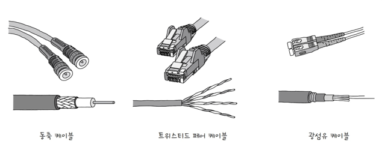

## 2.2. 이더넷 프레임
_프레임_ 은 데이터 링크 계층의 패킷 메시지 단위(PDU)를 의미하는 용어입니다. ([네트워크 개요 - PDU](https://kdkdhoho.github.io/posts/what-is-computer-network/#pdu))

**이더넷 프레임**은 이더넷으로 구성된 네트워크에서 주고받는 프레임을 뜻합니다.

데이터 링크 계층에서 캡슐화를 할 때, 헤더에는 프리앰블, 수신지 MAC 주소, 송신지 MAC 주소, 타입/길이로 구성되고, 트레일러에는 FCS로 구성됩니다.

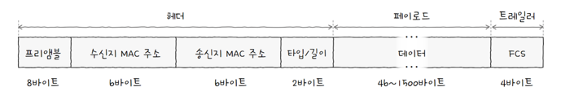

### 2.2.1. 프리앰블
이더넷 프레임의 시작을 알리는 8바이트 크기의 정보입니다.  
첫 7바이트는 10101010 값을 가지고, 마지막 바이트는 10101011 값을 가집니다.  
수신자는 이 프리앰블을 통해 이더넷 프레임이 오고 있음을 알아차릴 수 있습니다.

### 2.2.2. **수신지 MAC 주소와 송신지 MAC 주소**
물리적 주소라고도 불리는 **MAC 주소**는 데이터 링크 계층의 핵심입니다.

MAC 주소는 [네트워크 인터페이스](#3-nic와-케이블)마다 부여되는 6바이트 길이의 주소로, LAN 내에서 수신지와 송신지를 특정할 수 있습니다.

MAC 주소는 네트워크 인터페이스에 부여되는 주소입니다.  
그래서 컴퓨터 한 대에 여러 네트워크 인터페이스가 있다면 MAC 주소도 여러 개가 될 수 있습니다.

또한 MAC 주소는 **일반적으로** 고유한 값을 가지고 잘 변경되지 않습니다.  
여기서 '일반적으로'라고 표현한 이유는, MAC 주소가 변경될 수 있기 때문입니다.

MAC 주소의 할당은 국제 전기 전자 공학회(IEEE)와 네트워크 장비 제조업체가 협력해서 부여하는데요.  
IEEE Registration Authority는 장비 제조업체에 OUI(Organizationally Unique Identifier)라고 불리는 고유 식별 코드를 할당하고 관리합니다.  
삼성, 애플, 인텔과 같은 제조업체는 IEEE로부터 이 OUI를 구매한 뒤, 자사에서 생산하는 각 네트워크 인터페이스 컨트롤러(NIC)에 고유한 번호를 부여할 권한을 갖게 됩니다.

또한, MAC 주소는 하드웨어가 제조되는 공정 단계에서 부여됩니다.  
장치가 생산될 때 네트워크 인터페이스 컨트롤러의 읽기 전용 메모리(ROM)나 EEPROM에 물리적으로 영구 기록되기 때문에, 이를 BIA(Burned-In Address)라고도 부릅니다.  
따라서 사용자가 소프트웨어적으로 MAC 주소를 변경(스푸핑)하더라도, 장치 자체에 각인된 물리적인 주소는 제조 당시에 이미 결정되어 있습니다.

MAC 주소를 변경하는 행위는 이 물리적인 ROM에 기록된 주소를 바꾸는 게 아니라, OS가 네트워크 카드 드라이버를 통해 통신할 때 가짜 주소를 사용하도록 속이는 소프트웨어적 기법으로 변경할 수 있습니다.  
이때 사용자가 지정한 값으로 변경할 수 있습니다. 이를 MAC 스푸핑이라고 합니다.

만약 MAC 주소를 변경하여 동일한 네트워크 세그먼트 내에 이미 존재하던 다른 MAC 주소와 겹치게 되면, 패킷이 어디로 가야할 지 혼선이 생겨 두 기기 모두 네트워크 연결이 끊기거나 통신이 불안정해지는 현상이 발생합니다.  
또한, 일부 유료 소프트웨어에서 하드웨어 식별을 위해 MAC 주소를 고유 키로 사용하는데, MAC 주소가 바뀌면 소프트웨어가 해당 기기를 정품으로 인식하지 못합니다.

### 2.2.3. 타입/길이
타입/길이 필드에는 타입이나 길이가 올 수 있습니다.

필드의 값이 1500(16진수로 05DC) 이하인 경우, 프레임의 길이를 나타나는 데 사용하고, 1536(16진수로 0600) 이상일 경우에는 타입을 나타냅니다.  

여기서 이더타입(ethertype)이라고도 불리는 타입이란, 이더넷 프레임이 ‘어떤 정보를 캡슐화했는지’를 나타내는 정보입니다.  

대표적으로 상위 계층에서 사용된 프로토콜의 이름이 명시됩니다.  

### 2.2.4. 데이터
데이터는 상위 계층에서 전달받은, 혹은 전달해야 하는 내용입니다.  

최대 크기는 1,500byte로, 반드시 46바이트 이상이어야 합니다.  
만약, 46바이트 이하의 데이터라면 크기를 맞추기 위해 0을 넣어서 사이즈를 맞춥니다. 이를 _패딩_ 이라고 합니다.

### 2.2.5. FCS
FCS는 수신한 이더넷 프레임에 오류가 없는지 확인하기 위한 필드입니다.

이 필드에는 _CRC_ (Cyclic Redundancy Check), 즉 순환 중복 검사라고 불리는 오류 검출용 값이 들어갑니다.

송신지는 프리앰블을 제외한 나머지 필드 값을 바탕으로 CRC 값을 계산해서 FCS 필드에 기록합니다.  
수신지는 프리앰블과 FCS 필드를 제외한 나머지 필드 값을 바탕으로 CRC 값을 계산하고, 그 값을 FCS 필드 값과 비교합니다.  
이때 값이 일치하지 않으면 프레임에 오류가 있다고 판단하여, 해당 프레임을 폐기하는 구조입니다.

# 3. NIC와 케이블
## 3.1. NIC (Network Interface Controller)
NIC, **네트워크 인터페이스 컨트롤러**는 호스트와 통신 매체를 연결하고 MAC 주소가 부여되는 네트워크 장비입니다.

NIC는 통신 매체에 흐르는 신호(전기, 빛 등)를 호스트가 이해하는 프레임으로 변환하거나, 반대로 호스트가 이해하는 프레임을 통신 매체에 흐르는 신호로 변환하는 역할을 수행합니다.

[2.2.2. 수신지 MAC 주소와 송신지 MAC 주소](#222-수신지-mac-주소와-송신지-mac-주소) 부분에서 _NIC에 물리적으로 MAC 주소가 부여된다_ 고 했습니다.  
따라서 전달된 패킷에 작성된 수신지 MAC 주소가, 자신의 MAC 주소와 다르면 해당 패킷을 폐기할 수도 있습니다.

모든 호스트는 NIC를 통해서 네트워크에 참여할 수 있습니다. 이러한 점에서 네트워크 _인터페이스_ 라는 이름이 잘 어울리는 것 같습니다.

> NIC마다 지원하는 속도가 다릅니다. 그래서 높은 대역폭에서 많은 트래픽을 감당해야 하는 서버라면 지원하는 속도가 빠른 NIC를 사용해야 합니다.  
> NIC의 지원 속도는 10Mbps 부터 100Gbps 까지 광범위 합니다.

## 3.2. 트위스티드 페어 케이블
이제부터는 케이블, 그 중에서 가장 먼저 **트위스티드 페어 케이블**에 대해 알아보려고 합니다.

> 아무리 고사양의 호스트가 있고 NIC가 있다하더라도, 통신 매체(케이블)가 그 속도를 소화하지 못하면 그 값을 제대로 쓰지 못하게 됩니다.  
> 이런 점에서 케이블에 대한 이해도 매우 중요합니다.

트위스티드 페어 케이블은 구리 선으로 전기 신호를 주고받는 통신 매체입니다.  
우리가 흔히 랜선이라고 부르는 그 케이블입니다.

### 3.2.1. 트위스티드 페어 케이블의 생김새
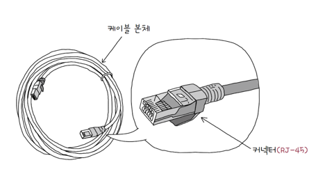

케이블 본체를 뜯어보면 케이블 이름처럼 구리 선이 두 가닥씩 꼬아져있는 모습입니다.

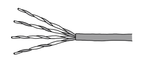

### 3.2.2. 실드에 따른 트위스티드 페어 케이블 분류
트위스티드 페어 케이블은 구리 선으로 만들어졌기에 노이즈에 민감합니다.  
그래서 구리 선 주변을 감싸 노이즈를 감소시키는 방식인 **차폐**를 한 케이블이 종종 있습니다.

그물 모양의 철사인 브레이드 실드를 감싸거나 포일을 감싼 포일 실드 방식이 있습니다.

브레이드 실드로 감싼 케이블을 STP (Shielded Twisted Pair), 포일로 감싼 케이블을 FTP (Foil Twisted Pair), 아무것도 감싸지 않은 케이블을 UTP (Unshield Twisted Pair) 라고 합니다.

트위스티드 페어 케이블을 명칭할 때는 위에서 언급한 S, F, U 를 본따서 짓습니다.  
만약, 케이블 외부를 감싸는 실드 종류가 S와 F, 케이블 내부를 감싸는 실드 종류가 F이면 'SF/FTP' 라고 합니다.  
케이블 외부를 감싸는 실드는 한 가지 또는 두 가지 종류일 수 있습니다.

### 3.2.3. 카테고리에 따른 트위스티드 페어 케이블의 분류
트위스티드 페어 케이블은 카테고리에 따라서도 분류할 수 있습니다.
여기서 카테고리는 트위스티드 페어 케이블 성능의 등급을 구분하는 역할입니다.

표기할 때는 보통, Category의 앞 세 글자만 따서 _Cat_ 에다가 숫자를 추가하는 형식입니다.  
예를 들어, "Cat3(혹은 Cat.3)" 처럼이요.

아래 사진은 현재 가장 대표적으로 사용되는 카테고리를 분류한 표 사진입니다.  
표에서 볼 수 있듯이, 카테고리마다 지원 가능한 대역폭, 규격, 전송 속도가 다릅니다.  
그리고 숫자가 높을수록 더 좋은 성능을 낸다는 것도 확인할 수 있습니다.

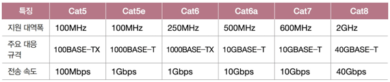

## 3.3. 광섬유 케이블
다음으로는 **광섬유 케이블**에 대해 알아보겠습니다.

광섬유 케이블은 **빛**을 이용해 정보를 주고받는 케이블입니다.  
덕분에 전기 신호를 이용하는 케이블에 비해 **속도도 빠르고**, **먼 거리까지 전송이 가능**합니다. 노이즈로부터 간섭받는 영향도 적습니다.  
주로 대륙 간 네트워크 연결에도 사용됩니다.

### 3.3.1. 광섬유 케이블의 생김새
광섬유 케이블은 아래와 같이 생겼습니다.

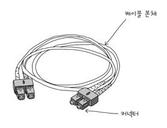

그런데 광섬유 케이블은 커넥터의 종류가 다양한데요. 그 종류는 다음과 같습니다.

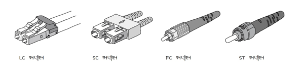

광섬유 케이블 본체 내부에는 아래 사진처럼 여러 개의 광섬유로 구성되어 있습니다.  
이 광섬유가 빛을 운반합니다.

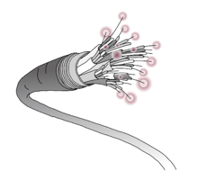

그리고 광섬유 한 가닥을 확대해보면 아래 사진과 같습니다.  
코어는 실제로 빛이 흐르는 부분이고, 클래딩은 빛이 코어 안에서만 흐르도록 빛을 가두는 역할을 합니다.

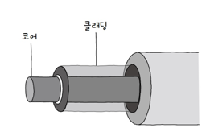

광섬유 케이블은 코어의 지름에 따라 _싱글 모드 광섬유 케이블_ 과 _멀티 모드 광섬유 케이블_ 로 나뉩니다.  
이 둘은 광섬유 케이블의 종류를 구분하는 가장 기본적인 기준입니다.

### 3.3.2. 싱글 모드 광섬유 케이블
싱글 모드 광섬유 케이블은 코어의 지름이 8~10µm 입니다.  
멀티 모드 광섬유 케이블보다 더 작은 수치입니다.

코어의 지름이 작다면 빛이 이동할 수 있는 경로 자체가 많지 않습니다.  
다시 말해 빛의 이동 경로가 하나 이상 갖기 어렵고, 때문에 "싱글 모드" 라고 표현합니다.

싱글 모드 케이블은 신호 손실이 적기에 장거리 전송에 적합합니다. 하지만 상대적으로 비싸다는 단점이 있습니다.

싱글 모드 케이블은 파장이 긴 장파장의 빛을 사용합니다.

### 3.3.3. 멀티 모드 광섬유 케이블
멀티 모드 광섬유 케이블은 코어의 지름이 50~62.5µm 정도로 싱글 모드보다 훨씬 큽니다.  
덕분에 빛이 여러 경로로 이동할 수 있습니다. 이를 두고 "멀티 모드" 라고 합니다.

멀티 모드 광섬유 케이블은 싱글 모드에 비해 신호 손실이 클 수 있기에 단거리 전송에 적합합니다.  
또한, 단파장의 빛을 이용합니다.

# 4. 허브
허브는 **물리 계층**의 네트워크 장비입니다.  
_리피터 허브_ 라고 부르기도 하고, 이더넷 네트워크의 허브는 _이더넷 허브_ 라고도 부릅니다.

허브는 아래 사진처럼 생겼습니다.  
한 대의 허브에 여러 대의 커넥터를 연결할 수 있는 **포트**가 존재하고, 이 포트에 케이블을 연결해서 N대의 호스트와 연결합니다.

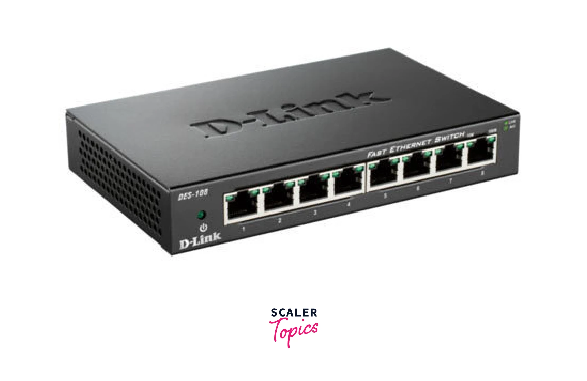

> 사실 허브는 오늘날 인터넷 환경에서 잘 사용되지 않습니다.  
> 대신 허브가 가진 두 가지 큰 특징이 네트워크 개념을 내포하고 있습니다.

## 4.1. 허브의 역할
### 4.1.1. 전달받은 신호를 다른 모든 포트로 그대로 다시 내보낸다.
다시 이야기하지만 허브는 **물리 계층**에 포함되는 장비입니다.  
**물리 계층은 주소 개념이 없기에 수신지를 특정할 수 없습니다**.  

따라서 신호를 전달받으면 송신지를 제외한 모든 포트에 그저 전달만 해야 합니다.

그리고 각 호스트에서 허브를 통해 전달받은 패킷을 데이터 링크 계층에서 MAC 주소를 비교해서 불필요한 패킷의 경우 폐기합니다.

### 4.1.2. 반이중 모드로 통신한다.
허브는 반이중 모드로 통신합니다.

**반이중 모드(Half Duplex)**란, 두 호스트가 통신을 할 때 번갈아가면서 데이터를 전달하는 통신 방식입니다.
한 호스트가 신호를 전송 중일 때 상대 호스트는 신호를 전송할 수 없습니다.

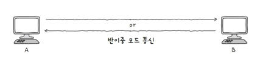

반대로 **전이중 모드(Full Duplex)**란, 송수신을 동시에 양방향으로 할 수 있는 통신 방식입니다.  
신호를 보내면서 동시에 받을 수도 있는 셈이죠.

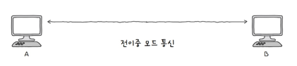

> 리피터 (Repeater)  
> 허브 외에도 물리 계층에는 _리피터_ 라는 장비가 있습니다.  
> 리피터는 전기 신호가 긴 거리를 이동함에 따라 신호가 약해지거나 왜곡되는 것을 방지하기 위해 전기 신호를 증폭시켜주는 장비입니다.  
> 허브와 마찬가지로 물리 계층의 장비이므로, 전달받은 신호를 증폭만해서 그대로 다른 모든 호스트로 전달만 합니다.  
> 허브는 이러한 리피터의 기능을 포함하는 경우가 많습니다.

## 4.2. 콜리전 도메인
허브는 반이중 통신입니다. 그래서 한 호스트가 허브에 신호를 전달하는 동안에는 다른 호스트는 허브로 신호를 전달할 수 없습니다.  
그런데 만약 2대 이상의 호스트가 동시에 허브로 신호를 전달하면 충돌(collision)이 발생합니다.

허브에 호스트가 많이 연결되어 있을수록 충돌 발생 가능성이 높은데요.  
이렇게 충돌이 발생할 수 있는 영역을 **콜리전 도메인** 이라고 부릅니다.  
따라서 허브에 연결된 모든 호스트는 동일한 콜리전 도메인에 속합니다.

허브에서 발생하는 충돌 문제를 해결하려면 **CSMA/CD** 프로토콜을 사용하거나 스위치 장비를 사용해야 합니다.

## 4.3. CSMA/CD
CSMA/CD는 반이중 이더넷 네트워크에서 충돌을 방지하는 대표적인 프로토콜입니다.

CSMA/CD가 하는 역할을 세 가지입니다.

1. **CS (Carrier Sense), 캐리어 감지**: 호스트가 허브로 신호를 전송하기 전에, 현재 네트워크 상에서 전송 중인 것이 있는지를 먼저 확인합니다.

2. **MA (Multiple Access), 다중 접근**: 캐리어 감지를 했음에도 부득이 두 호스트가 동시에 송신하는 경우를 의미합니다.

3. **CD (Collision Detection), 충돌 검출**: 충돌이 발생하면 전송이 중단되고, 충돌을 검출한 호스트는 다른 호스트에게 충돌이 발생했음을 알리는 Jam Signal이라는 신호를 보냅니다. 그리고 임의의 시간 동안 대기한 다음 신호를 재전송합니다.

# 5. 스위치
**스위치**는 데이터 링크 계층의 네트워크 장비입니다.  
OSI 7계층 기준으로 2계층인 데이터 링크 계층에 속한다고 해서 **L2 스위치** 라고도 부릅니다.

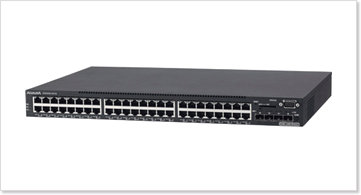

허브와 마찬가지로 스위치의 여러 포트에 호스트를 연결할 수 있습니다.  
다만 스위치는 **MAC 주소를 학습해 특정 MAC 주소를 가진 호스트에만 프레임을 전달**할 수 있고, **전이중 통신 모드**를 지원합니다.  
그렇기에 스위치를 이용하면 포트별로 콜리전 도메인이 나뉘고, 전이중 모드로 통신하므로 CSMA/CD 프로토콜을 사용하지 않아도 됩니다.

CSMA/CD의 대기 시간이 사라지므로 전송 속도도 자연스레 향상됩니다.

많은 장점으로 오늘날 이더넷 네트워크 구성 시 자주 사용됩니다.

## 5.1. 스위치의 특징
L2 스위치의 가장 핵심적인 특징은 **특정 포트와 그 포트에 연결된 호스트의 MAC 주소의 관계를 기억한다**는 점입니다.  
덕분에 원하는 호스트로만 프레임을 전달할 수 있습니다.  
이러한 기능을 **MAC 주소 학습**이라고 합니다.

L2 스위치는 포트와 포트에 연결된 호스트의 관계를 테이블 형태로 기억하는데, 이 테이블을 **MAC 주소 테이블**이라고 합니다.  
아래 사진은 실제로 L2 스위치에 접속해서 저장된 MAC 주소 테이블을 확인한 결과입니다.

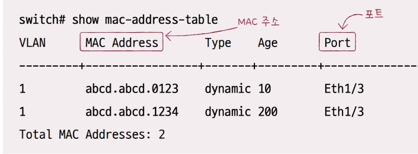

## 5.2. MAC 주소 학습
그렇다면 L2 스위치는 MAC 주소를 **어떻게 학습**할까요?

MAC 주소 테이블은 초기 상태에는 비어있는 상태입니다.  
이때 호스트 A가 호스트 C로 프레임을 전송한다고 가정해보겠습니다.  
호스트 A로부터 전달받은 프레임을 토대로, L2 스위치는 호스트 A와 연결된 포트에 대해서 호스트 A의 MAC 주소를 매핑합니다.  
아래 사진과 같은 모습이 되겠습니다.

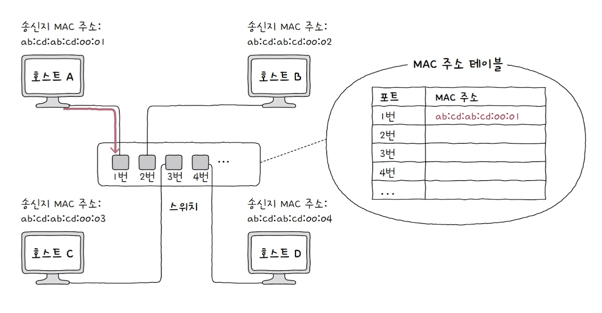

하지만 아직도 수신지인 호스트 C의 MAC 주소와, 어떤 포트에 연결되어 있는 지 알지 못합니다.  
이를 알아내기 위해 **플러딩 (flooding)** 을 수행합니다.  
마치 허브처럼 다른 모든 호스트로 프레임을 전송하는 과정인데요. 호스트 B와 D는 관계가 없는 프레임이기 때문에 이를 폐기합니다.  
하지만 호스트 C는 프레임을 정상적으로 수신하고, L2 스위치로 응답 프레임을 보내게 됩니다.  
이때 L2 스위치는 호스트 C의 MAC 주소와 몇 번 포트에 연결되어 있는지를 파악할 수 있게 됩니다.

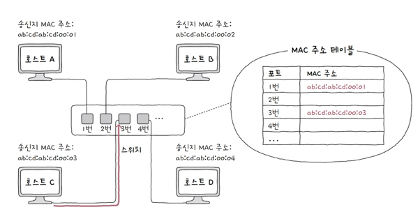

이제 호스트 A와 C의 MAC 주소를 모두 학습했습니다!  
이후로는 호스트 A와 C 간의 통신이 수행될 때는 MAC 주소 테이블을 참고하여 수신지로만 프레임을 전달할 수 있습니다.  
이를 **필터링**이라고 합니다.

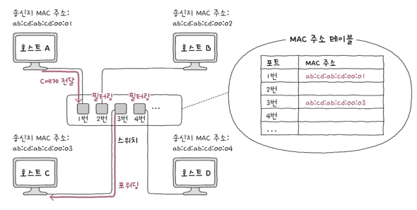

이후로 MAC 주소 테이블에 등록된 특정 포트에서 일정 시간 동안 프레임을 전송받지 못하면, 해당 항목은 삭제됩니다.  
이를 **에이징**이라고 합니다.

## 5.3. VLAN
스위치의 또 다른 중요한 기능으로 **VLAN** (Virtual LAN)이 있습니다.  
이름 그대로, **한 대의 스위치로 가상의 LAN을 만드는 방법**입니다.

아래 사진이 한 대의 스위치를 이용해 VLAN을 나눈 예시입니다.

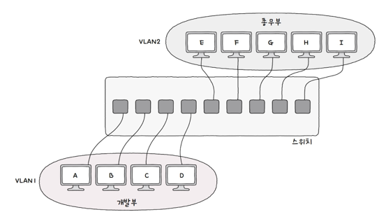

스위치에 연결된 호스트 중에서도 **서로 메시지를 받을 일이 없거나**, **브로드캐스트 메시지를 받을 필요가 없어** 굳이 같은 LAN에 포함될 필요가 없는 호스트가 있을 수 있습니다.

그렇다고 이들을 분리하고자 매번 새로운 스위치 장비를 마련하면 비용이 많이 들게 됩니다.    
이때 **한 대의 스위치로 VLAN을 구성하여, 여러 개의 논리적인 LAN을 나눌 수 있습니다**.

위 그림에서는 A, B, C, D 호스트는 서로 동일한 LAN에 속한 것으로 인식됩니다.  
E, F, G, H, I 호스트끼리도 같은 LAN에 속한 것으로 인식됩니다.

만약 VLAN1에 속한 호스트에서 VLAN2에 속한 호스트와 통신하고자 한다면, 데이터 링크 계층의 장비가 아니라 그 이상 상위 계층의 장비가 필요합니다.

또한, 브로드캐스트 도메인도 달라집니다.  
VLAN1에서 브로드캐스트를 하게 되면 VLAN1에 속한 호스트에만 프레임이 전달됩니다.

### 5.3.1. VLAN을 구성하는 방법
1. 포트 기반 VLAN  
    - 가장 단순하지만 대중적인 방식으로, 스위치의 포트가 VLAN을 결정하는 방식입니다.
    - 사전에 특정 포트에 VLAN을 할당하고, 해당 포트에 호스트를 연결함으로써 VLAN에 포함합니다.
    - 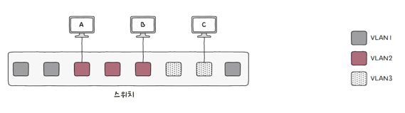
    - 하지만 이 방식은 VLAN 개수와 연결해야 하는 호스트 수가 많아지면 포트 수가 부족해진다는 문제가 있습니다.  
      이를 해결하기 위해서는 스위치 간의 통신을 위한 특별한 포트인 **트렁크 포트**에 스위치를 서로 연결하여, 포트를 확장할 수 있습니다.  
      (트렁크 포트가 아닌 포트를 액세스 포트라고 합니다.)
      

2. MAC 기반 VLAN
    - 사전에 설정된 MAC 주소에 따라 VLAN을 결정하는 방식입니다.
    - 아래 그림처럼 호스트 A의 MAC 주소가 VLAN3에 할당되었다면, 어떤 포트에 연결되었든간에 VLAN3에 속한 것으로 동작합니다.
    - 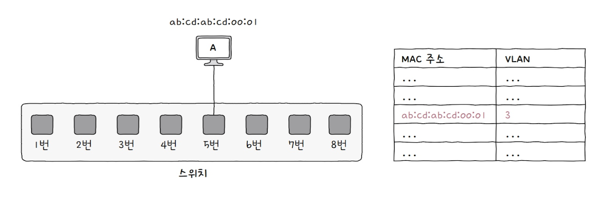

---

# 참고 자료
- [혼자 공부하는 네트워크](https://product.kyobobook.co.kr/detail/S000212911507)
