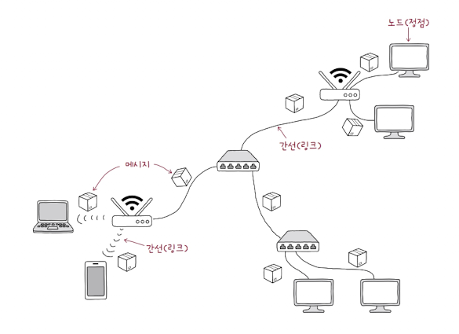
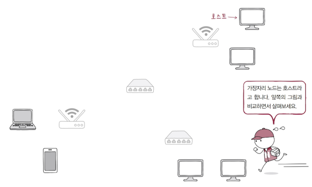
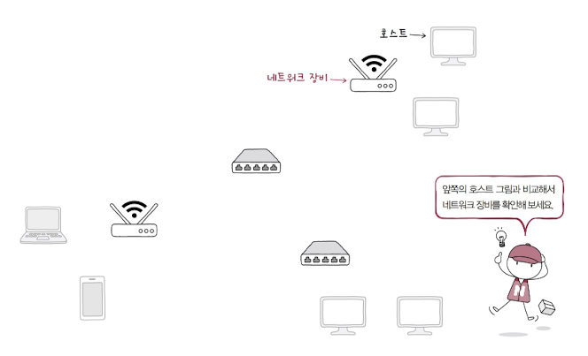
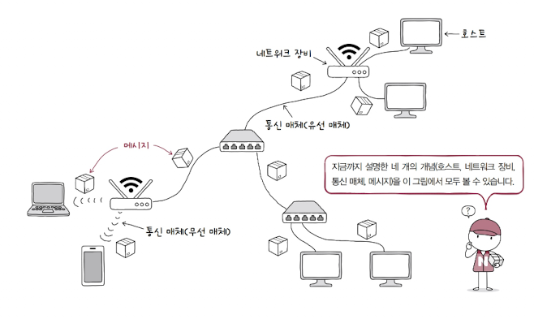
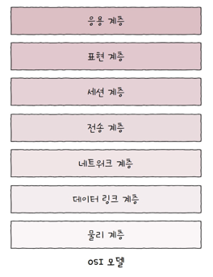
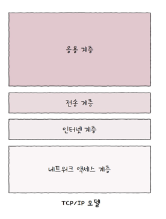
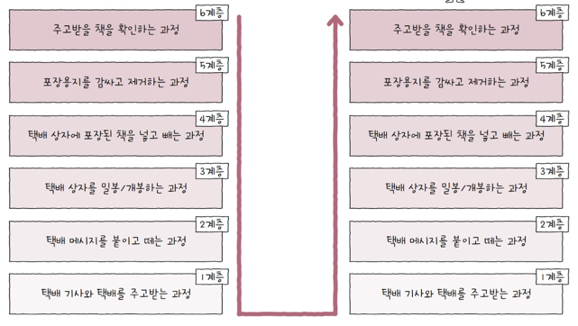
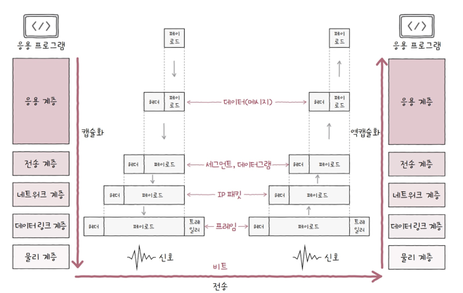

# 컴퓨터 네트워크란?
컴퓨터 네트워크란, 데스크톱, 노트북, 스마트폰 같은 장치들이 서로 연결되어 정보를 주고받을 수 있는 통신망을 컴퓨터 네트워크라고 합니다.  
단순하게 '네트워크'라고 줄여서 부릅니다.

인터넷이란 '네트워크를 연결하는 네트워크'를 의미합니다.  
이 인터넷 덕분에 한국에서 미국에 있는 기기와 통신할 수 있습니다.
즉, 인터넷이 네트워크보다 더 넓은 개념으로 볼 수 있습니다.

---

# 개발자가 네트워크를 알아야 하는 이유
그렇다면 개발자가 네트워크를 반드시 알아야 하는 이유는 무엇일까요?  
소프트웨어를 개발할 때 네트워크 지식을 활용해야 하는 경우가 반드시 존재하며, 유지보수 할 때에도 필요하기 때문입니다.

예를 들어 다음과 같은 기능을 구현하거나 수정할 때 반드시 네트워크 지식이 기반되어야 합니다.

- Spring Integration의 TCP와 UDP 지원 기능 ([공식문서](https://docs.spring.io/spring-integration/reference/ip/intro.html))
- 로그인 기능 (세션/쿠키)
- 배포 (DNS, HTTP/HTTPS, 포트 번호 등)
- 암호와 인증서
- 404 Not Found 또는 502 Bad Gateway 같은 상태 코드 응답

---

# 네트워크 구조
네트워크는 거시적으로 봤을 때 [그래프](https://kdkdhoho.github.io/posts/post-20260214-8885be/) 형태를 띕니다.



그래프에서 노드는 기기를, 간선은 통신 매체(유/무선. 예: 랜선, Wifi, 블루투스 등)입니다.  
즉, 통신 매체로 연결된 기기 간 정보를 주고 받는 구조를 네트워크라고 이해할 수 있겠습니다.

네트워크에서 가장자리에 위치한 노드(기기)를 **호스트**라고 부릅니다.



호스트는 데이터를 최초로 생성 및 송신하고, 최종적으로 수신합니다.  
즉, 서버와 클라이언트의 역할을 수행합니다.

**서버는 어떠한 서비스를 제공하는 호스트**입니다.  
종류로는 파일 서버, 웹 서버, 메일 서버 등이 있습니다.

**클라이언트는 서버에게 어떠한 서비스를 요청하고, 그 서버의 응답을 수신하는 호스트**입니다.

개인 컴퓨터, 노트북, 스마트폰, 서버 컴퓨터 등이 호스트입니다.

네트워크의 가장자리에는 호스트가 있다면, 중간 지점에는 무엇이 있을까요?  
바로 이더넷, 허브, 스위치, 라우터, 공유기와 같은 중간 노드가 있습니다. 이러한 장비들을 **네트워크 장비**라고 부릅니다.



네트워크 장비는 호스트 간 주고받는 정보가 목표하는 발신지까지 안정적이고 안전하게 전송할 수 있도록 합니다.



---

# 범위에 따른 네트워크 분류
그러면 네트워크의 범위는 어떻게 나뉠까요? 어디서부터 어디까지가 하나의 네트워크 단위가 될까요?

호스트 간 데이터를 주고 받는 범위는 일반 가정이 될 수도, 기업이 될 수도, 한 도시나 국가가 될 수 있습니다.  
이렇게 다양한 만큼, 네트워크의 범위에 따라 분류하는 기준이 존재합니다.

바로 LAN과 WAN 입니다.

LAN(Local Area Network)은 가까운 지역을 연결한 **근거리 통신망**을 의미합니다.  
예를 들어 가정, 기업, 학교처럼 제한된 공간의 네트워크가 LAN 입니다.

WAN(Wide Area Network)은 먼 지역을 연결한 **광역 통신망**을 의미합니다.  
멀리 떨어진 LAN을 연결하는 네트워크가 WAN 입니다.  
네트워크와 네트워크를 연결하는 인터넷이 WAN에 속합니다.

LAN 안에서 호스트 간 통신을 할 때는 WAN이 불필요합니다. 하지만 다른 LAN에 속한 호스트와 통신하려면 WAN을 반드시 거쳐야 합니다.  
WAN은 통신 3사와 같은 인터넷 서비스 업체(ISP, Internet Service Provide)가 구축하고 관리합니다.

> LAN은 어떤 방식으로 구축될까요?  
> LAN을 구축하는 방식에는 물리적인 LAN 구축과 클라우드에서의 LAN 구축이 있습니다.  
> 물리적인 LAN 구축은 케이블을 연결하고 스위치를 배치하는 과정이라면, 클라우드에서의 LAN 구축은 소프트웨어 정의 네트워크(SDN) 기술을 이용해 가상의 네트워크 공간(VPC)을 논리적으로 분할하고 설정하는
> 과정입니다.

> CAN과 MAN  
> LAN과 WAN 말고도 CAN과 MAN이라는 두 기준이 있습니다.  
> CAN은 Campus Area Network의 약자로, 학교 또는 회사의 여러 건물 단위로 연결되는 규모의 네트워크입니다.  
> MAN은 Metropolitan Area Network의 약자로, 도시 단위로 연결되는 규모의 네트워크를 의미합니다.
>
> 범위 규모를 큰 순서대로 나열해보면 WAN > MAN > CAN > LAN 순서가 되겠습니다.

---

# 메시지 교환 방식에 따른 네트워크 분류
네트워크 범위에 따른 분류 말고, 메시지 교환 방식에 따른 네트워크 분류도 존재합니다.

크게 **회선 교환 네트워크**과 **패킷 교환 네트워크**로 나눌 수 있습니다.

## 회선 교환 방식
회선 교환 방식은 과거에 널리 쓰인 방식이며, 대표적인 사용 예시는 전통적인 전화망이 있습니다.  
두 호스트가 통신할 때, 그 사이에 있는 **통신 경로를 통째로 점유**하는 방식입니다.

두 호스트 사이에 연결로를 확보한 후에 데이터를 주고 받는다는 특성 덕분에 안정적입니다. 그리고 다른 네트워크 통신에 의해 방해받을 일도 없습니다.  
때문에 고품질 음성 통화, 실시간 비디오 스트리밍처럼 끊김이 없어야 하는 서비스에 최적입니다.

하지만 연결은 해놨는데 정작 데이터 통신이 없으면 회선을 낭비하는 꼴이 됩니다.

회선 교환 방식에서는 두 호스트 간의 메시지 전달을 위해 **회선 스위치** 라는 네트워크 장비(중간 노드)가 존재합니다.  
회선 스위치는 호스트 간의 회선을 적절히 설정하는 역할을 수행합니다.

## 패킷 교환 방식
패킷 교환 방식은 오늘날 대부분의 인터넷에서 사용하는 방식입니다.

회선 교환 방식과 가장 큰 차이점은 **회선 경로를 점유하지 않는다**는 것입니다. 그리고 전달하려는 메시지를 **패킷**이라는 단위로 잘게 쪼개어 전달합니다.  
이렇게 쪼개어진 패킷은 목적지 호스트에서 재조립하는 과정을 거칩니다.

패킷은 전달하고자 하는 메시지가 있고, 이 메시지를 감싸는 데이터가 있는 구조입니다. 이 데이터는 메시지를 전달하는 송신자 주소와 수신자의 주소 등의 부가 정보입니다.  
여기서 전달하려는 메시지를 **페이로드**, 부가 정보를 **헤더**라고 부릅니다. 때로는 패킷 뒤에 **트레일러**라는 정보가 포함되기도 합니다.

> 트레일러(Trailer)란?  
> 패킷의 끝에 위치하여 여러 패킷의 경계를 뚜렷하게 알리는 역할을 하며 오류 검출 역할을 하기도 합니다.  
> 체크섬(Checksum) 또는 CRC(Cyclic Redundancy Check)와 같은 오류 검출 코드가 트레일러에 포함되어 있으면 전송 중에 데이터 손실과 같은 오류가 발생했는지 판단할 수 있습니다.

패킷 교환 방식은 어떠한 회선도 점유되지 않기에 **거시적인 네트워크 관점에서 봤을 때 효율적**입니다.

패킷 교환 방식에도 두 호스트 간의 원활한 메시지 전달을 위해 **패킷 스위치**가 존재하는데요.  
대표적인 예로는 **라우터**와 **스위치**가 있습니다.

### 주소와 송수신지 유형에 따른 전송 방식
패킷의 헤더에 담기는 대표적인 정보로는 **주소**가 있습니다.  
주소는 호스트를 특정하는 정보로, **IP 주소**와 **MAC 주소**가 있습니다.

이 주소를 이용하면, 다양한 방식으로 메시지를 전달할 수 있습니다.  
수신지를 네트워크 내에 속한 다른 모든 호스트에게 전달할 수도 있고, 자신과 동일한 그룹에 속한 호스트로 지정할 수도 있고, 특정 호스트 하나로 지정할 수도 있습니다.

이렇게 송수신지 유형에 따라서 전송 방식을 **유니캐스트**와 **브로드캐스트**로 나눌 수 있습니다.

유니캐스트는 가장 일반적인 송수신 방식으로, 하나의 호스트에 메시지를 전송하는 방식입니다.

브로드캐스트는 **자신을 제외한 네트워크 상의 다른 모든 호스트**에게 메시지를 전송하는 방식입니다.  
브로드캐스트가 전송되는 범위를 **브로드캐스트 도메인**이라고 합니다.  
즉, '브로드캐스트의 수신지 == 브로드캐스트 도메인 == 자신을 제외한 네트워크 상 모든 호스트' 입니다.

이 외에도 네트워크 내 동일 그룹에 속한 호스트에게만 전송하는 **멀티캐스트**, 네트워크 내 동일 그룹에 속한 호스트 중 가장 가까운 호스트에게 전송하는 **애니캐스트** 등 다양한 방식이 존재합니다.

---

# 프로토콜
네트워크를 공부할 때 **프로토콜**이라는 단어를 자주 접합니다.  
프로토콜은 **통신 규약**이라는 뜻입니다.  

쉽게 풀어서 설명해보면 두 호스트가 통신할 때 반드시 지켜야 할 약속입니다.  
우리는 이를 프로토콜이라고 부릅니다.

프로토콜에는 여러 종류가 있습니다. (IP, TCP, UDP, HTTP, FTP, SMTP 등)  

그리고 **프로토콜은 각각의 목적과 특징**이 있습니다.  
때문에 프로토콜마다 패킷 헤더에 포함되는 정보가 달라질 수 있고, 심지어는 프로토콜에 따라 헤더가 없는 경우도 있습니다. 

---

# 네트워크 참조 모델 (네트워크 계층 모델)
네트워크를 통해 데이터를 주고받을 때는 **정형화된 여러 단계를 거칩니다**.  
이 단계를 계층으로 표현할 수 있고, 이렇게 통신이 일어나는 각 과정을 계층으로 나눈 구조를 **네트워크 참조 모델** 또는 **네트워크 계층 모델** 이라고 부릅니다.

통신 과정을 계층으로 나눈 이유는 크게 다음과 같습니다.

1. 각 계층 별 목적이 분명히 나뉘므로 해당 계층의 목적에 맞게 설계하고 구성하기 용이하다.
2. 문제 발생의 원인을 분명히 알 수 있다. 각 계층 별로 원인을 파악하면, 해당 계층만 새로운 네트워크 장비로 변경해서 수리하면 다른 계층은 건드릴 필요가 없다.

한 마디로 각 단계를 **추상화**한 결과물이 계층이라고 볼 수 있겠습니다.

.  
.  
.

네트워크 참조 모델의 가장 대표적인 모델이 두 가지가 있습니다.  
바로, **OSI 7계층**과 **TCP/IP 모델** 입니다.

## OSI 7계층
국제 표준화 기구, ISO에서 만든 네트워크 참조 모델입니다.  
이름 그대로 일곱 계층으로 나뉩니다. (물리 계층 -> 데이터 링크 계층 -> 네트워크 계층 -> 전송 계층 -> 세션 계층 -> 표현 계층 -> 응용 계층)



이상적인 모델로, 주로 네트워크를 이론적으로 기술하고 이해할 때 사용하는 모델입니다.

## TCP/IP 모델
OSI 7계층은 이론에 초점을 둔 모델이라면, TCP/IP 모델은 실용적인 구현에 초점을 둔 모델입니다.

네 계층으로 나뉩니다. (네트워크 액세스 계층 -> 인터넷 계층 -> 전송 계층 -> 응용 계층)



이때 네트워크 액세스 계층의 경우, 과거에는 데이터 링크 계층에 대응했었는데요.  
현재는 TCP/IP 모델을 OSI 7계층에 빗대어 설명하기 위해 물리 계층을 추가한 5계층으로 설명하기도 합니다.  

---

# 캡슐화
오늘날 대부분의 네트워크는 데이터를 주고받기 위해 패킷 교환 방식을 사용하고 네트워크 참조 모델을 통해 통신한다고 이해했습니다.  
여기서 한 가지 중요한 키워드가 또 있습니다. 바로 **캡슐화**입니다.

패킷은 송신 과정에서 **캡슐화**가 일어나고, 수신 과정에서 **역캡슐화**가 발생합니다.



송신자 호스트에서 네트워크 참조 모델을 거쳐 패킷이 조립하고, 물리 계층을 거쳐 패킷이 수신자 호스트로 전송됩니다.  
수신자 호스트에서 전달받은 패킷을 그대로 네트워크 참조 모델을 거쳐 패킷을 분해합니다.

> _패킷의 조립은 분해의 역순_ 입니다.

정리해보면, 전달하려는 데이터를 네트워크 참조 모델을 거쳐 패킷으로 캡슐화되고, 전달된 패킷은 똑같은 네트워크 참조 모델을 역순으로 거쳐 패킷을 역캡슐화하여 데이터를 전달받습니다.

## PDU
각 계층에서는 계층의 역할과 목적에 맞게 헤더를 추가(캡슐화)합니다.  
이때 각 계층에서 송수신되는 패킷 메시지의 단위를 **PDU** (Protocol Data Unit) 라고 합니다.

각 계층 별 PDU의 이름이 약간씩 다릅니다. 이를 알아두는 것이 좋습니다.

|  OSI 계층   |                   PDU                    |
|:---------:|:----------------------------------------:|
|   응용 계층   |                데이터(data)                 |
|   표현 계층   |                데이터(data)                 |
|   세션 계층   |                데이터(data)                 |
|   전송 계층   | TCP: 세그먼트(segment), UDP: 데이터그램(datagram) |
|  네트워크 계층  |              IP 패킷(packet)               |
| 데이터 링크 계층 |                프레임(frame)                |
|   물리 계층   |                 비트(bit)                  |



---

# OSI 7계층, TCP/IP 4계층은 사실 아무것도 해주지 않는다.
네트워크 참조 모델은 반드시 지켜져야 하는 규칙은 아니며, 모든 프로토콜이나 네트워크 장비는 네트워크 참조 모델에 근거해 반드시 특정 계층에 완벽히 대응되지 않습니다.

네트워크 참조 모델은 모든 프로토콜과 네트워크 장비가 반드시 지켜야 하는 엄격한 규칙이나 법규가 아니고 가이드라인과 같습니다.

네트워크 참조 모델은 분명 중요한 개념이지만, 네트워크 _참조_ 모델이라는 이름처럼 네트워크 구조에 대한 개념 참조를 위해 사용하는 것이 바람직합니다.

지금도 새로운 프로토콜과 네트워크 장비는 만들어지고 있고, 모든 프로토콜이 모든 모델의 특정 계층에 완벽히 대응되지는 않습니다.

그래서 물론 특정 계층으로 명확히 분류되는 프로토콜이나 네트워크 장비도 다수 있지만, 특정 계층으로 분류하기 어렵거나 여러 계층을 포괄하는 프로토콜이나 네트워크 장비도 얼마든지 있을 수 있습니다.

네트워크 참조 모델이나 특정 계층은 네트워크를 작동시키는 주체가 아닙니다.  
**프로토콜 혹은 네트워크 장비 같은 대상이 바로 네트워크를 작동시키는 주체**입니다.  

---

# 트래픽과 네트워크 성능 지표
네트워크의 성능을 평가하는 대중적인 지표 세 가지가 있습니다.

## 1. 처리율 (throughput)
- **단위 시간당 네트워크를 통해 실제로 전송되는 정보량** 입니다.
- 실시간성이 강조된 지표로, 특정 노드가 얼만큼의 트래픽을 처리 중인지 판단하기 위해 사용됩니다.

## 2. 대역폭 (bandwidth)
- **단위 시간 동안 통신 매체를 통해 송수신할 수 있는 최대 정보량**을 의미합니다.
- 처리율과 똑같이 bps를 단위로 사용합니다.
- 만약 통신 매체가 높은 대역폭을 가지고 있다면, 이는 많은 정보를 송수신할 능력이 있음을 의미합니다.

## 3. 패킷 손실 (packet loss)
- **송수신되는 패킷이 손실된 상황**을 의미합니다.  
- 높은 트래픽으로 인해 노드가 순간적으로 처리해야 할 패킷이 너무 많아지거나 네트워크상에 예기치 못한 장애가 발생해서 패킷을 처리하지 못하면 패킷 손실이 발생할 수 있습니다.  
- 패킷 손실은 전체 패킷 중 유실된 패킷을 백분위로 표현한 값을 사용하는 경우가 많습니다.  
- 패킷 손실은 터미널에서 `ping` 명령어로 확인할 수 있습니다.  
  (`ping`: 수신지로 다수의 패킷을 전송해 수신지까지 도달 가능한지 여부를 알려 줍니다. 몇 개의 패킷을 보내고, 받았는지, 몇 %의 패킷이 손실되었는지를 알 수 있습니다.)

  ```shell
  # ping 결과
  ping www.naver.com
  PING www.naver.com.nheos.com (223.130.200.236): 56 data bytes
  Request timeout for icmp_seq 0
  Request timeout for icmp_seq 1
  Request timeout for icmp_seq 2
  Request timeout for icmp_seq 3
  Request timeout for icmp_seq 4
  Request timeout for icmp_seq 5
  Request timeout for icmp_seq 6
  Request timeout for icmp_seq 7
  Request timeout for icmp_seq 8
  Request timeout for icmp_seq 9
  Request timeout for icmp_seq 10
  Request timeout for icmp_seq 11
  ^C
  --- www.naver.com.nheos.com ping statistics ---
  13 packets transmitted, 0 packets received, 100.0% packet loss
  ```

---

# 참고 자료

- [혼자 공부하는 네트워크](https://product.kyobobook.co.kr/detail/S000212911507)
