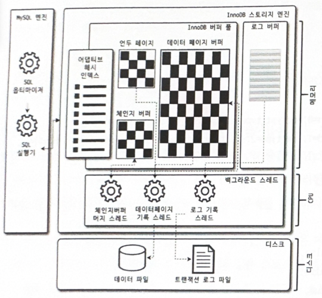

## InnoDB 스토리지 엔진

MySQL에서 사용할 수 있는 스토리지 엔진 중 거의 유일하게 **레코드 기반 Lock**을 지원한다.

덕분에 **높은 동시성 처리**와 **뛰어난 성능**을 가진다.

### 아키텍처

InnoDB의 전반적인 아키텍처는 다음과 같다.



## InnoDB의 주요 특징

### 프라이머리 키에 의한 클러스터링

모든 InnoDB 테이블은 PK에 의해 클러스터링 인덱스가 생성된다.

따라서 PK를 이용한 조회가 성능에 큰 영향을 끼친다.

### 외래 키 지원

FK를 지원한다.

다만, FK를 사용할 때는 부모 테이블과 자식 테이블에 데이터 존재 유무를 체크하는 작업이 필요하다.

이때 Lock이 여러 테이블로 전파되고, 이로 인해 데드락이 발생할 가능성이 많으므로 사용에 주의해야 한다.

`foregin_key_checks` 시스템 변수를 OFF로 설정하면 외래 키 관계에 대한 체크 작업을 일시적으로 멈출 수 있다.<br>
데이터 추가 및 삭제 시에, 부가적인 작업이 발생하지 않게 된다.<br>
다만, `foregin_key_checks`가 비활성화되면 `ON DELETE CASCADE` 나 `ON UPDATE CASCADE`도 무시하게 된다.

> `foregin_key_checks` 시스템 변수는 적용 범위를 GLOBAL과 SESSION 모두 설정 가능하다.<br>
> 따라서 본 작업을 수행할 때는 반드시 현재 작업을 수행하는 SESSION에서만 외래 키 체크 기능을 해제하는 것이 안전하다.<br>
> 명령어는 다음과 같다.<br>
> `mysql> SET SESSION foreign_key_checks=OFF;`<br>
> 작업이 완료되면 반드시 현재 세션을 종료하기 전, 다시 활성화해야 한다.

### MVCC(Multi Version Concurrency Control)

MVCC의 가장 큰 목적은, **잠금을 사용하지 않는 일관된 읽기를 제공하는 데 있다.**

InnoDB는 **언두 로그를 이용해 이 기능을 구현한다.**

여기서 Multi Version이라 함은 하나의 레코드에 대해 여러 개의 버전이 동시에 관리된다는 의미다.

예시를 통해 더 자세히 알아보자.

```sql
CREATE TABLE member (
    id      BIGINT PRIMARY KEY AUTO_INCREMENT,
    name    VARCHAR(20) NOTNULL,
    area    VARCHAR(100) NOT NUL,
    INDEX idx_area (area)
);

INSERT INTO member VALUES ('홍길동', '서울');
```

회원 정보를 저장하는 member 테이블을 생성하고 이름은 홍길동, 지역은 서울인 레코드를 추가한다.

데이터베이스의 상태는 다음과 같이 바뀔 것이다.


이후, 지역을 서울에서 경기로 수정한다.

```sql
UPDATE member SET area='경기' where id = 1;
```

UPDATE 쿼리가 실행되면 InnoDB 버퍼 풀에는 커밋 여부와 상관없이 새로운 값인 경기로 수정된다.

디스크에는 체크포인트나 Write 쓰레드에 의해 새로운 값으로 수정됐을 수도, 아닐 수도 있다.

아직 커밋이나 롤백이 되지 않은 상태에서 다른 세션에 의해 해당 데이터의 조회가 발생하면 데이터베이스는 어떻게 작업을 수행할까?

이때는 **MySQL 서버의 시스템 변수에 설정된 격리 수준에 따라 다르다.**

격리 수준이 READ_UNCOMMITED인 경우에는, 버퍼 풀의 데이터를 조회한다.

격리 수준이 READ_COMMITED 혹은 REPEATABLE_READ, SERIALIZABLE인 경우에는 언두 로그의 값을 조회한다.


이러한 과정을 DBMS에서 MVCC라고 표현한다.

만약 UPDATE 쿼리가 COMMIT 되면 지금의 상태를 영구적인 데이터로 만든다.

반대로 **ROLLBACK 되면 언두 로그에 있는 데이터를 버퍼 풀로 다시 복구하고 언두 로그의 데이터를 삭제한다.**<br>

언두 로그의 데이터는는, 해당 데이터를 필요로 하는 트랜잭션이 더는 없을 때 비로소 삭제된다.

### 잠금 없는 일관된 읽기(Non-Locking Consistent Read)

위의 MVCC 기술을 이용해 잠금을 걸지 않고 읽기 작업을 수행한다.

격리 수준이 SERIALIZABLE이 아니며 INSERT와 연결되지 않은 순수한 SELECT 작업은, 다른 트랜잭션의 변경 작업과 관계없이 항상 Lock을 대기하지 않고 바로 실행된다.

### 자동 데드락 감지

내부적으로 잠금 대기 목록을 그래프(Wait-for List) 형태로 관리한다.

데드락 감지 쓰레드가 주기적으로 잠금 대기 그래프를 검사해 데드락에 빠진 Tx들을 찾아 그 중 하나를 강제 종료한다.

이때 기준은 언두 로그 레코드를 더 적게 가진 Tx를 강제 종료한다.

> InnoDB는 스토리지 엔진이기에 MySQL 엔진에서 관리되는 테이블 잠금은 볼 수가 없어 데드락 감지가 불확실할 수 있다.<br>
> 하지만 `innodb_table_locks` 시스템 변수를 활성화하면 InnoDB 스토리지 엔진의 레코드 잠금뿐만 아니라 테이블 레벨의 잠금까지 감지할 수 있게 된다.<br>
> 따라서 특별한 이유가 있는 것이 아니라면 위 변수를 활성화하자.

일반적인 서비스에서는 데드락 감지 스레드의 작업이 부담되지 않는다.<br>
하지만 동시에 처리해야하는 스레드의 수가 매우 많아지거나 각 Tx이 가지는 잠금이 많아지면 데드락 감지 스레드의 작업이 느려진다.

데드락 감지 스레드는 잠금 목록을 검사한다.<br>
당시의 잠금 상태가 변경되지 않도록 잠금 목록이 저장된 리스트(잠금 테이블)에 새로운 잠금을 걸게 된다.<br>
즉, 데드락 감지 스레드가 느려지면 서비스 쿼리에도 악영향이 미치게 된다.

위 문제를 해결하기 위해 `innodb_deadlock_detect` 시스템 변수가 존재하고 해당 변수를 비활성화하여 데드락 감지 스레드를 사용하지 않을 수 있다.

하지만 이렇게 되면 데드락이 발생할 수 있는 가능성이 존재하기 때문에 다른 대안이 필요하다.

이럴 땐 `innodb_lock_wait_timeout` 시스템 변수를 활성화할 수 있다.

default 값은 50초인데, 이보다 훨씬 낮은 시간으로 설정하여 데드락을 방지하자.

### 자동화된 장애 복구

MySQL 서버가 시작될 때 완료되지 못한 Tx이나 디스크에 일부만 기록된 데이터 페이지 등에 대한 일련의 복구 작업이 알아서 진행된다.

만약 자동으로 복구될 수 없는 정도의 손상이라면 자동 복구를 멈추고 MySQL 서버를 종료시킨다.

### InnoDB 버퍼 풀

**InnoDB 스토리지 엔진에서 가장 핵심적인 부분이다.**

**디스크의 데이터 파일이나 인덱스 정보를 메모리에 캐시해 두는 공간이다.**

쓰기 작업을 지연시켜 일괄 작업으로 처리할 수 있도록 하는 버퍼의 역할도 수행한다.

#### 버퍼 풀의 크기 설정

버퍼 풀의 크기는 적절히 작은 값부터 시작해 조금씩 큰 값으로 설정하는 것이 최적의 방법이다.

기존에 사용하는 MySQL 서버가 있다면 해당 서버의 메모리 설정을 기준으로 크기를 조정하자.<br>
만약 처음으로 MySQL 서버를 준비한다고 했을 땐, 운영체제의 전체 메모리 공간이 8GB 미만이라면 50% 정도로 설정한다.<br>
전체 메모리 공간이 8GB 이상이라면 50% 에서 시작해서 조금씩 올려가며 최적점을 찾는다.

`innodb_buffer_pool_size` 시스템 변수로 크기를 설정할 수 있다.

하지만 버퍼 풀 크기 변경은 크리티컬한 변경이므로 서버가 한가한 시간에 수행해야 한다.<br>
그리고 용량을 더 크게 변경하는 건 시스템 영향도가 크진 않지만 줄이는 작업은 영향도가 매우 크므로 가능한 하지 않도록 하자.

버퍼 풀은 내부적으로 128MB 청크 단위로 쪼개어 관리된다.<br>
이는 버퍼 풀의 크기를 변경하는 단위로 사용된다.

#### 버퍼 풀의 구조

버퍼 풀은 3개의 자료 구조를 관리한다.

- LRU(Least Recently Used) List
  - 디스크로부터 한 번 읽어온 페이지를 최대한 오랫동안 보관하여 디스크 IO를 최소화하기 위해 사용
- Flush List
  - 디스크로 동기화되지 않은 데이터를 가진 데이터 페이지(더티 페이지)의 변경 시점 기준의 페이지 목록을 관리
- Free List
  - 실제 사용자 데이터로 채워지지 않은 비어 있는 페이지들의 목록
  - 사용자의 쿼리가 새롭게 디스크의 데이터 페이지를 읽어와야 하는 경우 사용

### Double Write Buffer

InnoDB의 리두 로그는 공간을 효울적으로 사용하기 위해 페이지의 변경된 내용만 기록한다.<br>
이로 인해 더티 페이지를 디스크 파일로 플러시할 때 일부만 기록되는 문제가 발생하면 그 페이지의 내용은 복구할 수 없을 수도 있다.<br>
이렇게 페이지가 일부만 기록되는 현상을 Partial-page 또는 Torn-page 라고 하는데, 하드웨어의 오작동이나 시스템 비정상 종료 등올 발생할 수 있다.

이 같은 문제를 막기 위해 사용하는 기법이 Double-Write 기법이다.

InnoDB 버퍼 풀에 존재하는 더티 페이지를 한 번의 디스크 쓰기로 시스템 테이블스페이스의 DoubleWrite 버퍼에 기록한다.<br>
그리고 각 더티 페이지를 데이터 파일에 하나씩 랜덤으로 쓰기를 실행한다.

이렇게 시스템 테이블스페이스의 DoubleWrite 버퍼에 기록된 변경 내용은 디스크에 모두 정상적으로 기록되면 필요가 없어진다.<br>
하지만 실제 데이터 파일의 쓰기가 중간에 실패할 때만 원래의 목적으로 사용된다.

InnoDB 스토리지 엔진은 재시작될 때 항상 DoubleWrite 버퍼의 내용과 디스크 데이터 파일을 모두 비교해서 다른 내용을 담고 있는 페이지가 존재한다면, DoubleWrite 버퍼의 내용을 디스크 데이터 파일의 페이지로 복사한다.

### 언두 로그

트랜잭션과 격리 수준을 보장하기 위해 **변경되기 이전 버전의 데이터를 별도로 백업한다.**<br>
이렇게 **백업된 데이터를 언두 로그라고 한다.**

### 체인지 버퍼

레코드가 INSERT 되거나 UPDATE 될 때는 데이터 파일 뿐만 아니라 해당 테이블에 포함된 인덱스를 업데이트하는 작업도 필요하다.<br>
하지만 인덱스를 업데이트하는 작업은 디스크를 랜덤하게 읽는 작업이 포함된다.

변경해야 할 인덱스 페이지가 버퍼 풀에 있으면 바로 업데이트를 수행하지만, 그렇지 않고 디스크로부터 읽어와서 업데이트해야 하는 상황이라면 임시 공간에 저장해두고 곧바로 사용자에게 결과를 반환하는 형태로 성능을 향상시킨다.<br>
이때의 임시 공간이 체인지 버퍼다.

### 리두 로그 및 로그 버퍼

ACID 중, 영속성과 밀접한 관련이 있다.<br>
모종의 이유로 인해 MySQL 서버가 비정상적으로 종료됐을 때 데이터 파일에 기록되지 못한 데이터를 복구할 때 사용하는 것이 리두 로그다.

대부분의 데이터베이스는 데이터 변경 내용을 로그로 먼저 기록한다.<br>
이유는, 보통 쓰기보다 읽기의 성능을 고려한 자료 구조를 가지고 있기 때문에 데이터 파일 쓰기는 랜덤 디스크 액세스가 필요하다.<br>
그래서 변경된 데이터를 데이터 파일에 기록하려면 상대적으로 큰 비용이 필요하다.

이로 인한 **쓰기 성능 저하를 막기 위해 데이터베이스 서버는 쓰기 비용이 낮은 자료 구조인, 리두 로그를 가진다.**

비정상 종료가 발생하면 리두 로그의 내용을 이용해 데이터 파일을 다시 서버가 종료되기 전으로 복구한다.

### 어댑티브 해시 인덱스

InnoDB 스토리지 엔진에서 **사용자가 자주 요청하는 데이터에 대해 자동으로 생성하는 인덱스이다.**

어댑티브 해시 인덱스는 B-Tree 검색 시간을 줄여주기 위해 도입된 기능이다.

자주 읽히는 데이터 페이지의 키 값을 이용해 해시 인덱스를 만들고, 필요할 때마다 어댑티브 해시 인덱스를 검색해서 해당 레코드가 저장된 데이터 페이지를 즉시 찾아갈 수 있다.

해시 인덱스는 '인덱스 키 값'과 해당 인덱스 키 값이 저장된 '데이터 페이지 주소'의 쌍으로 관리된다.

인덱스 키 값은, 'B-Tree 인덱스의 고유 번호'와 'B-Tree 인덱스의 실제 키 값'의 조합으로 생성된다.

데이터 페이지 주소는, 실제 키 값이 저장된 데이터 페이지의 메모리 주소를 가진다. 이는 InnoDB 버퍼 풀에 로딩된 페이지의 주소를 의미한다. 따라서 어댑티브 해시 인덱스는 버퍼 풀에 올려진 데이터 페이지에 대해서만 관리되고, 버퍼 풀에 해당 데이터 페이지가 없어지면 어댑티브 해시 인덱스에서도 해당 데이터 페이지에 대한 정보가 사라진다.