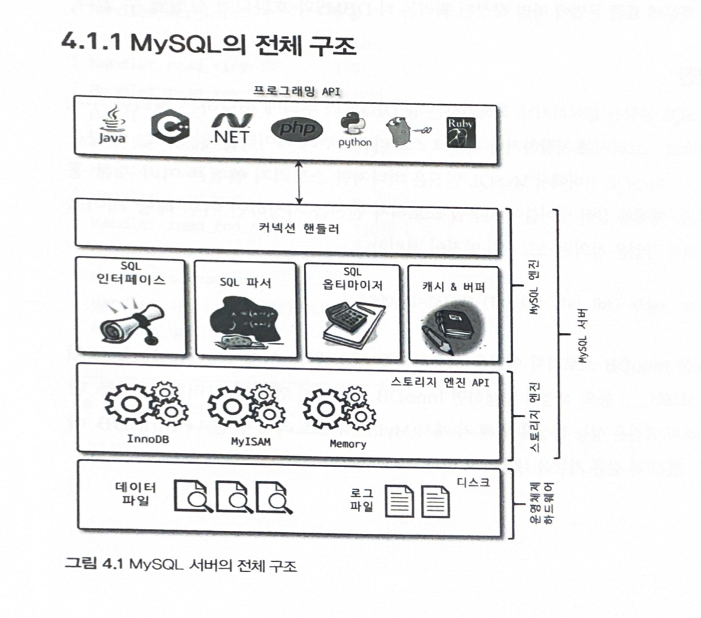

## MySQL 엔진 아키텍처



MySQL 서버는 크게 **MySQL 엔진**과 **스토리지 엔진**으로 나뉜다.

### MySQL 엔진

클라이언트와의 연결, 요청된 쿼리문을 파악하고 분석 및 최적화하는 작업을 수행한다.

그 후, 실제 동작은 *스토리지 엔진*에 요청한다.

이를 *핸들러 요청*이라고 하고, 여기에 사용되는 API를 *핸들러 API*라고 한다.

```sql
mysql> `SHOW GLOBAL STATUS LIKE Handler%`;
```

명령어로 핸들러 API를 확인할 수 있다.

MySQL 엔진은 아래와 같은 기능들로 이루어져 있다.

- 커넥션 핸들러
- SQL 인터페이스
- SQL 파서
- SQL 옵티마이저
- 캐시 & 버퍼

### 스토리지 엔진

종류로는 MyISAM, InnoDB 스토리지 엔진이 있다.

실제 데이터를 디스크에서 읽거나 쓰는 작업을 수행한다.

## MySQL 스레딩 구조

MySQL은 프로세스 기반이 아닌 쓰레드 기반으로 동작한다.

```sql
mysql> SELECT thread_id, name, type, processlist_user, processlist_host FROM performance_schema.threads ORDER BY type, thread_id;
```

위 명령어로 실행 중인 쓰레드를 확인할 수 있다.

### Foreground Thread

클라이언트의 요청을 처리하는 쓰레드이다. 때문에 클라이언트 쓰레드 혹은 사용자 쓰레드라고도 부른다.

클라이언트의 요청을 모두 처리하면, 쓰레드 캐시로 돌아간다.<br>
이때, 쓰레드 캐시가 가득 찬 상태라면 쓰레드를 종료시킨다.

데이터를 MySQL의 **데이터 버퍼**나 **캐시**로부터 가져오는 작업을 수행한다.

하지만 버퍼나 캐시에 데이터가 없는 경우, InnoDB 기준으로는 직접 디스크에서 데이터를 가져오는 작업은 **백그라운드 쓰레드**에서 처리된다.

### Background Thread

InnoDB 기준, 아래와 같은 여러 작업들이 백그라운드 쓰레드에 의해 처리된다.

- Insert Buffer를 병합하는 작업
- 로그를 디스크에 쓰는 작업
- InnoDB 버퍼 풀의 데이터를 디스크에 쓰는 작업
- 데이터를 버퍼로 읽어오는 작업
- 잠금이나 데드락을 모니터링하는 작업

아울러, 주로 디스크에 쓰기 작업을 수행하기 때문에 백그라운드 쓰레드의 개수는 적정 수를 유지하는 것이 중요하다.

쓰기 작업은 버퍼링을 통해 일괄 작업해도 괜찮다. 오히려 효율적이다. 따라서 이러한 방식으로 처리한다.

## 메모리 할당 및 사용 구조

### 글로벌 메모리 영역

MySQL 서버가 실행되면서 운영체제로부터 할당받는 공간이다.

필요에 따라 2개 이상의 메모리 공간을 할당받을 수 있다.

글로벌 메모리 영역이 2개 이상이더라도 모든 쓰레드에 의해 공유된다.

아래의 기능들이 글로벌 메모리 영역에 존재한다.

- 테이블 캐시
- InnoDB 버퍼 풀
- InnoDB 어댑티브 해시 인덱스
- InnoDB 리두 로그 버퍼

### 로컬 메모리 영역

클라이언트 쓰레드가 쿼리를 처리할 때 사용하는 메모리 영역이기에, 클라이언트 메모리 영역이라고도 한다.<br>
클라이언트와의 커넥션을 *세션*이라고도 하기에, 세션 메모리 영역이라고도 한다.

로컬 메모리는 각 클라이언트 쓰레드 별로 독립적으로 할당되며 사용된다.

대표적인 로컬 메모리 영역은 다음과 같다.

- 정렬 버퍼
- 조인 버퍼
- 바이너리 로그 캐시
- 네트워크 버퍼

## 쿼리 실행 구조

클라이언트로부터 쿼리 요청이 들어오면 다음과 같은 순으로 처리된다.

쿼리 파서 -> 전처리기 -> 옵티마이저 -> 쿼리 실행기

### 쿼리 파서

요청으로 넘어온 SQL문을 MySQL이 인식할 수 있는 최소한의 단위인 토큰으로 분리해 트리 구조로 만드는 작업을 수행한다.

SQL 문법 오류는 쿼리 파서에 의해 감지되고 에러를 발생한다.

### 전처리기

쿼리 파서의 결과인 *파서 트리*를 기반으로 쿼리 문장에 구조적 문제를 파악한다.

테이블이 존재하는지? 칼럼이 존재하는지? 권한이 있는지? 와 같이, 실제 쿼리를 동작했을 때 이상이 없을 지를 판단한다.

### 옵티마이저

SQL문을 가장 효율적으로 실행하기 위한 **실행 계획**을 수립한다.

### 쿼리 실행기

실행 계획을 바탕으로 스토리지 엔진에게 작업을 요청하고, 그 결과를 사용자에게 반환한다. 