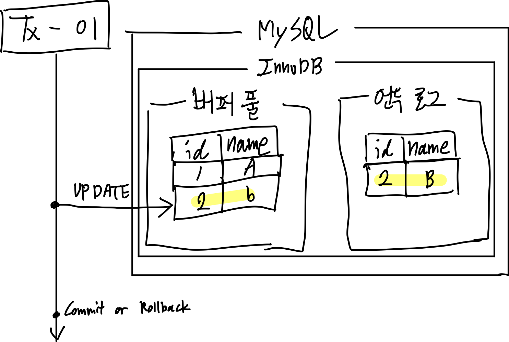
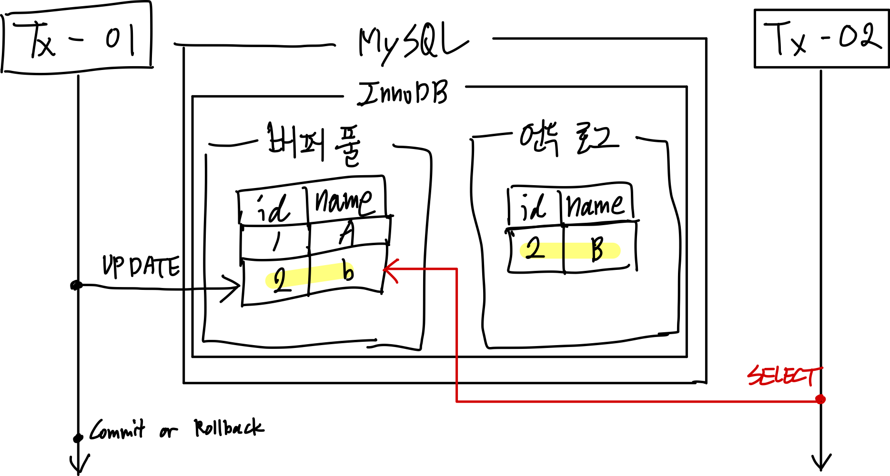
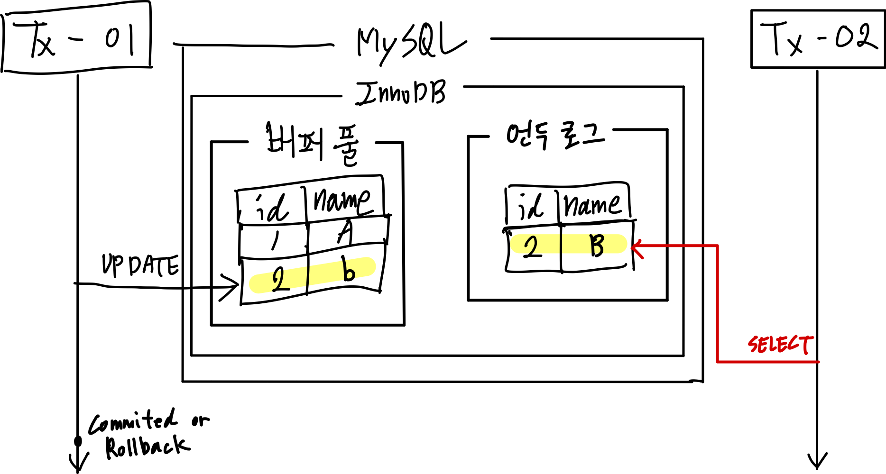
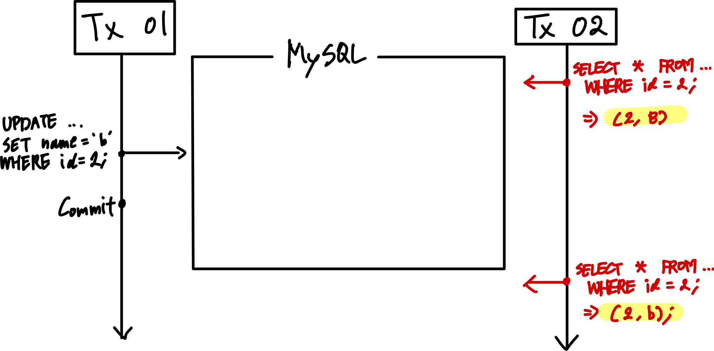
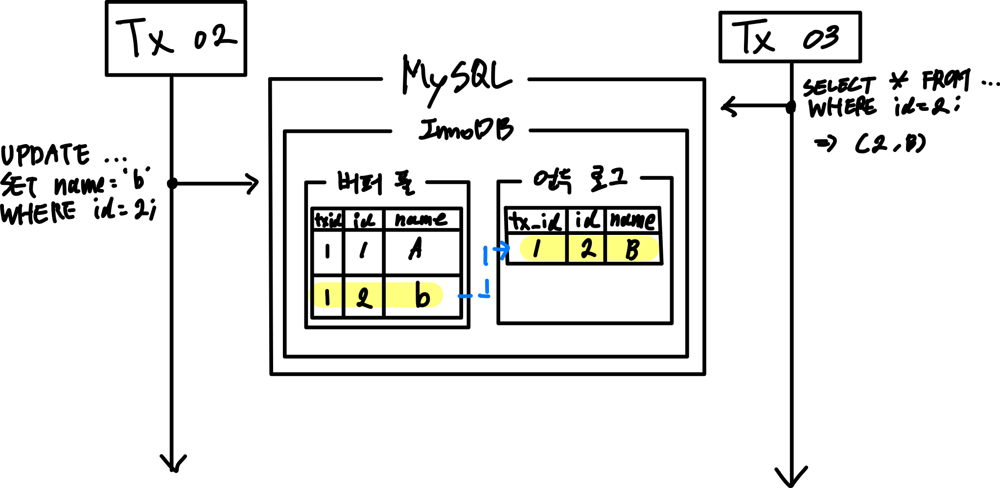
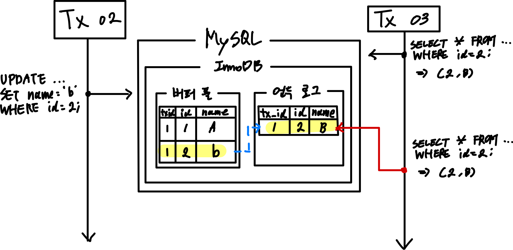

## 들어가며

MySQL에는 4가지의 격리 수준이 존재한다.

격리 수준에 따라 같은 상황, 그리고 같은 쿼리라 하더라도 결과가 매번 달라질 수 있다. 
이로 인해 정합성 문제가 발생할 수 있다.

우리가 실행하는 쿼리문이 적어도 격리 수준에 따라 어떤 결과를 가져올 지 정확하게 예측할 수 있어야 하기에, MySQL의 격리 수준에 대해 이해해보자.

## 트랜잭션 격리 수준

트랜잭션 격리 수준이란, **여러 트랜잭션이 동시에 처리될 때 특정 트랜잭션이 변경하는 값을 다른 트랜잭션이 조회할 때 어떤 값을 반환할 지 결정하는 것**이다.

MySQL의 트랜잭션 격리 수준은 총 4가지다.

- Read Uncommitted
- Read Committed
- Repeatable Reade
- Serializable

각 격리 수준에 따라 동일한 상황에서 조회 결과가 달라진다. 
그리고 트랜잭션을 동시에 처리할 수 있는 성능의 차이도 발생한다.

일반적인 온라인 서비스 용도의 데이터베이스는 _Read Committed_와 _Repeatable Read_ 중 하나를 사용한다. 
MySQL은 주로 _Repeatable Read_를 사용한다.

|                  | Dirty Read | Non-Repeatable Read | Phantom Read  |
|:----------------:|:----------:|:-------------------:|:-------------:|
| Read Uncommitted |     O      |          O          |       O       |
|  Read Committed  |     X      |          O          |       O       |
|  RepeatableRead  |     X      |          X          | O (InnoDB는 X) |
|   Serializable   |     X      |          X          |       X       |

## Read Uncommitted

먼저 그림으로 이해해보자.

트랜잭션 1번이 특정 레코드에 UPDATE 작업을 수행한다. 
동시에 언두 로그에는 변경되기 전의 값이 저장된다.

트랜잭션 1번이 커밋이나 롤백하기 전, 트랜잭션 2번에 의해 `id=2`인 레코드를 조회하는 상황에 Read Uncommitted는 아래같이 수행된다.

트랜잭션 2번은 버퍼 풀에 있는 값을 조회한다.

만약 이후에 트랜잭션 1번이 롤백된다면, 트랜잭션 2번의 조회 결과는 데이터베이스에 존재하지 않은 결과가 된다. 
즉, 정합성에 크리티컬한 문제가 발생한다.

특정 트랜잭션에서 처리한 작업이 완료되지 않았는데도 다른 트랜잭션에서 볼 수 있는 현상을 *Dirty Read*라고 한다. 
**_Read Uncommitted_ 에서는 이 _Dirty Read_ 문제가 발생한다.**

## Read Committed

이번에도 역시 그림으로 이해해보자.

위와 동일한 상황이다. 
마찬가지로 트랜잭션 1번이 Commit 되기 전, 트랜잭션 2번이 조회하는 상황에 Read Committed 격리 수준은 아래같이 수행된다.

_Read Uncommitted_ 와 달리 버퍼 풀이 아닌, **언두 로그에 있는 값을 조회한다.** 
즉, **커밋이나 롤백되지 않은 변경은 조회하지 않게 된다.**

따라서 Dirty Read 문제는 발생하지 않는다. 
하지만 다른 문제가 존재한다.

트랜잭션 2번의 입장에서 **하나의 트랜잭션 안에서 동일한 쿼리의 결과가 달라진다.** 

이러한 문제를 _Non-Repeatable Read_ 문제라고 하며, 분명하게 정합성에 오류가 존재하는 문제다.

## Repeatable Read

**MySQL에서 기본으로 사용되는 격리 수준이다.**

_Read Committed_ 와 마찬가지로 언두 로그에 존재하는 값을 조회한다. 
하지만 차이가 있다면, 언두 로그에 백업된 레코드의 여러 버전 중 몇 번째 이전 버전까지 조회할 것인가에 차이가 있다.

더 자세히 알아보자.

모든 InnoDB의 트랜잭션은 고유 번호를 가지며, 언두 로그의 모든 레코드에는 변경을 발생시킨 트랜잭션의 번호가 포함된다. 
그리고 언두 로그의 데이터는 InnoDB가 불필요하다고 판단되는 시점에 주기적으로 삭제한다.

_Repeatable Read_ 격리 수준일 때는 정합성을 보장하기 위해 **실행 중인 트랜잭션 중, 가장 오래된 트랜잭션 번호보다 더 앞선 언두 로그의 데이터는 삭제할 수 없다.**

더 정확하게는 **특정 트랜잭션 번호의 구간 내에서 백업된 언두 데이터를 모두 보존한다.**

그림을 통해 Repeatable Read 수준에서는 어떻게 동작하는지 이해해보자.

전제 조건은 다음과 같다.

트랜잭션 1번이 2개의 레코드를 삽입한 상황이고, 트랜잭션 3번이 `id=2`인 레코드를 조회한다.

그 다음 트랜잭션 2번이 `id=2`인 레코드에 UPDATE를 수행한다.

변경되는 레코드는 언두 로그에 백업된다.

이후 트랜잭션 2번이 커밋 혹은 롤백되기 전에 트랜잭션 3번이 `id=2`를 조회하는 상황이다.

사실 Read Committed와 동일하다.

하지만 내부적으로 트랜잭션 3번에서 실행되는 모든 SELECT 쿼리는, 해당 트랜잭션 번호인 3번보다 앞선 트랜잭션 번호를 가진, 언두 로그의 데이터들만 조회한다.

언두 로그에는 하나의 레코드에 다양한 버전으로 백업된 레코드가 충분히 존재할 수 있다. 
이러한 상황에서 Repeatable Read 격리 수준은 이 **트랜잭션 번호를 이용해서, 하나의 트랜잭션 내에서 발생하는 SELECT 쿼리에 대해 항상 동일한 값을 반환하도록 한다.**

Repeatable Read 격리 수준에서도 발생하는 정합성 문제가 있다. 
바로 _`Phantom Read`_ 문제다.

트랜잭션 3번이 2번의 `SELECT ... FOR UPDATE` 쿼리를 날리는 사이에, 트랜잭션 2번이 INSERT를 통해 값을 추가한다. 
이때, 트랜잭션 3번이 날리는 2개의 `SELECT ... FOR UPDATE` 쿼리 결과는 달라진다. 
이렇게 새로운 데이터가 생기거나 사라지는 현상을 _Phantom Read_ 라고 한다.

전제 조건이 있긴 한데, 하나의 트랜잭션 안에서 `SELECT ... FOR UPDATE` 나 `SELECT ... FOR LOCK IN SHARE MODE` 로 조회하는 경우에 발생한다.

위의 두 쿼리는 SELECT 하는 레코드에 **쓰기 잠금**을 걸어야 한다. 
하지만 **언두 로그에는 잠금을 걸 수 없다.** 
그래서 위 쿼리로 조회되는 레코드는 언두 영역의 레코드가 아닌, 버퍼 풀의 레코드이기 때문이다.

**InnoDB 엔진에서는 **갭 락과 넥스트 키 락** 덕분에 해당 격리 수준에서도 Phantom Read 문제가 발생하지 않는다.**

## Serializable

가장 단순하며 엄격한 격리 수준이다.

간단히 생각해서 뮤텍스처럼 동작하는 격리 수준이다.

InnoDB 테이블에서 기본적으로 순수한 SELECT 작업은 다른 트랜잭션의 변경 작업 수행 여부와 상관없이 잠금을 대기하지 않고 바로 수행된다. (잠금 없는 일관된 읽기)

하지만 격리 수준이 Serializable인 경우 순수 SELECT 작업도 공유 잠금(읽기 잠금)을 획득해야 한다. 
즉, 특정 트랜잭션이 레코드를 조회하고 있을 때에도 다른 트랜잭션은 조회하지 못하고 잠금을 대기해야 한다.

이러한 특징 때문에 정합성 관련 문제는 발생하지 않지만 동시성 처리 능력은 가장 떨어진다.

### Reference

> - https://product.kyobobook.co.kr/detail/S000001766482