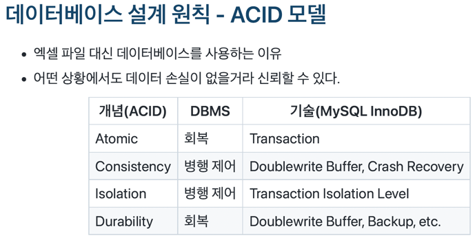

## 트랜잭션

트랜잭션은 **최소한의 논리적인 작업 단위이다.**

하나의 작업 단위에 포함되는 모든 작업들이 100% 성공해야 트랜잭션이 commit 되며, 중간에 작업 하나라도 문제가 생겼을 땐 작업 전체를 무효화한다. (*All or Nothing*)

이를 통해 데이터의 정합성을 보장한다.

### ACID 모델

데이터베이스 설계 원칙으로 ACID 모델이 있다.

InnoDB의 트랜잭션은 이 ACID 모델을 준수한다.

- **Atomic**: 원자성, 트랜잭션의 작업은 전부 적용되거나 전부 적용되지 않아야 한다.
- **Consistency**: 일관성, 데이터베이스는 트랜잭션이 진행되거나 커밋되거나 롤백된 모든 경우에 항상 일관된 상태로 유지된다. 
- **Isolation**: 고립성, 트랜잭션끼리는 서로 간섭할 수 없다. 뒷장에 나올 고립 수준으로 고립성의 정도를 조절할 수 있다.
- **Durability**: 지속성, 트랜잭션이 commit 된 후에는 반드시 디스크에 반영해야 한다.

자세한 내용은 [MySQL 공식문서](https://dev.mysql.com/doc/refman/8.0/en/mysql-acid.html) 참고

### 주의할 점

트랜잭션 또한 DB Connection과 마찬가지로 **최소한의 범위로 적용하는 것이 좋다.**

트랜잭션의 범위가 많다는 것은 처리해야 할 작업이 많다는 것이고 이는 Connection이 존재하는 시간이 길어진다는 의미이다. 
DB Connection의 수는 한정적이므로 하나의 Connection이 존재하는 시간이 길어지면 그만큼 다른 요청을 처리하는 데에 장애가 생길 확률이 높아진다.

그리고 트랜잭션에 **네트워크를 통해 원격 서버와 통신하는 등의 작업은 어떻게 해서든 트랜잭션 내에서 제거하는 것이 좋다.** 
트랜잭션이 실행되는 동안 외부 서버와 통신할 수 없는 상태라면, 해당 트랜잭션은 영영 처리되지 못하게 되며 다른 트랜잭션에도 악영향을 끼칠 수 있다.

## MySQL 엔진의 Lock

Lock은 동시성을 제어하기 위한 기능이다.

여러 Connection이 동시에 동일한 자원에 대해 변경을 요청한 경우, 경쟁 조건이 발생하는 것을 방지하기 위한 역할을 한다.

크게 MySQL 엔진 레벨과 스토리지 엔진 레벨의 Lock으로 나눌 수 있다.

MySQL 엔진 레벨의 Lock은 모든 스토리지 엔진에 영향을 미치지만, 스토리지 엔진 레벨의 Lock은 스토리지 엔진 간 상호 영향을 미치지 않는다.

### 글로벌 락

- `FLUSH TABLES WITH READ LOCK;` 명령으로 글로벌 락을 획득할 수 있다.

- MySQL에서 제공하는 Lock 가운데 범위가 가장 크다.

- 하나의 Connection에서 글로벌 락을 획득하면 다른 Connection에서 SELECT를 제외한 대부분의 DDL이나 DML을 실행한 경우 글로벌 락이 해제될 때까지 대기한다.

- 영향을 미치는 범위는 MySQL 서버 전체이며, 작업 대상 테이블이나 데이터베이스가 다르더라도 동일하게 영향을 미친다.

### 테이블 락

- 개별 테이블 단위에 설정하는 락이다.

- 묵시적으로도 테이블 락을 획득할 수 있으나, 명시적으로는 `LOCK TABLES table_name [ READ | WRITE ];` 명렁으로 특정 테이블에 대한 락을 획득할 수 있다. 
  이렇게 명시적으로 획득한 락은 `UNLOCK TABLES` 명령으로 락을 반환할 수 있다. 
  사실 명시적인 잠금은 글로벌 락과 마찬가지로 특별한 상황이 아니라면 애플리케이션에서 거의 사용할 필요가 없다.

- 묵시적 테이블 락은 MyISAM이나 MEMORY 테이블에 쓰기 작업의 쿼리를 실행하면 발생한다. 
  쿼리가 실행되는 동안 자동으로 획득했다가 쿼리가 완료된 후 자동 해제되는 식으로 동작한다.
  - InnoDB 테이블의 경우, 스토리지 엔진 차원에서 레코드 기반 Lock을 지원하므로 DML 쿼리에서는 묵시적 테이블 락이 적용되지는 않는다. 
    DDL의 경우에만 묵시적 테이블 락을 획득한다.

### 네임드 락

- `GET_LOCK()` 함수를 이용해 **임의의 문자열에 대해 Lock을 설정할 수 있다.**

- Lock의 대상이 데이터베이스 객체가 아니라는 특징이 있다. 
  단순히 사용자가 지정한 문자열에 대해 획득하고 반납하는 Lock이다.

- 자주 사용되지는 않는다. 
  여러 클라이언트가 상호 동기화를 처리해야 할 때 네임드 락을 이용하면 쉽게 해결할 수 있다. 
  또, 많은 레코드에 대해 복잡한 요건으로 레코드를 변경하는 트랜잭션에 유용할 수 있다.

자세한 내용은 [MySQL 공식문서](https://dev.mysql.com/doc/refman/8.0/en/locking-functions.html) 참고

> 한번 보면 좋을만한 글 
> [우아한기술블로그 - MySQL의 네임드 락을 이용한 분산 락으로 여러 서버에 걸친 동시성 관리](https://techblog.woowahan.com/2631/)

### 메타데이터 락

- 데이터베이스 객체(테이블 or 뷰)의 이름이나 구조를 변경하는 경우에 획득하는 Lock이다.

- 명시적으로 획득할 수는 없고, 테이블의 이름을 변경과 같은 경우에 자동으로 획득하는 Lock이다.
  - 테이블을 변경하는 작업의 경우 원본 이름과 변경될 이름 두 개 모두 한꺼번에 Lock을 획득한다.