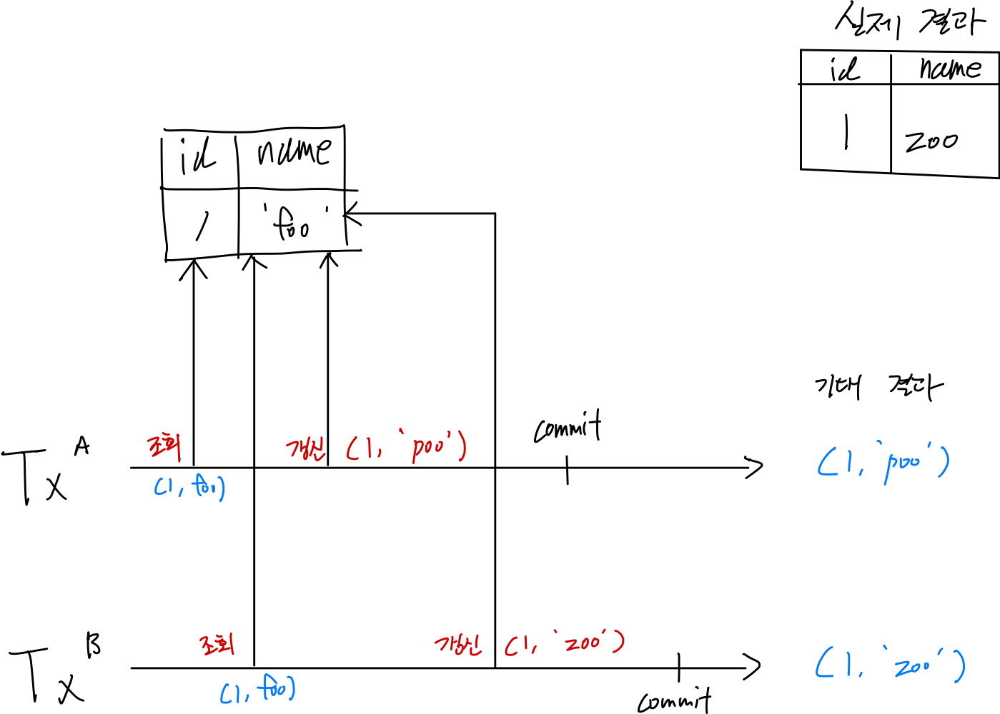
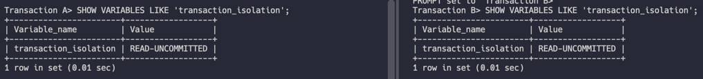
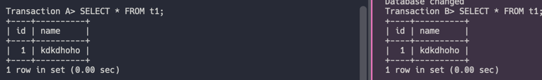
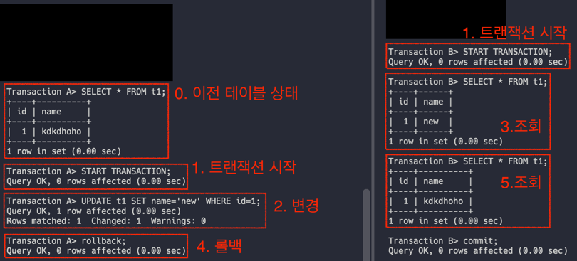
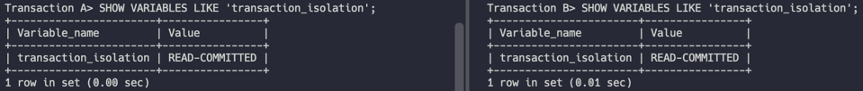
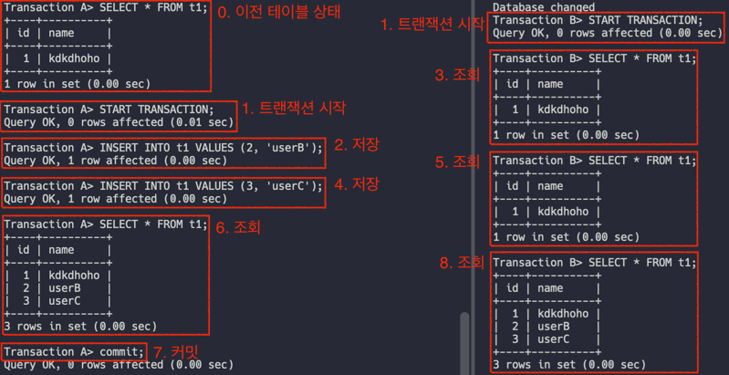
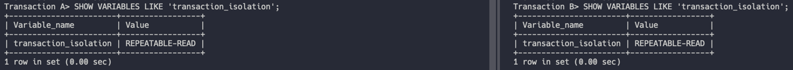
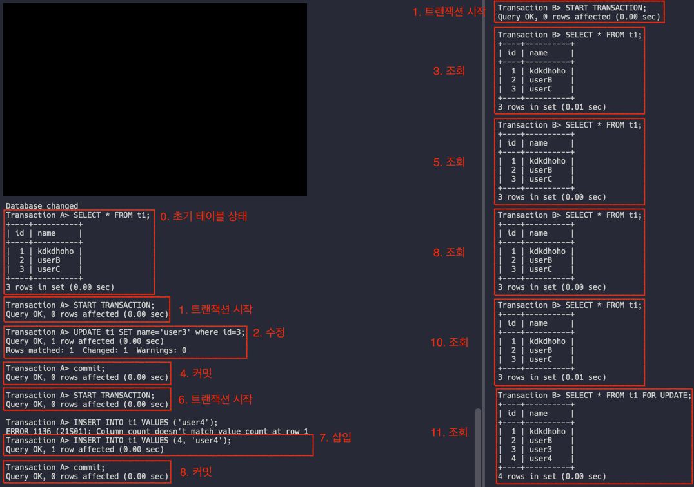

## 들어가며

이번 글에서는 DB 레벨에서 발생하는 동시성 문제를 이해하기 위해 먼저 트랜잭션과 트랜잭션 격리수준에 대해서 복습 겸 코드로 실습하는 시간을 가져보겠습니다.

DBMS는 MySQL 8.0이며 InnoDB 스토리지 엔진을 기준으로 설명하겠습니다.

## 1. 동시성 문제?

2개 이상의 작업이 **공유 자원**에 접근해 **값을 변경**할 때 생길 수 있는 문제입니다.

아래는 동시성 문제가 발생할 수 있는 상황 중 한 가지를 그려본 그림입니다.

트랜잭션 A (TxA) 의 경우 수정의 결과가 `(1, 'poo')` 가 나오길 기대했겠지만, 동시에 다른 트랜잭션과 동시에 처리되다보니 기대했던 결과와 다른 결과가 발생했습니다.

꼭 위의 상황이 아닌 각각 트랜잭션의 조회, 갱신, 그리고 commit 혹은 rollback 처리 순서에 따라 발생할 수 있는 동시성 문제는 상황마다 다를 수 있습니다.

트랜잭션의 순서를 보장하거나 LOCK과 같은 규칙을 정해놓지 않은 이상, 각 트랜잭션의 처리 순서는 개발자가 제어할 수 없는 영역에 속합니다. 
따라서 중요한 것은 **동시성 문제가 발생한 상황을 파악**하고 이를 해결하는 것이라고 생각합니다. 

DB 레벨에서 발생하는 동시성 문제를 이해하기 위해서는 _트랜잭션_ 과 _트랜잭션 격리수준_ 을 이해해야 합니다.

## 2. Transaction

트랜잭션은 작업의 논리적인 최소 단위입니다. 
InnoDB에서 사용자에 의해 일어나는 모든 활동은 **트랜잭션 내에서 이루어집니다**. 
쿼리가 1개든 2개 이상이든 상관없이 MySQL 서버로 요청하는 SQL 문은 모두 트랜잭션으로 묶여 처리됩니다.

트랜잭션은 **데이터 정합성**을 위한 기술입니다. 
사용자의 요청이 처리되는 중간에 문제가 발생했을 때, 일부만 반영되는 문제를 데이터베이스가 트랜잭션이라는 기능을 통해 간편하게 해결할 수 있도록 하는 것입니다.

이 트랜잭션에는 4가지 원칙이 있습니다. 
트랜잭션에 대해 한번이라도 공부를 해본 사람은 꼭 들어봤을만한 ACID 입니다.

### 2-1. Atomic, 원자성

All or Nothing. 
트랜잭션으로 묶인 쿼리들 중 하나라도 처리에 실패하면, 전체 작업이 실패합니다. 
트랜잭션 기술의 근본적인 목적입니다.

### 2-2. Consistency, 일관성

기본 키, 외래 키 제약과 같은 **명시적인 무결성 제약 조건**들뿐만 아니라 
자금 이체 예에서 두 계좌 잔고의 합은 이체 전후가 같아야 한다는 사항과 같은 **비명시적인 일관성 조건**들을 만족합니다.

트랜잭션이 커밋, 롤백 혹은 진행 중일 때 항상 일관된 상태를 유지합니다. 
여러 테이블에서 관련 데이터가 업데이트 되는 경우 쿼리에는 이전 값과 새 값이 혼합된 것이 아닌, 이전 값 혹은 새 값만 표시됩니다.

### 2-3. Isolation, 격리성

각각의 트랜잭션은 진행되는 동안 서로 격리됩니다. 
특정 트랜잭션이 다른 트랜잭션의 작업에 영향을 줄 수 없습니다. 또한 아직 커밋되지 않은 변경사항도 볼 수 없도록 할 수 있습니다. 
이는 *트랜잭션 격리 수준* 에 따라 결과가 달라집니다.

### 2-4. Durability, 지속성

트랜잭션 작업이 모두 성공적으로 완료되었다면 작업 결과는 영구적으로 디스크에 반영됩니다. 
이 원칙은 시스템에 이상이 생겼을 때에도 반드시 지켜져야 합니다. 
InnoDB는 리두 로그와 double write buffer를 이용해 지속성을 지킵니다.

## 3. Transaction Isolation Level

그럼 이제 Transaction의 격리 수준 정도를 조절하는 _트랜잭션 격리 수준_ 에 대해 알아보겠습니다.

트랜잭션 격리수준은, *여러 트랜잭션이 동시에 처리될 때 특정 트랜잭션이 다른 트랜잭션에서 변경하거나 조회하는 데이터를 볼 수 있게 허용할지 말지를 결정하는 것* 입니다. 

격리 수준에는 총 4가지의 선택지가 있습니다. 
각 선택지에 따라 발생하는 현상을 직접 실험을 해보며 이해해보겠습니다.

### 3-1. Read Uncommitted

우선 `mysql> SET GLOBAL transaction_isolation = 'READ-UNCOMMITTED';` 명령어로 격리 수준을 변경해줍니다.

보시면 TxA가 트랜잭션을 시작하고 값을 변경했지만 아직 커밋이나 롤백 하지 않은 상태에서 
TxB가 조회하면 바뀐 상태의 값이 결과로 반환됩니다.

이러한 문제를 *더티 리드 (Dirty Read)* 라고 합니다. 
더티 리드 문제는 아직 값의 변경이 확실하게 반영되지 않았음에도, 조회가 된다는 점 때문에 정합성에 큰 문제를 초래할 수 있다. 

### 3-2. Read Committed

더티 리드 문제가 발생하지 않는 격리 수준입니다. 
이름 그대로 커밋된 결과만 조회합니다. 
마찬가지로 `mysql> SET GLOBAL transaction_isolation = 'READ-COMMITTED';` 명령어로 격리 수준을 변경해줍니다.

확실히 변경 사항이 Commit 되어야 다른 트랜잭션에도 조회 결과에 포함되는 것을 확인할 수 있습니다.

그런데 한 가지 문제가 될 수 있는 점이 있습니다. 
Transaction B 관점에서 봤을 때 하나의 트랜잭션 안에서 조회가 총 3번 이루어집니다. 
하지만, 세 번째와 다섯 번째 조회 결과와 여덟 번째 조회 결과가 달라집니다.

이는 트랜잭션의 두 번째 원칙인 Consistency, 즉 일관성을 해치게 됩니다.

그런데 MySQL은 어떻게 다른 트랜잭션에서 값을 변경하더라도 commit 되기 전이라면, 변경하기 전의 데이터를 읽어올 수 있을까요? 
바로 InnoDB가 지원하는 MVCC 덕분입니다. 
InnoDB에는 _InnoDB 버퍼 풀_ 과 _언두 로그_ 를 통해 기능을 구현하는데요.

디스크에서 데이터를 조회하면 InnoDB 버퍼 풀에 해당 결과를 모두 저장합니다. 
그리고 데이터 수정 요청이 들어오면, 현재 버전을 언두 로그로 복사하고 InnoDB 버퍼 풀에 존재하는 데이터를 수정합니다. 
이런 상황에서 다른 트랜잭션이 동일 데이터를 조회하면 **언두 로그에 있는 데이터**를 반환함으로써 가능하게 하는 것이죠. 
사실 이러한 동작 방식은 _Read Committed_ 이상의 격리 수준이면 모두 이와 같이 수행됩니다. 

> 참고로 데이터 수정 요청 트랜잭션이 커밋되면 당시 상태를 영구적으로 저장하고 
> 롤백되면 언두 로그에 저장한 값들을 그대로 InnoDB 버퍼 풀로 복구하고 언두 로그에 있는 데이터를 삭제합니다. 
> 언두 로그의 데이터는 더이상 해당 데이터를 필요로 하는 트랜잭션이 존재하지 않으면 삭제되기 때문입니다.

### 3-3. Repeatable Read

MySQL이 채택하는 Default 설정값입니다. 
`mysql> SET GLOBAL transaction_isolation = 'REPEATABLE-READ';` 로 설정하고 테스트를 해봅시다.

Transaction B 입장에서 봤을 때 확실히 트랜잭션 안의 모든 SELECT 문은, Transaction A가 값을 수정해서 커밋을 해도 매번 동일하게 나오는 것을 확인할 수 있습니다.

얼핏보면 Read Committed와 동일하다고 생각할 수 있습니다. 
하지만 **현재 존재하는 트랜잭션 중, 가장 낮은 번호의 (오래된) 트랜잭션보다 이전에 갱신된 언두 로그에 있는 데이터는 삭제하지 않는다**는 특징 덕분에 항상 동일한 결과를 조회할 수 있게 되는 것입니다. 
그럼 반대로 Read Committed는 위 규칙을 지키지 않는 것인지? 혹은 무시하는 것인지는 더 공부를 해봐야겠습니다 ㅎㅎ..

Repeatable Read도 발생하는 문제가 한 가지 있습니다. 
위 사진에서 10번 조회까지는 TxA가 값을 수정 및 삽입 후 커밋을 해도 항상 동일한 결과가 조회되고 있습니다. 
하지만 11번 조회를 보시면 TxA가 삽입한 데이터가 포함되는 것을 확인할 수 있습니다. 
이러한 문제를 _Phantom Read_ 라고 합니다. 

이 문제가 발생하는 원인은 바로 **언두 로그에는 락을 걸지 못한다**는 조건 떄문입니다. 
잘 보시면 10번 조회는 잠금 없는 단순 조회입니다. (`SELECT FOR`) 
하지만 11번 조회는 쓰기 잠금을 거는 `SELECT FOR UPDATE` 문 입니다. 
위에서 언급했듯이 언두 로그에는 잠금을 걸지 못하기에 잠금을 거는 읽기의 경우 InnoDB 버퍼 풀에 저장된 데이터를 조회하게 됩니다.

### 3-4. Serializable

가장 단순하면서 엄격하게 관리합니다. 
잠금을 거는 `SELECT FOR UPDATE` 뿐만 아니라 순수 조회인 `SELECT` 문에서도 해당 레코드에 잠금을 걸게 됩니다. 
결국 각 레코드에는 하나의 트랜잭션만이 읽고 쓸 수 있는 것입니다.

로컬에서 CLI로 Serializable을 테스트하기는 어려움이 있어 직접 테스트는 패스하겠습니다 😉

## 마치며

지금까지 트랜잭션과 트랜잭션 격리 수준에 대해 이해해봤습니다. 
다음엔 LOCK에 대해 이해해보는 시간을 가지도록 하겠습니다.

감사합니다.

### References
> - Real MySQL 8.0
> - https://dev.mysql.com/doc/
> - 데이터베이스 첫걸음