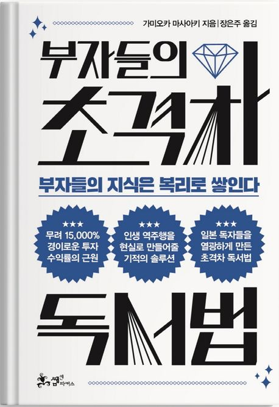

# 들어가며
'장경철 저자의 <진작 이렇게 책을 읽었더라면>'에 이은 독서법 관련 두 번째 책이다.  
책 뒤편에 "세계적인 부자인 빌 게이츠, 일론 머스크, 워런 버핏은 공통점이 하나 있다. 바로 지독한 독서광이라는 점..." 이라는 소개글이 있다.  
책을 빠르게 읽는 법에도 관심이 있던 터라 선택하게 됐다.

# 후기
저자께는 죄송하지만.. 내가 읽은 책 중에서 가장 별로였다.  
책의 제목과는 꽤 거리있는 내용들이 상당 부분 반복되었다.  
음.. 마치 초격차 독서법이라는 새로운 독서법을 판매하러 온 영업 사원이 나에게 초격차 독서법에 대해서는 설명하지 않고, "초격차 독서법이 이래서 좋고.. 저래서 좋고.. 츄라이~츄라이~" 하는 느낌이었다. 

# 그래서 초격차 독서법이 뭔데?
뇌 과학이 말하는 분산 효과를 활용해 책 1권을 2~3시간에 걸쳐 꼼꼼히 읽기보다, 30분 동안 3회 읽는 편이 기억에 더 잘남는 연구 결과를 활용한 독서법이다.  
또한, 사람이 한번에 집중할 수 있는 시간이 15분이 한계라는 연구 결과를 인용한 독서법이다.

200페이지 정도의 책으로 가정하고, 한 페이지당 5초 씩 읽는 것을 목표로 하여 **1회차에는 15분 안에 모두 읽는다.** 이 과정에서 중요하다고 생각되는 페이지는 한쪽 귀틍이를 접어둔다.    
2회차에는 장소를 옮겨서 접은 페이지를 중심으로 읽어가면서 그 앞뒤 페이지를 집중적으로 읽는다. 이때 새롭게 알게 된 지식이나 깨달은 점은 **파란펜으로 메모**한다. 이때 중요한 내용일수록 크고 눈에 띄게, 감정을 실어 메모한다. 이 또한 뇌 과학에서 말하는 에피소드 기억을 활용한 방법이다. 이는 10분 안에 수행한다.  
3회차에는 파란펜으로 메모한 부분을 다시 한번 살펴보면서 그 지식을 어떻게 실생활에 실천할 수 있을 지 구체적으로 기록한다. 이는 5분이 소요된다.

책의 앞부분에서 독서법에 대한 영업에 피로감을 느껴서 그런가, 저자가 강조하는 방법에 대해서 약간의 반감과 의구심이 들었다.  
한번 한 페이지를 5초 안에 읽기를 해보았는데 오히려 머리에 남는 것이 없는 듯 했다.  
급하게 제한된 시간 안에 책을 읽다보니까 잘 이해가 가지 않아도 일단 넘어가게 되고, 그 전 페이지에서 이해 되지 않은 채로 다음 페이지를 보니까 그 전 페이지랑 내용이 이어져서 더욱 읽는 데 어려움을 느꼈다.  

또한, 이동진 님의 책 <닥치는 대로 끌리는 대로 오직 재미있게 이동진 독서법>에서 말하길, "글을 읽다가 떠오른 생각에 집중하기 위해서, 그것을 넓혀나가기 위해서 또는 스스로 소화하기 위해서 책을 덮는 시간이 필요합니다. 그런 과정을 억지로 참아가면서 몇 시간 안에 이 책을 독파해버리겠다는 생각으로 책을 읽는 것은 참 미욱한 짓입니다." 라고 한다.  
책을 읽으며 어떤 문장이나 설명을 보고 그 문장을 이해하고 소화하기 위해서 잠시 책을 덮는 순간이 매번 생긴다.  
그런데 이 책에서 이야기하듯이 한 페이지당 5초를 목표로 하고 책을 읽게 되면 그런 순간을 가질 수 없다.  
독서를 하면서 이런 시간을 가지는 것이 정말 중요하다고 생각한다.

# 마치며
저자가 제안하는 방식은 나와는 맞지 않는 것 같다.  
대신, 책 <진작 이렇게 책을 읽었더라면>에서도 강조하듯이 **책을 반복해서 읽고, 메모하고, 메모한 것을 바탕으로 삶에 녹여보라는 조언은 일맥상통**한 것 같다.  

책의 후반부에서는 "_책의 표지와 띄지만 읽고 목차는 읽지 마라._"고 한다.  
이 부분도 사실 잘 모르겠다. 책의 표지와 띄지는 그 책의 핵심임은 동의하지만, 그래서 그 핵심 내용을 어떻게 풀어서 설명할 것인지에 대한 큰 그림이 목차라고 생각하기 때문이다.  
적어도 나는 그 흐름을 이해하고 따라가며, 책에서 이야기하는 핵심을 파악하면 더 잘 이해가 가고 기억도 잘 된다.
