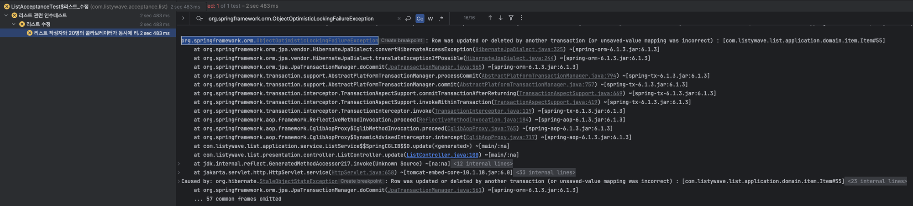

## 들어가며

[ListyWave](https://listywave.com/intro) 프로젝트를 진행하며 처음으로 동시성 이슈를 맞이했습니다.<br>
동시성 이슈 문제를 해결하며 기록했던 내용을 저장하기 위해 작성해보았습니다.<br>
문제를 해결하는 과정에서 시간의 흐름대로, 의식의 흐름대로 작성하다보니 문장이 다소 정제되지 않았음을 양해부탁드립니다. 

## 개요

ListyWave는 자신의 취향을 담은 리스트를 큐레이팅하고 공유하는 SNS 서비스이다.

본 서비스의 요구 사항 중 일부는 다음과 같다.

1. 리스트에는 콜라보레이터가 존재한다.
2. 콜라보레이터는 리스트를 함께 만들어 갈 수 있는 회원을 의미한다.
3. 작성자가 리스트를 만들 때 타 회원을 콜라보레이터로 지정하면, 지정당한 회원은 해당 리스트의 콜라보레이터로 등록된다. 이때 콜라보레이터는 최대 20명까지 등록이 가능하다.
4. **리스트의 수정 권한은 작성자 또는 콜라보레이터에게만 있다.**

바로 이 4번에 해당하는 요구 사항 때문에 동시성 이슈가 발생했다!


## 문제 파악

테스트 코드는 다음과 같다

```java
@Test
void 리스트_작성자와_20명의_콜라보레이터가_동시에_리스트를_수정한다() throws InterruptedException {
    // given: 동호라는 회원이 리스트를 작성한다. 이때 20명의 회원을 콜라보레이터로 지정한다.
    var 동호 = 회원을_저장한다(동호());
    var 동호_액세스_토큰 = 액세스_토큰을_발급한다(동호);
    var 콜라보레이터 = 여러_명의_회원을_저장한다(n명의_회원(20));
    var 콜라보레이터_ID = 콜라보레이터.stream().map(User::getId).toList();
    리스트_저장_API_호출(좋아하는_견종_TOP3_생성_요청_데이터(콜라보레이터_ID), 동호_액세스_토큰).as(ListCreateResponse.class);

    // when: 작성자인 동호와 20명의 콜라보레이터가 동시에 리스트 수정을 요청한다.
    int executeCount = 21;
    ExecutorService executorService = Executors.newFixedThreadPool(200); // Tomcat의 default Max-Threads 수는 200이다.
    CountDownLatch latch = new CountDownLatch(executeCount);

    for (int i = 0; i < executeCount; i++) {
        int index = i;

        executorService.execute(() -> {
            try {
                var 콜라보레이터_ID = new ArrayList<>(콜라보레이터_ID);
                콜라보레이터_ID.add(동호.getId());
                var 수정_요청_데이터 = new ListCreateRequest(
                        CategoryType.codeOf(String.valueOf(index % CategoryType.values().length)),
                        List.of(String.valueOf(index)),
                        콜라보레이터_ID,
                        String.valueOf(index),
                        String.valueOf(index),
                        new Random().nextBoolean(),
                        String.valueOf(index),
                        List.of(
                                new ItemCreateRequest(1, String.valueOf(index), "", "", ""),
                                new ItemCreateRequest(2, String.valueOf(index), "", "", ""),
                                new ItemCreateRequest(3, String.valueOf(index), "", "", "")
                        )
                );

                리스트_수정_API_호출(수정_요청_데이터, 액세스_토큰을_발급한다(콜라보레이터.get(index)), 1L);
            } catch (Exception e) {
                fail();
            } finally {
                latch.countDown();
            }
        });
    }

    latch.await(); // 테스트 스레드는 CountDownLatch의 수가 0이 될 때까지 대기한다.
    executorService.shutdown();

    // then: 생성된 히스토리는 총 20개여야 한다.
    List<HistorySearchResponse> result = 히스토리_조회(1L).as(new TypeRef<>() {
    });
    assertThat(result).hasSize(20);
}
```

에러 로그를 보자.



`org.springframework.orm.ObjectOptimisticLockingFailureException: Row was updated or deleted by another transaction (or unsaved-value mapping was incorrect) : [com.listywave.list.application.domain.item.Item#55]` 라고 한다.

에러의 내용은 대충, **값을 수정해서 반영하려고 하는데 이미 다른 트랜잭션에서 수정이 먼저 이루어진 상태**라고 한다.<br>
그리고 애초에 Exception 이름에서 **비관적 락에 실패**했다고 친절히 알려준다.

그럼 왜 이런 문제가 발생했는지 분석해보자.

일단 한 건의 리스트 수정 요청을 처리할 때, mysql의 general_log를 이용해 어떤 쿼리가 호출되는지 따라가보자.


로그인한 유저 데이터 조회 → 수정하려는 리스트 조회 → 해당 리스트의 콜라보레이터 조회 → (새 트랜잭션 생성) 콜라보레이터의 유저 정보 조회 (콜라보레이터 수만큼 나간다) → 기존 콜라보레이터 삭제 → 새 콜라보레이터 저장 (콜라보레이터에 변경이 없어도 삭제, 저장이 일어난다. 객체 동등성 비교에 실패해서 발생한 문제같은데 이 부분도 해결해야겠다) → 리스트의 아이템 조회 → (아이템 순위에 변경이 생겼을 경우) 히스토리 저장 → 히스토리 아이템 저장 → (라벨에 변경이 생겼을 경우) 새로운 라벨 저장 → 리스트 수정 → 기존 아이템 삭제 → 기존 라벨 삭제

일단 돌아가게끔만 구현했는데 쿼리를 보니 줄일 수 있는 부분들이 꽤 보인다.<br>
근데 이건 꽤나 큰 공사가 될 것 같으니 이번에는 내용을 포함하지 않겠다.<br>
그럼 문제를 분석하기 위해 일단 2개의 트랜잭션을 동시에 실행시켜보자.<br>
근데 웬걸..? 이번엔 데드락이 발생했다.


다시 한번 로그로 분석을 해보자.


324번과 325번 트랜잭션이 동시에 리스트 수정 작업을 진행한다.<br>
그러다가 325번이 rollback 했다.<br>
위 로그는 보기 힘들다. 어디서 문제가 생겼는지 직접 따라가기엔 많이 복잡해보인다.<br>
`SHOW ENGINE INNODB STATUS\G;` 명령어로 데드락의 원인을 자세히 파악해보자.<br>

```text
------------------------
LATEST DETECTED DEADLOCK
------------------------
2024-03-15 15:02:43 0x16b957000
*** (1) TRANSACTION: <-- 1번 트랜잭션
TRANSACTION 1340503, ACTIVE 0 sec starting index read
mysql tables in use 1, locked 1
LOCK WAIT 12 lock struct(s), heap size 1128, 4 row lock(s), undo log entries 9
MySQL thread id 149, OS thread handle 6122909696, query id 7363 localhost 127.0.0.1 root updating
update list set background_color='1',category_code='1',collect_count=0,description='1',has_collaboration='true',is_public='false',title='1',updated_date='2024-03-15 15:02:43.820187',owner_id=1,view_count=0 where id=1

*** (1) HOLDS THE LOCK(S): <-- 1번 트랜잭션이 space id 655에 S-Lock 걸었다.
RECORD LOCKS space id 655 page no 4 n bits 72 index PRIMARY of table '***'.`list` trx id 1340503 lock mode S locks rec but not gap

*** (1) WAITING FOR THIS LOCK TO BE GRANTED: <-- 1번 트랜잭션이 space id 655에 X-Lock을 걸기 위해 대기한다.
RECORD LOCKS space id 655 page no 4 n bits 72 index PRIMARY of table '***'.`list` trx id 1340503 lock_mode X locks rec but not gap waiting

*** (2) TRANSACTION: <-- 2번 트랜잭션
TRANSACTION 1340504, ACTIVE 0 sec starting index read
mysql tables in use 1, locked 1
LOCK WAIT 12 lock struct(s), heap size 1128, 4 row lock(s), undo log entries 9
MySQL thread id 150, OS thread handle 6125137920, query id 7364 localhost 127.0.0.1 root updating
update list set background_color='0',category_code='0',collect_count=0,description='0',has_collaboration='true',is_public='false',title='0',updated_date='2024-03-15 15:02:43.820188',owner_id=1,view_count=0 where id=1

*** (2) HOLDS THE LOCK(S): <-- 2번 트랜잭션이 space id 655에 S-Lock을 걸었다.
RECORD LOCKS space id 655 page no 4 n bits 72 index PRIMARY of table '***'.`list` trx id 1340504 lock mode S locks rec but not gap

*** (2) WAITING FOR THIS LOCK TO BE GRANTED: <-- 2번 트랜잭션이 space id 655에 X-Lock을 걸기 위해 대기 중이다.
RECORD LOCKS space id 655 page no 4 n bits 72 index PRIMARY of table '***'.`list` trx id 1340504 lock_mode X locks rec but not gap waiting

*** WE ROLL BACK TRANSACTION (2) <-- 2번 트랜잭션 롤백 !
```

1번이 list 인덱스 레코드에 S-Lock을 가지고, 동일한 레코드에 대해 X-Lock을 취득하기 위해 대기 중이다.<br>
또 트랜잭션 2번이 동일한 레코드에 S-Lock을 가지고 있고, 동일한 레코드에 대해 X-Lock을 취득하기 위해 대기 중이다.

[MySQL 공식 문서](https://dev.mysql.com/doc/refman/8.0/en/innodb-locks-set.html)에 따르면,
테이블에 외래 키 제약 조건이 정의되어 있는 경우엔 제약 조건을 확인해야 하는 모든 쓰기 작업 (INSERT, UPDATE 또는 DELETE)은 제약 조건을 확인하기 위해 접근하려는 레코드에 S-Lock 을 건다.<br>
위 정보를 토대로 다시 *리스트 수정 flow*를 보자. 특히 쓰기 작업만 따로 나열하여 테이블에 접근하는 순서를 살펴보자.

1. `collaborator` 테이블에 insert → list_id를 외래키로 가짐
2. `history` 테이블에 insert → list_id를 외래키로 가짐
3. `history_item` 테이블에 insert → history_id를 외래키로 가짐
4. `item` 테이블에 insert → list_id를 외래키로 가짐
5. `label` 테이블에 insert → list_id를 외래키로 가짐
6. `list` 테이블에 update

   이 사이에 325 트랜잭션이 rollback !!

7. `item` 테이블에 delete → list_id를 외래키로 가짐
8. `label` 테이블에 delete → list_id를 외래키로 가짐

`collaborator`, `history` , `item` , `label` 테이블에 쓰기 작업을 한다.<br>
이때, 이 테이블들은 list_id를 외래키로 가진다.<br>
즉, 트랜잭션은 list_id에 해당하는 list 테이블의 레코드에 S-Lock을 가진다.

이후 `list` 테이블에 update 쿼리를 날린다. 이때 특정 레코드에 X-Lock을 건다.<br>
하지만 다른 트랜잭션에서 S-Lock을 보유 중이므로 대기한다.

**위 과정을 또 다른 트랜잭션이 동일하게 수행한다.**

이를 그림으로 그려보면 아래와 같을 것이다.


## 해결

`ObjectOptimisticLockingFailureException` 이전에 일단 당장 데드락부터 해결해보자.<br>
데드락을 해결하기 위해선 테이블 접근 순서를 일관되게 하거나(원형 대기 방지) 데드락에 빠진 트랜잭션 중 하나를 작업을 중단하고 재시도(복구)하는 방법이 있겠다.<br>
하나씩 해보자.

### 테이블 접근 순서 일관성있게 가져가기

트랜잭션이 테이블을 접근하는 순서를 일관성있게 해보자.

현재는 collaborator → item → label → list 순으로 테이블에 접근하며 쓰기 작업을 진행한다.
현재 데드락이 발생하는 이유가,  위 과정에서 list를 외래키로 가지므로 해당 리스트 레코드에 S-lock을 가지다가 마지막에 list 테이블에 접근할 때 X-Lock을 걸면서 생기는 문제니까,
가장 먼저 list 테이블에 먼저 X-Lock을 걸어버리면 문제는 해결될 것으로 예상된다.

한번 테스트 해보자.<br>
메서드를 아래와 같이 수정했다.

```java
@Transactional
public void update(Long listId, Long loginUserId, ListUpdateRequest request) {
    validateDuplicateCollaboratorIds(request.collaboratorIds());

    User loginUser = userRepository.getById(loginUserId);
    ListEntity list = listRepository.getById(listId);
    Collaborators beforeCollaborators = collaboratorService.findAllByList(list);
    list.validateUpdateAuthority(loginUser, beforeCollaborators);

    boolean hasCollaborator = !request.collaboratorIds().isEmpty();
    LocalDateTime updatedDate = LocalDateTime.now();

    Labels newLabels = createLabels(request.labels());
    Items newItems = createItems(request.items());
    list.update(request.category(), new ListTitle(request.title()), new ListDescription(request.description()), request.isPublic(), request.backgroundColor(), hasCollaborator, updatedDate); // list 테이블에 upate
    listRepository.saveAndFlush(list);
    list.updateLabels(newLabels); // labels 테이블 update
    list.updateItems(newItems); // items 테이블 update

    Collaborators newCollaborators = collaboratorService.createCollaborators(request.collaboratorIds(), list);
    updateCollaborators(beforeCollaborators, newCollaborators); // collaborators 테이블 update

    if (list.canCreateHistory(newItems)) {
        historyService.saveHistory(list, updatedDate, request.isPublic()); // history, history_item 테이블 insert
    }
}
```

테스트 결과, 기대했던 대로 데드락은 걸리지 않았다.<br>
하지만 맨 처음 21명이 동시에 수정 요청을 보냈을 때와 똑같이 `ObjectOptimisticLockingFailureException: Row was updated or deleted by another transaction` 을 뱉는다.


확실히 테이블 접근 순서를 조정하니 데드락은 걸리지 않는 것을 확인할 수 있다.<br>
하지만 현재 문제는 데드락이 아닌, 동시성 문제다! 근본적인 해결책이 아니다.<br>
게다가 위 코드는 기존 코드에 비해 복잡성이 높아졌다. 따라서 적용하진 않겠다.

`ObjectOptimisticLockingFailureException`은 `net.sf.hibernate.StaleObjectStateException.class` 가 추상화된 예외이다.<br>
hibernate가 뱉는 걸로 봐서 JPA 관련 문제인 것 같은데, 그렇다면 `StaleObjectStateException`는 어떨 때 발생할까?<br>
바로 EntityManager에서 DB에 쿼리를 Flush할 때, 값이 변경되는 Row의 Version 또는 타임스탬프가 불일치하거나, delete or update 쿼리를 날렸지만 DB에 존재하지 않을 때 발생한다고 한다.

따라서 DB에서 데드락은 해결했지만, JPA 레벨에서 동시성 문제는 여전히 유효하다.<br>
이제 이를 해결해보자.

## 어떻게 해결할까?

해결하기 위해 여러 자료를 찾아본 결과 비관적 락, 낙관적 락, 네임드 락으로 해결할 수 있겠다.

### 비관적 락?

비관적 락은 실제 DB Row에 X-Lock을 걸어줌으로써 해결하는 방식이다.<br>
이 방식을 적용하려면 테이블 접근 순서를 List 테이블부터 X-Lock을 걸도록 코드를 수정하면 된다.
JPA를 이용해서 비관적 락을 적용하려면 `@Lock`을 추가해주고 `@Query`로 직접 쿼리를 작성해줘야 한다.<br>
하지만 특정 리스트만 수정하는 것이 아니고 포함되어 있는 많은 데이터도 함께 수정하는 것이므로 오히려 코드 복잡성이 더 증가할 것이다.

### 네임드 락?

네임드 락은 MySQL의 `GET_LOCK()` 함수를 이용해 임의의 문자열에 대해 락을 설정하는 방식이다.<br>
주로 분산환경에서 N대의 WAS가 1대의 DB 서버에 대한 로직을 동기화할 때 유용하게 사용되는 방식이라고 한다.<br>
또한, 복잡한 로직 자체를 하나의 로직으로 묶을 때에도 유용하다. 이 점에서는 네임드 락도 괜찮은 방식인 것 같다.<br>

### 낙관적 락?

낙관적 락은 DB에 락을 걸지 않고 롤백이나 예외가 발생할 경우 애플리케이션 레벨에서 재시도 또는 사용자에게 실패를 응답하는 식으로 처리하는 방식이다.<br>
JPA를 이용해서는 `@Version`을 이용하여 데이터 수정 시점에, 엔티티를 조회한 시점과 수정하는 시점의 버전일 일치하는 지를 비교하고 다를 경우 예외를 뱉는 방식이다.<br>
그러면 개발자는 해당 예외를 잡아서 처리하는 방식이다.

### @Version 없는 낙관적 락 방식 선택!

현재 상황을 다시 되돌아 봤을 때, 문제의 시작은 작성자와 콜라보레이터의 리스트 동시 수정 행위이다.<br>
이 행위가 빈번히 일어날 것인지를 생각해봤을 땐 그렇지 않다고 생각한다.<br>
현재 서비스 홍보를 하지 않은 상태인데다가 콜라보레이터 기능이 활발히 사용되진 않는다.<br>
게다가 리스트 수정 요청 순서는 지켜질 필요는 없다.

또한 현재 WAS와 DB를 1대의 서버로만 운영하고 있고 앞으로 증축할 계획은 없다. 분산 서버 환경이라면 네임드락을 사용하면 좋을 것 같다.<br>
이러한 상황을 토대로 **낙관적 락을 적용함으로써 구현에 소모하는 시간 대비 가장 효율적인 방법으로 해결하는 것**이라고 생각한다.<br>
이제 낙관적 락 방식으로 이를 해결해보자.

JPA에서 낙관적 락을 적용하기 위해선 `@Version` 어노테이션을 추가하면 된다고 한다.<br>
하지만 굳이 `@Version`을 추가하지 않고, `CannotAcquireLockException`을  try-catch로 잡아서 0.3초 후에 재요청을 보내도록 했다.<br>
왜냐하면 `@Version` 어노테이션을 붙여도 동일하게 예외가 발생하기 때문에, 어찌됐건 예외만 잡아서 다시 요청을 처리하는 식으로 해도 동일하다고 판단했기 때문이다.

작성한 코드는 아래와 같다.

```java
@Target(ElementType.METHOD)
@Retention(RetentionPolicy.RUNTIME)
public @interface Retry {
}
```

```java
@Aspect
@Component
@Order(Ordered.LOWEST_PRECEDENCE - 1)
public class OptimisticLockRetryAspect {

    private static final int MAX_RETRIES = 50; // 최대 50번 재요청
    private static final int RETRY_DELAY_MS = 300; // 0.3초 재요청 딜레이

    @Pointcut("@annotation(com.listywave.common.annotation.Retry)")
    public void retry() {
    }

    @Around("retry()")
    public Object retryOptimisticLock(ProceedingJoinPoint joinPoint) throws Throwable {
        Exception exceptionHolder = null;
        for (int attempt = 0; attempt < MAX_RETRIES; attempt++) {
            try {
                return joinPoint.proceed();
            } catch (CannotAcquireLockException e) {
                exceptionHolder = e;
                Thread.sleep(RETRY_DELAY_MS);
            }
        }
        throw exceptionHolder;
    }
}.
```


결과는 성공이다!<br>
히스토리 데이터에 2개가 들어가있는 걸 확인할 수 있다.

그럼 이제 최대 인원인 21명으로 시도해보자.<br>
결과는 통과다!


## 마치며

동시성 문제를 처음 겪고 해결하는 과정에서 굉장히 어려웠다. 그만큼 공부도 많이 했지만 아무래도 쓰레드, 트랜잭션은 낯설기도 하고 디버깅을 찍어보며 직접 실행 순서를 볼 수 없다는 점에서 문제에 접근하고 해결하는 과정이 어려웠다.

그리고 동시성 문제는 배경 지식과 기본기가 탄탄할 수록 잘 해결될 것 같다.<br>
덕분에 많은 걸 공부하긴 했지만.. 아직 스스로 탄탄하다고는 말을 못하겠다.<br>
그래도 문제를 구현하고 이를 로그로 분석하며 해결해본 경험이 진짜 값진 경험이라고 생각한다.<br>
물론 진짜 이번 주 내내 동시성 문제 해결한다고 애써서 피로도도 많이 쌓이고 너무너무 힘들었지만..!

또 테이블 접근 순서를 변경했을 때와, 실제로 낙관적 락을 걸었을 때, 그리고 비관적 락으로 처리를 했을 때의 성능 비교를 하지 못한 점이 아쉽다.<br>
다음에 여유가 된다면 한번 도전해보고 싶다.

여담으로 처음 문제에 접근할 때 머리가 너무 복잡하고 어디서부터 접근해야할 지 모르겠어서<br>
서브 모니터에 포스트잇으로 하나씩 붙여가며 Divide and Conquare 방식으로 밑에서부터 하나씩 접근했다.<br>
스스로 뿌듯하고 자랑하고 싶어 사진으로 남긴다. 🤭

