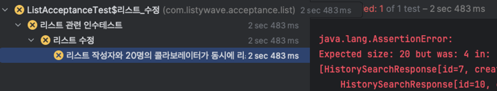
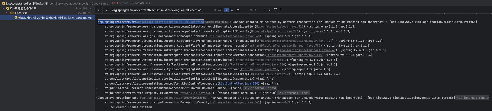
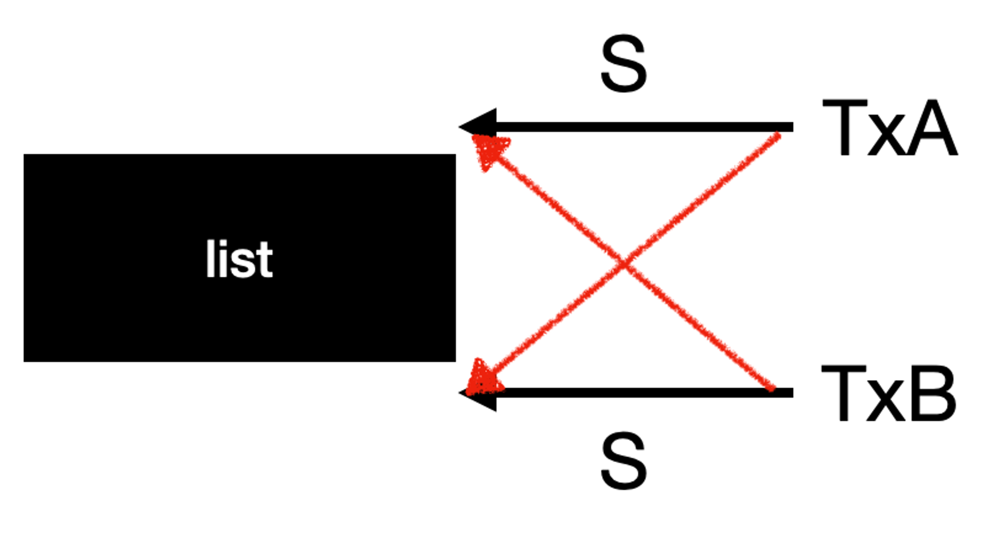
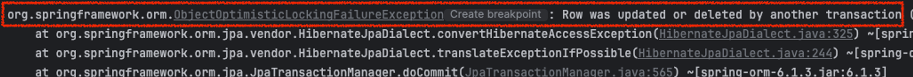
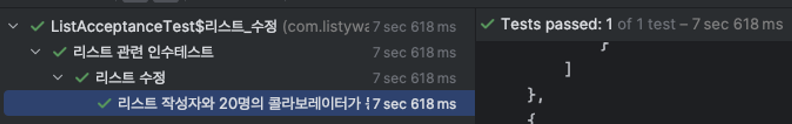

# 1. 들어가며
[리스티웨이브](https://github.com/8-Sprinters/ListyWave-back) 프로젝트를 진행하면서 동시성 문제를 겪은 적이 있습니다.

개발을 시작하고 이론으로만 듣던 동시성 문제를 처음 겪었습니다.  
사실 실제로 운영 환경에서 문제가 발생한 것은 아니지만, 문제가 충분히 일어날 것으로 예상되어 이를 테스트 코드로 시연해보았습니다.  
그 결과 정말 데이터 정합성이 맞지 않는 것을 확인할 수 있었습니다.

InnoDB 스토리지 엔진 내부 상태 정보를 분석하여 원인을 정확하게 파악하고, 이를 해결하기 위한 다양한 해결 방법 중 문제 상황에 적합한 방안을 선택한 과정에 대해 작성한 글입니다.

> 2024년에 진행했던 프로젝트에서 발생한 동시성 문제를, 2026년 3월 12일의 관점에서 다시 작성했습니다.

# 2. 문제 상황
리스티웨이브 프로젝트는 "내가 큐레이팅한 리스트로 소통하는 SNS 서비스"입니다.  
쉽게 말해 내 취향을 기록하고, 다른 사람과 공유하고, 그 과정 속에서 나를 발견할 수 있도록 도와주는 서비스입니다.

리스티웨이브에서 제공하는 기능 중에는 _콜라보레이터_라는 기능이 있었습니다.  
이 콜라보레이터는 이름 그대로 게시글을 함께 수정할 수 있는 권한이 부여된 유저입니다.  
이 기능의 특성상, 최대 21명의 유저가 동일한 게시글을 수정할 수 있는 상황이 발생했습니다.

다행히 실사용자가 없는 상황이었기에 실제 운영 환경의 데이터에 문제가 발생하지는 않았습니다.  
하지만 문제가 발생할 가능성을 인식한 순간, 해결을 피할 순 없었습니다.  
이에 동일한 게시글에 대해 최대 21명이 동시에 수정하는 시나리오의 테스트 코드를 작성해보았습니다.

작성한 테스트 코드는 다음과 같습니다.

[RestAssured](https://rest-assured.io/)를 이용해 통합 테스트를 작성했으며, ExecutorService를 이용해서 21개의 스레드를 미리 만들어놓고, CountDownLatch를 이용하여 21개의 워커 스레드가 모두 리스트 수정 API 호출을 완료하면 테스트 스레드가 이어서 진행되도록 구현했습니다.

검증 기준은 히스토리의 개수가 20개인지 여부였습니다.  
여기서 히스토리는 리스트(게시글)가 수정되면, 수정되기 전의 버전이 _히스토리_ 라는 이름으로 저장이 되는 기능입니다.

```java
@Test
void 리스트_작성자와_20명의_콜라보레이터가_동시에_리스트를_수정한다() throws InterruptedException {
    // given: 동호라는 회원이 리스트를 작성한다. 이때 20명의 회원을 콜라보레이터로 지정한다.
    var 동호 = 회원을_저장한다(동호());
    var 동호_액세스_토큰 = 액세스_토큰을_발급한다(동호);
    var 콜라보레이터 = 여러_명의_회원을_저장한다(n명의_회원(20));
    var 콜라보레이터_ID = 콜라보레이터.stream().map(User::getId).toList();
    리스트_저장_API_호출(좋아하는_견종_TOP3_생성_요청_데이터(콜라보레이터_ID), 동호_액세스_토큰).as(ListCreateResponse.class);

    // 동시성 제어를 위한 값들
    int executeCount = 21;
    ExecutorService executorService = Executors.newFixedThreadPool(21);
    CountDownLatch latch = new CountDownLatch(executeCount);
    
    // when: 작성자인 동호와 20명의 콜라보레이터가 동시에 리스트 수정을 요청한다.
    for (int i = 0; i < executeCount; i++) {
        int index = i;

        executorService.execute(() -> {
            try {
                var 요청용_콜라보레이터_ID = new ArrayList<>(콜라보레이터_ID);
                요청용_콜라보레이터_ID.add(동호.getId());
                
                var 수정_요청_데이터 = new ListCreateRequest(
                        CategoryType.codeOf(String.valueOf(index % CategoryType.values().length)),
                        List.of(String.valueOf(index)),
                        요청용_콜라보레이터_ID,
                        String.valueOf(index),
                        String.valueOf(index),
                        new Random().nextBoolean(),
                        String.valueOf(index),
                        List.of(
                                new ItemCreateRequest(1, String.valueOf(index), "", "", ""),
                                new ItemCreateRequest(2, String.valueOf(index), "", "", ""),
                                new ItemCreateRequest(3, String.valueOf(index), "", "", "")
                        )
                );

                리스트_수정_API_호출(수정_요청_데이터, 액세스_토큰을_발급한다(요청용_콜라보레이터_ID.get(index)), 1L);
            } catch (Exception e) {
                fail();
            } finally {
                latch.countDown();
            }
        });
    }

    latch.await(); // 테스트 스레드는 CountDownLatch의 수가 0이 될 때까지 대기한다.
    executorService.shutdown();

    // then: 생성된 히스토리는 총 20개여야 한다.
    List<HistorySearchResponse> result = 히스토리_조회(1L).as(new TypeRef<>() {
    });
    assertThat(result).hasSize(20);
}
```

위 테스트 코드를 실행한 결과는 아래 사진과 같습니다.  
결과를 보시면 히스토리 객체가 4개밖에 생성되지 않았음을 확인할 수 있습니다.



그리고 아래와 같은 예외가 발생했습니다.  
  
`org.springframework.orm.ObjectOptimisticLockingFailureException: Row was updated or deleted by another transaction (or unsaved-value mapping was incorrect) : [com.listywave.list.application.domain.item.Item#55]` 이라고 뜹니다.

로그만 봤을 땐 `Item` 엔티티의 일부 행이, 다른 트랜잭션에 의해 이미 수정 또는 삭제되었다고 추정할 수 있습니다.

이제부터는 데이터 정합성이 맞지 않는 이유와 `ObjectOptimisticLockingFailureException` 예외가 발생한 이유에 대해 딥다이브 해보겠습니다.

# 3. 문제 원인 파악
## 3.1. InnoDB 스토리지 엔진 내부 상태 조회
가장 먼저 `SHOW ENGINE INNODB STATUS\G;` 명령어를 통해 InnoDB 스토리지 엔진의 내부 상태를 조회해봤습니다.  
아래는 그 결과입니다.

```text
------------------------
LATEST DETECTED DEADLOCK
------------------------
2024-03-15 15:02:43 0x16b957000
// 1번 트랜잭션
*** (1) TRANSACTION:
TRANSACTION 1340503, ACTIVE 0 sec starting index read
mysql tables in use 1, locked 1
LOCK WAIT 12 lock struct(s), heap size 1128, 4 row lock(s), undo log entries 9
MySQL thread id 149, OS thread handle 6122909696, query id 7363 localhost 127.0.0.1 root updating
update list set background_color='1',category_code='1',collect_count=0,description='1',has_collaboration='true',is_public='false',title='1',updated_date='2024-03-15 15:02:43.820187',owner_id=1,view_count=0 where id=1

// 1번 트랜잭션이 space id 655에 공유 락을 걸었다.
*** (1) HOLDS THE LOCK(S):
RECORD LOCKS space id 655 page no 4 n bits 72 index PRIMARY of table '***'.`list` trx id 1340503 lock mode S locks rec but not gap

// 1번 트랜잭션이 space id 655에 X-Lock을 걸기 위해 대기한다.
*** (1) WAITING FOR THIS LOCK TO BE GRANTED:
RECORD LOCKS space id 655 page no 4 n bits 72 index PRIMARY of table '***'.`list` trx id 1340503 lock_mode X locks rec but not gap waiting

// 2번 트랜잭션
*** (2) TRANSACTION:
TRANSACTION 1340504, ACTIVE 0 sec starting index read
mysql tables in use 1, locked 1
LOCK WAIT 12 lock struct(s), heap size 1128, 4 row lock(s), undo log entries 9
MySQL thread id 150, OS thread handle 6125137920, query id 7364 localhost 127.0.0.1 root updating
update list set background_color='0',category_code='0',collect_count=0,description='0',has_collaboration='true',is_public='false',title='0',updated_date='2024-03-15 15:02:43.820188',owner_id=1,view_count=0 where id=1

// 2번 트랜잭션이 space id 655에 S-Lock을 걸었다.
*** (2) HOLDS THE LOCK(S):
RECORD LOCKS space id 655 page no 4 n bits 72 index PRIMARY of table '***'.`list` trx id 1340504 lock mode S locks rec but not gap

// 2번 트랜잭션이 space id 655에 X-Lock을 걸기 위해 대기 중이다.
*** (2) WAITING FOR THIS LOCK TO BE GRANTED:
RECORD LOCKS space id 655 page no 4 n bits 72 index PRIMARY of table '***'.`list` trx id 1340504 lock_mode X locks rec but not gap waiting

// 2번 트랜잭션 롤백
*** WE ROLL BACK TRANSACTION (2)
```

위 로그를 분석하면 다음과 같습니다.

1. 1번 트랜잭션이 `List` 테이블의 PK 인덱스 레코드에 공유 락을 걸고, 동일한 레코드에 대해서 배타 락을 취득하기 위해 대기한다.
2. 2번 트랜잭션이 동일한 레코드에 공유 락을 걸고, 동일한 레코드에 대해 배타 락을 취득하기 위해 대기한다.

## 3.2. 테이블 접근 순서 분석
쓰기 작업을 진행하는 SQL의 순서를 파악해보면 다음과 같습니다.

1. collaborator 테이블에 insert (list_id를 외래키로 가집니다.)
2. history 테이블에 insert (list_id를 외래키로 가집니다.)
3. history_item 테이블에 insert (history_id를 외래키로 가집니다.)
4. item 테이블에 insert (list_id를 외래키로 가집니다.)
5. label 테이블에 insert (list_id를 외래키로 가집니다.)
6. list 테이블에 update

(이때 2번 트랜잭션이 롤백)

7. item 테이블에 delete (list_id를 외래키로 가집니다.)
8. label 테이블에 delete (list_id를 외래키로 가집니다.)

정리해보면 collaborator, history, item, label 테이블에 쓰기 작업을 하는데, 이때 이 테이블들은 list_id를 외래키로 가집니다.  
따라서 1번 트랜잭션은 외래 키 체크로 인해 부모 레코드를 검사하기 위해 list_id와 일치하는 list 테이블의 레코드에 공유 락을 설정합니다.  
이후, list 테이블에 update 쿼리를 날립니다. 이때 해당 레코드에 배타 락을 설정합니다.  
하지만 2번 트랜잭션에서도 동시에 공유 락을 설정해두었으므로 대기합니다.

이를 그림으로 그려보면 아래 사진과 같습니다.



실제로 [MySQL 공식 문서](https://dev.mysql.com/doc/refman/8.0/en/innodb-locks-set.html)에 따르면, **테이블에 외래 키 제약 조건이 정의되어 있는 경우엔 제약 조건을 확인해야 하는 모든 쓰기 작업 (INSERT, UPDATE 또는 DELETE)은 제약 조건을 확인하기 위해 접근하려는 레코드에 공유 락을 건다**고 합니다.

# 4. 데드락 해결 시도
일단 데드락부터 해결해야 될 문제로 판단됩니다.  
데드락을 해결하기 위해서는 테이블 접근 순서를 일관되게 하거나(원형 대기 방지) 데드락에 빠진 트랜잭션 중 하나를 작업을 중단하고 재시도(복구)하는 방법이 있겠습니다.

## 4.1. 테이블 접근 순서를 일관되게 수정하는 방법
테이블 접근 순서를 다시 따져보면 collaborator → item → label → list 순으로 접근하며 쓰기 작업을 진행합니다.  
데드락이 발생하는 이유가, collaborator, item, label이 list를 외래키로 가지면서, 해당 레코드에 공유 락을 걸다가, 마지막에 배타 락을 걸기 때문이니까, 가장 먼저 list 테이블에 배타 락을 걸어버리면 데드락은 해결될 것입니다.

따라서 메서드를 아래 코드와 같이 수정하여 테이블 접근 순서를 조정해주었습니다.

```java
@Transactional
public void update(Long listId, Long loginUserId, ListUpdateRequest request) {
    validateDuplicateCollaboratorIds(request.collaboratorIds());

    User loginUser = userRepository.getById(loginUserId);
    ListEntity list = listRepository.getById(listId);
    Collaborators beforeCollaborators = collaboratorService.findAllByList(list);
    list.validateUpdateAuthority(loginUser, beforeCollaborators);

    boolean hasCollaborator = !request.collaboratorIds().isEmpty();
    LocalDateTime updatedDate = LocalDateTime.now();

    Labels newLabels = createLabels(request.labels());
    Items newItems = createItems(request.items());
    // list 엔티티 먼저 수정 -> list 레코드에 배타 락 획득 시도
    list.update(request.category(), new ListTitle(request.title()), new ListDescription(request.description()), request.isPublic(), request.backgroundColor(), hasCollaborator, updatedDate);
    listRepository.saveAndFlush(list);
    list.updateLabels(newLabels); // labels 테이블 update
    list.updateItems(newItems); // items 테이블 update

    Collaborators newCollaborators = collaboratorService.createCollaborators(request.collaboratorIds(), list);
    updateCollaborators(beforeCollaborators, newCollaborators); // collaborators 테이블 update

    if (list.canCreateHistory(newItems)) {
        historyService.saveHistory(list, updatedDate, request.isPublic()); // history, history_item 테이블 insert
    }
}
```

하지만 테스트 코드를 다시 돌려보면 `ObjectOptimisticLockingFailureException: Row was updated or deleted by another transaction` 예외가 여전히 발생합니다.  


데드락 예외는 더 이상 발생하지 않았지만, 여전히 다른 문제가 남아 있었습니다.  
따라서 위 코드는 근본적인 해결책이 되지 못할 뿐더러 로직이 더 복잡해집니다.  
이에 다른 해결 방안을 모색해봐야 했습니다.

# 5. `ObjectOptimisticLockingFailureException` 원인 파악
`org.springframework.orm.ObjectOptimisticLockingFailureException: Row was updated or deleted by another transaction (or unsaved-value mapping was incorrect) : [com.listywave.list.application.domain.item.Item#55]`

위의 예외 메시지를 다시 자세히 보면 Item 엔티티에 대해서 다른 트랜잭션이 이미 수정 또는 삭제해서 발생한 것으로 파악됩니다.

즉, 두 개 이상의 트랜잭션이 동시에 동일한 Item 엔티티를 수정하기 위해 조회합니다.  
이때 각 트랜잭션은 자신의 영속성 컨텍스트에 동일한 버전의 Item 엔티티를 보관하게 됩니다.  
이후 한 트랜잭션이 먼저 Item 엔티티의 변경 사항을 Flush 합니다.  
그리고 다른 트랜잭션이 동일한 엔티티에 대한 변경을 Flush 하는 시점에, 이미 해당 row의 상태가 변경되었거나 삭제되었기 때문에 `StaleObjectStateException`이 발생합니다.

> `StaleObjectStateException`은 Hibernate가 던지는 예외이고 `ObjectOptimisticLockingFailureException`은 Spring이 추상화한 예외입니다.

# 6. 해결 방안
결국 해결해야 할 문제는 데드락과 `ObjectOptimisticLockingFailureException`이었습니다.

테이블 접근 순서를 조정하면서 데드락은 일부 완화할 수 있었지만, 동일한 `Item` 엔티티를 여러 트랜잭션이 동시에 수정하는 상황 자체는 여전히 남아 있었습니다.  
즉, 단순히 SQL 실행 순서를 바꾸는 것만으로는 문제를 완전히 해결할 수 없었고, 동시 수정 요청을 어떤 방식으로 제어할지에 대한 별도의 전략이 필요했습니다.

여러 방법을 검토한 결과, 이번 상황에서는 비관적 락과 낙관적 락이 가장 현실적인 후보라고 판단했습니다.

## 6.1. 비관적 락
**비관적 락은 충돌이 발생할 가능성이 높다고 보고, 데이터를 조회하는 시점부터 DB 락을 걸어 다른 트랜잭션의 접근을 제한하는 방식**입니다.  
리스트 수정 로직에 적용한다면, 가장 먼저 `List` 레코드를 잠그고 트랜잭션이 끝날 때까지 다른 수정 요청이 대기하도록 만들 수 있습니다.

이 방식의 장점은 충돌을 사전에 차단할 수 있다는 점입니다.  
먼저 락을 획득한 트랜잭션이 작업을 마칠 때까지 다른 트랜잭션은 기다리게 되므로, 동일한 데이터를 동시에 수정하다가 stale state가 발생할 가능성을 크게 줄일 수 있습니다.

다만 현재 로직은 `List`만 수정하는 것이 아니라 `Collaborator`, `Item`, `Label`, `History`까지 함께 변경합니다.  
따라서 비관적 락을 적용하려면 어떤 시점에 어떤 데이터를 잠글 것인지 더 엄격하게 설계해야 하고, JPA에서도 락 모드와 조회 쿼리를 직접 제어해야 합니다.  
결국 문제를 직접적으로 막는 대신, 코드 복잡성과 유지보수 부담이 커질 가능성이 있었습니다.

## 6.2. 낙관적 락
반면 **낙관적 락은 충돌이 자주 발생하지 않는다고 가정하고, 요청은 우선 처리하되 실제 충돌이 발생했을 때 이를 감지해 재시도하거나 실패로 처리하는 방식**입니다.  
DB 레벨에서 긴 시간 동안 락을 유지하지 않기 때문에, 비관적 락보다 구현 부담이 적고 일반적인 처리 흐름도 단순하게 유지할 수 있습니다.

지금 문제 상황을 다시 보면, 작성자와 콜라보레이터가 같은 리스트를 정확히 같은 시점에 수정하는 경우는 충분히 가능하지만 빈번하게 발생하는 상황은 아닙니다.  
또한 리스트 수정 요청은 순서가 반드시 보장되어야 하는 작업도 아니었습니다.  
그렇다면 모든 요청을 강하게 직렬화하는 것보다는, 충돌이 발생했을 때 이를 감지하고 재시도하는 방식이 더 적절하다고 판단했습니다.

# 7. 해결
앞서 정리한 내용을 바탕으로, 최종적으로는 낙관적 락 성격의 재시도 방식으로 문제를 해결했습니다.

이렇게 결정한 이유는 두 가지였습니다.

1. 작성자와 콜라보레이터가 같은 리스트를 정확히 같은 시점에 수정하는 상황은 가능하지만, **서비스 특성상 매우 빈번하게 발생하는 요청은 아니었습니다**.
2. 리스트 수정 요청은 **반드시 들어온 순서대로 처리되어야 하는 작업도 아니었습니다**.

즉, 모든 수정 요청을 강하게 직렬화하기보다는, **충돌이 발생했을 때 예외를 감지하고 짧은 간격으로 다시 시도하는 편이 구현 복잡도와 운영 비용 측면에서 더 현실적이라고 판단**했습니다.

JPA에서 낙관적 락을 적용하는 대표적인 방법은 `@Version`을 사용하는 것입니다.  
하지만 `@Version` 칼럼을 추가해 충돌을 감지하더라도, 재시도 로직은 애플리케이션 레벨에서 직접 구현해야 합니다.  
따라서 이번에는 `@Version` 컬럼을 추가하지 않고, 수정 과정에서 발생하는 예외를 애플리케이션 레벨에서 잡아 재시도하는 방식을 선택했습니다.

구현은 AOP를 이용해 재시도 로직을 공통화하는 방향으로 진행했습니다.  
재시도가 필요한 메서드에 어노테이션을 붙이고, 예외가 발생하면 일정 시간 대기한 뒤 다시 실행하도록 구성했습니다.

`try-catch` 절에서는 `CannotAcquireLockException`과 `ObjectOptimisticLockingFailureException`을 잡도록 설정했습니다.  
데드락으로 인해 발생한 락 획득 실패 예외와 `ObjectOptimisticLockingFailureException`이 발생했을 때 모두 재시도하기 위함입니다.

```java
@Target(ElementType.METHOD)
@Retention(RetentionPolicy.RUNTIME)
public @interface Retry {
}
```

```java
@Aspect
@Component
@Order(Ordered.LOWEST_PRECEDENCE - 1)
public class OptimisticLockRetryAspect {

    private static final int MAX_RETRIES = 50; // 최대 50번 재요청
    private static final int RETRY_DELAY_MS = 300; // 0.3초 재요청 딜레이

    @Pointcut("@annotation(com.listywave.common.annotation.Retry)")
    public void retry() {
    }

    @Around("retry()")
    public Object retryOptimisticLock(ProceedingJoinPoint joinPoint) throws Throwable {
        Exception exceptionHolder = null;
        for (int attempt = 0; attempt < MAX_RETRIES; attempt++) {
            try {
                return joinPoint.proceed();
            } catch (CannotAcquireLockException | ObjectOptimisticLockingFailureException e) {
                exceptionHolder = e;
                Thread.sleep(RETRY_DELAY_MS);
            }
        }
        throw exceptionHolder;
    }
}
```

`@Retry` 어노테이션이 붙은 메서드에서 락 관련 예외가 발생하면, Aspect가 이를 가로채 최대 50번까지 재시도합니다.  
각 재시도 사이에는 0.3초의 지연 시간을 두어, 먼저 실행 중이던 트랜잭션이 커밋 또는 롤백을 마칠 시간을 확보하도록 했습니다.

여기서 0.3초라는 간격은 "즉시 재시도하다가 같은 충돌을 반복하지 않을 정도의 짧은 대기 시간"이 필요하다는 판단에서 정한 값입니다.  
반대로 대기 시간이 너무 길면 사용자 응답 시간이 불필요하게 늘어나기 때문에, 짧지만 트랜잭션 종료를 기다릴 수 있는 수준으로 300ms를 선택했습니다.

재시도 횟수를 50번으로 잡은 이유도 같은 맥락입니다.  
최대 21명이 동시에 수정하는 상황을 기준으로, 일시적인 충돌이 연속으로 발생하더라도 대부분의 요청이 중간에 포기되지 않도록 충분한 횟수를 확보하고 싶었습니다.  
동시에 `50 * 0.3초 = 최대 15초`라는 상한이 생기므로, 무한 재시도로 빠지는 것을 막으면서도 충돌이 해소될 시간을 어느 정도 보장할 수 있었습니다.

# 8. 결과
이제 다시 테스트 코드를 돌려보면 아래 사진과 같이 테스트가 통과하는 것을 확인할 수 있습니다.  
최대 21명이 동시에 수정하는 시나리오에서도 히스토리 20개가 정상적으로 생성되었고, 기존에 발생하던 동시성 예외도 발생하지 않았습니다.



# 9. 마치며
동시성 문제를 처음 겪었고, 해결 과정에서 어려운 개념들이 많이 사용되어 꽤 어려웠습니다.  
그만큼 공부도 많이 했지만, 쓰레드와 트랜잭션은 여전히 낯설었고 디버깅만으로 실행 순서를 바로 확인하기 어렵다는 점도 쉽지 않았습니다.

동시성 문제는 배경 지식과 기본기가 탄탄할수록 더 잘 해결할 수 있다는 점도 함께 느꼈습니다.
