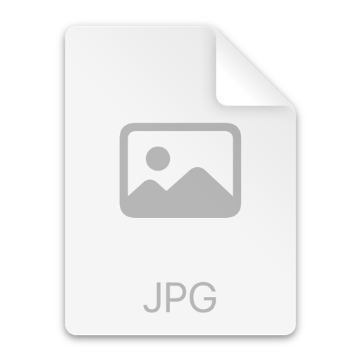

4.3. ~ 4.4.
워크숍을 다녀왔다.

전체적인 일정은 정말 빽빽했다. 솔직히 많은 사람들을 만나고 끊임없이 대화를 나누는 과정이 즐겁지 않았다면 무척 힘들었을 것 같다. 그래도 그 안에서 재미를 느끼기도 했고, 어쩌면 더 나은 팀원을 만나야 한다는 마음이 있었기에 더욱 적극적으로 임할 수 있었다.

그럼에도 이번 워크숍에서는 느낀 점도 많았고, 배운 점도 정말 많았다.

### 1. 프롬프트 경진대회 해커톤
부끄럽게도 해커톤은 이번이 처음이었다.
더구나 프롬프트에 대해서는 그동안 이야기로만 들어봤을 뿐, 이를 활용해서 주어진 상황에서 더 나은 답변을 이끌어내기 위해 깊이 고민해본 적은 없었다. 그래서 워크숍 전날 학습 자료를 보며 따로 공부했다. 그 과정에서 In-Context Learning, CoT, ToT 같은 프롬프트 기법을 알게 됐다. 지금까지는 단편적으로만 접한 내용을 어렴풋이 활용해왔는데, 이제는 이 부분을 제대로 채워야겠다는 생각이 들었다. 특히 스킬, 에이전트 등 AI 활용 방식은 예비 과정 전까지 더 공부하고 연구해야겠다고 느꼈다.

### 2. ASM 방향성
워크숍이 시작될 때까지만 해도 취업과 창업 모두에 가능성을 열어두고 싶었다.  
그래서 사용자를 많이 모을 수 있는 제품을 만드는 일을 1순위로 두고 있었다.

2순위는 우수자 인증, 3순위는 과정이 끝나고 계속 연락하고 교류할 수 있는 사람을 만나는 것이다.

우선순위 자체는 같지만, 1순위를 두는 목적은 달라졌다.  
기존에는 취업과 창업 두 가능성을 모두 붙잡아두기 위한 선택이었다면, 이제는 오직 창업에 도전해보기 위한 방향으로 바뀌었다.  
이렇게 생각이 바뀐 이유는 말 그대로 _창스라이팅_ 을 당했기 때문이다. 엑스퍼트와 멘토님들께서 워크숍 1일차 내내 창업을 해보라고 강조하셨다.  

AI/SW 마에스트로만큼 창업에 도전해볼 수 있는 환경이 흔치 않다는 것은 사실이다. 나 역시 과정이 시작되기 전부터 이곳이 아니면 창업에 도전해보기 어렵겠다고 생각했고, 그래서 적어도 여기서만큼은 취업 생각하지 않고 쏘마 과정에 전념하기로 했었다.  

그리고 한 가지 놀라웠던 점은, 정말 많은 사람들이 나와 비슷한 생각을 하고 있었다는 것이다.  
초반에는 취업과 창업 모두에 가능성을 열어두기 위해 프로젝트에 올인하겠다는 이야기가 대부분이었다.  
하지만 _창스라이팅_ 을 겪고 난 뒤에는 창업에 도전해보고 싶다는 동기를 가진 사람들이 훨씬 많아졌다.  

### 3. 기술 스택
2번과 비슷한 맥락으로, 기술 스택에 대해서도 관점이 달라졌다.
고백하자면 네이버 백엔드 개발자가 되는 것은 개발자를 시작한 시점부터 늘 품어온 꿈이었다.  
그러기 위해서는 Java, Spring에 대한 백엔드 기술 지식이 깊어야 한다고 생각해왔다.  

스타트업에서 풀스택으로 개발하며 넓고 얕게 경험한 시간은 개발자로서의 시야를 넓혀주었지만, 한편으로는 아쉬움도 남아 있었다.  
그래서 워크숍에서도 나를 "Java, Spring 백엔드 기반 풀스택"이라고 소개했다.  
마음 한편에는 여전히 Java, Spring 백엔드 기술 스택에 대한 고집, 혹은 욕심이 자리하고 있었다.

그런데 여섯 분의 멘토님들을 만나면서 모든 분께 비슷한 질문을 드렸다.  
특히 네이버에 재직 중이신 멘토님이 두 분 계셨다.  

질문은 "신입 개발자를 뽑을 때 기술적 깊이와 문제 해결 경험 중 어느 것을 더 높게 점수를 주는가?"이다.  
그런데 모든 멘토님들이 "신입은 기술적 역량이 또이또이다. 어차피 들어와서 우리가 키운다는 마인드이고, **문제에 대해 어떻게 사고했고 어떻게 접근해서 어떻게 해결했는지**를 중요하게 본다."고 말씀하셨다.  

이 말은 결국, 신입 포지션으로 지원할 나에게 "기술 스택보다는 쏘마에서 깊고 진하게 문제 해결 경험을 쌓는 것이 더 중요하다"라고 말씀하시는 것처럼 들렸다.

그래서 내 관점도 바뀌었다.  
굳이 특정 기술 스택에 집착하지 않고, 클라이언트 개발을 해도 괜찮겠다고 생각하게 됐다.  

실제로 13기 수료생이자 이번 기수 엑스퍼트이고, 내 대학 동기이기도 한 친구 역시 대학생 때는 AI를 하다가 쏘마에서는 Flutter로 앱 개발을 했고, 이후 스타트업에서 Java, Spring 백엔드를 거쳐 현재는 토스에서 데이터 엔지니어로 일하고 있다.

이쯤 되니 정말 기술 스택이 얼마나 중요한가 싶어졌다.

기술 스택을 고집했던 태도는 어쩌면 내 아집이자 고집이었고, 또 한편으로는 컴포트존이었던 것 같기도 하다.

### 4. 대단한 사람이 참으로 많다.
의대생이면서도 고등학생 때부터 개발을 해오신 분도 계셨다.
서울대생 분들도 많았고, 현역 군인이신데 휴가를 내고 오신 분들도 세 분이나 계셨다.  
모두의 에너지와 열정이 정말 대단했다.  
나는 새벽 1시 반쯤 숙소로 들어갔는데, 그 시간에도 밤새 네트워킹하며 이야기를 이어가는 분들이 많았다.

다들 말을 너무 똑부러지게 잘하셨고, 그야말로 대단한 사람들이 모여 있는 자리라는 생각이 들었다.

이런 분들과 이야기를 나누는 것 자체가 즐거웠고, 그만큼 정말 많은 것을 배울 수 있었다.

우테코 때는 네트워킹을 충분히 하지 못한 채 나만의 싸움을 했던 기억이 있다. 그래서 이번에는 반드시 고민을 더 많이 공유하고, 질문도 많이 하고, 이야기도 많이 나누어야겠다고 다짐했다.

> _"거인의 어깨에 올라서서 더 넓은 세상을 바라보라"_ - 아이작 뉴턴

### 5. 좋은 사람들도 많이 만났다.  
같은 테이블에 있던 사람들은 다행히도 낯을 많이 가리는 분들이 아니었다. 몇 마디를 주고받고 나니 금세 가까워졌고, 금방 편해졌다.  
같은 관심사를 가진 또래들과 이야기를 나누다 보니 생각보다 더 잘 통했다.  
여기서 친해진 사람들과 앞으로의 한 해를 즐겁게 보낼 수 있을 것 같다는 생각이 든다.

### 6. 성향이 I에서 E로 바뀐 것 같다. 어쩌면 이기적에서 이타적으로 바뀌고 있는 것도 같다.
정~말 많은 사람들, 특히 처음보는 사람들이랑 이야기를 정~말 많이 하니까 이제는 사람과 이야기하는 게 편해지고 익숙해졌다.

그거랑은 별개로 원래 I 성향이 강하기도 했고 처음 보는 사람에게 내 모습을 잘 안보여주는 스타일이었는데, 여기서는 어느정도 나를 내려놓기도 하고 먼저 말도 꺼내고 장난도 친다.

소마 입과 전에 책 <다정한 것이 살아남는다>, <현명한 이타주의자> 를 읽었는데, 두 책에서 모두 남을 위한 행동과 나를 어느정도 포기하고 타인을 위한 행동을 하는 것이, 결국엔 본인에게 긍정적인 작용을 한다고 했다.  

실제로 다정하고 친근하고 발이 넓은 사람은, 어떠한 방식이라도 도움을 받게 되고 잘 풀리는 것 같다.

소마에서 조금이라도 더 사람들에게 이타적인 행동을 하려고 한다.  

현재 내가 소마 과정에서 만들고 싶은 프로젝트 또한 재미를 추구하고, 시간과 돈을 절약해주어 수익을 창출하기보다는, 유기견 보호센터의 자금난 문제를 해결하거나 펫로스 증후군을 겪고 있는 분들께 힘이 될 수 있는 서비스를 개발하고 싶다.
