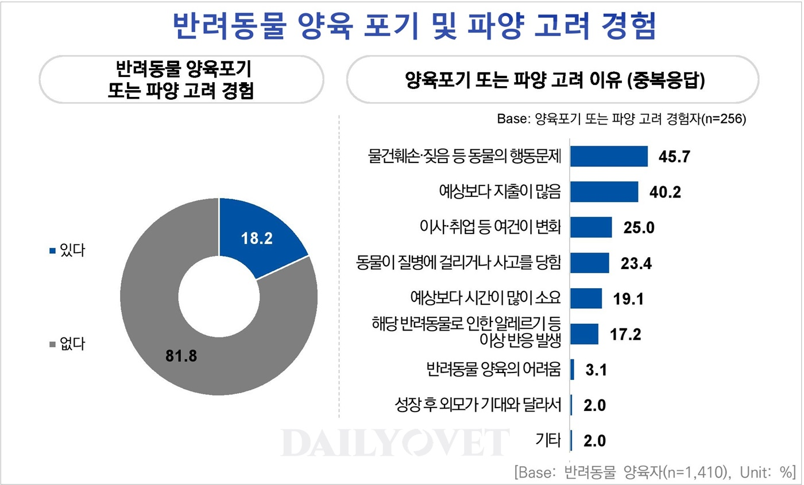

# 들어가며
'전 세계의 모든 강아지들이 행복했으면 좋겠다'는 내 꿈을 발견한 지 한 달 정도가 지났다.  
꿈을 발견하고 곧바로 집근처 유기견 보호센터에 자원봉사를 다녀왔고, 꿈을 이루기 위해서 무엇을 할 수 있을 지 한 달에 걸쳐 탐색하고 고민했다.  
그 결과, 개발자로의 경험을 살려 유기견과 관련된 문제를 기술로 풀어보자는 생각을 하게 되었고, 그에 대한 첫 번째 프로젝트로 '봉사하개' 프로젝트를 기획하게 됐다.

# '봉사하개' 프로젝트의 목적
'봉사하개' 프로젝트를 처음 생각하게 된 계기는 '다른 사람들이랑 같이 유기견 보호센터 봉사를 가고 싶다'였다.  
집에서 가장 가까운 보호센터로 가기 위해서는 최소 왕복 2시간의 시간이 걸리는데, 자차가 없으니 대중 교통을 이용하느라 환승하는 시간도 존재하고 20분 정도를 걸어야 한다.  
날이 좋으면 상관없겠지만 날이 많이 춥거나 더우면 가고 싶어도 가기 힘든 게 사실이다.  
그래서 "아 같이 가려는 사람 중에서 누가 차가 있었더라면.." 이라는 생각을 하게 되었고, "그러면 같이 갈 사람을 구하면 좋겠다!" 라는 생각까지 확장하게 됐다.

그리고 나의 경우에는 네이버 지도에 검색해서 알게 되었다. 그러다보니 해당 센터에서 제공하는 정보에 의존할 수 밖에 없었고, 추가적인 정보를 얻기 위해서는 해당 센터에서 운영하는 다음 카페에서 이것저것 찾아볼 수 밖에 없었다.  
그 과정에서 안전 사고를 위해 반드시 지켜야 할 규칙도 있고, 처음 해보는 경우 너무 복잡하고 어렵게 느껴졌다.  
그래서 이미 왔다 간 사람들의 후기나 추가적인 정보들이 많은 도움이 되었다.  

이런 고민들은 한 문장으로 '**유기견 봉사활동에 대한 문턱을 낮추고 한 명이라도 더 봉사활동을 하도록 돕고, 한 마리라도 입양될 수 있도록 돕자**'로 결론짓게 되었다.  
 
문득 다른 사람들은 유기견 봉사활동에 대해 어떻게 생각하는지 궁금해서 네이버 카페에 _유기견 봉사활동_ 으로 검색해보았다.  
실제로 사람들이 봉사활동을 가고 싶어도 어디에 있는 지 정보를 쉽게 구하지 못했고, 어떻게 신청해야 하는 지 물어보는 사람들이 꽤 있었다.  

  
이러한 사람들을 타겟으로 만들면 좋겠다는 생각이 든다.

사람들의 니즈를 충족시켜주고, 내가 잘만 만든다면 전 세계 모든 강아지들이 행복했으면 좋겠다는 내 꿈을 이룰 수 있는 한 가지 방법이 될 것이라고 생각한다.

# 프로젝트의 핵심 비전
1. 유기견 봉사활동에 대한 문턱을 낮춘다.
2. 사용자의 피드백을 최우선으로 반영한다.

# 프로젝트의 기술적 비전
1. 코드와 기술은 문제 해결을 위한 도구이자 수단이다.
2. 의도한 대로 동작하지 않는 이쁜 코드보다 돌아가는 쓰레기가 훨씬 낫다.

# 프로젝트의 1차 MVP
1. **유기견 보호센터 지도**를 통해서 내 주변, 그리고 전국적으로 어디에 보호센터가 존재하는 지 한눈에 파악할 수 있도록 지도를 통해서 정보를 제공한다.  
2. 보호센터에 대한 상세 정보를 제공한다.  
3. 봉사를 신청할 수 있도록 보호센터와 매칭을 한다.  
4. 해당 센터에서 봉사를 한 후기를 작성하고 정보를 모두 제공한다.

# 26.01.07. 추가 - 프로젝트 기획을 위해 많은 자료를 수집하면서 느낀 점

미국의 한 [블로그](https://coyotecommunications.com/coyoteblog/2023/05/volunteer-matching-tech/)에서는 봉사활동 매칭 플랫폼이 우후죽순 생기지만, 봉사자를 매칭하는 것은 보호소가 봉사자를 모집할 환경을 갖추고 난 다음에 해야 하는 문제라고 한다.

생각해보면 사람들에게 "이런 보호시설이 있어요~ 관심가져주시고 봉사해주세요!" 라고 해도, 강아지를 무서워하는 사람, 강아지는 좋지만 더러운 환경이 싫은 사람, 봉사하기 위해서 필요한 장비를 따로 구매하기 싫은 사람 등 봉사를 가기 꺼려지는 여러 요인들이 분명 있을 수 있다.
이를 위해 봉사자마다 적합한 임무와 역할을 만들고, 다양한 유형의 업무와 역할을 만들고, 장애인을 포용하는 등 접근성이 뛰어난 작업과 역할을 만들고, 적합한 자원봉사자를 선별하고 부적합한 자원봉사자를 걸러내기 위한 선별 과정, 봉사 활동을 하는 데 필요한 자원을 준비하는 일들이 어쩌면 선행되어야 한다고 생각한다.  

그러면 조금 더 봉사활동의 허들이 낮아질 것이고, 더 많이 봉사하게 될 것이고, 봉사활동이 하나의 유행이나 문화로 자리 잡으면 유기견에 대한 인식도 자연스레 개선될 것이라고 생각한다.

아무래도 다른 것보다 '돈'이 필요하다고 생각한다. 관심있는 사람, 하려는 사람은 꽤 있다. 하지만 보호소가 개선되고 환경이 개선되려면 아무래도 자금이 필수적으로 필요하다.  
그러면 사람들에게 보호소를 소개하고, 후원을 많이 받을 수 있도록 유도하는 것은 어떨까?

# 26.02.11. 추가 - 반려동물 분양 경로와 파양 비율 통계
## 1. 유기견 입양 후 재파양 비율
이종세 저, <강아지 훈련노트> 에서 다음과 같이 설명한다.

"_여러 가지 생각으로 유기견을 입양하신 분 중에 70% 이상이 다시 파양한다는 것입니다. 왜 그렇게 좋은 뜻으로 유기견을 입양하신 분들이 다시 파양하게 되는 걸까요?_

_통계에 의하면 유기견들이 버림을 받는 가장 많은 이유 중에 70~80% 정도는 강아지의 문제행동 때문이었고, 그 다음에 10~20% 정도가 주인의 여러 가지 피치 못할 사정 때문이었습니다.  
특히 버림받는 강아지들의 문제 행동을 살펴보면 심하게 짖는 문제, 사람을 무는 문제, 배변 문제, 분리불안증, 알파증후군 등이 가장 많습니다._

_다시 말해서 버림받은 유기견의 전 주인이 강아지를 입양해서 애지중지하며 잘못된 방법으로 키우다가 여러 가지 심각한 문제 행동이 나타나자 나름대로 고쳐보려고 노력하다가 도저히 감당할 수 없게 되니까 버렸다는 것입니다._ 

_그렇게 심각한 문제 때문에 전 주인도 할 수 없이 버린 유기견을, 새로 입양하는 사람이 데려다 키우는 것은 만만한 일일까요? 그래서 유기견을 입양한 사람 중에 70% 이상이 다시 파양하게 되는 것입니다._" 라고 한다.

그런데 사실상 **이는 유기견 뿐 아니라, 펫샵을 통해 분양하거나 지인을 통해 분양받은 경우에도 해당된다**고 본다.

## 반려동물 입양 및 분양 경로 통계
실제로 동물복지에 대한 국민의식조사 결과에 따르면, 반려동물 입양 및 분양 경로 통계는 다음과 같다.

2023년 기준, 반려동물 양육자 중 16.8%만이 동물보호시설이나 길에 떠도는 동물을 데려다 키운다고 응답했다.  
그런데 행동 문제 때문에 파양되는 동물은 단지 16.8%에만 해당될까?

## 반려동물 양육 포기 및 파양 고려 경험
이는 실제 설문 결과에서 확인할 수 있다. 아래 사진은 반려동물 양육 포기 및 파양 고려 경험에 대한 통계다.

양육포기 또는 파양 고려 경험자가 고려 이유에 대해 응답한 것으로는 행동 문제가 1위였다.  
이 말은 즉, 유기견에만 해당하는 문제가 아니라는 것이다.

결국 유기견을 입양하는 데 고려되는 문제는 유기견의 행동이 큰 비중을 차지하지 않을 수 있다.

## 유기동물 입양을 고려하지 않는 이유
신기하게도 유기동물 입양을 고려하지 않는 이유에 대한 통계도 존재한다.

이번 조사를 시행한 농림축산식품부는 “_월평균 가구소득별로 살펴보면 ‘300만 원 이하’는 ‘입양 방법이나 절차 등을 잘 모른다’의 응답 비율이 상대적으로 높게 나타났고, ‘301~500만 원’ 및 ‘501만 원 이상’은 ‘어린 동물을 키우고 싶은데, 유실·유기동물은 보통 성견이나 연령이 높은 경우가 많다’가 높게 나타났다_”고 설명했다.

즉, 경제적 여유가 있는 사람들은 어리고 건강한 반려동물을 입양하고 싶은 욕구가 있지만 **대부분의 유기견은 나이가 있거나 건강 상에 문제가 있는 동물이 많기 때문에 꺼려한다**.  
상대적으로 경제적 여유가 없는 사람들은 **입양 방법이나 절차에 대한 정보 부재**가 이유가 된다.

## 반려동물 마리당 월평균 양육비
**유기견을 입양하는 데 큰 걸림돌 중 하나는 양육비, 그 중에서 병원비**가 있다.

