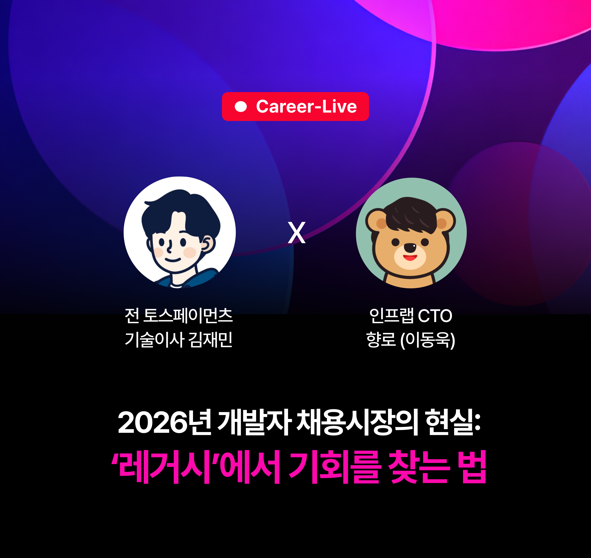

# 들어가며
3월 5일, 인프런에서 라이브 세션을 마련해주었다.  
제목은 "**2026년 개발자 채용시장의 현실 : '레거시'에서 기회를 찾는 법**"  
취업을 준비하면서 개발자 채용 시장에 대한 관심을 두지 않을 수 없기에 제목을 보자마자 홀린듯이 신청했다.

라이브 세션에서는 전 토스페이먼츠 기술이사 김재민(a.k.a. 제미니) 님과 향로님께서 진행해주셨다.  
세션 흐름은 제목에 충실하게 2026년 개발자 채용시장에 대해 짚고 넘어가고, 레거시 환경을 피하지 말고 맞서싸워 좋은 기회를 찾는 방법에 대해 말씀해주셨다.

세션 동안 제미니 님과 향로 님의 개발자 채용 시장에 대한 의견을 듣고, 참여자 분들의 좋은 질문과 그에 대한 답변을 들으며  
채용 시장을 바라보는 시각이 확장되었다.

세션을 들으며 기록하고 싶은 내용을 이곳에 기록하려고 한다.  
중간중간 빠르게 기록하려고 

---

# 메모

- 원하는 도메인의 회사에서 실제로 겪을 법한 문제를 하나 정하고, 그 문제를 AI와 함께 스스로 풀어본 경험을 이력서에 녹여내면 분명 가산점은 있다.

- 하지만 개발자에게 결국 중요한 것은 **문제 해결**이다.

- **개발자의 근본과 본질은 기술적 사고력**이라고 생각한다. 그리고 그 사고력은 **계속해서 "왜?"라고 묻는 태도**에서 나온다.

- **Q. 신입 개발자에게 크게 기대하는 것은 없다고 하셨는데, 그렇다면 이력서에서는 무엇을 어필해야 할까요? 내가 왜 이런 결정을 했는지, 그 선택의 이유를 설명하는 데 충실하면 될까요? 그런데 이런 내용은 누구나 한 번쯤 고민해봤을 것 같아서, 다른 신입 이력서와 다 비슷해질까 걱정됩니다. 어떤 내용으로 어필해야 할지 고민입니다.**  
  A. 작년 기준으로는 그런 내용을 제대로 적은 이력서를 거의 보지 못했다고 하셨다. 결국 서류 합격 이후 인터뷰까지 염두에 두고 준비해야 한다. 내 이력서에 적은 내용이 거짓이 아니고, "**나는 이렇게 개발자처럼 사고한다**"를 보여주는 것이 중요하다는 말이 인상적이었다. 대부분은 실제로 운영 중인 서비스도 없고, GitHub 링크만 덩그러니 올려두고 끝나는 경우가 많다고 한다.

- AI를 실제로 제대로 활용하는 사람은 생각보다 많지 않다고 하셨다. 너무 불안해할 필요는 없다는 말이 오히려 현실적으로 들렸다.

- AI 패러다임은 너무 빠르게 변한다. 그 흐름에만 매몰되기보다는, 결국 진짜 문제와 본질을 보는 것이 더 중요하다는 말에도 공감했다.

- AI에 대해 과장된 기대를 거는 분위기도 있다는 이야기가 나왔다. 실제로 AI만으로 엄청난 결과를 만들어냈다는 사례를 체감하기는 아직 어렵고, 그래서 더더욱 경거망동하지 않는 태도가 필요하다고 느꼈다.

- **Q. 주니어로서 아직 부족하다고 느껴서, 요즘은 코드를 직접 만들어보고 그 결과를 AI에게 피드백받는 방식으로 주로 활용하고 있습니다. 그런데 바이브 코딩이 워낙 대세가 되면서 한 번쯤은 써보게 되더라고요. 다만 이렇게 가다 보면 제 구현 능력이 떨어질까 걱정됩니다. 어떤 방향으로 성장하는 것이 가장 바람직할까요?**  
  A. 하나의 기능을 내가 직접 만들어보기도 하고, 같은 기능을 AI에게 시켜보기도 하며, 두 결과를 비교해보는 방식이 좋겠다는 답변이 나왔다. AI가 작성한 코드에 대해 내가 리뷰를 해보고, 왜 이렇게 작성했는지 되묻는 과정 자체가 학습이 될 수 있다는 말도 인상 깊었다.

- 아직은 신입에게 직접 코드를 짜는 능력이 필요하다고 본다. 에이전틱 개발을 활용하더라도, 그 과정에서 "이 에이전트를 어떻게 더 잘 쓰고 개선할 수 있을까?"를 고민하는 태도가 중요하겠다는 생각이 들었다.

- 재민 님은 실무 역량을 길러야 한다는 입장이 강해 보였다. 코딩 테스트가 완전히 사라져야 한다고까지 단정할 수는 없겠지만, 사고력과 구현 능력을 요구하는 과제형 문제의 중요성은 오히려 더 커질 것 같다는 의견에 공감했다.

- 기업마다 성격이 다르기 때문에 전통적인 알고리즘 역량을 강하게 보는 곳도 있고, 그렇지 않은 곳도 있다. 다만 전반적으로는 **과제 테스트**의 비중이 더 커질 것 같다는 느낌을 받았다.

- **개발자에게는 결국 똥을 치운 이력이 훈장**이라는 말도 기억에 남는다.  
  향로님과 재민님도 결국 그런 문제를 치운 경험으로 지금까지 먹고살고 있다고 말씀하셨다.

- 레거시를 개편할 때는 반드시 문제의식과 목표가 있어야 한다고 하셨다.  
  단순히 "내가 이 기술을 알고 있고, 이게 더 좋고 익숙하니까"라는 이유만으로 리팩터링하거나 레거시를 개선하면 안 된다. 결국 회사에서 임팩트가 큰 문제를 해결하는 방향이어야 한다는 말이 맞다고 느꼈다.

- 소프트웨어 개발의 꽃은 **운영**이라는 말도 다시 들었다.  
  운영을 해보지 않은 개발자는 분명히 놓치는 것이 있다는 이야기인데, 재민님이 2023년부터 계속 강조하셨던 말이라고 한다. 나도 점점 더 이 말에 동의하게 된다.

- **Q. 재민님이 지금 취준생이라면 가장 먼저 무엇을 하실 건가요?**    
  A. 본인 서비스를 하나 만들어서 어떻게든 키워보려고 할 것 같다고 하셨다. 실제 사용자가 쓸 수 있게 만들고, 그 과정에서 했던 고민과 문제 해결 과정을 정리할 것이라고 한다. 트래픽도 AI의 도움을 받아 일부러 넣어보고, 직접 트러블슈팅도 해보고, 그 과정을 기록할 것 같다고 하셨다.  
  핵심은 "내가 스스로 생각해서 문제를 풀어보려고 노력했다"를 최대한 보여주는 것이다. 코딩 공부나 알고리즘 공부 자체보다도, 문제 해결 경험을 만드는 쪽에 더 시간을 쓸 것 같다는 답변이었다.  
  향로님도 비슷한 취지의 말씀을 하셨다. 이제는 비전공자도 딸깍해서 서비스를 만들 수 있는 시대인데, 정작 개발자가 딸깍해서라도 서비스 하나 운영해보지 않았다는 건 역설적이라는 말이 인상적이었다. 실제 서비스를 운영하면서 맞닥뜨리는 문제를 겪고 해결하는 경험 자체가 큰 자산이라는 뜻일 것이다.    
  취준 기간 내내 서비스를 운영하라고도하셨다.    
  재민님은 또, 가고 싶은 회사를 기준으로 기술 스택을 정할 것 같다고 하셨다. 회사 타겟팅을 먼저 하고, 그 채용 공고에 나오는 기술을 중심으로 준비할 것 같다는 이야기였다.

- **Q. 신입인데도 신입~저연차를 거의 뽑지 않는 기업을 타겟팅하는 게 유효할까요?**    
  A. 재민님은 나라면 일단 열려 있는 공고를 중심으로 타겟팅할 것 같다고 하셨다.  
  다만 한국 시장에서는 여전히 Java와 Spring이 표준에 가깝고, 기회가 있는 레거시 땅에서는 Java가 훨씬 유리하다는 말도 나왔다.
  결국 타겟팅은 하되, 지금 열려 있는 곳을 함께 보면서 준비해야 한다는 것이다. 신입 공채가 언제 다시 열릴지 모르기 때문에, 전체 결을 최대한 비슷하게 가져가는 전략이 필요하다는 뜻으로 이해했다.
  예를 들어 지금 열려 있는 곳은 Node를 쓰는데, 내가 가고 싶은 회사는 Java 기반일 수 있다. 혹은 지금은 Go 포지션이 열렸는데 장기적으로는 네이버를 가고 싶을 수도 있다. 그럴 때는 작년 채용 정보나 시장 상황까지 함께 보고 선택과 집중을 해야 한다는 말이 인상 깊었다.  
  정리하면 Java, Spring Boot, MySQL, SQL 위주로 준비하는 것이 현실적인 선택처럼 느껴졌다.  
  일단 SQL로 개발하고 JPA랑 MyBatis 두 버전으로 새로 구현해본다고도 하셨다.  
  JSP는 굳이 깊게 공부하기보다는, AI의 도움을 받아 이해할 수 있을 정도까지만 보는 것을 추천하셨다.  
  또 대부분 ANSI SQL이나 DB 지식을 많이 묻기 때문에, SQL과 DB 지식이 정말 중요하다고 하셨다. 채용 공고를 잘 읽고, 그 공고를 기준으로 준비해야 한다는 말이 결국 핵심이었다.  
  레거시와 현실 기술이 함께 적혀 있는 공고라면, 현재는 레거시를 다루지만 앞으로는 신기술을 도입하려는 조직일 가능성이 높다는 해석도 흥미로웠다.

- 똥통(레거시 환경)에 들어가는 것 자체는 나쁘지 않다. 다만 그 똥통을 실제로 치울 수 있는 환경인지, 거기서 기회를 잡을 수 있는지는 꼭 봐야 한다. 기회가 없다면 다시 생각해볼 문제라는 말도 현실적으로 들렸다.

# 마치며
- 재민님, 향로님 같은 분들과 함께 개발 일을 해보고 싶다는 생각이 들었다.  

- 요즘은 알고리즘 쪽에 시간을 많이 쓰고 있었는데, 이번 라이브를 보면서 개발과 실무에 더 가까운 역량을 쌓는 시간도 의식적으로 확보해야겠다는 생각이 들었다.  

- 얼른 실무를 하고 싶다. 레거시도 만지고 싶고, 똥도 치우고 싶다..

- 이번 쏘마 2차 코테가 끝나면 코테와 개발에 쓰는 시간의 비중을 다시 조절하고, 방향성을 한 번 더 점검해야겠다.

- 재민님은 지금 취준생이라면 서비스를 직접 운영하면서 그 과정에서 했던 고민과 문제를 모두 정리하고, 그걸 통해 개발자적 사고를 보여주겠다고 하셨다. 그런데 그러면 CS는 어떻게 해야 할까?  CS의 중요성은 누구나 말한다. 그런데 정작 CS를 어떻게 접근하고 학습해야 하는지에 대해서는 잘 알려주지 않는다.  나는 컴공 전공자가 아니지만, 학교에서 배우는 CS도 대체로 학문적인 방식으로 전달된다. 우리는 그 흐름에 맞춰 공부한다. 어떻게 보면 학자형에 가까운 접근이다.  그런데 실력 있는 사람들은 대개 야생형으로 배운다고들 한다.  그래서 더 궁금해졌다.  취준생의 입장에서 CS를 어떻게 받아들여야 하는지, 어떤 마음가짐으로 접근해야 하는지, 그리고 서비스를 직접 개발하고 운영하는 과정 속에서 CS를 어떤 식으로 연결해 학습해야 하는지 말이다.  아마 비슷한 고민을 하는 신입이나 취준생이 꽤 많을 것 같다. 이 주제에 대해서도 언젠가 강의나 영상으로 생각을 들려주시면 정말 많은 사람들이 도움을 받을 것 같다.
  - 인프런 수강평에 질문을 남겼다. ([링크](https://inf.run/ARhnd))
