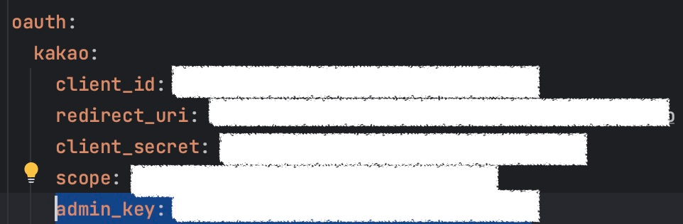
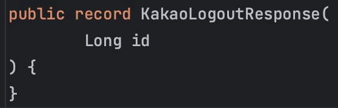

## 로그아웃 API 명세

우선 OAuth 관련 기능을 구현하려면 무조건 해당 OAuth 서버의 공식 문서를 통해 API 명세를 확인해야합니다.

구현하고자 하는 OAuth 서버인 카카오의 로그아웃 API 명세는 다음과 같습니다.

## 인증 방식 선택

인증 방식을 보면 `액세스 토큰`, `서비스 앱 어드민 키`(이하 어드민 키)로 두 가지가 있습니다.

액세스 토큰 방식은 쉽게 생각해 JWT를 통해 인증하는 것이고, 어드민 키는 API 요청을 보낼 때, 어드민 키를 함께 파라미터로 담아 요청하는 방식입니다.

**저희 팀이 선택한 인증 방식은 어드민 키 방식**인데요. 이유로는, 로그인 시 발급되는 액세스 토큰을 따로 관리하지 않으며, 서비스의 인증 방식으로 토큰 방식이 아닌 세션 방식을 채택해 사용하고 있기 때문입니다.

하지만 액세스 토큰 방식이 더 간단하니 상황이 된다면 액세스 토큰 방식을 사용하는 것을 추천합니다.

어드민 키는 '내 애플리케이션 - 앱 키' 에서 확인할 수 있습니다.

## 구현

그럼 이제 `어드민 키` 방식으로 구현해보겠습니다.

일단 그 전에 어드민 키를 환경 변수에 설정해줍니다.

그 다음 API 명세를 자세히 확인합니다.

눈여겨 볼 포인트는 **헤더**와 **본문**, **응답**입니다.

위 코드를 통해 간단하게 로그아웃 기능을 구현할 수 있습니다.

## 테스트

테스트 방식은 다음과 같습니다.

1. 로컬에서 프론트 애플리케이션을 띄운다.
2. 브라우저를 통해 로그인 요청을 보낸다.
3. 로그인 후 획득한 세션 아이디를 통해 포스트맨으로 로그아웃 요청을 보낸다.
4. 결과를 확인한다.

### 로그인 요청 실패

이때, 브라우저를 통해 로그인 요청을 보내면 이런 에러가 뜰 수 있습니다.

이는 **허용 IP 주소를 설정해주지 않아서 생기는 오류입니다.**

이를 해결하기 위해 아래 페이지를 통해 현재 사용중인 IP를 추가합니다.

입력할 IP는 `외부 IP 주소`입니다. 외부 IP는 (맥 기준) 터미널에 `curl ipecho.net/plain; echo` 명령어를 통해 확인할 수 있습니다.

그리고 다시 로그인 요청을 보내면 정상적으로 되는 것을 확인할 수 있습니다.

### 로그아웃 요청

로그인을 통해 얻은 세션을 아래와 같이 설정해주고 요청을 보내봅니다.

정상적으로 로그아웃되는 것을 확인할 수 있습니다.