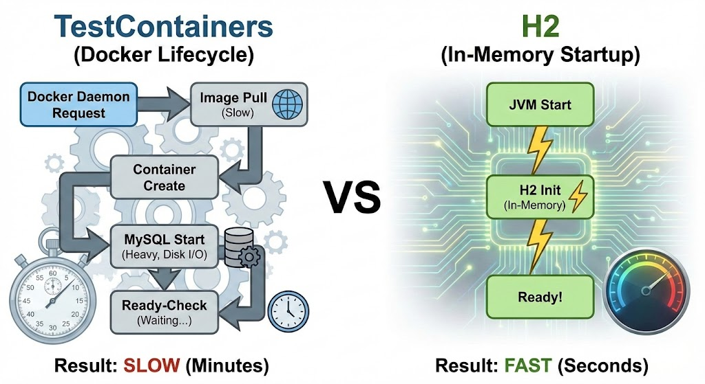
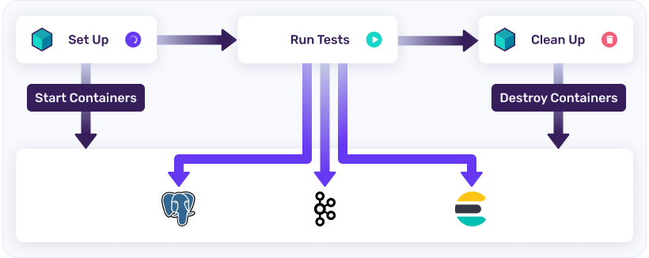
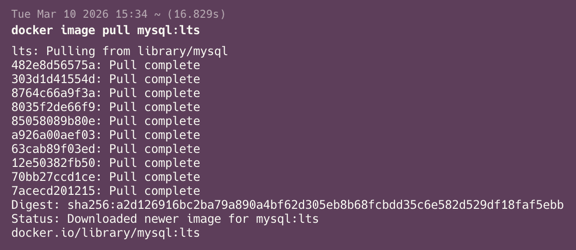
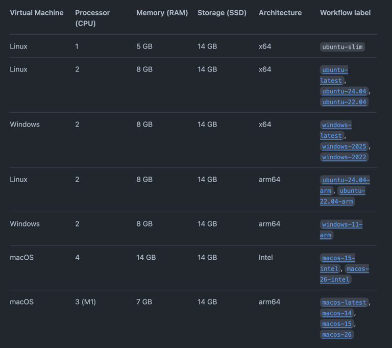

# 1. 들어가며

실무에서 Spring Boot로 백엔드 API를 개발할 때 통합 테스트를 작성했습니다.  
테스트용 DB로는 운영 환경(MySQL)과의 일관성을 위해 TestContainers를 사용했습니다.

하지만 GitHub Actions에서 수행되는 **CI 빌드 시간이 3분을 넘었습니다**.  
때문에 주기적인 배포와 개발 속도를 저해하는 하나의 병목 현상이 되었습니다.  
더구나 스타트업인데 개발 서버에 개발한 기능 배포할 때마다 3분 이상 기다리는 게 너무 아깝게 느껴졌습니다.  
자연스레 반드시 해결해야 되는 문제라고 판단했습니다.

이 글에서는 TestContainers를 사용한 통합 테스트의 CI 빌드 시간이 느린 이유와, 이를 해결하는 과정에 대해 작성해보려고 합니다.

---

# 2. TestContainers가 느린 이유는?

우선 TestContainers가 느린 이유에 대해 파악해봤습니다.

결론부터 말하면, **Docker 기술을 사용하기 때문**입니다.

원인에 대한 힌트는 [TestContainers 공식문서](https://testcontainers.com/getting-started/)에서 얻을 수 있었습니다.

TestContainers는 E2E 테스트 시에, 외부 인프라(Redis, MySQL 등) 의존성을 실제 운영 환경의 인프라와 100% 일치하도록 대체하기 위해 탄생한 기술입니다.  
Docker 기술을 기반으로 구현됩니다.

아래 그림은 TestContainers Workflow 입니다.



과정을 잘 보면 테스트를 실행하기 전에, **실행할 외부 의존성을 Docker 컨테이너로 띄웁니다**.

GitHub Actions에서 Docker 컨테이너를 띄우기 위해서는 항상 이미지를 Pull 받아야 합니다.  
GitHub Hosted Runner는 실행될 때마다 매번 새로운 가상 환경에서 실행되기 때문입니다.

제 경우에는 MySQL:8 을 설치하고 있었는데요. 아래 사진을 보시면 로컬에서 쌩으로 _mysql:lts_ 버전을 설치해도 16초가 나옵니다.



당시 GitHub Actions에서 동작하는 호스트의 하드웨어는 2 Processor, 8GB RAM, 14GB SSD, x64 Architecture 였습니다.

> 아래는 GitHub Actions에서 지원하는 Private Repository의 호스트 하드웨어 표입니다.  
> 

GitHub Actions는 MS Azure를 기반으로 호스트를 실행하는데요.  
이에 대응하는 MS Azure의 VM Size는 _Standard_D2_v3_ 이고, 해당 스펙의 Network 성능은 Max NICs == 2, Max Networks Bandwidth(Mb/s) == 1000
입니다.

즉, **MySQL Docker Image Pull을 다운로드 받을 때 상당한 시간이 걸림**을 유추할 수 있습니다.  
(당시에 로그를 확인했으면 정확히 파악했을텐데 그러지 못해 아쉽습니다..)

---

이 외에도 아래의 이유들로 시간이 자꾸 추가될 것입니다.

- MySQL 컨테이너가 띄어지고 초기화되는데까지 시간이 걸린다.
- TestContainers 자체적으로 Wait 전략을 통해 컨테이너가 올바르게 초기화됐는지 확인한다.
- Testcontainers API가 Ryuk 사이드카 컨테이너를 사용하여 테스트 실행 완료 후 생성된 모든 리소스(컨테이너, 볼륨, 네트워크 등)를 자동으로 제거한다. 이때 리소스가 정리되는 데까지 필요한 시간도
  있을 것이다.

---

# 3. 어떻게 개선할 수 있을까?

## 3.1. MySQL Docker Image를 캐싱해놓는다.

매번 새로운 가상환경이 실행되므로 매번 새로운 Docker Image를 Pull 받는 것이 큰 병목이라면, 이를 캐싱해두면 됩니다.  
Docker Manuals에도 잘 안내되어 있습니다. ([공식문서 링크](https://docs.docker.com/build/ci/github-actions/cache/))

[docker/setup-buildx-action](https://github.com/docker/setup-buildx-action)
과 [docker/build-push-action](https://github.com/docker/build-push-action) 을 조합해서 구현할 수 있습니다.

```yaml
steps:
  - name: Set up Docker Buildx
    uses: docker/setup-buildx-action@v3

  - name: Build and push
    uses: docker/build-push-action@v5
    with:
      context: .
      push: true
      tags: user/app:latest
      cache-from: type=gha
      cache-to: type=gha,mode=max
```

- `cache-from: type=gha`
    - GitHub Actions 캐시 저장소에서 이전 빌드 레이어를 찾아 현재 빌드에 재사용하도록 설정합니다.
- `cache-to: type=gha,mode=max`
    - 빌드가 완료된 후 생성된 모든 레이어를 GitHub Actions 캐시에 저장합니다. `mode=max`를 설정하면 최종 이미지뿐만 아니라 중간 단계의 모든 레이어까지 캐싱하여 재사용성을 극대화합니다.

|                          장점                          |                    단점                    |
|:----------------------------------------------------:|:----------------------------------------:|
| 가장 큰 병목이 되는 Docker Image Pull에 걸리는 시간을 간단히 해결할 수 있다. |      해결책이 GitHub Actions 환경에 종속적이다.      |
|               테스트 환경을 MySQL로 유지할 수 있다.               |           최초 1회에는 똑같이 3분이 걸린다.           |
|                                                      | **캐시를 불러오는 과정 역시, 네트워크 I/O 오버헤드가 존재**한다. |

## 3.2. TestContainers 설정으로 실행 시간을 단축한다.

TestContainers의 [Reusable Containers](https://java.testcontainers.org/features/reuse/) 기능을 통해 컨테이너 생성 및 파괴에 드는 리소스를 줄이는
방안이 있겠습니다.

`testcontainers.reuse.enable=true`를 설정하고, 소스 코드에서 `.withReuse(true)`를 명시하여 기능을 활성화 할 수 있습니다.

|            장점            |                             단점                             |
|:------------------------:|:----------------------------------------------------------:|
| 테스트 환경을 MySQL로 유지할 수 있다. | **매번 새로운 가상 환경에서 실행되는 GitHub Actions Runner 에서는 먹히지 않는다**. |
|     설정을 손쉽게 할 수 있다.      |                                                            |

## 3.3. H2 In-Memory DB를 사용한다.

아예 TestContainers(MySQL)를 사용하지 않고 H2 In-Memory DB를 사용하는 방식입니다.

|               장점               |                     단점                      |
|:------------------------------:|:-------------------------------------------:|
|    네트워크 I/O 오버헤드가 전부 사라진다.     |     테스트와 운영 환경의 불일치가 발생할 가능성이 존재하게 된다.      |
|            적용이 쉽다.             |               코드 수정이 일부 필요하다.               |
| 로컬 환경에서 항상 Docker를 켜두지 않아도 된다. | 프로덕션 코드에서 MySQL에 종속적인 SQL을 수행했다면 전부 고쳐야 한다. |

# 4. 해결

위 해결 방안 중에서 **H2 In-Memory DB를 사용**하는 방식을 택했습니다.

따지고 보면 MySQL에 종속적인 SQL을 사용하거나 기능을 호출하고 있지 않았습니다. 굳이 운영 환경과 일치할 필요가 없었던 것이죠.

그리고 프로덕션 코드에서 DB에 접근하는 모든 코드는 JPA에 의존하고 있었기에 특정 DB에 종속적이지 않아 쉽게 교체가 가능했습니다.

하지만 이 방법의 경우 아래의 `DatabaseCleaner` 라는 객체에 대해 코드 수정이 필요했습니다.  
테스트 격리를 위해 모든 테이블에 `TRUNCATE` 쿼리를 날리는 객체입니다. SQL이 MySQL에 종속적이기에 H2로 변경하면 테스트가 실패하게 됩니다.

```java
public class DatabaseCleaner {

    private final JdbcTemplate jdbcTemplate;
    private final List<String> truncateQueries;

    public DatabaseCleaner(JdbcTemplate jdbcTemplate) {
        this.jdbcTemplate = jdbcTemplate;
        this.truncateQueries = jdbcTemplate.queryForList("""
                SELECT CONCAT('TRUNCATE TABLE ', TABLE_NAME) AS query
                FROM INFORMATION_SCHEMA.TABLES
                WHERE TABLE_SCHEMA = DATABASE()
                AND TABLE_TYPE = 'BASE TABLE'
                """,
                String.class
        );
    }

    public void clean() {
        jdbcTemplate.execute("SET FOREIGN_KEY_CHECKS = 0");
        truncateQueries.forEach(query -> jdbcTemplate.execute(query));
        jdbcTemplate.execute("SET FOREIGN_KEY_CHECKS = 1");
    }
}
```

가장 이상적으로는 JPA에 의존해서 DB 구현체에 상관없이 외래키 제약 조건을 해제하고, 모든 테이블에 대해 `TRUNCATE` 하는 것입니다.  
하지만, 외래 키 제약 조건 해제 명령은 SQL 표준이 아니므로 모든 벤더에서 공통으로 동작하는 단일 SQL은 존재하지 않습니다.

이를 해결하기 위해 다음과 같은 해결 방안이 있겠습니다.

1. 엔티티 간의 연관 관계 순서를 고려하여 삭제한다.  
   | 장점 | 단점 |
   |:------------------------------------------------:|:------------------------------------:|
   | 순수 JPA에만 의존하기 때문에 DB 구현체가 달라지더라도 코드를 수정할 필요가 없다. | 외래키 제약 조건을 위반하지 않는 순서를 고려해서 삭제해야 한다. |
   | | 엔티티가 추가될 때마다 코드를 추가해야 한다. |

2. 연관 관계가 복잡하다면 각 벤더별 Dialect를 분기 처리한다.
   | 장점 | 단점 |
   |:------------------------------------------------:|:------------------------------------:|
   | 연관 관계를 고려하지 않아도 된다. | DB 구현체가 달라지면 코드 수정이 조금 필요하다. |
   | 엔티티가 추가되더라도 코드를 수정하지 않아도 된다. | |

저는 1번 방법을 선택했습니다.  
엔티티 간의 연관 관계가 복잡하지 않았기 때문에 가장 직관적인 방법을 택했습니다.

> 지금 생각하면 2번 방법이 더 나은 방법 같아 보입니다.  
> DB 구현체가 달라질 가능성은 매우 희박했고, 오히려 엔티티를 추가하고 삭제하는 빈도가 더 잦았기 때문입니다.

그 결과 아래 코드와 같이 작성했습니다.

```java
@Component
public class DatabaseCleaner {

    @Autowired
    private UserRepository userRepository;
    @Autowired
    private PostRepository postRepository;
    @Autowired
    private CommentRepository commentRepository;
    @Autowired
    private LikeRepository likeRepository;

    public void clean() {
        likeRepository.deleteAllInBatch();
        commentRepository.deleteAllInBatch();
        postRepository.deleteAllInBatch();
        userRepository.deleteAllInBatch();
    }
}
```

# 5. 결과
TestContainers를 걷어내고 H2 DB를 적용하니 CI 빌드 시간이 약 1분까지 감소하여 약 66%가 단축되었습니다.

만약 앞으로 운영 환경에 종속적인 SQL이나 기능을 구현해야 한다면, 해당 기능만 따로 TestContainers를 이용한 테스트를 수행하도록 해야 될 것 같습니다.  
물론 이때도 테스트 속도가 큰 병목이 될텐데요.  
그때는 GitHub Actions에 MySQL Image를 캐싱하거나, 아예 인프라용 서버를 구축해서 테스트용 MySQL 컨테이너를 상시 띄어놓는 방법 등을 적용해볼 수 있겠습니다.

# 6. 마치며
지금까지 TestContainers를 사용해서 CI 시간이 3분이 걸린 이유에 대해 알아보고, 여러 해결 방안 중 H2 In-Memory DB를 사용해서 문제를 해결한 과정에 대해 정리해봤습니다.

지금 생각해보면 처음부터 TestContainers를 사용할 이유가 없었던 것 같습니다.

---

# 참고
- [Testcontainers 공식 문서](https://testcontainers.com/)
- [GitHub Actions Dependency Caching](https://docs.github.com/en/actions/reference/workflows-and-actions/dependency-caching)
