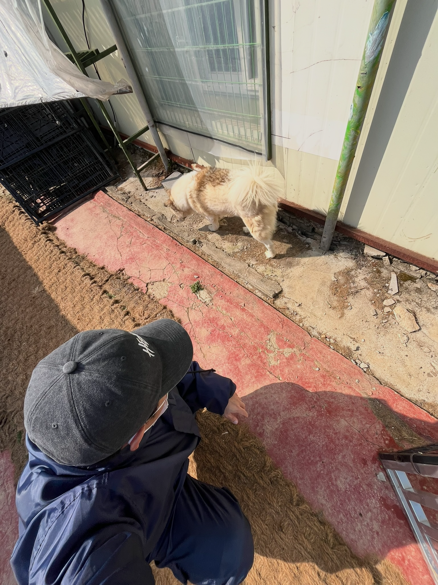
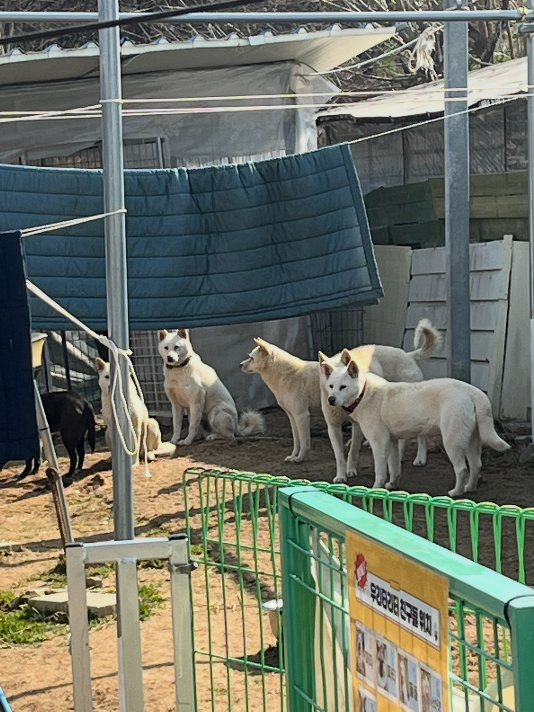
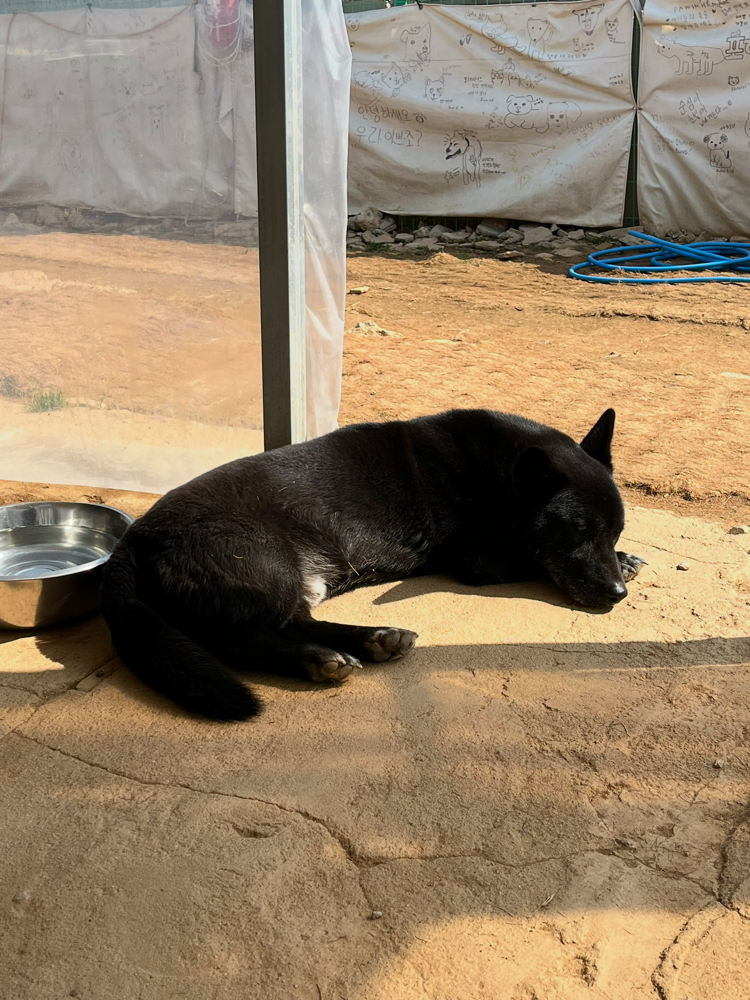
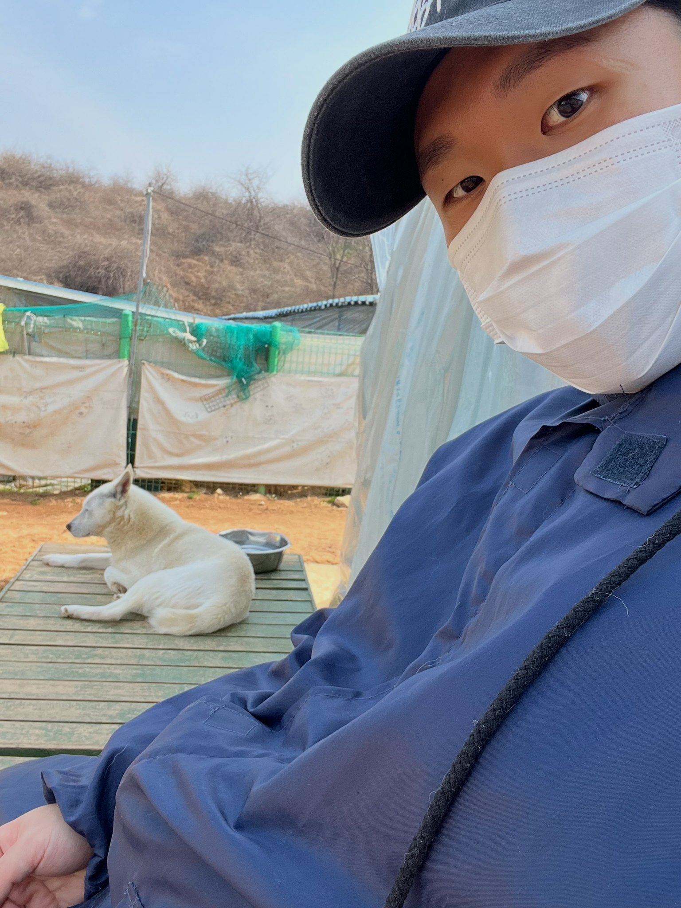
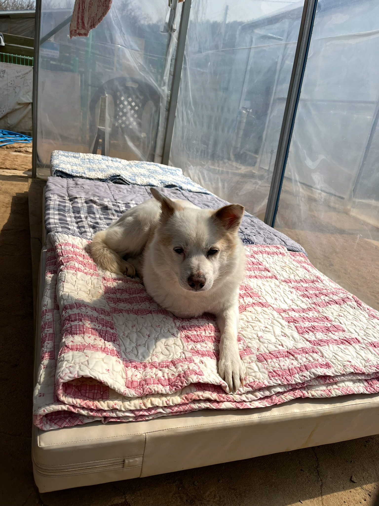
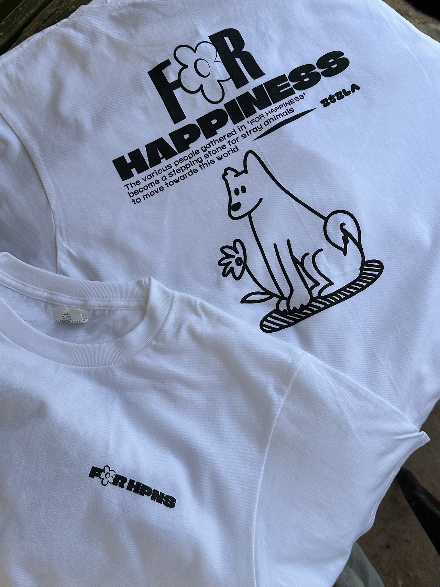

오늘은 정말 오랜만에 [포해피니스](https://naver.me/FnmZDAb5)에 유기견 보호센터 자원봉사를 다녀왔다!  
이번이 무려 3회차인데, 마지막으로 1월 6일에 마지막으로 방문했으니 두 달이 훌쩍 넘었네..  
1~2월부터 본격적인 취업 준비를 시작해서 바빴다는 핑계뿐 😭  
그리고 자차가 있었다면 더 쉽게 갔을텐데 아쉽다 ㅜㅜ

그래도 저번 주 금요일에 AISOMA 최종 면접도 마쳤고, 매주 월요일에 하던 오프라인 스터디도 한 주 쉬어가는 김에 바로 봉사 신청을 했다!

의도한 건 아니지만 이 날이 _세계 강아지의 날_ 이었다.  
그래서인가 더욱 뜻깊은 하루가 된 기분이다.

시작 사진은 본가에 있는 반려견인 사랑이 사진으로 시작!

## 봉사 사진

1. 낯가리는 파티  

2. 아직 누가 누구인지 헷갈리는 친구들..

3. 덩치에 비해 다리가 짧아 귀여운 칸쵸  

4. (아마도) 토르랑 같이 찍은 사진

5. 점박이가 매력적인 루이

이 날 할 일이 꽤 많고 아이들도 볕이 따뜻한 탓인지 사람이 많은 탓인지 잘 나오지 않아 사진을 많이 못찍었다.  
토르랑 야외 산책도 나갔는데 주민 분들도 많이 오가고 대형견들을 단체로 산책하다보니 집중해야해서 사진 찍을 여력이 없었다.

오랜만에 간 보호센터에는 자주 보이던 친구들이 많이 보이지 않았다.  
특히 내 최애였던 동동이는 인스타를 통해 해외로 입양 간 사실을 알고 있었지만, 내심 아쉬웠다 ㅜ  
그래도 아이들한테는 더 나은 세상을 살고 있다는 뜻이니까 너무너무 다행이다.  
남은 아이들도 모두 좋은 곳으로 입양갔으면 좋겠다.

## 정봉 티셔츠
모든 봉사활동이 끝나고 마무리하는 중에 현장 관리자 님께서 정봉티를 챙겨주셨다!  
봉사를 3회차 이상 온 사람들을 **정봉**이라고 부르는데, 정봉들에게 나눠주는 티셔츠이다.

직접 입어보니 생각보다 티셔치가 쫀쫀하고 페인팅도 너무 이뻤다.  
너무 감사합니다 ☺️
