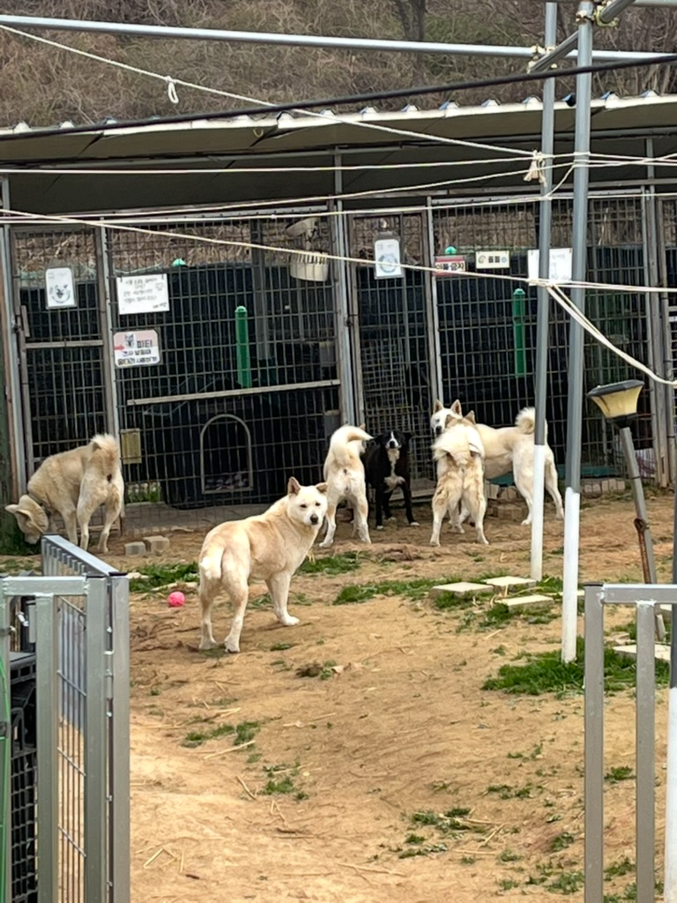
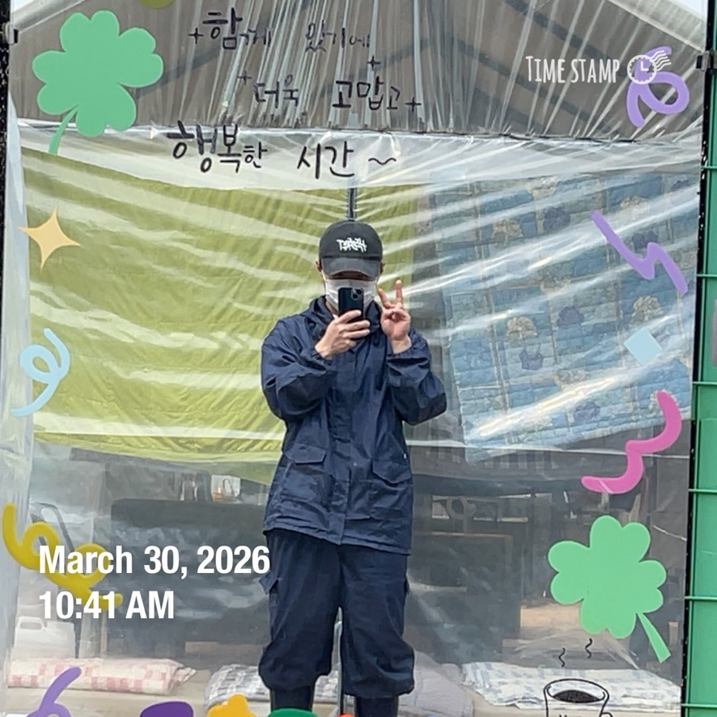
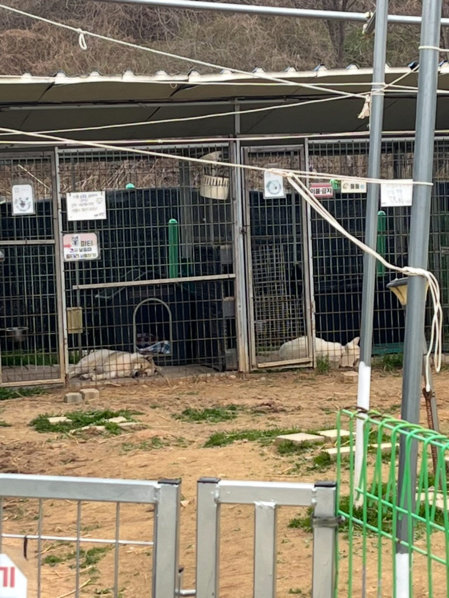
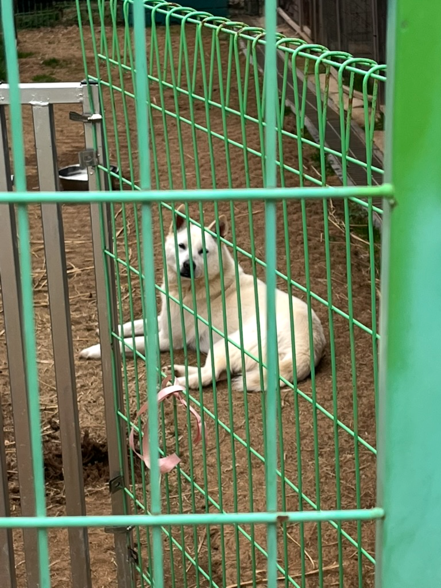

[3회 차](https://kdkdhoho.github.io/posts/volunteering-at-a-stray-dog-shelter-3/)를 지난 주(3/23 월)에 다녀오고 일주일만에 다시 방문했습니다.

3월 25일(수)에 쏘마 최종 합격 연락을 받고 급하게 서울에 방도 알아보고 계약까지 했는데요.

입주일이 5/3으로 결정되었고 4월부터는 쏘마 예비 과정이 본격적으로 시작되는 만큼, 이제 천안에서 있을 시간이 없다고 생각이 됐습니다.

이 생각이 들자마자 곧바로 4회차 봉사를 신청해서 다녀오게 되었습니다!

금요일엔 온종일 서울 방 알아보고, 토-일은 군대 선임 만나서 술 거하게 마시고 찜질방에서 자고 온 터라, 아침에 일어나는 게 힘들긴 했지만 마지막이라는 생각에 힘이 났습니다.

그럼 봉사 사진 슛~!

## 봉사 사진

1. 돌돌, 순심, 흰둥이1, 레옹, 파티, 흰둥이3

2. 거울에서 한 장

3. 똑같은 자세로 자는게 귀여워서 ㅋㅋㅋ

4. 민들레 홀씨 행복이랑 도도한 루이

5. 지난 주 같이 산책했던 젠틀한 토르

6. 마지막 날이라고 쓰레기도 버리고, 사진은 없지만 아이들 하네스도 채워주고 사료도 줬답니다.

7. 마지막은 몸이 다부진 꼬삼이

## 마치며
이제야 아이들 성격이 보이고 이름도 외워지려고 하는데 마지막이라니 참 아쉽습니다.

포해피니스에서의 봉사는 마지막이지만 서울에서도 주기적으로 할 예정입니다. 쉬는 날에 할 것도 없는데 봉사 다녀오면 아~주 개운하고 뿌듯하거든요.

아마 내년에 취업이든 창업이든 해서 돈 벌면서 포해피니스에는 후원으로나마 응원해야겠습니다.
