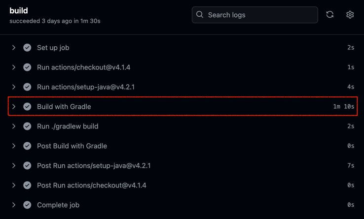
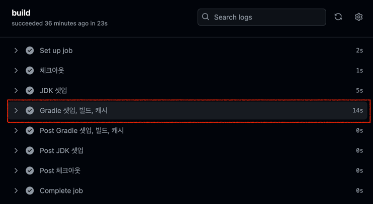
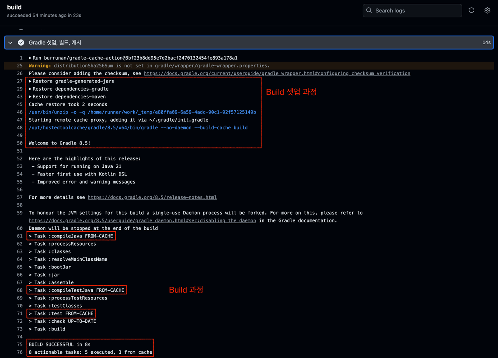
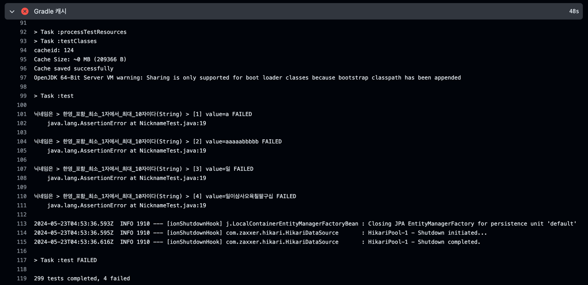

## 들어가며

현재 [ListyWave](https://listywave.com) 프로젝트에서 백엔드는 지속적 통합(이하 CI)의 툴로 [Github Actions](https://docs.github.com/ko/actions)를 이용 중이다.

CI 과정에서 수행하는 작업은 크게 아래와 같다.

1. 저장소 Checkout
2. JDK 준비
3. Gradle 준비
4. Build

하지만 3, 4번 과정에서 최소 1분이 걸리고 있었다.



이를 Github Actions Market Place에 있는 [actions/gradle-cache](https://github.com/marketplace/actions/gradle-cache)를 이용해 속도를 개선하려고 한다.

## 1. actions/gradle-cache

우선 [actions/gradle-cache](https://github.com/marketplace/actions/gradle-cache)에 대해 간단하게 이해해보자.

Github Actions는 작업이 수행될 때마다 매번 새로운 환경의 가상 호스트를 생성하고 작업을 수행한다.<br>
따라서 JDK 셋업이나 Gradle 셋업 및 빌드 과정이 매번 동일하게 수행된다.

하지만 위 작업들은 변경되지 않는 한, **캐싱을 이용할 수 있는 작업들**이다.

_actions/gradle-cache_ 는 그 중에서도, Gradle을 셋업하고 빌드하는 과정을 전반적으로 수행해주며 동시에 원격 혹은 로컬에 캐싱을 지원해주는 기술이다.

## 2. Gradle을 캐싱하면 속도가 빨라지는 이유

[Gradle](https://docs.gradle.org/)은 Java, Android, Kotlin을 **Build** 해주는 오픈 소스 라이브러리다.

Build란 우리가 완성한 프로젝트를 실행가능한 독립적인 하나의 파일로 만드는 과정을 의미한다.<br>
Java를 기준으로 설명하면, Build의 산출물로 _.jar_ 또는 _.war_ 파일이 탄생한다.

Build를 하기 위해서는 컴파일 -> 링크 -> 패키징 -> 테스트의 과정을 거친다.<br>
이 과정에서 **프로젝트에서 사용되는 종속성을 네트워크를 통해 다운로드** 받아야 한다.<br>
또한 중요한 사실은, **Build의 입력(소스 코드, 종속성, 빌드 옵션 등)이 동일하면 출력도 동일**하다.

따라서 **직전 Build의 결과를 저장하고 다음 Build 작업에서 입력이 바뀌지 않았다면 해당 결과물을 재사용함으로써 시간을 절약**할 수 있다.<br>
또한 **종속성을 캐싱한다면 네트워크를 통해 다운로드 받는 반복 작업을 수행하지 않을 수 있다**.

## 3. 적용하기

[Gradle 공식 문서](https://sejoung.github.io/2021/08/2021-08-04-gradle_build/)와 [기술 블로그](https://sejoung.github.io/2021/08/2021-08-04-gradle_build/)를 통해 **Gradle 자체적으로 성능 개선을 위한 옵션을 지원**하고 있는 것을 확인할 수 있다.

여러 종류의 옵션이 지원되고 있는데, 나는 그 중에서 **빌드를 병렬적으로 수행하게 해주는 옵션**과 **빌드 캐시를 활성화해주는 옵션을 설정**했다.

옵션에 대한 자세한 설명은 공식 문서나 블로그 글을 참고해보면 좋겠다.

### 개선된 CI Workflow

Gradle 캐싱을 적용한 CI Workflow는 아래과 같다.

```yaml
name: CI workflow

on:
  pull_request:
    branches: [ "dev", "prod" ]
  workflow_dispatch:

jobs:
  build:
    runs-on: ubuntu-22.04

    steps:
      - name: 체크아웃
        uses: actions/checkout@v4

      - name: JDK 셋업
        uses: actions/setup-java@v4
        with:
          java-version: '17'
          cache: 'gradle'
          distribution: 'corretto'

      - name: Gradle 셋업, 빌드, 캐시
        uses: burrunan/gradle-cache-action@3bf23b8dd95e7d2bacf2470132454fe893a178a1
        with:
          arguments: build # 경우에 따라 bootJar 로도 할 수 있다.
          save-gradle-dependencies-cache: true
          properties: |
            --build-cache
            --parallel
```

위 Workflow로 수행한 결과는 아래와 같다.




Gradle를 셋업하는 과정에서 캐시 데이터를 활용한 것을 볼 수 있고, 빌드 과정 중에서 `Task :compileJava`, `Task :compileTestJava`, `Task :test ` 작업이 모두 캐시로부터 수행된 것을 확인할 수 있다.<br>
그 결과, 확실히 Gradle과 관련된 작업에서 상당한 성능 개선이 이루어진 것을 확인할 수 있다.

혹시나해서 고의로 실패하는 테스트를 작성 후 Workflow를 실행해보았다.

Build가 성공적으로 실패하는 것을 확인할 수 있었다.

## 마치며

이 글을 통해 Github Actions를 이용해 CI를 구축하려는 사람들이 조금 더 빠른 속도로 처리했으면 좋겠다.
