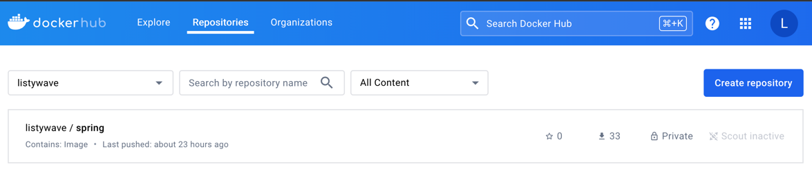
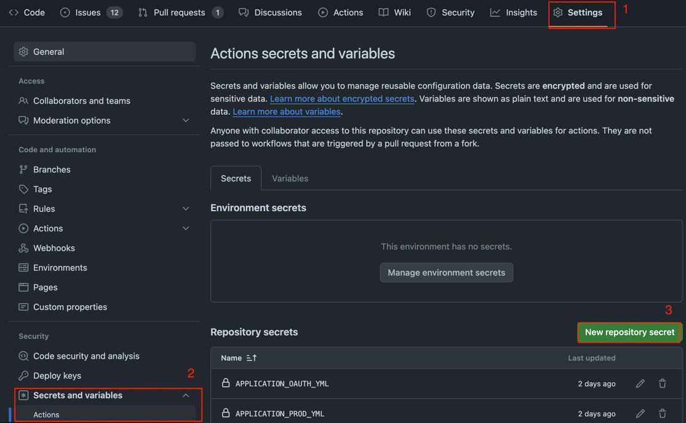

## 들어가며

서비스를 지속적으로 발전하기 위해서는 많은 기능을 추가하거나 성능을 개선하는 등 많은 작업이 필연적으로 이뤄진다.<br>
작업이 완료되면 이를 배포해야 하는데, 배포하는 과정이 귀찮고 길어지면 서비스를 지속적으로 발전하는 데 문제가 생긴다.

따라서 **배포를 자동화하는 작업은 서비스를 지속적으로 운영함에 있어 매우 중요한 작업**이다.

배포 자동화를 구축하는 방법과 툴은 여러 가지가 있지만, 이번 글에서는 Github Actions와 Docker를 이용해 구축하는 방법에 대해 작성해보겠다.

## Architecture

배포 자동화가 수행되면 아래 그림과 같은 순서로 동작하게 될 것이다.


1. 특정 브랜치에 Push or Merge가 발생하면 Github Actions를 통해 Deploy Workflow가 수행한다.
2. Docker Hub에서 Image를 Pull하기 위해 Github Actions Host에서 EC2 인스턴스에 접속해야 한다.<br>
이를 위해 EC2 보안 그룹 인바운드 규칙에 현재 수행 중인 Github Actions Host의 IP를 추가해야 한다.
3. Docker Image를 만들기 전, 프로젝트 설정 파일을 추가하고 프로젝트를 빌드한다.
4. 프로젝트 빌드의 결과물을 Dockerfile을 이용해 Image로 만들고 Docker Hub에 Push 한다.
5. EC2 인스턴스에 접속해 Docker Hub에 올려놓은 Image를 Pull 하고 실행시킨다.

<br>

이제 위 작업을 하나씩 수행해보자.

## Docker Private Repository 만들기

우선 [Docker Hub](https://hub.docker.com/)에 접속 후 로그인하자.<br>

로그인 후 상단에 `Repository` 탭을 누르고 `Create Repository` 버튼을 누른다.

그리고 *Repository Name*을 본인에 맞게 작성하자.<br>
참고로 `account/repository name` 으로 생성된다.<br>
작성했다면 아래 `Private`을 선택해 생성하자.

생성하고 나면 아래 사진처럼 Private Repository가 존재할 것이다.


## Docker Access Token 발급받기

뒤에서 진행될 Docker Login과 GitHub Actions에서 Docker에 Login하기 위해 *Docker Access Token*이 필요하다.

미리 발급을 받아놓자.

우측 상단에 프로필 버튼을 눌러 `Account Settings` -> `Security`로 들어가면 `Access Tokens`가 있을 것이다.<br>
`New Access Token` 버튼을 눌러 발급받자.<br>
그리고 Token 값은 본인만 알고 있는 곳에 기록해놓으면 되겠다.

## WAS에 접속해 Docker Login 해놓기

다음 단계로, WAS에 접속해 미리 Docker에 Login 해놓는 것이다.

전체 동작 흐름을 보면 Actions Host에서 EC2 인스턴스에에 SSH로 접속 후, 미리 작성해놓은 스크립트를 수행한다.<br>
이때, Docker Hub에서 Image를 Pull 받는 과정은 로그인이 된 상태에서 수행되어야 한다.<br>

WAS에 접속 후 `docker login --username ... --password ...` 명령어로 로그인을 해놓자.

참고로 구글 계정으로 로그인을 했다면 password에 미리 발급받아놓은 `Docker Access Token` 값을 입력하면 된다. 

## Dockerfile

다음으로 *Dockerfile*을 작성해보겠다.<br>
Dockerfile은 우리가 만든 프로젝트를 이미지로 만들기 위해 필요한 스크립트 파일이다.<br>

작성한 Dockerfile은 다음과 같다.

```dockerfile
FROM arm64v8/amazoncorretto:17-alpine-jdk

COPY ./build/libs/listywave.jar listywave.jar

ENV TZ=Asia/Seoul

ENTRYPOINT ["java", "-jar", "listywave.jar"]
```

여기서 따로 수정이 필요할 수 있는 부분은 `FROM arm64v8/amazoncorretto:17-alpine-jdk` 이라고 생각한다.<br>
필자의 EC2 인스턴스의 CPU 아키텍처가  _arm64v8_ 라서 앞에 `arm64v8`을 추가해주었다.<br>
본인 환경에 맞게 수정해주면 되겠다.

Dockerfile은 프로젝트 경로 최상단에 위치시키면 된다. 

## CD Workflow

이제 셋팅은 모두 끝났다. 배포 자동화의 전체 동작을 기술한 Workflow를 작성해보자.<br>
`/프로젝트 최상단/.github/workflows/` 경로에 아래 yml 파일을 작성하자. 

각 step 별로 name을 한글로 적었으니, 각각 어떤 작업을 수행하는지 파악할 수 있을 것이다.

```yaml
# prod-cd.yml
name: Deploy to PROD

on:
  workflow_dispatch:
  push:
    branches: [ "prod" ]

jobs:
  deploy:
    runs-on: ubuntu-latest
    steps:
      - name: Github Actions 호스트 IP 가져오기
        id: ip
        uses: haythem/public-ip@bdddd92c198b0955f0b494a8ebeac529754262ff

      - name: AWS 로그인
        uses: aws-actions/configure-aws-credentials@e3dd6a429d7300a6a4c196c26e071d42e0343502
        with:
          aws-access-key-id: ${{ secrets.AWS_ACCESS_KEY_ID }}
          aws-secret-access-key: ${{ secrets.AWS_SECRET_ACCESS_KEY }}
          aws-region: ${{ secrets.AWS_DEFAULT_REGION }}

      - name: IP 허용
        run: |
          aws ec2 authorize-security-group-ingress --group-id ${{ secrets.AWS_SECURITY_GROUP_ID }} --protocol "tcp" --port "${{ secrets.EC2_PORT }}" --cidr "${{ steps.ip.outputs.ipv4 }}/32"
        env:
          AWS_ACCESS_KEY_ID: ${{ secrets.AWS_ACCESS_KEY_ID }}
          AWS_SECRET_ACCESS_KEY: ${{ secrets.AWS_SECRET_ACCESS_KEY }}
          AWS_DEFAULT_REGION: ${{ secrets.AWS_DEFAULT_REGION }}

      - name: 저장소 Checkout
        uses: actions/checkout@v4

      - name: 설정 파일 추가
        run: |
          cd ./src/main/resources/

          cat <<EOF > application-prod.yml
          ${{ secrets.APPLICATION_PROD_YML }}
          EOF

          cat <<EOF > application-oauth.yml
          ${{ secrets.APPLICATION_OAUTH_YML }}
          EOF

          cat <<EOF > application-storage.yml
          ${{ secrets.APPLICATION_STORAGE_YML }}
          EOF

      - name: 디렉터리 이동
        run: cd /home/runner/work/ListyWave-back/ListyWave-back/

      - name: Gradle 셋업, 빌드, 캐싱
        uses: burrunan/gradle-cache-action@3bf23b8dd95e7d2bacf2470132454fe893a178a1
        with:
          arguments: bootJar

      - name: 도커 이미지 빌드
        run: docker build -t ${{ secrets.DOCKER_HUB_USERNAME }}/${{ secrets.IMAGE_NAME }}:${{ secrets.PROD_TAG }} ./

      - name: 도커 허브에 로그인
        uses: docker/login-action@0d4c9c5ea7693da7b068278f7b52bda2a190a446
        with:
          username: ${{ secrets.DOCKER_HUB_USERNAME }}
          password: ${{ secrets.DOCKER_HUB_TOKEN }}

      - name: 도커 허브에 Push
        run: docker push ${{ secrets.DOCKER_HUB_USERNAME }}/${{ secrets.IMAGE_NAME }}:${{ secrets.PROD_TAG }}

      - name: 인스턴스 접속 및 배포 스크립트 실행
        uses: appleboy/ssh-action@029f5b4aeeeb58fdfe1410a5d17f967dacf36262
        with:
          host: ${{ secrets.PROD_EC2_HOST }}
          username: ${{ secrets.EC2_USERNAME }}
          key: ${{ secrets.PROD_EC2_PRIVATE_KEY }}
          script: |
            docker stop "${{ secrets.CONTAINER_NAME }}"
            docker rm -f "${{ secrets.CONTAINER_NAME }}"
            docker rmi "${{ secrets.DOCKER_HUB_USERNAME }}/${{ secrets.IMAGE_NAME }}:${{ secrets.PROD_TAG }}"
            docker pull "${{ secrets.DOCKER_HUB_USERNAME }}/${{ secrets.IMAGE_NAME }}:${{ secrets.PROD_TAG }}"
            docker run -d -p 8080:8080 --name "${{ secrets.PROD_CONTAINER_NAME }}" "${{ secrets.DOCKER_HUB_USERNAME }}/${{ secrets.IMAGE_NAME }}:${{ secrets.PROD_TAG }}"

      - name: IP 제거
        if: ${{ always() }} # 반드시 추가해야 한다. 추가하지 않으면 보안 그룹에 추가한 IP가 삭제되지 않는다!!
        run: |
          aws ec2 revoke-security-group-ingress --group-id "${{ secrets.AWS_SECURITY_GROUP_ID }}" --protocol "tcp" --port "${{ secrets.EC2_PORT }}" --cidr "${{ steps.ip.outputs.ipv4 }}/32"
        env:
          AWS_ACCESS_KEY_ID: ${{ secrets.AWS_ACCESS_KEY_ID }}
          AWS_SECRET_ACCESS_KEY: ${{ secrets.AWS_SECRET_ACCESS_KEY }}
          AWS_DEFAULT_REGION: ${{ secrets.AWS_DEFAULT_REGION }}
```

## Github Repository에 Secret 값 넣어주기

이제 위 workflow가 정상적으로 수행할 수 있도록 *Secrets* 값들을 넣어주자.

프로젝트의 GitHub Repository에서 `Settings` - `Secrets and variables` - `Actions`로 들어가자.

그리고 `New Repository secret` 버튼을 눌러 Secrets 값들을 저장해주면 된다.


위 Workflow를 위에서부터 하나씩 **천천히!** **차근차근!** 보면서 저장해주자.<br>
필자는 단 하나를 빠트려 2시간을 날렸다.. 😭😭

## 동작 확인하기

이제 설정한 브랜치에 코드를 push해서 제대로 동작하는지 확인하면 모든 작업은 끝이 난다.

만약 작업이 실패한다면, `Actions` 탭에서 해당 workflow의 로그를 살펴보며 어디서 실패했는지 확인하면 된다.<br>
대부분 설정 하나를 빠트렸다거나, 값을 잘못 작성했다거나 하는 문제일 가능성이 크기 때문에<br>
로그를 읽고 하나씩 해결하면 모두 올바르게 동작할 것이다.

## 마무리

인프라 작업은 다양한 곳에서 설정해줘야 하기에 세심함이 필요하다.<br>
급하게 하기보단 하나씩 작업을 수행하고 확인하는 식으로 진행하는 것을 추천한다.

혹여나 설명이 빠졌거나 부족한 부분이 있다면 언제든지 댓글로 알려주세요.<br>
감사합니다.
