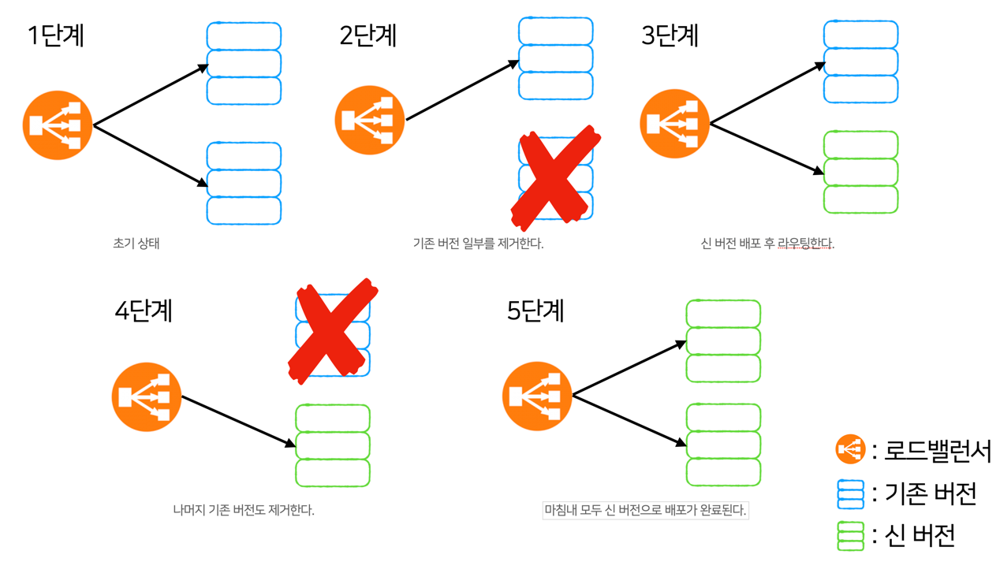
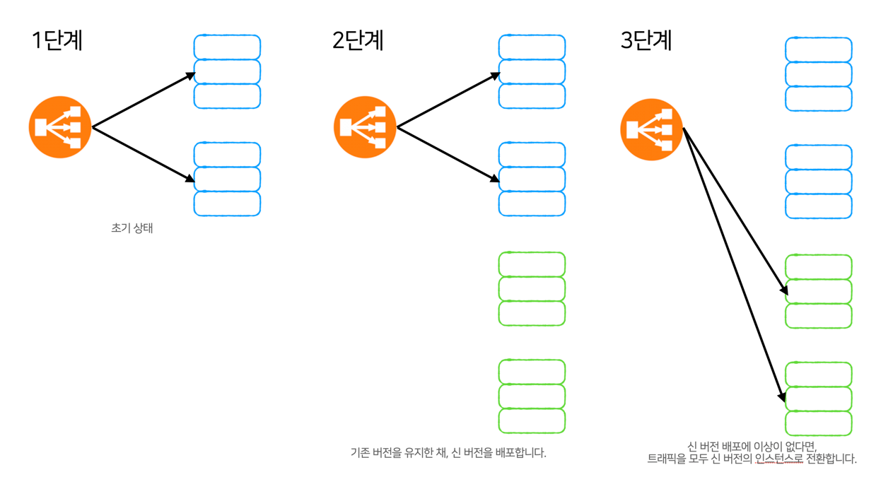
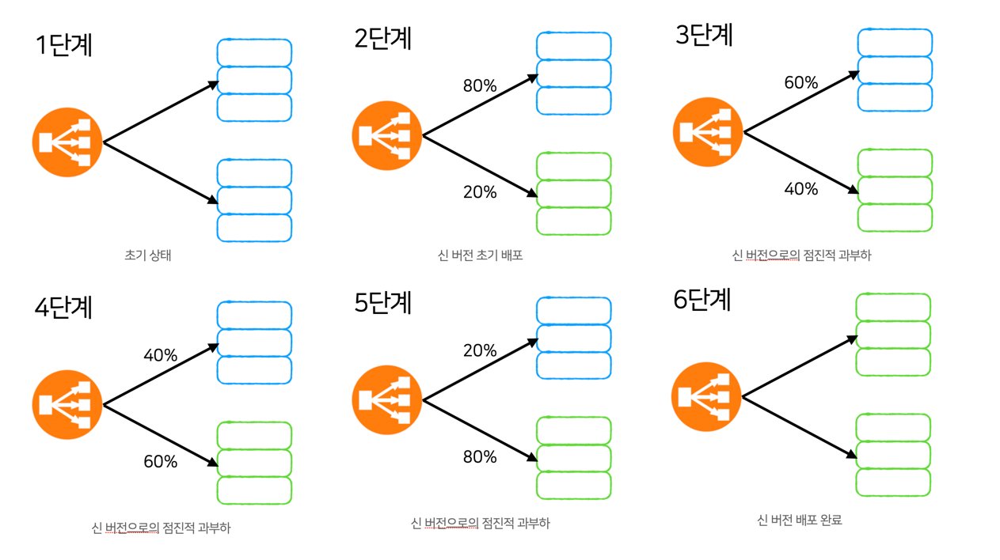

## 무중단 배포란? 적용하는 이유는?

한 대의 서버로만 배포하는 모놀리식 구조의 서비스인 경우, 서비스를 새로운 버전으로 업데이트해야 하는 경우가 있습니다.

이때 새롭게 배포하게 되는데, 배포되는 시간동안 서비스는 **잠깐 사용할 수 없게 됩니다.**

이 시간을 *Down Time* 이라고 부릅니다.

**이 Down Time을 제거하여 사용자에게 불편함을 주지 않기 위해 적용하는 것**이 무중단 배포입니다.

## 적용하는 방법

무중단 배포를 적용하는 방법에는 크게 3가지 방식이 있습니다.

1. 롤링 배포
2. 블루/그린 배포
3. 카나리 배포

각 방식에 따른 장단점이 분명하기에, 상황에 맞는 배포 전략을 적절히 선택하는 것이 중요합니다.

### 롤링 배포

신 버전을 **점진적으로 배포**한다는 특징을 가진 배포 방식입니다.

#### 장점

- 모두 완료되기 전, 기존 버전도 유지되기 때문에 신 버전에 문제가 생겼을 경우 롤백이 쉽습니다.
- 추가적인 인스턴스가 필요하지 않아도 됩니다.

#### 단점

- 무중단 배포가 진행되는 동안, 트래픽이 일부 인스턴스에 과도하게 몰릴 수 있습니다.
- 기존 버전과 신 버전이 공존하는 시간이 존재하기에 호환성 문제가 발생할 수 있습니다.

### 블루/그린 배포

블루를 기존 버전, 그린을 신 버전으로 지칭합니다.

신 버전의 새로운 인스턴스를 우선적으로 구성한 후에, 배포가 완료되면 트래픽을 한꺼번에 신 버전으로 라우팅하는 방식입니다.

#### 장점

- 신 버전을 동일한 환경의 새로운 인스턴스를 구성하여 미리 테스트할 수 있습니다.
- 배포 도중이나 이후에 신 버전에 문제가 생겼을 경우, 기존 버전을 유지시킨다면 쉽게 복구할 수 있습니다.
- 기존 버전과 공존하지 않기 때문에 호환성 문제가 발생하지 않습니다.

#### 단점

- 배포를 위한 리소스가 두 배로 필요합니다.

### 카나리 배포

옛날 광부들이 유독 가스에 민감한 카나리아 새를 이용해 가스 누출 위험을 감지했던 것에서 유래한 것으로 잠재적 문제 상황을 미리 발견하기 위한 방식입니다.

신 버전 배포 후 트래픽의 일부를 신 버전으로 라우팅 한 다음, 모니터링 및 피드백 과정을 거칠 수 있습니다.

#### 장점

- 신 버전 배포 이후 신 버전을 일부 사용자만이 경험할 수 있도록 조절할 수 있습니다.
- 신 버전에 문제가 생겼을 경우 기존 버전으로 롤백이 쉽습니다.

#### 단점

- 기존 버전과 신 버전이 공존하는 시간이 존재하기 때문에 호환성 문제가 발생할 수 있습니다.

### Reference
> - https://www.samsungsds.com/kr/insights/1256264_4627.html
> - https://hudi.blog/zero-downtime-deployment/
