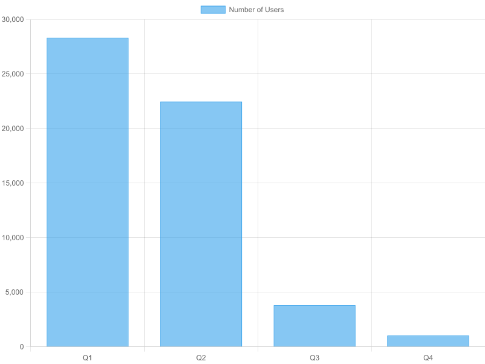

# 1. 들어가며
바로 어제, 두 번째 LeetCode Contest를 치뤘습니다!

[지난 번 Contest](https://kdkdhoho.github.io/posts/weekly-contest-488/) 이후로 참여 중인 [코테 스터디](https://github.com/cheonan-chibbo-study/coding-test-study)에서 한 주동안 그래프 알고리즘 유형의 문제만 풀었는데요.

그동안 완전탐색, 재귀 함수 유형은 자신있게 잘 풀었는데, 그래프 유형이 시작되자마자 뭔가 생각만큼 한번에 잘 풀리지도 않고.. 자신감도 잃고.. 자연스레 PS에 대한 흥미도 약간 잃은 느낌이었습니다..

그래도 이번 Contest 덕분에 새로운 문제 유형도 풀 수 있었고, 앞 두 문제는 10분 이내에 모두 푼 덕분에 약간의 자신감도 되찾았습니다!

3, 4번 문제는 접근 아이디어는 쉽게 떠올렸는데 최적화 하는 방법을 찾지 못해 아쉽게 풀지 못했습니다😢.

그러면 문제를 분석해보고, 복기하는 시간을 가져보도록 하겠습니다. 

# 2. 문제 분석
## 2.1. 1번 문제 ([링크](https://leetcode.com/contest/weekly-contest-489/problems/toggle-light-bulbs/description/))
1번 문제에서 요구하는 바는 주어진 수열에서 홀수개만큼 등장하는 수를 찾는 문제였습니다.

문제를 보자마자 숫자를 Key로, 등장 횟수를 Value로 하는 해시맵을 써서 풀면 되겠다고 생각이 들었습니다.  

아래는 제출한 코드입니다.

```python
class Solution:
    def toggleLightBulbs(self, bulbs: list[int]) -> list[int]:
        d = {}
        for bulb in bulbs:
            cnt = d.get(bulb, 0)
            d[bulb] = cnt + 1

        answer = []
        for bulb, cnt in d.items():
            if cnt & 1 != 0:
                answer.append(bulb)
        return sorted(answer)
```

그런데 지금 보니, 주어지는 수의 범위가 1부터 100까지이므로 사이즈가 101인 배열을 만들어서 각 숫자의 인덱스에 등장 횟수를 기록하는 방법도 직관적으로 풀 수 있을 것 같다는 생각이 들었습니다.

아래는 배열을 이용해서 해결한 코드입니다. 더 단순한 풀이 방법인 것 같네요!

```python
class Solution:
    def toggleLightBulbs(self, bulbs: list[int]) -> list[int]:
        counts = [0] * 101
        for bulb in bulbs:
            counts[bulb] += 1

        answer = []
        for i, count in enumerate(counts):
            if count > 0 and count & 1 != 0:
                answer.append(i)
        return answer
```

## 2.2. 2번 문제 ([링크](https://leetcode.com/contest/weekly-contest-489/problems/first-element-with-unique-frequency/description/))
2번 문제는 정수 배열이 주어질 때, 각각의 정수가 등장한 횟수가 유일한 경우의 정수를 출력하는 것입니다.

그러니까 [20, 10, 30, 30] 이 주어질 때, 1개만 등장한 정수는 10과 20으로 유일하지 않지만, 2개가 등장한 정수는 30으로 유일합니다. 따라서 이때의 정답은 30이 됩니다.

이 문제 역시 해시맵을 사용해서 풀어야겠다고 생각이 들었습니다.  
처음에는 정수 배열을 순회하면서 (정수:등장횟수) 쌍의 해시맵을 만들고, 이렇게 만들어진 해시맵을 이용하여 (등장 횟수:정수 리스트) 쌍의 해시맵을 만들면, 이때 정수 리스트의 사이즈가 1인 정수를 찾는 방식으로 접근했습니다.

```python
class Solution:
    def firstUniqueFreq(self, nums: List[int]) -> int:
        # 1. 모든 정수의 개수를 딕셔너리에 저장한다.
        d = {} # key: 정수, value: 개수
        for num in nums:
            cnt = d.get(num, 0)
            d[num] = cnt + 1

        # 2. 개수를 key로, 해당 개수만큼 등장하는 정수를 list로 저장한다.
        d2 = {}
        for num, cnt in d.items():
            value = d2.get(cnt, [])
            value.append(num)
            d2[cnt] = value

        # 3. 정수 list(value)의 사이즈가 1이면 그 정수를 정답 후보군에 넣는다.
        candidates = set()
        for cnt, numbers in d2.items():
            if len(numbers) == 1:
                candidates.add(numbers[0])

        answer = -1
        # 4. 정답 후보군이 0개이면 -1을, 1개이면 바로 그 숫자를, 2개 이상이면 nums를 돌면서 가장 먼저 정답 후보군에 포함된 숫자를 반환한다.
        if len(candidates) == 0:
            return answer
        elif len(candidates) == 1:
            answer = list(candidates)[0]
        else:
            for num in nums:
                if num in candidates:
                    answer = num
                    break
        return answer
```

아래는 다른 사람이 푼 코드인데요. 동작 순서는 동일하지만 더 간결한 코드라서 가져와봤습니다.  
덕분에 `collections.defaultdict()` 모듈에 대해 알게 됐네요.

```python
from collections import defaultdict

class Solution:
    def firstUniqueFreq(self, nums: List[int]) -> int:
        # (정수:등장 횟수) 쌍의 딕셔너리 생성
        counter = defaultdict(int)
        for num in nums:
            counter[num] += 1
        
        # (등장 횟수:정수 리스트) 쌍의 딕셔너리 생성
        freq = defaultdict(list)
        for num in counter:
            freq[counter[num]].append(num)

        for num in nums:
            count = counter[num]
            values = freq[count]
            if len(values) == 1:
                return num
        return -1
```

## 2.3. 3번 문제 ([링크](https://leetcode.com/problems/longest-almost-palindromic-substring/description/))
3번 문제는 문자열 s가 주어질 때, s의 모든 부분 문자열 중에서 문자 단 하나만 제외했을 때 팰린드롬 문자열이 되는 부분 문자열의 최대 길이를 구하는 문제였습니다.

문제 접근은 '부분 문자열 구하기(2중 for문) -> 문자 하나만 제거하기 (재귀) -> 팰린드롬 검사하기' 순으로 했는데요.  
문자열의 최대 길이가 2,500 이라서 최적화가 필요했습니다.

해당 문제의 Solutions 탭에 있는 문제 풀이를 보고 참고했는데요.  
핵심 아이디어는 일단 평범하게 중앙에서부터 최대 길이의 팰린드롬을 찾습니다. 그때 문자 하나만 건너띄고 ((l-1, r), (l, r + 1)) 다시 팰린드롬을 시도해보는 방식입니다.

```python
class Solution:
    def almostPalindromic(self, s: str) -> int:
        n = len(s)
        
        def expand(l, r):
            while l >= 0 and r < n and s[l] == s[r]:
                l -= 1
                r += 1
            return l, r

        result = 1
        for i in range(n):
            for l0, r0 in ((i, i), (i, i + 1)):
                l, r = expand(l0, r0)
                result = max(result, r - l)

                l1, r1 = expand(l - 1, r)
                result = max(result, r1 - l1 - 1)

                l2, r2 = expand(l, r + 1)
                result = max(result, r2 - l2 - 1)

            if result >= n:
                return n

        return result
```

이러한 방식은 시간 복잡도가 O(N^2) 가 되겠네요.  
덕분에 2중 for문으로 모든 부분 문자열에 대해서 팰린드롬을 찾는 기존 방식에서, 문자열을 하나씩 순회하면서 좌우로 범위를 확장해가며 팰린드롬 문자열을 찾는 방식을 알게 됐습니다.  

기존에 알고 있던 방식은 O(N^3) 인 반면, 새로 알게 된 방식은 O(N^2) 이네요.

## 2.4. 4번 문제 ([링크](https://leetcode.com/problems/maximum-subarray-xor-with-bounded-range/description/))
마지막 문제는 정수 배열이 주어질 때, 부분 수열 중에서 최댓값과 최솟값의 차이가 k 이하인 부분 수열의 모든 요소에 XOR 연산을 한 결과의 최대값을 반환하는 문제였습니다.

이 문제 역시 완전탐색 방식으로 접근하면 쉽게 접근할 수 있습니다. 하지만 완전탐색 방식의 시간 복잡도는 수열의 길이가 N일 때, O(N^3) 입니다.  
문제의 제약 조건에서 N의 최대값은 4*10^4 이므로 최적화가 필요했습니다.

마찬가지로 Solutions 탭과 AI에게 도움을 받아보았는데요. AI에게 난이도를 물어보니 백준 기준 플레 1~2 정도라고 합니다.. 

목표가 기업 코테에 합격하는 수준이기에 이 문제는 가볍게 보고 넘어가려고 합니다.

아래는 풀이 코드입니다.

```python
from collections import deque


class TrieNode:
    __slots__ = ("ch", "cnt")

    def __init__(self):
        self.ch = [None, None]
        self.cnt = 0


class Solution:
    MAX_BIT = 20  # nums[i] < 2^15 여유 있게

    def __init__(self):
        self.root = TrieNode()

    # -------- Trie --------
    def add(self, v):
        cur = self.root
        for i in range(self.MAX_BIT, -1, -1):
            b = (v >> i) & 1
            if cur.ch[b] is None:
                cur.ch[b] = TrieNode()
            cur = cur.ch[b]
            cur.cnt += 1

    def remove(self, v):
        cur = self.root
        for i in range(self.MAX_BIT, -1, -1):
            b = (v >> i) & 1
            cur = cur.ch[b]
            cur.cnt -= 1

    def query(self, v):
        cur = self.root
        ans = 0

        for i in range(self.MAX_BIT, -1, -1):
            b = (v >> i) & 1
            want = 1 - b

            if cur.ch[want] and cur.ch[want].cnt > 0:
                ans |= (1 << i)
                cur = cur.ch[want]
            else:
                cur = cur.ch[b]

        return ans

    # -------- Main --------
    def maximumSubarrayXor(self, nums, k):
        n = len(nums)

        # prefix xor
        px = [0] * (n + 1)
        for i in range(n):
            px[i + 1] = px[i] ^ nums[i]

        mn = deque()
        mx = deque()

        l = 0
        ans = 0

        for r in range(n):

            # monotonic queue update
            while mn and nums[mn[-1]] >= nums[r]:
                mn.pop()
            while mx and nums[mx[-1]] <= nums[r]:
                mx.pop()

            mn.append(r)
            mx.append(r)

            # add possible start
            self.add(px[r])

            # shrink window
            while nums[mx[0]] - nums[mn[0]] > k:

                self.remove(px[l])
                l += 1

                while mn and mn[0] < l:
                    mn.popleft()
                while mx and mx[0] < l:
                    mx.popleft()

            # best xor ending at r
            ans = max(ans, self.query(px[r + 1]))

        return ans
```

# 3. 결과
1, 2번 문제만 풀어서 결과적으로 2솔입니다..!  
3번 문제는 이제 팰린드롬 문자열을 탐색하는 더 좋은 방법을 알게 됐으니, 나중에 다시 보면 풀 수도 있을 것 같네요!

추가로 [Discuss에 각 문제를 푼 유저 수 통계](https://leetcode.com/discuss/post/7580527/my-analysis-of-weekly-contest-489-by-moh-8tsa/)가 있어서 가져와봤는데요.



뭐.. 그렇다고 아직 만족할 단계는 아닌 것 같습니다.

# 4. 느낀 점
지난 번에 치뤘던 LeetCode Contest에서 느꼈던 장점들에 추가로 약간의 자신감을 얻었다는 점, 그리고 팰린드롬 문자열 탐색 방법에 대해 새롭게 알게 된 것이 큰 수확이네요.

앞으로도 시간이 된다면 꾸준히 할 생각입니다.

다음 번에는 3솔을 할 수 있었으면 좋겠네요..!
