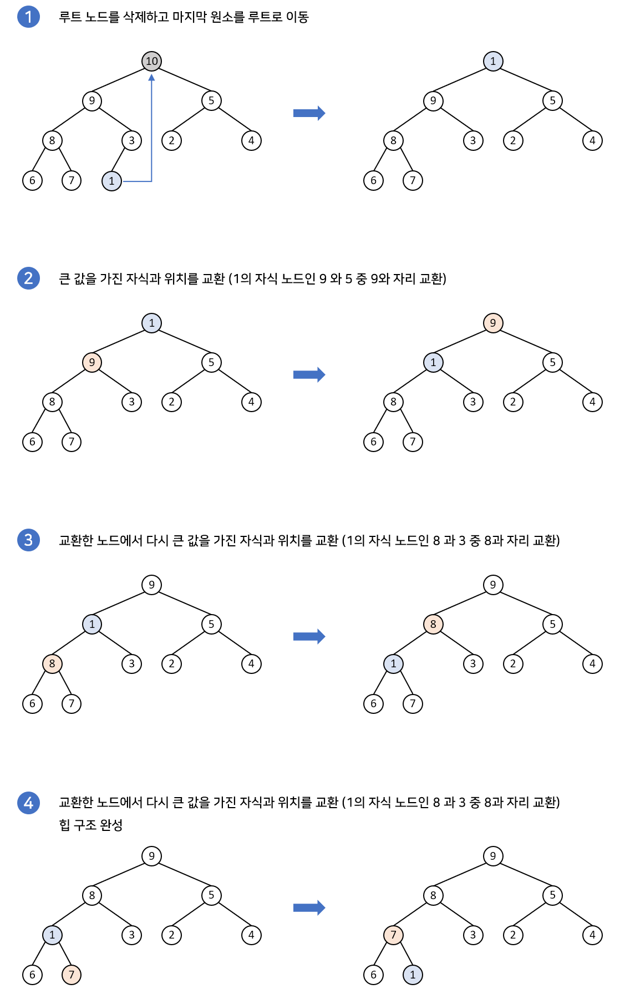

# 힙(Heap)
힙은 **최대값 혹은 최소값을 매우 빠르게 찾아내기 위한 자료구조**로, **완전이진트리를 기반**으로 한다.  
힙에는 **최대힙과 최소힙** 두 가지로 나뉘는데, 최대힙은 부모 노드가 자식 노드보다 항상 커야 하고, 최소힙은 부모 노드가 자식 노드보다 반드시 작아야 한다.  
대소 관계는 부모와 자식 노드 간에서만 성립해야 하며, **형제 노드끼리는 성립하지 않는다**.

힙에서는 가장 높은 우선순위를 가진 값(가장 큰 값, 혹은 가장 작은 값)이 루트 노드로 오는 특징이 있다.  
이러한 특징을 이용해 우선순위 큐로 사용하기에 용이하다.

# 구현
힙은 보통 배열을 이용하여 구현된다. 기반이 완전이진트리이기 때문에 중간에 빈 공간이 없어 배열로 구현하기 용이하다.

루트 노드(인덱스 0)를 제외한 임의의 노드의 인덱스 i에 대해, 부모 노드의 인덱스는 항상 `i/2`가 성립하고 왼쪽 자식 노드의 인덱스는 `2*i`, 오른쪽 자식 노드의 인덱스는 `2i + 1`가 성립한다.

# 힙 재구조화 (Heapify)
## 삽입
힙에 새로운 값을 삽입하면 다음 과정이 일어난다.

1. 저장할 수 있는 마지막 인덱스 위치에 값을 추가한다.
2. 해당 값의 부모 노드와 대소를 비교한다. 이때 새로 추가된 값이 우선 순위가 더 높은 경우 부모 노드와 위치를 바꾼다.
3. 2번 과정을 부모 노드보다 우선순위가 더 낮거나, 루트 노드에 도달하는 순간까지 반복한다. 

완전이진트리의 높이를 h라고 했을 때, 걸리는 시간 복잡도는 _O(logh)_ 이다.

## 삭제
루트 노드의 값이 추출될 경우 다음 과정이 일어난다.

1. 가장 마지막 인덱스 위치에 있는 값을 루트 노드로 이동한다.
2. 루트 노드의 두 자식 노드를 비교해서 더 우선순위가 높은 값과 자리를 바꾼다.
3. 그 다음 바뀐 자리에서의 두 자식 노드를 비교해서 더 우선순위가 높은 값과 자리를 바꾼다.
4. 위 과정을 더이상 바꿀 수 없거나 바꾸지 않아도 될 때까지 반복한다.

삭제도 마찬가지로 트리의 높이를 h라고 했을 때, 소요되는 시간은 _O(logh)_ 이다.

# 힙 만들기(Build Heap)
만약 값들이 임의의 순서를 가진 배열을 힙으로 만드려면 어떻게 해야 할까? 시간 복잡도는 어떻게 될까?

이때는 뒤에서부터 한 묶음의 부모-자식 관계를 모두 보면서, 힙을 만들면 된다.  
다르게 말하면 분할정복 방식으로 힙을 완성시킨다고 표현할 수도 있겠다.

과정은 다음과 같다.

# Reference
- https://ko.wikipedia.org/wiki/%ED%9E%99_(%EC%9E%90%EB%A3%8C_%EA%B5%AC%EC%A1%B0)
- https://velog.io/@emplam27/%EC%9E%90%EB%A3%8C%EA%B5%AC%EC%A1%B0-%EA%B7%B8%EB%A6%BC%EC%9C%BC%EB%A1%9C-%EC%95%8C%EC%95%84%EB%B3%B4%EB%8A%94-%ED%9E%99Heap
- https://gmlwjd9405.github.io/2018/05/10/data-structure-heap.html
