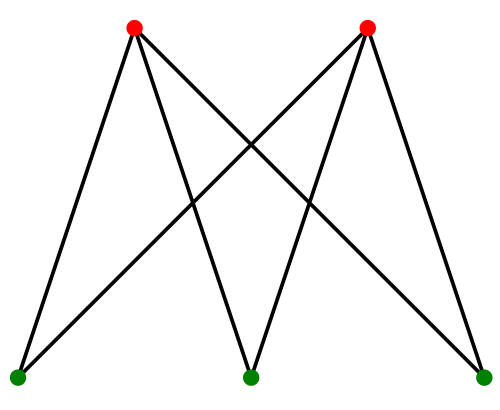
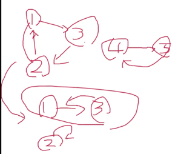

# 그래프
자료구조에는 **선형 자료구조**(배열, 리스트, 스택, 큐 등)와 **비선형 자료구조**(그래프, 트리 등)이 있습니다.

선형 자료구조는 데이터의 순서가 중요한 자료구조입니다.  
반면 **비선형 자료구조는 데이터의 관계를 표현한 자료구조**입니다.

그래프는 노드와 간선으로 표현할 수 있습니다.  
**노드는 데이터 자체**를 의미하고, **간선은 관계**를 의미합니다.

간선은 단방향과 양방향으로 또 나뉩니다.  
단방향은 한 노드에서 다른 한 노드로만 향하는 관계일 때 사용되며, 양방향은 양 노드가 서로를 향하는 관계일 때 사용됩니다.  
이때 양방향은 방향성을 반드시 표현하지 않아도 됩니다.

그래프에서 '_**연결 요소**_' 라는 단어가 있습니다.  
연결 요소는 연결된 노드를 하나의 집합으로 묶어서 부르는 것을 의미합니다.  
예를 들어 아래 그림의 경우 연결 요소는 5개입니다.


'_**가중치**_' 라는 단어도 있습니다.  
한 노드에서 다른 노드로 향할 때, 간선의 크기를 의미합니다.  
예를 들어, 서울이 노드 A, 부산이 노드 B라고 할 때, A에서 B로 향하는 가중치는 10이라고 표현할 수 있습니다.

# 그래프 탐색 알고리즘
그래프를 탐색하는 방법(알고리즘)에는 크게 두 가지가 있습니다. DFS와 BFS 입니다.

## DFS (Depth First Search)
### 특징
깊이 우선 탐색이라 불리는 DFS는, 그래프를 탐색할 때 다음 노드를 먼저 방문하는 식으로 탐색합니다.  
이미지로 표현하면 다음과 같습니다.


### 용도
DFS를 주로 사용하는 경우는 다음과 같습니다.

- 연결 요소의 크기 구하기
- 연결 요소의 개수 구하기
- Flood Fill
  - 2차원 배열의 데이터가 주어지고, 특정 위치의 연결 요소의 크기를 구하는 경우가 있을 때, 이 크기를 DFS를 이용하여 구할 수 있습니다. ([대표적인 문제](https://www.acmicpc.net/problem/2667))
- 이분 그래프 판별
- 사이클 존재 파악 및 사이클 크기 구하기

### 기본 구현
DFS를 구현할 때 가장 먼저, 주어진 노드와 간선 정보를 그래프 형태로 저장해야 합니다.  
그래프를 저장할 때는 **인접 행렬**과 **인접 그래프** 방식으로 구현할 수 있습니다.

1. 인접 행렬
2차원 배열을 만들고, 연결 정보를 이 배열에 저장합니다.  
만약 `arr` 라는 이름의 변수가 있다고 가정하면 노드 x에서 노드 y로 향하는 간선의 정보는 `arr[x][y]`로 접근할 수 있습니다.

간선의 개수가 k개이고, 모든 간선의 가중치가 1인 양방향 그래프인 경우 아래 코드와 같이 저장할 수 있습니다.

```python
arr = [[0] * n for _ in range(n)]
for _ in range(k): # k: 간선의 개수
    a, b = map(int, input().split())
    arr[a][b] = 1
    arr[b][a] = 0
```

2. 인접 그래프
각 노드에 연결된 노드를 리스트 형태로 저장합니다.  
만약 n개의 노드와 k개의 간선이 있다고 가정하면, 인접 그래프로 저장하는 코드는 다음과 같습니다. 

```python
graph = [[] * for _ in range(n)]
for _ in range(k): # k: 간선의 개수
    a, b = map(int, input().split())
    graph[a].append(b)
    graph[b].append(a)
```

인접 행렬은 공간을 더 많이 차지하는 대신, O(1) 만에 연결 정보를 조회할 수 있는 장점이 있습니다.  
반면, 인접 그래프는 공간을 더 효울적으로 사용하는 대신, 그래프를 탐색할 때 연결된 노드 개수만큼 선형적으로 늘어난다는 단점이 있습니다.

따라서 문제 요구사항이나 제약 조건에 따라 적절한 방식을 사용하는 것이 좋겠습니다.

이제 DFS 탐색을 위해서는 다음과 같이 작성할 수 있는데요. 인접 그래프 형태로 저장했다고 가정하고 구현해보겠습니다.  
이때 한 노드를 중복 방문하는 것을 방지하기 위해 `visited = [False] * n` 과 같이 배열 형태로 값을 기록하는데요. 방문 처리는 DFS 함수 내부의 첫 번째 라인에서 수행하는 것이 권장됩니다.

특정 노드에 방문했을 때 해야 할 일(방문 표시, 결과 합산 등)이 한곳에 모여 있어 코드가 깔끔하고 별도로 처리해줄 필요가 없어 실수할 확률이 줄어듭니다. 또한 재귀 함수는 자기 자신을 정의하는 함수라는 측면에서도 자연스럽습니다.

```python
# 파이썬의 기본 재귀 호출 한도는 보통 1,000회로 제한됩니다.  
# 따라서 `sys` 모듈의 `setrecursionlimit=n`으로 최대 한도를 설정합니다.
import sys
sys.setrecursionlimit(n**2)

# 그래프
graph = [[] * for _ in range(n)]
for _ in range(k): # k: 간선의 개수
    a, b = map(int, input().split())
    graph[a].append(b)
    graph[b].append(a)
    
# 노드 방문 여부
visited = [False] * n

# DFS 로직
def dfs(curr_node):
    visited[curr_node] = True
    
    for next_node in graph[curr_node]:
        if visited[next_node]:
            continue
        dfs(next_node)
```

위 DFS 코드를 기반으로, 문제에서 필요한 해를 구하는 코드를 추가하면 됩니다.

### 이분 그래프
이분 그래프란, 모든 정점을 빨간색, 혹은 파란색으로 칠했을 때, 모든 간선에 대해서 각 간선이 빨간색이랑 파란색을 포함하도록 색칠할 수 있는 그래프입니다.



기본 구현(Python)은 다음과 같습니다.

```python
import sys

# 이분 그래프 판별 함수
def is_bipartite_graph(curr, color):
    colors[curr] = color
    
    for nxt in graph[curr]:
        if colors[nxt] != 0: # 이미 방문을 한 적이 있는 노드
            if color[nxt] == color[curr]: # 연결된 노드와 현재 노드의 색상이 같으면 이분 그래프가 아니게 된다.
                answer = False
                return False
            continue
        
        # 연결된 노드를 탐색하면서 현재 노드와 다른 색상으로 칠한다. 
        if not is_bipartite_graph(nxt, colors[curr] * -1):
          return False
    
    return True

n, m = map(int, input().split())
sys.setrecursionlimit(n**2)

# 그래프 생성
graph = [[] for _ in range(n + 1)]
for _ in range(m):
    a, b = map(int, input().split())
    graph[a].append(b)
    graph[b].append(a)
      
colors = [0] * (n + 1) # 색상 기록 배열. 0: 방문하지 않은 노드, 1: 빨간색, -1: 파란색
answer = True
for i in range(1, n + 1):
    if colors[i] == 0: # 아직 방문하지 않았다면
        if not is_bipartite_graph(i, 1):
          answer = False
          break
        
print(answer)
```

### 사이클 존재 유무 파악 및 사이클 크기 구하기
사이클이 존재하는지? 존재한다면 사이클의 크기를 구할 때도 DFS를 이용할 수 있습니다.

기본 구현(Python)은 다음과 같습니다.

```python
depth  = [0] * n # 각 노드의 방문 깊이(순서)를 기록하는 배열입니다.
has_cycle = False

# cur: 현재 방문한 노드 번호입니다.
# prev: 이전에 방문한 노드 번호입니다.
def dfs(cur, prev):
    for nxt in graph[cur]:
        if prev != nxt: # cur과 연결된 노드인 경우
          if depth[nxt] == 0: # 해당 노드에 처음 방문하는 경우
              depth[nxt] = depth[cur] + 1
              dfs(nxt, cur)
          elif depth[nxt] > depth[cur]: # 연결된 노드가 현재 노드보다 먼저 방문한 경우 -> 사이클 존재
            has_cycle = True
            size = depth[cur] - depth[nxt] + 1 # 사이클의 사이즈를 구한다.    
```

대표적인 문제로는 [백준의 아침은 고구마야](https://www.acmicpc.net/problem/20426)가 있으니 위를 참고하여 풀어보는 것도 좋겠습니다.

### 순열 사이클 분할 (임시 저장)



---

## BFS (임시 저장)
### 특징

### 용도
- 최단 거리
- 단계별 확산 시뮬레이션

### 구현 시 주의사항
**방문 여부를 반드시 큐에 넣기 전에 설정**해야 한다.  
큐에서 뺄 때 처리하면, 중복된 노드가 큐에 여러 번 들어가 메모리 초과가 발생할 수 있다.

### 구현(Python)  
```python
from collections import deque

dx = [-1,0,1,0]
dy = [0,1,0,-1]

def bfs(start_x, start_y):
    visited = [[False] * n for _ in range(n)]
    q = deque((start_x, start_y))
    
    while q:
        x, y = q.popleft()
        
        for d in range(4):
            nxt_x, nxt_y = x + dx[d], y + dy[d]
            if not in_array(nxt_x, nxt_y):
                continue
            if visited[nxt_x][nxt_y]:
                continue
            visited[nxt_x][nxt_y] = True
            q.append((nxt_x, nxt_y))
```
