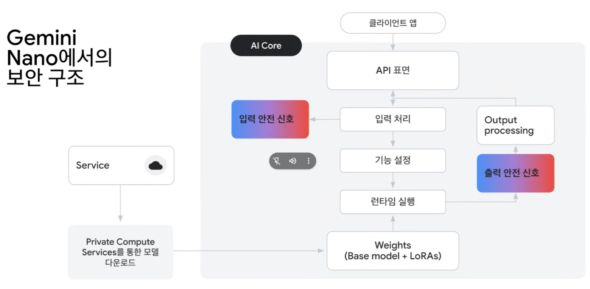
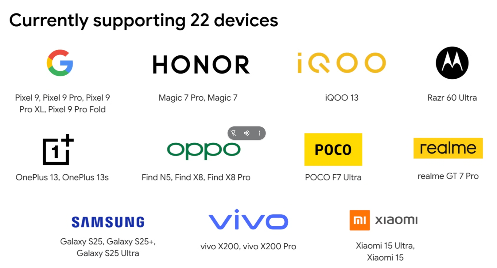
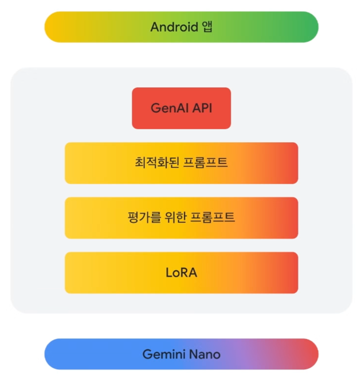

강사: 강사룡 Android Developer Relations Engineer, Google

# On-device Gen AI Use Cases

## 1. 콘텐츠 소비
- 놓친 알림에 대한 요약 제공
- 긴 이메일 스레드 요약
- 문서의 핵심 내용 하이라이트
- 이미지 입력에서 정보 추출

## 2. 콘텐츠 생성 지원
- 사용자의 아이디어 브레인스토밍 지원 혹은 프롬프트 생성
- 더 좋은 글을 작성할 수 있돌고 글쓰기 지원
- 캡션 또는 해시태그 제안

## 3. 콘텐츠 분류
- 사용자가 만든 콘텐츠를 분석
- 주제 또는 테마 별로 분류

**서버 데이터 전송없이 안드로이드 기기 내에서 프롬프트를 처리할 수 있다.**

# On-device Gen AI의 장점

- 로컬에서 처리 가능
  - 사용자 별 데이터를 격리화 / 암호화로 종단간 통신 -> 보안에서 자유롭진 못하다.  
    but, 서버로의 전송이 법적 규제가 있는 경우가 있다.
- 오프라인 사용 가능
- 추가 비용 없음

# Gemini Nano

# AICore 시스템 서비스
1. 내장된 최적화
2. 모델 배포
3. 로컬 처리

AICore의 Gemini Nano는 각 추론 요청을 격리하며, 입출력 데이터를 기기에 저장하지 않는다.

# Gemini Nano에서의 보안 구조

# 현재 지원 중인 기기

앞으로 계속 지원 폭을 넓힐 예정

# GenAI API
앱의 온디바이스 작업 구현을 돕는, Gemini Nano 기반의 **GenAI API**

요약
교정
재작성
이미지 묘사

주요 이점
1. 고수준 API
2. 높은 품질의 결과물
3. 일관된 품질

# 아키텍처

# GenAI API 사용법
0. SDK 초기화 요청 생성
1. 작업 정의 (요약, 교정, 재작성, 이미지 묘사)
2. 기능 사용 가능 여부 확인
3. `runInference`로 돌리기

# Gemma 3n

# On-device에서 하기 어려운 작업들은?
Firebase SDKs -> Firebase -> Gemini API in Vertex AI || Gemini Developer API

# Gemini Live API
- 저지연 양방향 Voice-to-Voice 상호작용 with Gemini 2.0 Flash
- 웹소켓
- 종단간 암호화

# Imagen

- User profile image

# Play for On-device AI
직접 만든 ML 모델을 손쉽게 배포.

# 질문

1. AI Edge 기반으로 해서 미디어 플랫폼

2. 바이브코딩으로 상용화 하기 어려운 것이 사실이다.

3. Flutter에서도 API를 사용할 수 있는지?  
Flutter로도 사용할 수 있지만, 동작은 Android에서만 가능
미디어 파이프 SDK 사용하면 iOS에서도 사용 가능한데, 실험 단계임.
