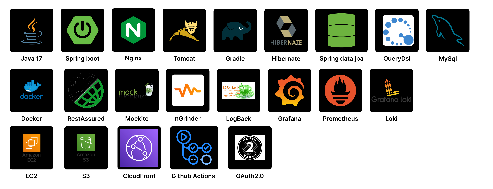

## Java 17

우아한테크코스에서 진행한 미션들의 Java 버전은 11이었습니다.

모든 팀원들에게 익숙한 버전은 11 버전임은 부정할 수 없는 사실이지만, 그럼에도 17 버전을 선택한 이유는 다음과 같습니다.

### 생산성

17 버전에 포함된 **Record 타입, String 블럭 사용, Stream.toList()**사용 으로 생산성 향상을 기대했기 때문입니다.

우테코에서 진행하는 프로젝트 특성상 2주 단위로 기능을 빠르게 추가해야 하는 상황이었습니다.

따라서 팀에게 있어 생산성도 중요한 가치라고 판단했습니다.

> Record 타입은 JDK 14에 추가됐습니다. [관련 글](https://www.baeldung.com/java-record-keyword) 
> String 블럭은 JDK 15에 추가됐습니다. [관련 글](https://www.baeldung.com/java-text-blocks)
> Streams.toList()는 JDK 17에 추가됐습니다. [관련 글](https://www.baeldung.com/java-stream-to-list-collecting)

### JDK 8, 11에 이은 LTS 버전

JDK 11은 26년 9월, JDK 17은 31년 9월까지 지원하는 LTS 버전입니다.

셀럽잇 프로젝트를 앞으로 몇 년이고 지속할 수 있는 가능성이 존재했습니다.

또한, 신규 프로젝트를 진행하는 상황에 있어 레거시를 고려할 필요는 없을 뿐더러 앞으로 있을 미래를 대비하는 것이 현명하다고 판단했습니다.

### 더 나은 GC 성능

이는 추가적인 이유를 찾아보다가 발견한 이유입니다.

바로, JDK 11보다 더 나은 GC 성능을 가진다는 것인데요.

G1 GC의 경우 JDK 11에 비해, 8.66% 더 빠르다는 벤치마킹 결과가 존재하는 것을 확인할 수 있었습니다.

> [참고 문서](https://www.optaplanner.org/blog/2021/09/15/HowMuchFasterIsJava17.html)

GC 개선, JIT 컴파일러 개선, 클래스 데이터 공유로 인한 개선으로 인한 것이라고 합니다.

## Spring Boot 3

Java 17은 Spring Boot 3 부터 지원을 강제하는 이유에서 선택했습니다.

## Nginx

초기 개발 단계에서 React와 Spring이 한 대의 EC2 인스턴스 내에 존재했습니다.

따라서 접속 URL에 따라 포트 포워딩을 할 필요가 있었습니다.

추가로, Nginx와 연동 가능하며 HTTPS 적용에 필요한 SSL 인증서를 발급해주는 무료 오픈소스인 [Let's Encrypt](https://letsencrypt.org/)를 사용하여 간편하게 HTTPS 적용을 하기 위해 사용했습니다.

> [[10분 테코톡] 🤫 피케이의 Nginx](https://youtu.be/6FAwAXXj5N0?feature=shared)

## JPA & Spring Data JPA

사실 처음에는, JPA를 사용해본 적이 없는 팀원이 저를 포함해 2명이 있었습니다.

따라서 처음엔 발생할 수 있는 문제에 모든 팀원이 대응할 수 있기 위해 JDBC를 사용했는데요.

개발을 본격적으로 시작하기까지는 조금의 시간이 있었습니다.

그 시간동안 JPA를 학습할 수 있었고, JPA를 통해 개발 초기에 빠르게 개발할 수 있다는 점에서 선택을 변경했습니다.

또한, JPA는 객체와 RDBMS의 패러다임 불일치를 해결해준다는 점에서 큰 메리트를 느꼈습니다.

## QueryDsl

셀럽잇이 제공하는 기능 중, 음식점을 다양한 조건으로 필터링하여 조회하는 기능이 있었습니다.

해당 기능을 구현하기 위해서는 동적 쿼리를 만들어야 했는데요.

QueryDsl을 선택하기 전의 동적 쿼리는 유지보수가 매우 힘들었습니다.

따라서 유지보수를 위해 도입했습니다.

## Docker

초기 개발 단계에서 운영 단계를 준비하는 과정에서 동일한 환경을 쉽게 세팅하기 위해 사용했습니다.

## nGrinder

부하 테스트 툴로써 다른 대안이었던 JMeter에 비해 더 편리한 사용성과 편리한 UI/UX, 그리고 무엇보다 한국어를 지원한다는 점에서 선택했습니다.

## Grafana, Prometheus, Loki, Promtail

다른 대안이었던 AWS CloudWatch는 새로 학습해야 하는 학습 비용이 존재했습니다. 동시에 금전적인 비용이 들어갑니다.

사실 _Grafana, Prometheus, Loki, Promtail_도 팀원 전체가 학습을 해야하는 건 마찬가지였지만, 인프런에 김영한 님의 관련 강의가 존재하였고 이를 통해 쉽게 기술을 익혀 사용할 수 있을 것으로 판단했습니다.

동시에 모두 무료 오픈소스인 점에서 선택했습니다.

## S3

음식점에 대한 정보 중, 음식점 사진이 존재했습니다.

초기에는 사진을 모두 EC2 인스턴스 내에 저장하여, 정적으로 Serving 했습니다.

하지만 음식점의 수가 증가함에 따라 사진 파일의 수도 증가하고, 그에 따라 서버의 용량을 걱정하지 않을 수 없었습니다.

동시에, React로 개발한 결과물을 빌드한 것은 모두 정적인 자원이며, EC2 인스턴스 내에서 빌드하는 데에 많은 시간이 걸렸습니다.

따라서 정적 자원들은 스토리지에서 제공하기 위해 사용했습니다.

## CloudFront

S3를 그냥 사용하면 보안과 관련된 문제가 발생할 수 있습니다.

또, S3에 있는 자원에 접근하려면 매우 길고 이상한 URL로 접근을 해야 했습니다.

이를 해결하기 위해 CDN 역할의 AWS CloudFront를 도입했습니다.

## Github Actions

CI/CD 툴로 사용했습니다.

다른 대안이었던 Jenkins는 팀원 전체가 학습할 시간이 필요했습니다.

따라서 바로 적용할 수 있는 CI/CD 툴을 적용했습니다.

## OAuth 2.0

OAuth 2.0을 적용하면 사용자의 개인 정보를 저장하지 않아도 되는 장점이 있습니다.

또한, 사용자 퍼널 개선을 위한 목적으로 선택했습니다.