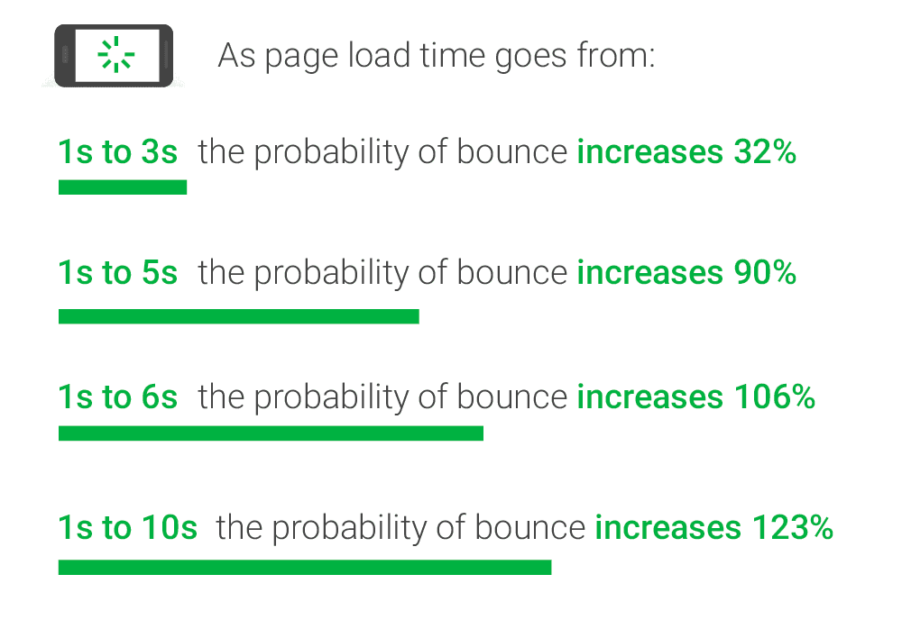

이번 글에선 셀럽잇이 왜? 그리고 어떻게? 무중단 배포를 적용했는 지에 대해 작성하고자 합니다.

## 무중단 배포를 왜 하는가?

서버가 1개인 상황에서 새로 배포를 하게 되면, 배포가 완료되는 시간동안 사용자들은 서비스를 이용하지 못합니다.

배포 시간이 3초만 되어도 사용자는 3초 동안 에러 페이지만 보게 될 것입니다.

아래 사진은 구글이 제공하는 데이터입니다.



무려 3초만 서비스를 이용하지 못하더라도 약 1/3 의 사용자가 이탈합니다.

**따라서 실사용자가 있는 상황에서 배포에 따른 Down-Time을 제거하기 위해 무중단 배포를 적용해야 합니다.**  

## 무중단 배포 방식 결정하기

무중단 배포에는 *롤링 방식*, *블루/그린 방식*, *카나리 방식*이 있습니다.

> ([무중단 배포 방식에 대해 정리한 글](https://kdkdhoho.github.io/zero-downtime-deployment))

이 중, 현재 주어진 리소스를 고려하여 최적의 방식을 선택하려고 합니다. 

현재 리소스 상황으로는, 배포 서버로 EC2 인스턴스 1대를 사용중입니다.<br>
해당 인스턴스에서 리버스 프록시 역할의 Nginx와 스프링 애플리케이션이 존재합니다.<br>
이러한 상황에서 무중단 배포를 위한 인스턴스를 추가로 사용하기 위해선 기술 검토 요청을 보내야 하며 그 동안의 대기 시간이 필요합니다.<br>
또한, 추가 사용이 가능한지도 미지수인 상황이었습니다.

따라서 한 대의 서버에서 무중단 배포를 적용하기엔 **블루/그린 방식**이 최적의 방식이라고 판단했습니다.

> 더불에 블루/그린 방식의 문제점을 생각해봤을 때, 배포 서버의 자원을 2배로 사용한다는 점은 서비스를 운영함에 있어 문제되지 않았습니다.

## 배포 전략

기본적으로 2개의 포트를 사용합니다.<br>
저희 팀은 8080, 그리고 8081 포트를 사용하기로 했습니다.

배포 과정의 전체적인 Flow는 다음과 같습니다.

1. 비어있는 포트(Idle Port)를 찾는다.
2. 해당 포트에 새로운 버전(그린)을 배포한다.
3. 그린이 이상없이 동작하는지 확인하기 위해 헬스 체크를 진행한다.
4. 문제가 없다면, Nginx의 포트 포워딩 설정을 그린으로 변경하고 기존 버전(블루)을 종료한다.<br>
   문제가 있다면, 그린을 종료한다.

---

위 시나리오의 과정에 대해 더 자세히 말씀드리겠습니다.

1)<br>
Idle Port를 찾는 방법은, 8080 포트에 API 요청을 보내고 그에 따른 응답의 결과로 찾습니다.<br>
만약 응답 코드가 200이면 현재 8080 포트에서 블루가 동작중인 셈이니 8081포트가 Idle Port가 됩니다.

21)<br>
이런 식으로 찾은 Idle Port에 그린을 배포합니다.

3)<br>
이후, 그린의 헬스 체크를 진행하기 위해 30초의 대기 시간을 가집니다.<br>
대기 시간을 가지는 이유는 그린이 띄어진 직후에 실행한 헬스 체크는 정상으로 확인되었지만, 이후에 혹여나 예상치 못한 문제로 그린이 Down 될 가능성을 염두했기 때문입니다.<br>
또한 당시 스프링 애플리케이션이 서버에 완전히 띄어지기까지 약 20초의 시간이 소요되는 점을 고려했기 때문입니다.

4)<br>
이후 헬스 체크를 진행합니다.<br>
체크 결과, 그린 서버가 정상적으로 배포가 됐다면 Nginx의 포트 포워딩 설정을 변경합니다. 그리고 5초의 여유를 가지고 블루 서버를 종료합니다.
그린 서버에 문제가 생겨 정상적으로 실행되지 않았다면 종료합니다.

## 배포 스크립트

위 시나리오대로 작성한 배포 스크립트는 아래와 같습니다.

```bash
RESPONSE_CODE=$(curl -o /dev/null -w "%{http_code}" http://localhost:8080/celebs)
if [ ${RESPONSE_CODE} = 200 ];
    then
        IDLE_PORT=8081
        IDLE_MONITORING_PORT=18082
        USED_PORT=8080
    else
        IDLE_PORT=8080
        IDLE_MONITORING_PORT=18081
        USED_PORT=8081
fi

echo "IDLE_PORT=${IDLE_PORT}"
echo "IDLE_MONITORING_PORT=${IDLE_MONITORING_PORT}"

IMAGE_TAG=back-prod-${APP_VERSION_TAG}
DOCKER_CONTAINER_NAME=backend-${IDLE_PORT}
DOCKER_HUB_REPOSITORY=celuveat/celuveat
SERVER_LOG_DIR_PATH=~/log
DOCKER_LOG_DIR_PATH=/app/logs

docker pull ${DOCKER_HUB_REPOSITORY}:${IMAGE_TAG}
docker run \
-d \
--name ${DOCKER_CONTAINER_NAME} \
-p $IDLE_PORT:8080 \
-p $IDLE_MONITORING_PORT:18080 \
-e "SPRING_PROFILES_ACTIVE=prod" \
-v ${SERVER_LOG_DIR_PATH}:${DOCKER_LOG_DIR_PATH} \
${DOCKER_HUB_REPOSITORY}:${IMAGE_TAG}

# 새로 뜬 컨테이너 확인
sleep 30
HEALTHY_CODE=$(curl -o /dev/null -w "%{http_code}" http://localhost:${IDLE_PORT}/celebs)
if [ ${HEALTHY_CODE} != 200 ];
    then
            IDLE_CONTAINER_ID=$(docker ps -q --filter "publish=${IDLE_PORT}")
            docker stop ${IDLE_CONTAINER_ID}
            docker rm ${IDLE_CONTAINER_ID}
            echo "TERMINATED"
            exit 1
fi

echo "set \$service_url http://127.0.0.1:${IDLE_PORT};set \$service_monitoring_url http://127.0.0.1:${IDLE_MONITORING_PORT};" | sudo tee /etc/nginx/conf.d/service-url.inc
sudo service nginx reload

sleep 5
USED_CONTAINER_ID=$(docker ps -q --filter "publish=${USED_PORT}")
docker stop ${USED_CONTAINER_ID}
docker rm ${USED_CONTAINER_ID}
docker image prune -f
```

## 추가로 신경써야 할 점

기존에 애플리케이션 모니터링을 위해 Spring Actuator에 포트를 할당해 사용하고 있었습니다.<br>
따라서 모니터링을 위한 포트도 함께 변경해줘야 합니다.

저희 팀은 `8080, 18080` / `8081, 18081` 으로 묶어 관리하기로 결정했습니다.

모니터링을 위한 포트도 마찬가지로 Nginx에서 포트 포워딩을 통해 처리해줍니다.

**그런데 여기서 중요한 점이 있습니다!!**<br>
Nginx에서 Actuator로 향하는 포트를 listen하기 위해 18080 포트를 사용하고 있었습니다.<br>
즉, Actuator의 포트로 18080 포트를 사용하지 못하게 됩니다.

결과적으로 모니터링을 위한 포트는 `18081` 과 `18082` 를 사용하게 되었습니다.

## Nginx 설정

아래는 Nginx 포트 포워딩 설정 스크립트입니다.

```bash
server {
  listen 443 ssl;
  server_name api.celuveat.com;

  ssl_certificate /etc/letsencrypt/live/api.celuveat.com/fullchain.pem;
  ssl_certificate_key /etc/letsencrypt/live/api.celuveat.com/privkey.pem;

  include /etc/nginx/conf.d/service-url.inc;
  location / {
    proxy_pass $service_url;
    proxy_set_header Host $http_host;
    proxy_set_header X-Real-IP $remote_addr;
    proxy_set_header X-Forwarded-For $proxy_add_x_forwarded_for;
    proxy_set_header X-Forwarded-Proto $scheme;
  }
}

server {
  listen 18080;
  include /etc/nginx/conf.d/service-url.inc;
  location / {
    proxy_pass $service_monitoring_url;
    proxy_set_header Host $http_host;
    proxy_set_header X-Real-IP $remote_addr;
    proxy_set_header X-Forwarded-For $proxy_add_x_forwarded_for;
    proxy_set_header X-Forwarded-Proto $scheme;
  }
}
```

## 기타 설정 (참고용)

Github Actions Workflow는 아래와 같이 수정되었습니다.

```bash
name: ✨ Celuveat backend PROD CD ✨

env:
  PROFILE: prod
  IMAGE_TAG: back-prod-${{ secrets.APP_VERSION_TAG }}
  DOCKER_CONTAINER_NAME: backend
  DOCKER_HUB_REPOSITORY: celuveat/celuveat
  SERVER_LOG_DIR_PATH: ~/log
  DOCKER_LOG_DIR_PATH: /app/logs

on:
  workflow_dispatch:
  push:
    branches:
      - main
    paths:
      - "backend/**"

jobs:
  backend-docker-build-and-push:
    runs-on: ubuntu-latest
    defaults:
      run:
        working-directory: ./backend

    steps:
      - name: ✨ Checkout repository
        uses: actions/checkout@v3
        with:
          submodules: true
          token: ${{ secrets.ACTION_TOKEN }}

      - name: ✨ JDK 17 설정
        uses: actions/setup-java@v3
        with:
          java-version: '17'
          distribution: 'temurin'

      - name: ✨ Gradle Caching
        uses: actions/cache@v3
        with:
          path: |
            ~/.gradle/caches
            ~/.gradle/wrapper
          key: ${{ runner.os }}-gradle-${{ hashFiles('**/*.gradle*', '**/gradle-wrapper.properties') }}
          restore-keys: |
            ${{ runner.os }}-gradle-

      - name: ✨ Gradlew 권한 설정
        run: chmod +x ./gradlew

      - name: ✨ Jar 파일 빌드
        run: ./gradlew bootJar

      - name: ✨ DockerHub에 로그인
        uses: docker/login-action@v2
        with:
          username: ${{ secrets.DOCKER_HUB_USERNAME }}
          password: ${{ secrets.DOCKER_HUB_PASSWORD }}

      - name: ✨ Docker Image 빌드 후 DockerHub에 Push
        uses: docker/build-push-action@v4
        with:
          context: ./backend
          file: ./backend/Dockerfile
          push: true
          platforms: linux/arm64
          tags: ${{ env.DOCKER_HUB_REPOSITORY }}:${{ env.IMAGE_TAG }}

  backend-docker-pull-and-run:
    runs-on: [self-hosted, prod]
    if: ${{ needs.backend-docker-build-and-push.result == 'success' }}
    needs: [ backend-docker-build-and-push ]
    steps:
      - name: ✨ 배포 스크립트 실행
        run: |
          export APP_VERSION_TAG=${{ secrets.APP_VERSION_TAG }}
          sh /home/ubuntu/deploy.sh
```
